# AI 八字命理分析平台：总体系统架构

**文档编号：** 03  
**文档类型：** System Architecture Document  
**文档状态：** 待评审  
**当前版本：** 0.1  
**上游基线：** `01-PRODUCT-VISION.md` 1.0、`02-SRS.md` 1.0（Approved）  
**适用阶段：** 原型、MVP、V1、V2 架构演进  
**目标读者：** CTO、产品负责人、架构师、研发与测试负责人、命理专家、安全、隐私、运维与内容治理人员

---

## 1. 文档目的与架构权威

本文档定义平台的总体技术边界、模块职责、依赖方向、关键数据流、AI 编排、规则与证据体系、数据存储、安全模型、部署方式和演进策略。

在本文件通过评审后，它是项目的最高技术架构依据；后续详细设计和实现不得绕过其核心约束。若实现需要偏离，必须形成架构决策记录（ADR），说明原因、影响、迁移和回滚方案，并重新评审受影响需求。

本文档不包含实现代码、数据库建表语句、接口字段定义或基础设施配置，不授权进入编码阶段。

---

## 2. 架构目标

### 2.1 首要目标

1. 普通用户在移动端以低理解成本完成首次排盘。
2. 确定性排盘不依赖 AI，且相同输入、参数和版本可复现。
3. 计算事实、规则观点、知识解释和 AI 综合在数据与模块层同时分离。
4. 每个重要结论可追踪到事实、规则、流派、来源和版本。
5. AI 不可补造排盘事实，所有正式输出经过结构、事实、引用、冲突和风险检查。
6. 出生信息和对话数据按最小化、去标识化和生命周期原则处理。
7. MVP 保持模块化单体，避免微服务和动态插件的过早复杂度。
8. 为 V1 多流派、多语言、完整时间轴以及 V2 API、研究和受控插件保留稳定边界。

### 2.2 质量属性优先级

架构发生取舍时，采用以下优先顺序：

1. 正确性与历史可复现；
2. 隐私、安全和风险控制；
3. 普通用户易用性；
4. 可测试、可审计和可维护；
5. 可用性与故障降级；
6. 性能与成本；
7. 扩展性；
8. 局部开发便利。

扩展性不能成为破坏当前正确性或引入无必要分布式复杂度的理由。

---

## 3. 架构原则

### AP-001 确定性核心隔离

时间标准化、历法、四柱和派生事实处于确定性计算边界内。该边界不得调用大语言模型，也不得依赖自然语言知识检索才能完成。

### AP-002 证据优先于文案

规则引擎先产生结构化结论和证据，AI 后产生解释。任何无法映射到有效证据的重要命理结论不得进入正式报告。

### AP-003 不可变版本快照

正式计算、分析和报告使用锁定版本。发布新算法、规则、知识、Prompt 或模型配置时创建新版本，不原地修改旧快照。

### AP-004 模块化单体优先

MVP 后端作为单一部署单元维护清晰模块边界，后台任务可使用独立进程部署。模块只通过公开应用服务、命令、查询和领域事件交互，不直接访问其他模块私有数据结构。

### AP-005 同步完成事实，异步生成解释

输入校验和核心排盘应尽快同步完成；AI 报告、长任务、导出、删除传播和索引更新使用可恢复异步任务。

### AP-006 默认拒绝与最小权限

用户资源、后台操作、知识内容和模型配置均默认不可访问；只有明确角色、资源归属、用途和状态满足时允许操作。

### AP-007 外部供应商通过适配器接入

AI、地点、对象存储、通知和未来算法适配器均位于防腐层之后。供应商数据模型不得渗透核心领域。

### AP-008 故障不得伪装成功

算法差异、规则错误、AI 校验失败、删除部分失败或知识授权失效必须以明确状态表达，不允许使用通用文案掩盖。

### AP-009 可观察但不泄露

所有关键流程有相关 ID、指标和审计；日志不得默认包含出生信息、对话正文、密钥或完整模型上下文。

### AP-010 第二个真实模块验证插件抽象

MVP 仅定义内部扩展契约。插件抽象要在第二个真实术数模块接入时验证，不提前建设开放市场或第三方代码执行沙箱。

---

## 4. 约束、假设与待确认边界

### 4.1 已确认约束

- 前端方向：Next.js、TypeScript、响应式移动端优先；具体组件库待详细设计。
- 后端方向：Python、FastAPI、模块化单体；第一阶段不拆微服务。
- 数据方向：PostgreSQL、Redis、对象存储、PostgreSQL 向量扩展。
- 运行方向：容器化、自动化交付、结构化日志、指标、错误追踪和自动备份。
- MVP 只有简体中文为正式语言，但架构必须支持 i18n 和 RTL。
- MVP 不处理真实支付、不开放第三方动态插件、不提供完整公共 API。

### 4.2 设计假设

- 初期团队规模适合维护一个后端代码库和一个主要关系数据库。
- 排盘计算属于 CPU 可控的短任务；AI 和外部地点服务是主要时延及成本来源。
- 正式报告生成量在 MVP 初始容量基线内，可通过任务队列削峰。
- PostgreSQL 足以承担事务、版本元数据、审计索引和初期向量检索。
- 用户对报告历史复现的需求高于对旧报告自动更新的需求。

### 4.3 架构不得决定的领域规则

架构只提供表达、执行、版本、冲突和审核能力，不定义：旺衰、格局、调候、用神、喜忌、起运、子时换日最终默认、真太阳时最终口径、首批神煞及多流派优先级。这些均由命理专家评审后作为版本化内容进入系统。

---

## 5. 系统上下文

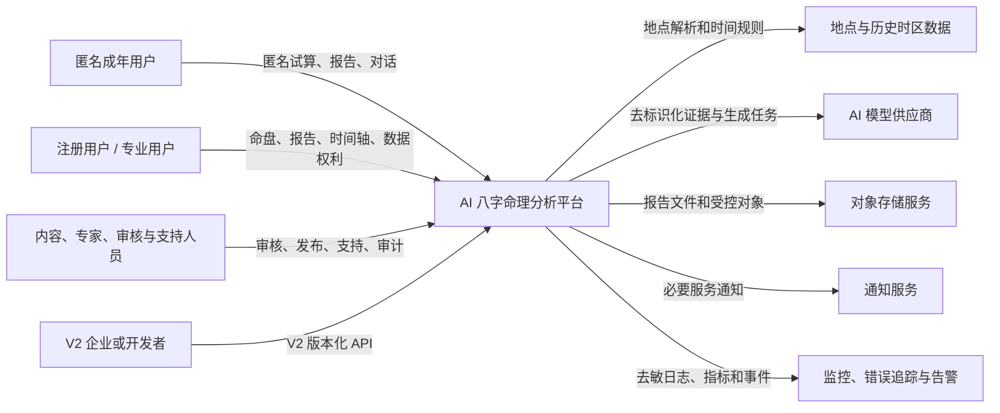

### 5.1 信任边界

1. 浏览器和任何 API 客户端均为不可信输入源。
2. 平台应用边界内仍按用户域、后台域和高权限运维域分权。
3. AI 模型供应商属于外部数据处理边界，只接收最小化上下文。
4. 对象存储不能依赖不可猜 URL 作为唯一授权机制。
5. 监控平台不应接收用户敏感正文。
6. V2 企业客户与普通用户数据必须有租户隔离边界。

---

## 6. 容器级总体架构

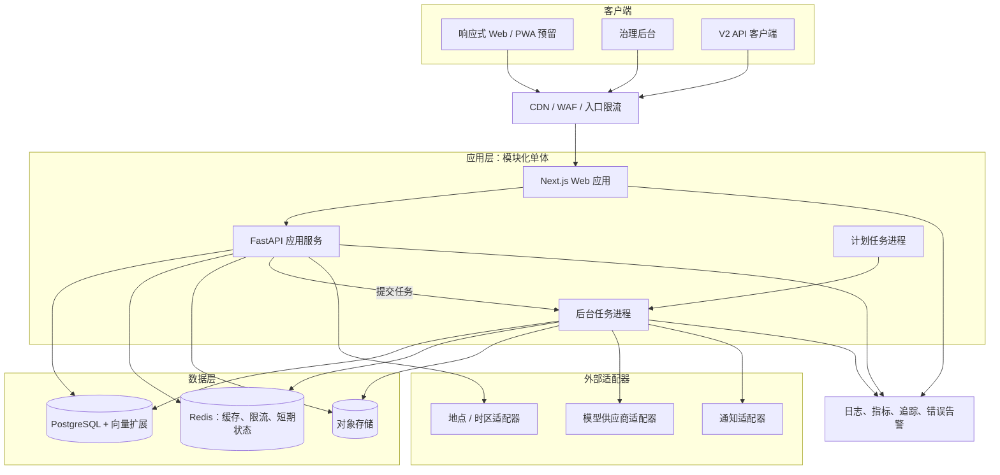

### 6.1 容器职责

| 容器 | 职责 | 不承担 |
|---|---|---|
| Web 应用 | 页面渲染、交互、i18n、RTL、客户端状态和安全调用 | 权限最终裁决、排盘、规则执行 |
| API 应用 | 身份、业务用例、同步排盘、查询、授权和任务提交 | 长时间等待模型、批量文件生成 |
| 后台任务 | AI 编排、报告生成、索引、导出、删除传播和重任务 | 直接绕过应用授权创建用户结果 |
| 计划任务 | 过期清理、保留策略、备份校验和周期治理任务 | 任意业务数据修改 |
| PostgreSQL | 事务数据、领域状态、版本、证据、审计索引和向量 | 大型二进制文件正文 |
| Redis | 限流、缓存、锁、短期任务协调 | 正式唯一数据源、永久报告快照 |
| 对象存储 | PDF、导出、较大冻结制品和受控附件 | 权限规则的唯一执行点 |

后台任务与 API 虽可分别部署，MVP 仍属于同一模块化单体和同一发布版本，不视为微服务。

---

## 7. 后端模块边界

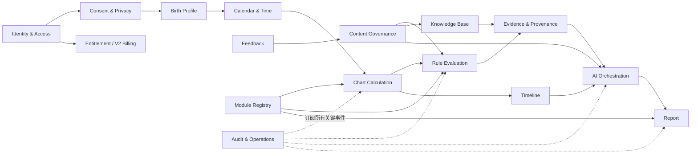

### 7.1 Identity & Access

负责账户、认证、会话、角色、资源归属、服务端授权和 V2 租户身份。它不保存命盘正文，也不决定数据处理同意。

### 7.2 Consent & Privacy

负责年龄确认、政策版本、处理目的、可选授权、数据权利请求、保留策略和敏感访问授权。它向其他模块提供“是否允许处理”的决策，不直接执行排盘。

### 7.3 Birth Profile

负责原始出生输入、时间精度、地点引用、输入来源、直接四柱模式、命盘标签和归属关系。原始输入与标准化计算快照分开保存。

### 7.4 Calendar & Time

负责地点解析后的时间标准化、历史时区、夏令时、历法和节气基础能力、真太阳时及换日策略接口。具体口径由已发布算法版本提供。

### 7.5 Chart Calculation

负责确定性四柱、派生事实、大运与流运计算、算法版本锁定和交叉验证。不得调用 AI 或自由文本知识库。

### 7.6 Rule Evaluation

负责选择已发布规则集、执行条件、生成规则发现、表达不适用、信息不足和冲突。不得生成面向用户的自然语言综合结论。

### 7.7 Evidence & Provenance

负责把计算事实、规则发现和知识引用组织为不可变证据包，分配稳定证据 ID，计算版本化证据状态，并验证引用关系。

### 7.8 Knowledge Base

负责知识来源、授权、条目、语言、流派、审核状态、引用范围、检索索引和版本。向量相似度只负责候选召回，不能绕过状态和权限过滤。

### 7.9 AI Orchestration

负责分析计划、上下文最小化、检索、模型路由、Prompt 版本、结构化生成、事实校验、引用校验、冲突检查、风险检查、有限重试和降级。

### 7.10 Report

负责在线报告结构、生成状态、冻结快照、打印投影、V1 PDF 和分享状态。报告保存生成结果，不承担规则重新计算。

### 7.11 Timeline

负责当前大运、未来三年和 V1 人生时间轴的查询组织、按需粒度计算协调、节点对齐及比较。关键节点必须来自规则证据。

### 7.12 Feedback

负责用户对报告和回答的结构化反馈、投诉类别和实际结果提交。反馈不能直接写入正式规则或知识发布状态。

### 7.13 Content Governance

负责规则、知识、Prompt、术语和高风险内容的草稿、审核、批准、发布、停用、影响分析和回滚编排。

### 7.14 Module Registry

负责八字及未来模块的标识、版本、能力声明、兼容范围和启停状态。MVP 不加载第三方动态代码。

### 7.15 Audit & Operations

负责业务审计、安全事件、运行观测、关联 ID 和管理行为留痕。审计写入失败时可阻断高风险操作。

### 7.16 Entitlement / Billing

MVP 仅负责免费额度、功能资格和幂等用量，不产生订单资金流水。V1/V2 商业化在独立边界扩展。

---

## 8. 模块依赖规则

1. Web 层只能调用应用用例，不直接访问数据库。
2. 应用用例协调模块，但不能把某模块的私有持久化模型传给另一模块。
3. Chart Calculation 可以依赖 Calendar & Time 的稳定接口，不依赖 Rule、AI 或 Report。
4. Rule Evaluation 只读取不可变计算事实和规则发布快照。
5. AI Orchestration 只消费证据包、时间轴投影和已发布知识，不读原始敏感出生档案。
6. Report 只冻结验证通过的分析输出和版本引用，不反向修改证据。
7. Feedback 通过治理流程影响未来候选版本，不能直接修改生产内容。
8. Audit 以追加方式接收关键事件，不成为业务事实的唯一存储。
9. 任何外部供应商访问都通过适配器和统一出站策略。
10. 跨模块读取优先使用公开查询模型；跨模块状态变化使用应用命令或事务后领域事件。

### 8.1 允许的事务边界

- 创建输入快照与创建计算任务可以在一个本地事务中完成。
- 确定性计算事实和计算完成状态在一个本地事务中提交。
- 规则执行结果和证据包在验证完成后原子提交。
- AI 外部调用不保持数据库事务；使用任务状态、幂等键和补偿处理。
- 报告冻结与版本清单写入必须原子完成。
- 审计采用事务内最小事件记录或可靠事件表，避免业务成功但审计永久丢失。

---

## 9. 核心数据流

### 9.1 自动排盘与报告

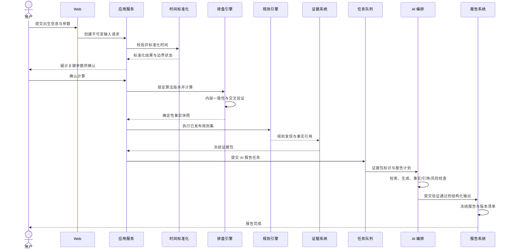

### 9.2 AI 对话

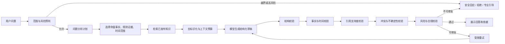

### 9.3 版本发布

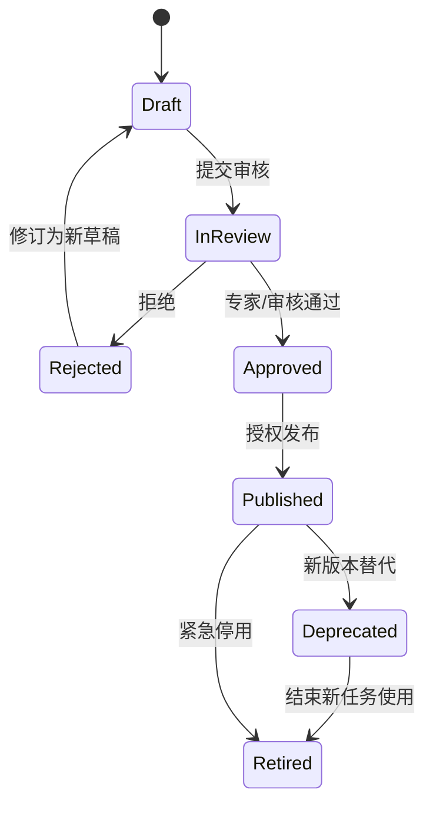

---

## 10. 时间标准化与排盘引擎架构

### 10.1 处理阶段

1. **输入规范化：** 日期类型、时间精度、地点标识和传统算法参数。
2. **地点解析：** 标准地点、经纬度精度、历史行政信息和时区候选。
3. **时区解析：** 出生时刻对应的历史偏移、夏令时歧义或无效时间。
4. **历法转换：** 公历、农历和闰月信息转为内部统一时间表示。
5. **可选时间修正：** 按锁定策略处理真太阳时等配置。
6. **换日与节气边界：** 按算法版本和用户选择计算。
7. **四柱计算：** 产生四柱事实。
8. **派生事实：** 藏干、十神、五行等已批准事实。
9. **运势事实：** 按已批准起运算法产生大运和流运。
10. **验证：** 数据范围、内部不变量、黄金规则和独立交叉验证。

### 10.2 算法契约

每个算法版本必须声明：

- 稳定算法标识和语义版本；
- 支持的输入日历、日期范围、地点范围和参数；
- 所用历法、节气、时区和经纬度数据版本；
- 真太阳时、换日、起运和流月边界能力标识；
- 输出事实类型及数据字典版本；
- 已知差异、限制和迁移说明；
- 黄金测试集版本与通过状态；
- 发布时间、停用状态和责任人。

### 10.3 交叉验证策略

MVP 的正式参考算法是唯一用户正式计算来源；独立实现或数据集作为验证器，不自动成为第二真相。

差异按以下级别处理：

| 级别 | 示例 | 处置 |
|---|---|---|
| Critical | 四柱、换日、节气边界不一致 | 阻断正式报告，必须归因 |
| High | 大运起点或流年结构不一致 | 阻断受影响分析，专家复核 |
| Medium | 已批准派生事实不同 | 隐藏受影响结论并告警 |
| Informational | 格式或非语义元数据差异 | 记录，不影响生成 |

差异解释本身也必须版本化。未知差异不得由 AI 自由解释。

### 10.4 不确定时间

时间精度属于核心值对象，不能只是界面备注。计算引擎返回：

- 可唯一计算；
- 结果在声明范围内稳定；
- 跨越关键边界，存在多个候选；
- 信息不足，无法计算。

MVP 是否自动生成多候选命盘仍待产品与专家确认；无论选择哪种方案，架构必须支持一个输入档案关联多个候选计算，并禁止将候选之一伪装成唯一确定结果。

---

## 11. 规则引擎架构

### 11.1 设计目标

- 规则可读、可测试、可版本化、可停用；
- 流派之间相互隔离；
- 事实与规则输出分开；
- 不适用、信息不足和冲突是一等状态；
- 规则来源和专家审核可追踪；
- 旧规则版本可为历史复现继续读取。

### 11.2 规则结构

每条规则至少包含：

- 规则 ID、版本和流派；
- 名称、目的和来源引用；
- 所需事实类型；
- 适用条件与排除条件；
- 条件表达与结果类型；
- 与其他规则的依赖、冲突或覆盖声明；
- 证据生成模板；
- 风险主题标签；
- 专家意见和审核状态；
- 测试样例版本；
- 生效、停用和兼容范围。

本文档不选择具体规则表达语言。详细设计应比较受控声明式表达、应用内类型化规则和有限决策表；禁止 MVP 通过后台上传任意可执行代码作为规则。

### 11.3 执行模型

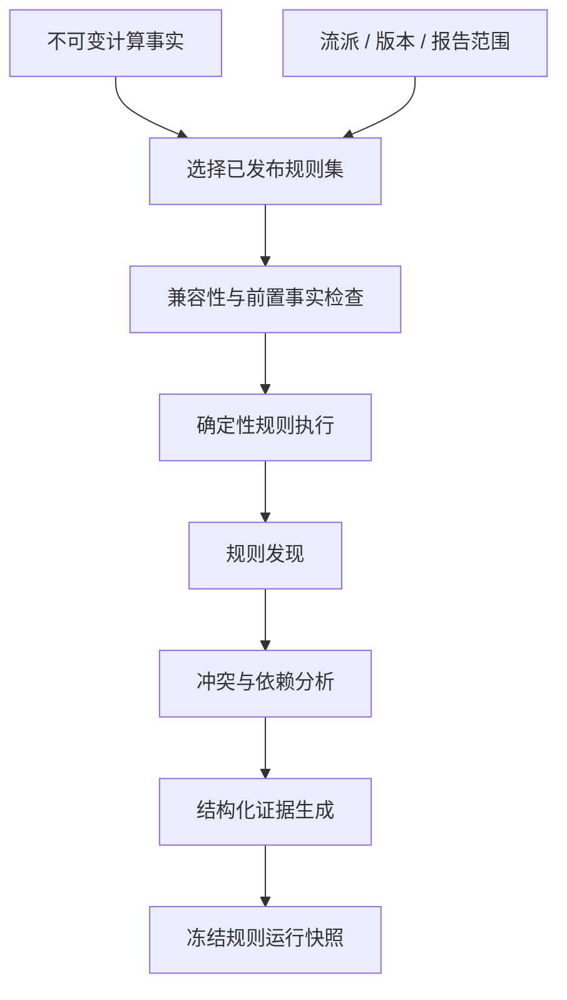

### 11.4 规则发现状态

`Satisfied`、`NotSatisfied`、`NotApplicable`、`InsufficientData`、`Conflicted`、`ExecutionError` 必须使用稳定枚举表达。自然语言展示由术语和解释层产生，不能替代状态本身。

### 11.5 多流派

V1 多流派执行使用同一命盘事实快照，各自选择独立规则版本并生成独立结果。比较层只负责语义对齐：一致、部分一致、差异、冲突和不可比较。

比较层不能：

- 把多数流派视为客观真理；
- 未经专家确认设置隐藏权重；
- 修改原流派结论；
- 让 AI 发明冲突优先级。

---

## 12. 证据与溯源系统

### 12.1 证据类型

| 类型 | 来源 | 示例性质 |
|---|---|---|
| InputEvidence | 用户确认的输入快照 | 出生时间精度、所选参数 |
| CalculatedEvidence | 排盘算法事实 | 四柱、藏干、十神 |
| RuleEvidence | 规则执行发现 | 某规则满足及所用事实 |
| KnowledgeEvidence | 已审核知识引用 | 来源章节、现代解释 |
| ComparativeEvidence | 多规则或多流派对齐 | 一致、差异、冲突 |
| SafetyEvidence | 风险检查与处置 | 高风险类别、使用的安全策略 |

### 12.2 证据图

每个面向用户的重要结论必须指向证据节点；证据节点再指向上游事实、规则、知识和版本，形成有向无环溯源图。

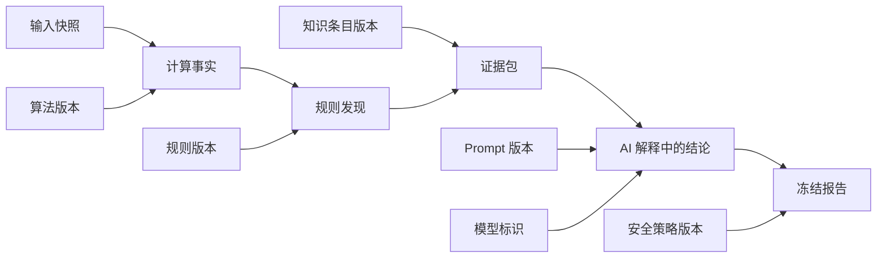

### 12.3 证据等级

系统存储等级值、计算策略版本和解释文本版本。等级只描述证据支持状态，不能命名为“准确率”“成功率”或“发生概率”。具体阈值待专家和产品确认。

### 12.4 引用验证

引用验证分三层：

1. **存在性：** 证据 ID 存在并属于当前分析快照。
2. **权限与版本：** 当前用户可访问，版本与报告一致。
3. **支持关系：** 证据主题、极性、条件和时间范围能够支持结论。

第三层不能只靠同一生成模型自评。优先使用结构化规则、确定性匹配和独立校验策略；无法自动确认时降低结论强度或进入人工抽样。

---

## 13. 知识库架构

### 13.1 存储分层

- PostgreSQL 保存来源、授权、条目、章节、语言、流派、版本、审核状态和引用元数据。
- PostgreSQL 向量扩展保存已批准文本片段的检索向量。
- 对象存储保存合法授权且不适合关系库存储的原始附件。
- 检索索引是可重建投影，不是知识授权和版本状态的真相源。

### 13.2 内容摄取流程

### 13.3 检索顺序

1. 按语言、流派、授权、发布状态、适用主题和时间有效性过滤。
2. 使用结构化关键词和概念标识召回。
3. 使用向量相似度补充召回。
4. 重排候选并控制上下文预算。
5. 返回稳定知识版本、引用范围和允许展示方式。

向量检索不直接决定命理结论，只为 AI 提供经过审核的解释材料。

### 13.4 版权撤下

授权过期或撤下时：

- 新检索立即排除；
- 删除或重建相关向量；
- 列出受影响模板和未来任务；
- 旧冻结报告按法律意见保留、遮蔽或重新交付；
- 审计元数据按合法要求保留。

---

## 14. AI 编排架构

### 14.1 编排阶段

1. 范围与风险预判；
2. 分析计划；
3. 证据选择；
4. 知识检索；
5. 去标识化和上下文预算；
6. 模型与 Prompt 路由；
7. 结构化生成；
8. Schema 校验；
9. 事实和时间范围校验；
10. 引用支持校验；
11. 冲突和不确定性校验；
12. 风险与合规校验；
13. 有限修复或重试；
14. 结果冻结、成本记录和展示。

### 14.2 模型网关

模型网关统一抽象：

- 供应商与模型标识；
- 结构化输出能力；
- 上下文和输出上限；
- 超时、重试和取消；
- 数据保留与训练策略标签；
- 区域和合规允许范围；
- 用量、成本和延迟；
- 敏感内容能力和供应商错误映射。

供应商适配器不得决定业务证据、报告状态或用户权限。

### 14.3 路由策略

路由输入包括任务类型、语言、证据长度、风险等级、用户资格、预算、模型健康和地区限制。路由配置必须版本化。模型自动升级不得直接替换生产标识；需要评测通过后发布新路由版本。

### 14.4 上下文最小化

AI 上下文使用匿名分析标识，不包含账户 ID、姓名、联系方式和详细地址。只有确有解释必要时才包含标准化时间信息；多数分析优先使用已经计算的命盘事实。

### 14.5 重试与降级

- 只对暂时性错误、结构错误和可修复引用错误有限重试。
- 相同任务使用幂等键，避免生成多份正式报告或重复扣减。
- 风险检查失败不得通过切换更宽松模型绕过。
- 模型全部不可用时，展示确定性排盘和规则摘要，并明确 AI 解读暂不可用。
- 未通过检查的原始内容不展示给普通用户。

### 14.6 多模型复核

V1 可对高风险或高价值报告使用第二模型复核。复核是质量控制手段，不是对命理有效性的证明。模型分歧进入保守表述、规则校验或人工抽样，不进行简单多数投票。

### 14.7 Prompt 治理

Prompt 与普通内容相同，遵循草稿、审核、批准、发布、停用和回滚。每个版本声明任务、语言、适用模型、输入 Schema、输出 Schema、风险策略和评测集结果。

---

## 15. 报告与时间轴架构

### 15.1 报告组成

报告不是一段自由文本，而是结构化区块集合：

- 输入与参数摘要；
- 排盘事实投影；
- 通俗摘要；
- 主题分析；
- 当前大运与未来三年；
- 证据和冲突；
- 行动建议；
- 风险与不确定性；
- 版本与来源清单。

每个区块声明来源类型、证据引用、语言、生成方式和显示级别。

### 15.2 报告状态

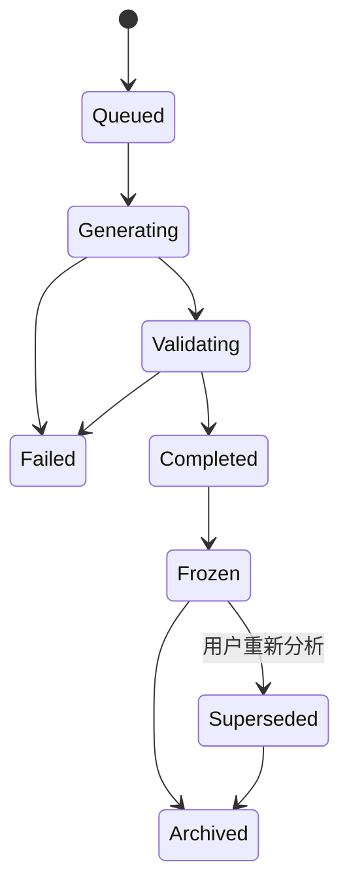

`Frozen` 是正式报告唯一可交付状态。重新生成创建新报告，不修改原报告。

### 15.3 在线、打印、PDF 和分享

- 在线报告是冻结结构化报告的主要投影。
- 打印是同一报告的样式投影，不重新调用 AI。
- V1 PDF 从冻结结构化报告生成，失败不改变在线报告。
- V1 分享链接是独立授权对象，包含过期、撤销和访问策略，不复制报告正文。

### 15.4 时间轴

MVP 保存大运和未来三年必要结构，按主题投影。V1 0 至 100 岁时间轴按大运和年份分页查询；流月、流日、流时按需计算并缓存，不全量预生成。

关键节点由规则证据触发。AI 可以解释节点，不能创建没有规则证据的节点。

---

## 16. 数据架构与存储决策

### 16.1 数据分类

| 分类 | 示例 | 主要控制 |
|---|---|---|
| 身份数据 | 账户、认证渠道 | 强访问控制、独立加密、最小关联 |
| 敏感出生数据 | 日期、时间、地点、传统算法参数 | 目的限制、字段加密、访问审计 |
| 计算事实 | 四柱、派生事实、运势事实 | 不可变版本、完整性校验 |
| 规则与证据 | 规则发现、引用、冲突 | 版本、审核、历史可读 |
| AI 内容 | 报告、回答、检查结果 | 去标识化、风险检查、保留策略 |
| 治理内容 | 规则、知识、Prompt、术语 | 职责分离、发布状态、版权 |
| 审计数据 | 权限、发布、敏感访问 | 追加、防篡改、限制访问 |
| 运营数据 | 聚合用量、成本、性能 | 去标识化、限制明细 |

### 16.2 PostgreSQL

PostgreSQL 是 MVP 事务真相源，承载：

- 账户引用、同意和权限元数据；
- 出生档案、输入快照和标准化结果；
- 计算任务、事实快照和算法版本；
- 规则、运行、发现、证据和知识版本；
- AI 任务、报告、对话和反馈元数据；
- 状态机、幂等键、可靠事件和审计索引；
- 向量索引及其知识版本引用。

敏感身份与业务数据在逻辑模块和权限上分离；详细表模型由 `05-DATA-MODEL-DRAFT.md` 定义。

### 16.3 Redis

Redis 只用于：

- 短期缓存；
- 分布式限流；
- 短期会话或撤销辅助；
- 任务协调和短锁；
- 可丢失进度通知。

Redis 丢失不能导致正式命盘、规则结果、报告或审计永久丢失。

### 16.4 对象存储

用于 V1 PDF、用户导出、合法知识附件和大型冻结制品。对象使用不可猜标识、服务端授权、短期签名访问、加密和生命周期策略。数据库保存对象状态、哈希、版本、所有者和保留策略。

### 16.5 缓存

可缓存：

- 以算法版本、参数哈希和输入哈希为键的确定性公共计算片段；
- 已发布术语和知识检索投影；
- 已授权用户自己的冻结报告投影；
- 时间轴按需计算结果。

不得跨用户复用包含私人文案或对话的缓存。权限必须在缓存命中后仍验证。版本是所有业务缓存键的一部分。

### 16.6 数据保留与删除

数据对象携带保留类别和到期时间。删除采用可追踪编排，覆盖数据库、对象存储、向量索引、缓存、任务和分析副本。备份按周期到期，恢复流程必须重新应用删除墓碑，防止已删数据复活。

具体期限待法律评审，不写死在应用逻辑中。

---

## 17. 同步、异步与任务设计

### 17.1 同步用例

- 输入字段校验；
- 参数预览和用户确认；
- 常规账户、命盘和报告查询；
- 在 NFR-025 范围内的确定性排盘；
- 权限、额度和同意检查。

### 17.2 异步用例

- AI 报告与较长 AI 对话生成；
- 大型规则批次或 V1 多流派分析；
- PDF、导出和分享制品；
- 向量索引构建；
- 数据删除传播；
- 过期清理、影响分析和通知。

### 17.3 任务可靠性

所有异步任务包含：任务 ID、幂等键、用户/租户边界、输入版本引用、状态、尝试次数、超时、取消状态和错误码。

采用“至少一次执行 + 业务幂等”思路。不能假设队列只投递一次。任务完成前验证输入版本仍有效，但不得自动切换到更新版本。

---

## 18. 安全架构

### 18.1 身份与会话

- 认证与业务资料分离；
- 安全会话轮换、撤销和过期；
- 高权限账户使用更强认证，具体 MFA 策略待上线安全评审；
- 恢复流程不泄露账户存在性和敏感资料；
- V2 API 密钥只保存不可逆摘要或受控密钥材料。

### 18.2 授权模型

MVP 采用 RBAC 与资源归属检查组合：

- RBAC 决定角色可执行的操作类型；
- 资源归属决定用户可访问的具体命盘、报告和对话；
- 用途与同意决定敏感数据是否可进入特定处理；
- 后台敏感访问要求工单、理由或临时授权；
- V2 增加租户边界和细粒度 API scope。

### 18.3 输入与输出安全

- 所有客户端输入按不可信处理；
- 自由文本、知识导入和 Prompt 防止注入影响系统控制指令；
- 模型输出作为不可信数据，必须经过解析和验证；
- 报告渲染避免脚本、模板和链接注入；
- 文件上传在 V1/V2 经过类型、大小、恶意内容和隔离检查。

### 18.4 密钥与供应链

- 密钥不存源码、数据库普通字段、日志或报告；
- 不同环境使用不同密钥和供应商项目；
- 依赖、容器和构建制品进行漏洞与来源检查；
- 生产发布使用受保护流程和最小部署权限。

### 18.5 审计

以下操作必须审计：权限变化、敏感访问、规则/知识/Prompt/模型发布、回滚、数据导出与删除、授权变化、密钥操作、分享创建和重大安全处置。

审计内容最小化，但足以回答谁、何时、基于何种权限、对什么对象、执行了什么、结果如何。

---

## 19. 隐私架构

### 19.1 隐私数据流

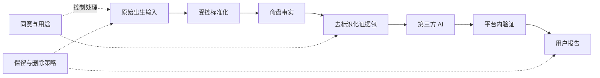

### 19.2 去标识化边界

发送给 AI 的上下文默认移除：姓名、联系方式、账户 ID、详细地址、支持工单、其他命盘标签和无关对话。使用一次性分析标识关联响应。模型供应商日志与平台用户身份不能直接映射。

### 19.3 数据权利

导出、单项删除、账户删除和授权撤回由 Privacy 模块编排。每个下游模块提供可重复调用的数据定位和处理能力，并返回完成证明或失败原因。

### 19.4 分析数据

产品分析优先使用聚合事件，不发送完整出生数据或报告正文。命例研究使用独立授权、独立数据域和匿名化评审。撤回策略待法律确认。

---

## 20. 国际化、RTL 与可访问性架构

1. 稳定概念 ID 与显示语言分离；四柱和术语不能依靠中文字符串作为业务键。
2. 界面、错误码、风险提示、术语、Prompt 和报告模板分别版本化。
3. 日期显示本地化，但内部计算统一保存时间点、时区和历法语义。
4. RTL 由布局方向、组件和图表层共同支持，不能仅翻转文本。
5. 阿拉伯语中的四柱、天干地支和数字顺序需专项人工验收。
6. 颜色不是趋势、风险或证据等级的唯一表达方式。
7. 动态 AI 内容也必须使用已审核语言策略；不允许把简体中文 Prompt 自动翻译后直接作为正式版本。

---

## 21. 插件与未来术数扩展

### 21.1 MVP 扩展点

内部模块声明：

- 模块 ID、版本和兼容平台版本；
- 输入 Schema 与所需同意；
- 计算能力和事实类型；
- 规则集与证据类型；
- 报告区块和术语资源；
- 权限、保留和风险标签；
- 数据迁移和停用策略。

### 21.2 生命周期

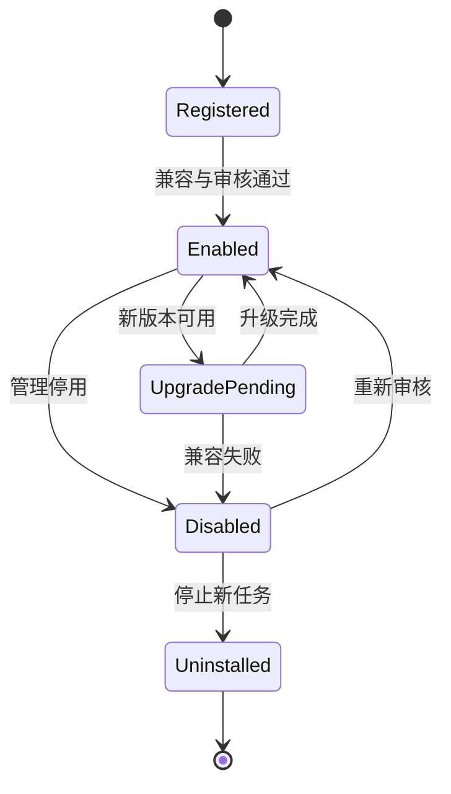

卸载只停止新任务和删除可重建运行组件，不删除历史报告及其必要版本元数据。

### 21.3 明确限制

MVP/V1 不允许第三方上传可执行代码，不设计公共插件市场，不承诺插件跨任意平台版本兼容。第二个真实模块接入前，扩展契约保持内部和最小化。

---

## 22. 部署与环境架构

### 22.1 环境

至少分为：本地开发、自动测试、预发布和生产。生产数据不得复制到低环境；确需复现时使用合成或严格去标识化数据。

### 22.2 MVP 生产拓扑

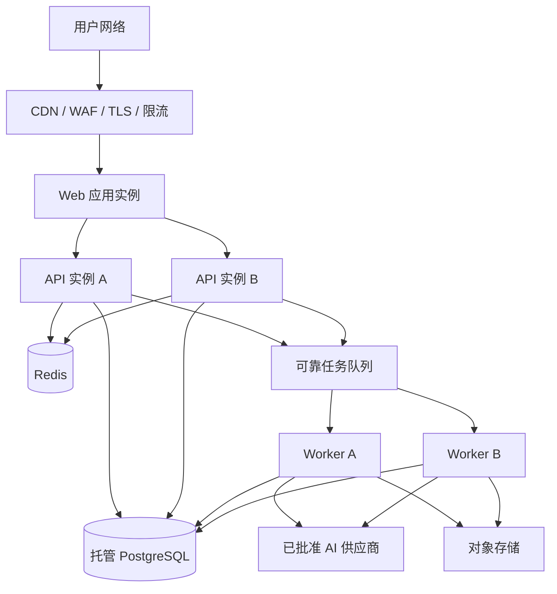

### 22.3 部署原则

- API 尽量无状态，状态保存在受控数据层；
- Web、API 和 Worker 可独立扩缩容，但共享同一应用版本兼容矩阵；
- 数据迁移采用向前兼容阶段，不允许部署中间态破坏旧实例；
- 规则、知识和 Prompt 发布与应用部署分开，但均受审计和门禁；
- 生产回滚不能导致已生成快照无法读取。

### 22.4 备份与恢复

数据库连续保护或定期备份、对象版本保护和关键配置导出共同满足待确认 RPO/RTO。恢复演练必须验证版本链、审计、删除墓碑和对象引用，而不只是数据库能够启动。

---

## 23. 可观察性与运营

### 23.1 关联标识

一次用户操作可产生 Request ID、Calculation Run ID、Rule Run ID、Evidence Bundle ID、AI Task ID 和 Report ID。日志只记录必要标识，后台按权限关联调查。

### 23.2 核心指标

| 领域 | 指标 |
|---|---|
| 用户旅程 | 开始、参数确认、计算成功、首屏到达、三分钟完成率 |
| 排盘 | P50/P95/P99、黄金校验失败、交叉验证差异、算法版本分布 |
| 规则 | 执行时延、错误、不适用、信息不足、冲突和版本分布 |
| 证据 | 引用存在率、支持度校验失败、孤立证据 |
| AI | 模型时延、结构失败、事实失败、引用失败、风险命中、重试、成本 |
| 报告 | 队列时间、生成成功、冻结失败、打印和 PDF 失败 |
| 隐私 | 导出/删除时长、部分失败、授权撤回、保留任务积压 |
| 安全 | 登录异常、越权、敏感访问、发布操作和告警处置 |
| 基础设施 | CPU、内存、连接、队列积压、存储、备份和外部依赖健康 |

### 23.3 告警原则

- 以用户影响和数据风险为优先，不为每个单次错误发送噪声告警；
- 四柱交叉验证 Critical 差异、审计写入失败、越权和删除传播失败为高优先级；
- AI 供应商故障可降级，但事实或引用校验被绕过必须视为阻断事件；
- 每个告警有责任人、处置手册和升级路径。

---

## 24. 性能、容量与成本

### 24.1 初始基线

架构以 SRS NFR-025 至 NFR-030 为初始目标：排盘 P95 ≤ 2 秒、常规 API P95 ≤ 500 毫秒、AI 首次有效响应 P95 目标 ≤ 15 秒、完整 AI 报告 P95 目标 ≤ 60 秒、100 并发交互请求、20 并发 AI 任务和持续 10 请求/秒。

这些是压测基线而非对外承诺；模型选型和真实负载后通过正式变更调整。

### 24.2 性能策略

- 地点解析与排盘提交分阶段，外部地点时延不污染排盘计算指标；
- 确定性结果按输入和版本安全缓存；
- AI 使用队列削峰、上下文预算和流式进度；
- 时间轴按需分页，不全量逐时生成；
- 报告结构限制 30,000 字符，对话回答限制 8,000 字符；
- PostgreSQL 查询以主要访问模式建索引，避免初期分库分表。

### 24.3 成本控制

每次 AI 调用记录任务、模型、输入输出用量、缓存、重试、估算成本和最终结果状态。成本按“通过验证的有效输出”统计，不能只看供应商请求数。

优先降本顺序：减少无关上下文、复用确定性证据摘要、选择合适模型、限制重试、按任务路由、最后才降低输出长度。不得通过跳过事实、引用或风险检查降本。

---

## 25. 故障模式与降级矩阵

| 故障 | 用户可用能力 | 降级行为 | 禁止行为 |
|---|---|---|---|
| AI 全部不可用 | 输入、排盘、已保存报告、规则摘要 | 报告排队或显示无 AI 版本 | 用模板冒充已完成 AI 解读 |
| 地点服务不可用 | 已保存命盘、直接四柱 | 使用受控本地数据或稍后重试 | 猜测地点和时区 |
| 向量检索不可用 | 排盘、规则、已保存报告 | 使用已验证结构化解释或停止知识增强 | 引用不存在来源 |
| Redis 不可用 | 数据库中的正式资产 | 限流保守化、缓存失效、任务协调降级 | 丢失正式状态或绕过额度 |
| 对象存储不可用 | 在线报告和排盘 | PDF/导出稍后重试 | 将私有对象公开存放 |
| 规则执行部分失败 | 排盘事实 | 隐藏失败主题并标记错误 | AI 补造缺失规则结论 |
| 交叉验证关键差异 | 输入与参数预览 | 阻断正式报告并进入复核 | 任选一个结果静默继续 |
| 审计写入失败 | 普通低风险读取 | 高风险管理写操作停止 | 无审计发布规则或访问敏感数据 |
| 数据库主服务失败 | 静态告知页面 | 故障切换或恢复 | 接受无法可靠保存的新正式任务 |
| 删除部分失败 | 其他正常功能 | 显示处理中并重试/人工处理 | 向用户虚假报告完成 |

---

## 26. 从模块化单体到微服务的演进

### 26.1 MVP 不拆微服务的理由

1. 核心领域和专家规则仍在形成，过早网络边界会固化错误抽象。
2. 排盘、规则、证据和报告需要强版本一致性，本地事务更易保证。
3. 初期团队维护分布式部署、追踪、消息一致性和多仓库的成本高于收益。
4. 当前容量基线可通过应用和 Worker 横向扩展满足。
5. 模块化单体仍可通过边界、契约和任务实现未来拆分准备。

### 26.2 拆分触发条件

只有满足至少一项实际证据并完成 ADR 才考虑拆分：

- 单模块负载或资源类型导致整体无法经济扩展；
- 独立团队需要不同发布节奏且模块契约已稳定；
- 法律或租户隔离要求独立数据和运行边界；
- 外部 API 需要独立 SLO、容量或安全域；
- 某模块故障频繁扩大影响且无法用进程隔离解决；
- 单体部署时间或变更风险已经成为量化瓶颈。

### 26.3 推荐未来拆分顺序

1. **AI Generation Worker：** 成本高、外部依赖强、异步且易独立扩缩容。
2. **Report Rendering：** PDF 和多语言渲染资源特征独立。
3. **Developer API Gateway：** V2 企业 SLO、密钥、租户和限流边界明确。
4. **Knowledge Indexing：** 数据量或重建负载真实增长后拆分。
5. **Calculation Service：** 只有算法接口稳定且外部客户需要独立 SLO 时拆分。

Rule、Evidence 与 Calculation 在领域稳定前不优先拆开，避免跨服务版本一致性复杂化。

---

## 27. 架构决策与取舍

| ADR 候选 | 决策 | 理由 | 代价 |
|---|---|---|---|
| ADR-001 | MVP 采用模块化单体 | 领域仍演进、强一致性、团队成本低 | 需要严格模块纪律 |
| ADR-002 | PostgreSQL 为事务真相源 | 关系、版本、审计和查询能力成熟 | 需防止数据库成为无边界共享模型 |
| ADR-003 | 使用 PostgreSQL 向量扩展 | 减少独立系统，规模适合 MVP | 大规模检索时可能迁移 |
| ADR-004 | AI 经统一模型网关 | 可切换、测量成本和统一安全 | 需维护最小公分母与供应商特性 |
| ADR-005 | 报告不可变冻结 | 历史可复现、可审计 | 更新需创建新报告，占用更多存储 |
| ADR-006 | 同步排盘、异步 AI | 快速得到事实，隔离供应商延迟 | 状态机和任务幂等更复杂 |
| ADR-007 | 规则不允许后台任意代码 | 降低安全和不可测试风险 | 复杂规则需受控扩展方式 |
| ADR-008 | Redis 不作为正式真相源 | 防止缓存丢失破坏业务 | 更多数据库状态管理 |
| ADR-009 | 插件先内部契约 | 避免动态执行和兼容矩阵过早出现 | 初期扩展需要平台团队参与 |
| ADR-010 | 权限、同意和资源归属共同决策 | 覆盖敏感数据用途与后台访问 | 授权实现和测试更复杂 |

上述为本文件中的正式候选决策；评审通过后转为已接受 ADR 基线。

---

## 28. 需求到架构责任映射

| SRS 范围 | 主责任模块 | 关键协作模块 |
|---|---|---|
| FR-001 至 FR-006 | Identity & Access | Consent, Audit |
| FR-010 至 FR-018 | Birth Profile | Calendar & Time, Privacy |
| FR-020 至 FR-028 | Chart Calculation | Calendar & Time, Audit |
| FR-030 至 FR-038 | Rule Evaluation | Evidence, Governance |
| FR-040 至 FR-045 | Knowledge Base | Governance, Privacy |
| FR-050 至 FR-059 | AI Orchestration | Evidence, Knowledge, Audit |
| FR-060 至 FR-065 | AI Orchestration | Report, Safety, Entitlement |
| FR-070 至 FR-076 | Report | Evidence, Object Storage |
| FR-080 至 FR-084 | Timeline | Calculation, Rule, Evidence |
| FR-090 至 FR-096 | Consent & Privacy | 全模块删除适配器、Audit |
| FR-100 至 FR-105 | Identity & Audit | 全模块 |
| FR-110 至 FR-114 | Web / Localization | Terminology, Report, AI |
| FR-120 至 FR-124 | Module Registry | IAM, Evidence, Report |
| FR-130 至 FR-137 | Governance/Admin | IAM, Audit, Entitlement |

跨模块 Must 需求必须由端到端验收测试覆盖，不能因每个模块单测通过就视为整体通过。

---

## 29. 架构验证计划

### 29.1 原型验证

- 用专家黄金命例验证时间、四柱和事实模型接口；
- 用冲突规则样例验证证据图和不确定性表达；
- 用模拟模型输出验证事实与引用拦截；
- 用移动端原型验证参数确认和三分钟旅程；
- 用删除演练验证跨模块数据定位接口。

### 29.2 MVP 上线前验证

- NFR-025 至 NFR-030 性能与容量；
- AI、地点、Redis、对象存储和数据库故障演练；
- 报告版本重放和旧版本可读；
- 跨账户和后台敏感访问安全测试；
- 去标识化出站扫描；
- 备份恢复与删除墓碑重放；
- i18n 伪本地化、RTL 组件和 WCAG 核心旅程；
- 规则、知识、Prompt 发布与回滚。

### 29.3 架构适用性复审

在 V1 多流派、正式 PDF/分享、三语言上线，以及 V2 API、研究模式或第二术数模块启动前分别进行架构复审，不默认认为 MVP 所有决策无需变化。

---

## 30. 已确认架构输入

1. 以普通用户最好用为产品优先级。
2. 确定性排盘、规则、证据和 AI 分层。
3. 模块化单体作为 MVP 架构形态。
4. PostgreSQL、Redis、对象存储及 PostgreSQL 向量扩展作为初始数据方向。
5. 一个正式算法加独立内部验证。
6. AI 多供应商可插拔、去标识化、结构化输出和多阶段校验。
7. 报告与所有生成依赖版本化，旧报告不可被覆盖。
8. MVP 简体中文正式上线，i18n 与 RTL 从第一天存在。
9. 插件只做内部契约，不执行第三方代码。
10. MVP 不接真实支付，V2 才开放完整开发者能力。

---

## 31. 架构待确认问题

### 31.1 需要产品与技术共同确认

1. AI 报告是否统一异步，或短报告允许同步等待后转异步。
2. MVP 流月与年份比较是否属于正式门槛，从而影响预计算和缓存范围。
3. 不确定出生时间跨边界时，MVP 是生成多候选命盘还是阻断部分分析。
4. 单用户 100 个活动命盘和报告/回答长度上限是否合适。
5. NFR 初始并发、时延和 AI 报告 60 秒目标是否作为架构压测基线接受。
6. MVP 是否部署两个 API 实例以减少单实例故障，或首期采用单实例加快速恢复。
7. 任务队列是由 Redis 能力承载还是采用独立托管队列；需在详细设计中按可靠性和运维成本评估。
8. 审计数据采用同库独立 Schema、独立数据库还是外部不可变归档；MVP 建议同 PostgreSQL 独立权限域加周期归档。

### 31.2 需要命理专家确认

1. 算法数据源、支持日期范围和黄金命例。
2. 真太阳时、换日、起运和流月边界的算法契约。
3. 第一批正式事实类型和规则范围。
4. 规则冲突、依赖、证据等级和多流派对齐语义。
5. 多候选命盘哪些下游结论必须阻断。

### 31.3 需要法律、安全与隐私专家确认

1. 身份、出生数据、命盘、对话和日志的保护等级与保留期限。
2. AI 供应商地区、跨境、留存和训练禁用要求。
3. 高风险主题分类、拒答和紧急支持边界。
4. 用户保存他人命盘、命例研究和撤回后的处理。
5. 知识版权撤下对旧冻结报告的处理。
6. 审计留存、不可变程度和管理员监控边界。

---

## 32. 进入下一份《04-DOMAIN-MODEL》的输入条件

- [ ] 确认模块化单体、Web/API/Worker 容器边界和依赖方向。
- [ ] 确认 Calendar、Calculation、Rule、Evidence、Knowledge、AI、Report 的职责没有重叠。
- [ ] 确认证据图是所有重要命理结论的唯一溯源机制。
- [ ] 确认同步排盘、异步 AI 和冻结报告策略。
- [ ] 确认 PostgreSQL、Redis、对象存储和向量扩展的职责边界。
- [ ] 确认 AI 模型网关、去标识化和五类输出检查不可绕过。
- [ ] 确认权限由角色、资源归属、用途同意和后台临时授权共同决定。
- [ ] 确认插件在 MVP/V1 不执行第三方代码。
- [ ] 确认性能容量数字作为初始架构测试基线，而非未经验证的市场承诺。
- [ ] 确认微服务拆分只由真实负载、团队、合规或 SLO 触发。
- [ ] 确认架构待确认项的责任人和最迟决策阶段。
- [ ] 确认 `04-DOMAIN-MODEL.md` 应以本文件的模块边界为上下文候选，但允许通过领域分析提出有证据的边界调整。
- [ ] 确认下一阶段仍只生成领域模型文档，不创建代码、项目、数据库或部署配置。

只有本架构文档通过评审后，才开始生成 `04-DOMAIN-MODEL.md`。在用户明确回复“需求与架构评审通过，可以进入编码阶段”之前，不得进入实现阶段。

