# AI 八字命理分析平台：领域模型

**文档编号：** 04  
**文档类型：** Domain Model  
**文档状态：** Approved  
**当前版本：** 1.0  
**上游基线：** `01-PRODUCT-VISION.md`、`02-SRS.md`、`03-SYSTEM-ARCHITECTURE.md`（均已通过评审）  
**领域模型地位：** 本文档通过评审后，作为本项目唯一正式领域模型  
**目标读者：** 产品负责人、命理专家、领域专家、架构师、研发与测试负责人、隐私及法律评审人员

---

## 1. 文档目的与边界

本文档定义平台的统一领域语言、限界上下文、业务对象、聚合、一致性边界、生命周期、领域服务、仓储抽象、工厂和领域事件。

本文档只讨论：

- 业务概念及其含义；
- 对象身份、所有权与生命周期；
- 聚合关系和一致性规则；
- 限界上下文的责任与协作；
- 领域事件及业务后果。

本文档不讨论：

- 数据库、表、字段、索引或数据迁移；
- SQL、ORM 或持久化框架；
- API、传输协议、DTO 或 Controller；
- 服务实现、算法代码、项目结构或部署配置。

本文档中的“计算确定性”仅表示相同输入、参数及算法版本应产生可复现结果，不表示八字分析具有科学预测准确性。

### 1.1 1.0 变更摘要

1. 确认 `Chart` 只属于 Chart Calculation Context，负责确定性计算及 CalculationSnapshot 生命周期，为下游独立聚合提供稳定事实基础。
2. 明确 RuleRun、EvidenceBundle、AIAnalysis、Timeline 和 Report 均不由 Chart 管理，其状态只可通过只读 `AnalysisProgress` 查询投影汇总。
3. 保留复审确认的 RuleRun、EvidenceBundle、AIAnalysis、SubjectConsent、Birth 事件语义及 Timeline 依赖方向，并完成全文一致性检查。

---

## 2. 领域建模原则

### DM-001 事实、规则、证据与解释分离

`Chart` 拥有确定性计算事实；`RuleFinding` 表达特定规则版本的判断；`Evidence` 说明判断依据；AI 分析只对已有事实和证据进行解释。四类对象不能合并为一个“分析结果”。

### DM-002 不确定性是一等领域概念

出生时间不精确、计算结果存在候选、规则信息不足或观点冲突，必须以明确对象和值表达，不能用空值或自然语言备注代替。

### DM-003 正式结果不可变

完成的计算快照、已发布规则版本、已生成证据和冻结报告是历史事实。更新产生新版本或新对象，不原地改写历史。

### DM-004 所有权与用途分离

用户拥有本人账户下的业务资产，不等于平台可将这些资产用于研究或优化。数据处理用途由 `ConsentRecord` 单独决定。

### DM-005 上下文自治

每个 Bounded Context 拥有自己的领域语言和业务不变量。其他 Context 只能通过对方公开的领域能力、稳定引用或领域事件协作，不能直接修改其内部对象。

### DM-006 流派不被强制统一

不同 `RuleSet` 可以对同一 `Chart` 产生不同 `RuleFinding`。冲突由领域对象保留，不由 AI 或技术层自动裁决。

### DM-007 删除不等于抹去历史事实

用户删除、法律保留、匿名化、归档、撤回授权和历史审计是不同业务动作。是否可删除按对象责任分别定义，不能用统一物理删除语义替代。

### DM-008 领域模型不承载实现细节

Repository、Factory 和 Domain Service 是领域抽象，不暗示特定技术框架、数据库或网络调用方式。

---

## 3. 统一语言（Ubiquitous Language）

| 术语 | 正式定义 | 禁止混淆 |
|---|---|---|
| BirthProfile | 用户管理的一份出生资料及其输入来源、精度和授权关系 | 不等同于已经计算完成的命盘 |
| BirthInput | 某次出生信息输入的不可变业务记录 | 不等同于标准化时间或四柱 |
| Chart | 围绕一次被确认输入建立的命盘业务聚合 | 不等同于单独的四柱值 |
| CalculationSnapshot | 使用锁定算法与参数产生的不可变计算事实快照 | 不包含 AI 解释 |
| FourPillars | 年、月、日、时四柱的值组合 | 不包含流派规则判断 |
| AlgorithmVersion | 可被选择和复现的正式算法定义版本 | 不等同于应用发布版本 |
| RuleSet | 属于某流派、具有独立版本和生命周期的规则集合 | 不等同于 AI Prompt |
| RuleRun | 一个 RuleSetVersion 对一个 CalculationSnapshot 的单次执行，管理本次 RuleFinding、冲突和完整性 | 不等同于 RuleSet 定义本身 |
| RuleFinding | 某规则集对某计算快照得出的结构化判断 | 不等同于客观科学事实 |
| Evidence | 连接事实、规则发现、知识来源与结论的可追溯依据 | 不等同于预测概率 |
| EvidenceBundle | 围绕同一分析范围冻结的一组 Evidence 及上游版本清单 | 不等同于一条 Evidence 或报告 |
| EvidenceStatus | 充分、一般、有限、存在冲突等证据支持状态 | 不表示事件发生率或准确率 |
| KnowledgeArticle | 经过来源、授权和审核治理的知识内容版本 | 不等同于规则本身 |
| AIAnalysis | 一次独立的 AI 结构化分析任务及其通过校验的正式结果 | 不得产生事实、Evidence 或扩大分析范围 |
| AIConversation | 绑定一个命盘范围的连续解释会话 | 不得跨命盘共享事实上下文 |
| Report | 面向用户组织事实、规则、证据和解释的业务制品 | 不等同于一次计算任务 |
| Frozen Report | 通过校验、正式交付且不可原地修改的报告 | 重新分析必须产生新报告 |
| Timeline | 围绕同一命盘组织大运、流年及按需时间节点的领域视图 | 不表示未来事件必然发生 |
| ConsentRecord | 针对主体、目的、政策版本和范围作出的同意或撤回记录 | 不等同于账户注册 |
| SubjectConsent | 汇总一个主体的用途决定并管理追加式 ConsentRecord 历史的聚合根 | 不等同于单次同意动作 |
| Governance | 对规则、知识、Prompt 和术语进行审核与发布的治理领域 | 不直接改变历史报告 |
| AuditEvent | 对关键业务或管理行为的不可篡改事实记录 | 不等同于调试日志 |
| Archive | 停止活跃使用但保留历史对象 | 不等同于删除 |
| Regeneration | 基于新请求或新版本生成新的分析或报告 | 不等同于更新旧报告 |
| AnalysisProgress | 只读汇总 Chart、RuleRun、EvidenceBundle、AIAnalysis 和 Report 状态的查询投影 | 不是 Entity、Aggregate Root 或跨 Context 工作流事务 |

---

## 4. 领域分类

### 4.1 核心域（Core Domain）

- Calendar & Time：将用户输入转换为可复现的时间语义。
- Chart Calculation：产生确定性命盘事实。
- Rule Evaluation：基于流派规则产生结构化判断。
- Evidence：建立事实、规则、知识和解释之间的溯源链。
- AI：在证据约束下形成通俗解释。

其中 Evidence 是平台区别于一般 AI 命理产品的关键核心域。

### 4.2 支撑域（Supporting Domain）

- Birth：管理出生资料、输入精度和命盘创建意图。
- Knowledge：治理可引用的传统及现代解释资料。
- Report：组织和冻结正式用户报告。
- Timeline：从确定性流运事实构建基础时间轴，并在独立分析投影中附加规则、证据和解释。
- Governance：管理规则、知识、Prompt 和术语的发布生命周期。
- Consent：控制数据用途、授权和撤回。

### 4.3 通用域（Generic Domain）

- Identity：账户、身份和角色。
- Audit：审计事实及调查能力。

通用域仍必须遵守本项目的敏感数据与职责分离要求。

---

## 5. Context Map

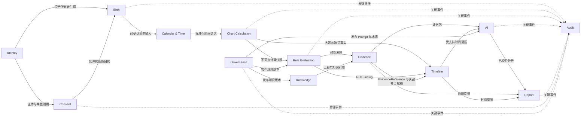

### 5.1 Context 关系类型

| 上游 | 下游 | 关系 | 约束 |
|---|---|---|---|
| Identity | 其他 Context | Published Language | 只暴露主体引用、角色与状态，不暴露认证内部模型 |
| Consent | Birth / AI / Knowledge | Customer–Supplier | 下游必须遵守目的授权，不得自行推断同意 |
| Birth | Calendar & Time | Customer–Supplier | Birth 提供已确认输入，Calendar 返回标准化结果或边界问题 |
| Calendar & Time | Chart Calculation | Conformist with Version | Chart 遵循被锁定的时间语义版本，不自行重算时间口径 |
| Chart Calculation | Rule Evaluation | Published Language | 通过稳定计算事实语言协作 |
| Rule Evaluation | Evidence / Timeline | Customer–Supplier | Evidence 接收 RuleRun 的结构化 RuleFinding；Timeline 只在分析时间轴附加这些发现 |
| Knowledge | Evidence / AI | Open Host Service（概念） | 只提供已发布、授权有效的知识引用能力，不代表网络 API |
| Evidence | AI / Report | Published Language | 证据 ID、状态和溯源关系必须稳定 |
| Timeline | AI / Report | Published Language | 基础时间轴由计算事实独立存在；分析时间轴提供附加解释，不成为 EvidenceBundle 冻结前置条件 |
| AI | Report | Anti-Corruption Layer | Report 接收已校验分析，不接受供应商原始输出模型 |
| Governance | Rule / Knowledge / AI | Separate Ways + Publication | 治理决定可发布版本，不参与单次业务计算 |
| 各 Context | Audit | Domain Event Subscriber | Audit 记录事实但不反向修改业务聚合 |

---

## 6. Bounded Context 详细定义

## 6.1 Identity Context

**职责**

- 管理用户主体、账户状态、角色和身份生命周期；
- 确定一个业务动作由哪个主体发起；
- 表达匿名主体、注册主体、专业用户和后台角色。

**拥有的数据**

- `User` 的身份、状态和角色；
- 匿名主体与注册主体之间的受控认领关系；
- 账户删除业务状态。

**对外暴露能力**

- 确认主体是否有效；
- 判断主体具有什么业务角色；
- 提供稳定 `UserId` 或匿名主体引用；
- 发起账户删除领域过程。

**与其他 Context 的关系**

- Consent 以主体引用记录同意；
- Birth 以主体引用确定资产所有者；
- Report、AIConversation 和 Timeline 通过 Chart 所有权间接授权；
- Audit 订阅账户与角色事件。

**边界约束**

Identity 不拥有出生数据、命盘、报告正文、同意目的或命理规则。

## 6.2 Consent Context

**职责**

- 管理年龄确认、必要处理、可选用途、命例优化及撤回；
- 回答某主体、某目的、某范围在某时刻是否获得允许；
- 协调数据权利请求的业务状态。

**拥有的数据**

- `SubjectConsent` 聚合；
- 作为追加式历史的 `ConsentRecord`；
- 政策版本引用；
- 同意目的、范围、状态和撤回原因；
- 数据导出、删除和授权撤回的业务请求。

**对外暴露能力**

- 评估处理是否允许；
- 创建同意或撤回记录；
- 提供当前有效授权视图；
- 发布撤回和删除请求事件。

**关系**

- Identity 提供主体；
- Birth、AI、Knowledge 和研究用途必须查询相应用途；
- Audit 记录同意变化和数据权利执行。

**边界约束**

Consent 只决定业务许可，不直接删除其他 Context 对象；删除由各 Context 响应统一业务过程。同一 SubjectConsent 内，同一主体、目的和范围在同一时刻只能有一个有效决定，历史变化只能追加 ConsentRecord。

## 6.3 Birth Context

**职责**

- 管理出生资料及其所有权；
- 记录公历、农历或直接四柱输入来源；
- 表达时间精度、地点选择和用户确认；
- 发起命盘创建意图。

**拥有的数据**

- `BirthProfile`；
- `BirthInput`；
- 用户可读标签、归属关系和输入确认状态。

**对外暴露能力**

- 创建、修改草稿、确认、归档或请求删除 BirthProfile；
- 提供不可变的已确认 BirthInput；
- 声明输入精度及是否可能存在多个候选。
- 在 BirthProfile 容器创建时发布 `BirthProfileCreated`；只有输入被用户确认后才发布 `BirthInputConfirmed`。

**关系**

- Identity 确定所有者；
- Consent 确定是否允许保存和后续用途；
- Calendar & Time 只因 `BirthInputConfirmed` 消费已确认 BirthInput；
- Chart Calculation 不直接读取未确认草稿。

**边界约束**

Birth 不计算四柱，不判断命理规则，也不把直接四柱输入逆推为出生时间。

## 6.4 Calendar & Time Context

**职责**

- 将 BirthInput 转化为标准化时间语义；
- 处理公农历、地点、时区、历史夏令时、节气、真太阳时和换日策略；
- 表达歧义、无效本地时间和关键边界。

**拥有的数据**

- 时间标准化策略版本；
- `TimeZoneInfo`、`SolarTermBoundary` 等值对象定义；
- 某次标准化结果及其问题状态；
- 外部时间与地点资料的领域版本引用。

**对外暴露能力**

- 标准化已确认输入；
- 给出候选标准化时间或边界问题；
- 判断输入范围是否跨越影响计算的边界。

**关系**

- 上游为 Birth；
- 下游为 Chart Calculation；
- Governance 管理可用策略版本的发布资格；
- Audit 记录高风险口径变化。

**边界约束**

Calendar & Time 不产生命理结论。真太阳时和换日最终口径由命理专家确认后形成版本。

## 6.5 Chart Calculation Context

**职责**

- 管理 Chart 聚合；
- 锁定输入、时间语义、算法版本和参数；
- 产生四柱、派生事实、大运与流运事实；
- 执行内部不变量和独立交叉验证；
- 管理只覆盖输入验证、确定性计算、验证阻断与归档的 Chart 生命周期。

**拥有的数据**

- `Chart`；
- `CalculationSnapshot`；
- `AlgorithmVersion`；
- 确定性事实和值对象；
- 验证差异及其处置状态。

**对外暴露能力**

- 创建计算意图；
- 执行或重放锁定版本的计算；
- 提供不可变计算快照；
- 说明计算是否唯一、候选、失败或存在未解释差异。

**关系**

- 依赖 Calendar & Time 的标准化结果；
- 向 Rule Evaluation 和 Timeline 提供计算事实；
- 向 Evidence 提供事实引用；
- Audit 订阅计算和差异事件。

**边界约束**

不得调用 AI，不拥有 RuleRun、RuleFinding、EvidenceBundle、AIAnalysis 或 Report，也不把交叉验证一致性表述为预测准确率。规则执行、证据生成、AI 分析和报告生成不得修改 Chart 状态。端到端进度只由只读 `AnalysisProgress` 查询投影汇总。

## 6.6 Rule Evaluation Context

**职责**

- 管理规则集和版本；
- 管理 `RuleRun` 聚合及其执行生命周期；
- 对计算快照执行已发布规则；
- 生成 `RuleFinding`；
- 表达满足、不满足、不适用、信息不足、冲突和错误；
- 支持 V1 多流派并行运行。

**拥有的数据**

- `RuleSet` 及其规则成员；
- 规则版本、流派和适用范围；
- `RuleRun` 及其完整性、冲突关系和运行状态；
- `RuleFinding`；
- 单次规则运行及冲突关系。

**对外暴露能力**

- 判断规则集是否适用于某 CalculationSnapshot；
- 执行已发布规则集；
- 创建并执行 RuleRun，输出结构化 RuleFinding 集合；
- 对齐不同流派发现但不裁定唯一真理。

**关系**

- Governance 决定规则版本发布状态；
- Chart Calculation 提供事实；
- Evidence 消费 RuleFinding；
- AI 不能直接绕过 Evidence 读取规则内部条件。

**边界约束**

具体旺衰、格局、调候、用神、起运、神煞和冲突优先级均待专家确认。RuleRun 只能引用 Chart 的有效 CalculationSnapshot，不能改变 Chart 聚合。

## 6.7 Evidence Context

**职责**

- 建立输入、计算事实、规则发现、知识引用和解释结论之间的溯源关系；
- 管理 `EvidenceBundle` 聚合及其上游版本清单和分析范围；
- 生成稳定 Evidence 身份；
- 形成不可变证据集合；
- 判断引用存在性、版本一致性和支持关系；
- 表达证据状态。

**拥有的数据**

- `Evidence`；
- `EvidenceBundle`、证据集合及内部引用关系；
- `EvidenceStatus`；
- 引用验证结果。

**对外暴露能力**

- 根据 CalculationSnapshot、RuleRun、RuleFinding 和知识引用构建 EvidenceBundle；
- 验证一个结论是否可被指定证据支持；
- 提供普通和专业两种证据投影；
- 给出冲突与信息不足状态。

**关系**

- 上游为 Chart Calculation、Rule Evaluation 和 Knowledge；
- 下游为 AI、Report 和 Timeline；
- Audit 接收证据生成与验证失败事件。

**边界约束**

EvidenceStatus 不是事件概率；Evidence 不负责生成用户文案。EvidenceBundle 不依赖完整 Timeline 才能构建；时间相关 Evidence 可选择引用基础 `TimelineNode` 的稳定身份，但该引用不赋予 Evidence 修改 Timeline 的能力。

## 6.8 Knowledge Context

**职责**

- 管理知识来源、授权、版本、语言、流派、章节和解释；
- 确定知识内容是否可被正式检索和引用；
- 管理知识发布与撤下后的领域状态。

**拥有的数据**

- `KnowledgeArticle`；
- 来源、作者、书名、章节和授权声明；
- 内容版本、适用条件、语言和审核状态；
- 知识引用身份。

**对外暴露能力**

- 返回符合授权、发布、语言和流派条件的知识引用；
- 判断引用是否仍可用于新分析；
- 发起知识撤下及影响通知。

**关系**

- Governance 完成审核和发布决策；
- Evidence 使用稳定知识引用；
- AI 使用经过过滤的解释片段；
- Consent 控制匿名命例类知识用途。

**边界约束**

知识文章不能直接作为计算事实或自动成为规则；向量相似性不改变文章发布与授权状态。

## 6.9 AI Context

**职责**

- 管理受命盘范围约束的分析和会话；
- 管理独立 `AIAnalysis` 聚合的计划、生成、校验和正式结果；
- 依据证据建立分析计划；
- 生成结构化解释并完成事实、引用、冲突和风险校验；
- 管理 AIConversation 和 AIMessage 生命周期；
- 表达生成失败、降级和拒答。

**拥有的数据**

- `AIConversation`；
- `AIMessage`；
- `AIAnalysis` 及其正式分析结果；
- 分析计划、生成版本引用和校验状态；
- 对话范围和风险处置结果。

**对外暴露能力**

- 基于冻结 EvidenceBundle 计划并生成一次独立 AIAnalysis；
- 在当前命盘、未来三年和支持主题内回答；
- 返回通过校验的解释或安全拒绝；
- 提供分析完成事件给 Report。

**关系**

- Evidence 提供可引用依据；
- Knowledge 提供已发布解释材料；
- Timeline 提供允许的时间范围；
- Governance 提供已发布 Prompt、术语和风险策略；
- Report 只接受完成校验的分析。

**边界约束**

AIAnalysis 不计算四柱、大运或规则事实，不创建 Evidence，不自行扩大时间或主题范围。模型供应商原始输出不是正式领域结果，只有通过 ValidationResult 和 RiskDisposition 的输出才能成为 Completed AIAnalysis。

## 6.10 Report Context

**职责**

- 管理报告聚合和生命周期；
- 组织输入摘要、事实、规则、证据、AI 解释、时间轴、建议和不确定性；
- 冻结正式报告；
- 表达重新生成、替代、归档及 V1 发布状态。

**拥有的数据**

- `Report`；
- 报告区块及其证据引用；
- 报告版本清单；
- 冻结、替代和归档关系。

**对外暴露能力**

- 根据验证通过的组成部分创建报告；
- 冻结、归档和重新生成；
- 提供普通、专业、打印和 V1 正式制品投影。

**关系**

- 接收 Frozen EvidenceBundle、Completed AIAnalysis 和 Timeline 的稳定引用；
- Identity/Chart 所有权控制访问；
- Audit 记录冻结、重新生成和访问相关关键事件。

**边界约束**

冻结报告不可原地修改；Report 不重新执行排盘或规则。

## 6.11 Timeline Context

**职责**

- 从 CalculationSnapshot 与确定性流运事实构建可独立存在的基础时间轴；
- 在基础时间轴上构建附加 RuleFinding、EvidenceReference 和关键节点解释的分析时间轴；
- 构建指定时间粒度的节点与比较；
- 保证分析时间轴中的关键节点具有证据。

**拥有的数据**

- `Timeline` 及其 Basic / Analytical 类型；
- TimelinePeriod 和 TimelineNode；
- 节点之间的顺序、粒度和比较结果；
- 基础节点的事实引用，以及分析节点附加的规则与证据引用。

**对外暴露能力**

- 仅基于 CalculationSnapshot 构建或扩展基础时间轴；
- 基于既有基础时间轴构建分析时间轴；
- 查询支持范围内的节点；
- 比较两个时间节点；
- 声明不支持、信息不足或边界不确定。

**关系**

- Chart Calculation 提供基础时间轴所需的确定性流运事实；
- Rule Evaluation 和 Evidence 只为分析时间轴提供附加判断、EvidenceReference 和解释；
- AI 和 Report 消费时间轴投影。

**边界约束**

基础 Timeline 无需 RuleFinding 或 Evidence 即可存在。分析 Timeline 不产生无规则依据的“关键事件”，也不表达必然吉凶。Timeline 不作为 EvidenceBundle 冻结的必要上游；如 Evidence 需要指向时间位置，只引用基础 TimelineNode 的稳定身份。

## 6.12 Governance Context

**职责**

- 管理规则、知识、Prompt、术语和风险策略的治理请求；
- 协调草稿、审核、专家意见、批准、发布、停用和回滚；
- 实施职责分离和影响评审。

**拥有的数据**

- 治理提案；
- 审核意见和决策；
- 发布批次、影响说明和回滚理由；
- 专家与审核角色在本次决策中的业务职责。

**对外暴露能力**

- 提交审核；
- 记录专家同意、反对或保留意见；
- 批准或拒绝发布；
- 发布不可变版本或停用现有版本。

**关系**

- Identity 提供角色；
- Rule、Knowledge 和 AI Context 拥有被治理对象本身；
- Audit 记录全部高风险治理动作。

**边界约束**

Governance 不拥有命盘、报告和用户反馈事实；用户反馈只能形成候选治理输入。

## 6.13 Audit Context

**职责**

- 记录关键业务、权限、发布、敏感访问和数据权利事件；
- 支持按业务关联调查历史；
- 保持审计事实不可由普通业务角色修改。

**拥有的数据**

- `AuditEvent`；
- 事件主体、动作、业务对象引用、目的、结果和时间；
- 调查关联和安全严重度。

**对外暴露能力**

- 接收已发生领域事件的审计投影；
- 查询特定业务过程的审计链；
- 标记调查状态，但不改变原始审计事实。

**关系**

- 订阅所有 Context 的关键领域事件；
- 向授权审计人员提供只读调查能力；
- 不向业务 Context 发布会改变原业务事实的指令。

**边界约束**

AuditEvent 与运行日志不同；审计不能成为恢复 Chart、RuleFinding 或 Report 正文的唯一来源。

---

## 7. 核心实体总览

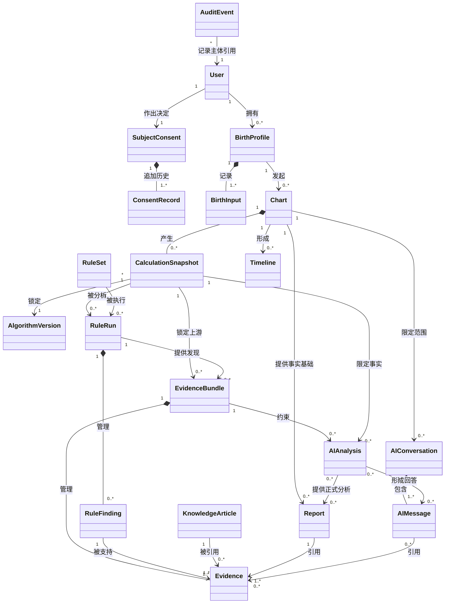

该图表示领域关系，不表示数据库外键、表结构或对象装载方式。

---

## 8. Entity 详细定义

## 8.1 User

- **作用：** 表示可拥有业务资产、作出同意和执行操作的注册主体。
- **生命周期：** Pending → Active → Suspended → DeletionRequested → Deleted。恢复与法律保留规则待确认。
- **唯一标识：** `UserId`，在业务生命周期内稳定，不使用邮箱或手机号充当领域身份。
- **是否可删除：** 可请求删除；删除后业务状态不可继续使用。必要审计及法定保留不等同于继续保留活跃 User。
- **是否版本化：** 不采用内容版本；状态变化有历史事件。
- **所属 Aggregate：** User Aggregate Root。
- **所有权：** User 是主体本身，不被其他用户拥有。

## 8.2 BirthProfile

- **作用：** 表示用户管理的一份出生资料，承载所有权、标签、输入方式、精度和创建命盘的业务意图。
- **生命周期：** Draft → Confirmed → InUse → Archived → DeletionRequested → Deleted。
- **唯一标识：** `BirthProfileId`。
- **是否可删除：** 可由所有者请求删除；冻结报告的历史引用如何处理由隐私与法律规则决定。
- **是否版本化：** BirthProfile 本身以当前状态存在；每次确认输入形成新的不可变 BirthInput，而不是覆盖历史输入。
- **所属 Aggregate：** Chart Aggregate 的上游独立聚合；其自身为 BirthProfile Aggregate Root。
- **所有权：** 一个 User 或匿名主体拥有；保存他人资料时必须记录合法关系或授权声明。

## 8.3 BirthInput

- **作用：** 记录某次用户确认的公历、农历或直接四柱输入及其精度和参数选择。
- **生命周期：** DraftInput → ConfirmedInput → Superseded；Confirmed 后不可修改。
- **唯一标识：** `BirthInputId`。
- **是否可删除：** 随 BirthProfile 的数据权利过程处理；被正式 CalculationSnapshot 引用时需按法律规则删除、去标识化或保留最小历史证明。
- **是否版本化：** 是。修改输入产生新 BirthInput。
- **所属 Aggregate：** BirthProfile Aggregate 内部实体。
- **所有权：** 继承 BirthProfile 所有权。

## 8.4 Chart

- **作用：** 表示围绕已确认 BirthInput 建立的命盘业务对象，负责管理确定性计算及 CalculationSnapshot 生命周期，为 RuleRun、EvidenceBundle、AIAnalysis、Timeline 和 Report 提供稳定事实基础。
- **生命周期：** Draft → Validating → Validated → Calculating → Calculated → Archived。验证失败进入 ValidationFailed；计算失败进入 CalculationFailed；关键交叉验证差异进入 VerificationBlocked。
- **唯一标识：** `ChartId`。
- **是否可删除：** 所有者可请求删除；归档与删除不同。关联报告和审计的处理待法律规则确认。
- **是否版本化：** Chart 标识不因重新计算而变化，但每次正式计算形成新 CalculationSnapshot；改变关键输入可选择创建新 Chart，具体产品规则待确认。
- **所属 Aggregate：** Chart Aggregate Root。
- **所有权：** 继承关联 BirthProfile 的所有权；匿名 Chart 由匿名主体临时拥有。Chart 不拥有或汇总 RuleRun、EvidenceBundle、AIAnalysis 与 Report 的状态。

## 8.5 CalculationSnapshot

- **作用：** 保存一次锁定输入、时间语义、参数和 AlgorithmVersion 后产生的确定性事实集合。
- **生命周期：** Pending → Calculating → Validating → Valid → Invalid / Failed → Superseded。Valid 后不可修改。
- **唯一标识：** `CalculationSnapshotId`。
- **是否可删除：** 不可从仍存在的正式 Report 中单独删除；随 Chart 数据权利过程整体处理。
- **是否版本化：** 天然版本化；每次重新计算产生新快照。
- **所属 Aggregate：** Chart Aggregate 内部实体。
- **所有权：** 由 Chart 拥有。

## 8.6 AlgorithmVersion

- **作用：** 表示可选择、测试、发布、停用和重放的一套排盘算法业务版本及其能力声明。
- **生命周期：** Draft → InReview → Approved → Published → Deprecated → Retired；可被 Rejected。
- **唯一标识：** `AlgorithmVersionId`，同时具有稳定算法家族标识与版本信息。
- **是否可删除：** 已被正式快照引用后不可删除；可停止新使用。
- **是否版本化：** 是；自身就是版本实体，已发布版本不可原地修改。
- **所属 Aggregate：** Algorithm Aggregate Root；在 Chart Aggregate 中仅通过身份引用。
- **所有权：** 平台治理所有，不属于用户。

## 8.7 RuleSet

- **作用：** 表示某一流派下可独立审核、发布和执行的一组规则。
- **生命周期：** Draft → InReview → Approved → Published → Deprecated → Retired；可被 Rejected。
- **唯一标识：** `RuleSetVersionId`，并关联稳定 `RuleSetId` 和流派身份。
- **是否可删除：** 已发布或被正式结果引用的版本不可删除；草稿可依治理规则撤销。
- **是否版本化：** 是；任何规则内容或适用范围变化产生新版本。
- **所属 Aggregate：** Rule Aggregate Root。
- **所有权：** 平台治理所有，专家是审核角色而非个人所有者。

## 8.8 RuleRun

- **作用：** 表示一个 RuleSetVersion 对一个 CalculationSnapshot 的单次执行，管理本次 RuleFinding 集合、冲突关系和完整性状态。
- **生命周期：** Requested → Running → Validating → Completed；运行或验证不可完成时进入 Failed。
- **唯一标识：** `RuleRunId`。
- **是否可删除：** 被 EvidenceBundle 或 Frozen Report 间接引用时不可单独删除；随 Chart 数据权利过程和法律规则整体处理。
- **是否版本化：** 不原地版本化；使用新 RuleSetVersion、CalculationSnapshot 或执行范围时创建新 RuleRun。
- **所属 Aggregate：** RuleRun Aggregate Root。
- **所有权：** 业务访问权继承被分析 Chart；Rule Evaluation Context 拥有其执行语义。

## 8.9 RuleFinding

- **作用：** 表示 RuleSet 对某 CalculationSnapshot 的一项结构化判断。
- **生命周期：** Produced → Validated → Included / Excluded；执行失败形成 Error 状态而非命理判断。Validated 后不可修改。
- **唯一标识：** `RuleFindingId`。
- **是否可删除：** 随规则运行和 Chart 数据权利过程处理；被冻结报告引用时不可单独改写。
- **是否版本化：** 不原地版本化；重新执行产生新的 RuleFinding。
- **所属 Aggregate：** RuleRun Aggregate 内部实体；对外只通过 RuleRun Root 和稳定引用进入 Evidence。
- **所有权：** 业务上属于相应 Chart 分析结果，同时由 Rule Evaluation Context 管理。

## 8.10 EvidenceBundle

- **作用：** 管理围绕同一分析范围形成的一组 Evidence，锁定上游 CalculationSnapshot、RuleRun、KnowledgeCitation 和证据策略版本，冻结后供 AIAnalysis 和 Report 引用。
- **生命周期：** Building → Validating → Frozen；验证不通过进入 Invalid。
- **唯一标识：** `EvidenceBundleId`。
- **上游版本清单：** 必须列出 CalculationSnapshotId、全部 RuleRunId、所用 RuleSetVersion、KnowledgeCitation 版本和证据策略版本；时间相关证据可包含稳定 TimelineNodeReference。
- **分析范围：** 明确 Chart、时间范围、主题、语言和允许的流派范围；Bundle 内 Evidence 不得越界。
- **冻结语义：** Frozen 后 Evidence、溯源关系、分析范围和上游版本清单均不可原地修改；上游变化创建新 EvidenceBundle。
- **是否可删除：** 被 Frozen Report 或 Completed AIAnalysis 引用时不可单独删除；随其业务所有者的数据权利过程整体处理。
- **是否版本化：** 不修改旧 Bundle；每次重建生成新的 EvidenceBundleId。
- **所属 Aggregate：** EvidenceBundle Aggregate Root。
- **所有权：** 业务访问权继承对应 Chart；Evidence Context 拥有证据语义。

## 8.11 Evidence

- **作用：** 表示能够支持、限制或反驳某项结论的结构化依据及其上游溯源。
- **生命周期：** Candidate → Validating → Valid / Conflicted / Invalid → Included。Evidence 随所属 EvidenceBundle 冻结后不可修改。
- **唯一标识：** `EvidenceId`。
- **是否可删除：** 被冻结报告引用时不可单独删除；随上游数据权利和法律策略整体处理。
- **是否版本化：** 不修改旧 Evidence；证据策略或上游版本变化时生成新 Evidence。
- **所属 Aggregate：** EvidenceBundle Aggregate 内部实体。
- **所有权：** 由对应分析快照拥有访问边界，Evidence Context 拥有其语义。

## 8.12 KnowledgeArticle

- **作用：** 表示一份经过来源、版权、流派、语言和审核治理的知识内容版本。
- **生命周期：** Draft → InReview → Approved → Published → Deprecated → Retired / Withdrawn。
- **唯一标识：** `KnowledgeArticleVersionId`，关联稳定文章身份。
- **是否可删除：** 未发布草稿可撤销；已发布版本通常不可抹除其审计身份，可因版权撤下停止展示或新引用。最终处理待法律确认。
- **是否版本化：** 是；正文、解释、授权或适用条件变化产生新版本。
- **所属 Aggregate：** Knowledge Aggregate Root。
- **所有权：** 平台治理所有；来源作者与版权方是权利关系，不是平台账户所有权。

## 8.13 AIAnalysis

- **作用：** 表示一次独立的 AI 结构化分析任务及其通过校验的正式结果，可用于报告生成，也可作为对话回答的上游分析对象或独立结果。
- **生命周期：** Planned → Generating → Validating → Completed；范围或安全校验拒绝时进入 Rejected；不可恢复错误进入 Failed。
- **唯一标识：** `AIAnalysisId`。
- **核心概念：** Chart 与 CalculationSnapshot 引用、Frozen EvidenceBundle 引用、AnalysisPlan、PromptVersion、ModelReference、ValidationResult、RiskDisposition、Status。
- **是否可删除：** 可随 Chart、Report 或 Conversation 的数据权利过程处理；被 Frozen Report 引用时不可单独破坏其历史语义。
- **是否版本化：** 不原地修改；重试中间结果不构成正式版本，重新分析产生新 AIAnalysis。
- **所属 Aggregate：** AIAnalysis Aggregate Root。
- **所有权：** 业务访问权继承 Chart 所有者；AI Context 拥有其分析语义。
- **硬性约束：** 不计算命盘事实、不创建 Evidence、不扩大 AnalysisPlan 范围；模型供应商原始输出不是正式领域结果。

## 8.14 AIConversation

- **作用：** 表示绑定某个 Chart、特定证据范围和允许主题的连续解释会话。
- **生命周期：** Active → Limited / Suspended → Closed → Archived → DeletionRequested。
- **唯一标识：** `AIConversationId`。
- **是否可删除：** 用户可请求删除；必要安全审计单独处理。
- **是否版本化：** 会话本身不版本化；范围和生成策略在每条 AIMessage 上锁定版本。
- **所属 Aggregate：** AIConversation Aggregate Root。
- **所有权：** 由发起用户拥有并受 Chart 访问权约束。

## 8.15 AIMessage

- **作用：** 表示会话中的用户问题、基于 AIAnalysis 形成的已校验回答或安全拒绝，以及其证据和版本引用。
- **生命周期：** Submitted → Generating → Validating → Completed / Rejected / Failed。Completed 后不可原地修改。
- **唯一标识：** `AIMessageId`。
- **是否可删除：** 随会话删除请求处理；不能在保留回答的情况下删除其必要证据引用而仍声称可追溯。
- **是否版本化：** 修复或重答生成新 AIMessage，并关联被替代消息。
- **所属 Aggregate：** AIConversation Aggregate 内部实体。
- **所有权：** 继承 AIConversation 所有权。

## 8.16 Report

- **作用：** 表示面向用户组织并正式交付的一份结构化分析报告。
- **生命周期：** Queued → Generating → Validating → Completed → Frozen → Superseded / Archived；生成或校验可进入 Failed。
- **唯一标识：** `ReportId`。
- **是否可删除：** 用户可请求删除；与 Chart、证据、审计和 V1 分享的处理必须协调。
- **是否版本化：** 是，通过新 Report 表达重新生成；Frozen 报告不可原地变更。
- **所属 Aggregate：** Report Aggregate Root。
- **所有权：** 继承 Chart 的所有权；分享只授予访问权，不转移所有权。

## 8.17 Timeline

- **作用：** 表示基于一个 CalculationSnapshot 组织的时间阶段、节点和比较。基础 Timeline 只依赖确定性流运事实；分析 Timeline 在指定基础版本上附加 RuleFinding、EvidenceReference 和关键节点解释。
- **生命周期：** Planned → Building → Available → Extended → Superseded / Archived。
- **唯一标识：** `TimelineId`。
- **是否可删除：** 随 Chart 删除过程处理；可重建的派生视图可失效，但冻结报告引用的节点语义必须保留。
- **是否版本化：** CalculationSnapshot 或粒度变化产生新基础 Timeline；规则、证据或解释范围变化产生新分析 Timeline，不改写基础版本。
- **所属 Aggregate：** Timeline Aggregate Root。
- **所有权：** 继承 Chart 所有权。

## 8.18 SubjectConsent

- **作用：** 表示一个主体全部受管同意目的的聚合，维护当前目的决策视图和追加式 ConsentRecord 历史。
- **生命周期：** Active → Restricted → Closed；单个目的决定通过内部 ConsentRecord 变化，不用聚合状态替代具体决定。
- **唯一标识：** `SubjectConsentId`，并持有稳定 `SubjectId`。
- **核心概念：** SubjectId、当前目的决策视图、适用 PolicyReference、ConsentRecord 历史。
- **是否可删除：** 不作为普通业务资产直接删除；关闭、最小化和最终处置范围待法律确认。
- **是否版本化：** 聚合根不使用可变内容版本；每次决定产生新的 ConsentRecord，当前视图由历史推导。
- **所属 Aggregate：** SubjectConsent Aggregate Root。
- **所有权：** 决定由 Subject 作出，Consent Context 管理其业务与合规事实。
- **一致性约束：** 同一主体、目的和范围在同一时刻只能有一个有效决定。

## 8.19 ConsentRecord

- **作用：** 表示某主体针对某处理目的、范围和政策版本作出的同意、拒绝或撤回事实。
- **生命周期：** Granted / Declined → Revoked / Expired / Superseded。
- **唯一标识：** `ConsentRecordId`。
- **是否可删除：** 通常不可作为普通内容删除；需保留证明的范围和期限待法律确认。正文应最小化。
- **是否版本化：** 每次选择变化形成新记录，不覆盖旧记录。
- **所属 Aggregate：** SubjectConsent Aggregate 内部追加式实体。
- **所有权：** 由主体作出，Consent Context 管理其法律业务事实。

## 8.20 AuditEvent

- **作用：** 表示已经发生的关键操作、访问、发布、权限或数据权利事实。
- **生命周期：** Recorded → Retained → Archived → EligibleForDisposal；不能回到未发生状态。
- **唯一标识：** `AuditEventId`。
- **是否可删除：** 只按法定与安全保留策略处置，普通用户和管理员不能任意删除。
- **是否版本化：** 不版本化且不可修改；若需更正，追加新的纠正事件。
- **所属 Aggregate：** AuditStream Aggregate 内部不可变事件；调查状态属于独立 Case 聚合。
- **所有权：** 平台合规与安全责任范围内管理，不属于业务用户可编辑资产。

---

## 9. Value Object

Value Object 没有独立业务身份，以全部组成值定义相等性。除非特别说明，它们应被视为不可变，可在符合用途和权限的上下文中共享其副本。

| Value Object | 含义与约束 | 为什么是 Value Object | 可共享 | 可比较 |
|---|---|---|---|---|
| FourPillars | 年、月、日、时四个 Pillar 的有序组合 | 身份不重要，完整值决定语义 | 可在同一授权范围内共享副本 | 可按四柱整体和值位置比较 |
| Pillar | 一个 HeavenlyStem 与 EarthlyBranch 的组合及柱位 | 由组成值决定 | 是 | 是 |
| HeavenlyStem | 十天干之一，使用稳定概念值 | 不需独立生命周期 | 是 | 可按相等性比较；不默认按强弱排序 |
| EarthlyBranch | 十二地支之一，使用稳定概念值 | 不需独立身份 | 是 | 可按相等性比较；关系由规则定义 |
| TimePrecision | 精确到分钟、时辰、范围或未知等时间精度 | 描述输入质量而非实体 | 是 | 可比较是否更精确；不能自动推断真实时间 |
| BirthTimeRange | 用户声明的最早与最晚可能时刻 | 范围值完整决定含义 | 可复制 | 可比较包含、重叠和是否跨边界 |
| LocationReference | 标准地点标识、经纬度精度和来源版本 | 地点在本用例中作为被引用值 | 可在合法范围共享 | 可比较是否同一标准地点和精度 |
| TimeZoneInfo | 时区标识、当时偏移、夏令时状态和来源版本 | 某时刻下的完整时间语义值 | 是 | 仅在相同时间语境下比较 |
| SolarTermBoundary | 某节气的精确边界时刻和计算版本 | 由节气、时刻和版本决定 | 是 | 可比较某时刻位于边界前后 |
| CalendarDate | 日历体系、年、月、日及闰月标记 | 日期值，无独立身份 | 是 | 在同一日历语义下比较 |
| NormalizedMoment | 标准化时刻、时区语义、修正策略和精度 | 完整值表达计算输入 | 可复制 | 版本和策略一致时可比较 |
| CalculationParameters | 真太阳时、换日、起运等被确认参数集合 | 参数值整体定义一次计算口径 | 可复制 | 可逐项比较差异 |
| VersionInfo | 稳定对象标识、版本号、发布时间和兼容标记 | 描述版本值，不代表版本实体本身 | 是 | 可比较相等与兼容性；不只做字符串排序 |
| SchoolReference | 流派稳定身份及分支说明 | 引用值，不独立变化 | 是 | 可比较同一流派或明确父子关系 |
| RuleOutcome | 满足、不满足、不适用、信息不足、冲突、错误 | 有限业务状态值 | 是 | 可比较相等；不得随意排序 |
| EvidenceStatus | 充分、一般、有限、存在冲突 | 支持状态值，无独立身份 | 是 | 可比较相等；任何等级顺序须由已发布策略定义 |
| EvidenceReference | Evidence 身份、版本和允许展示范围 | 指向证据的稳定引用值 | 可受权限共享 | 可比较身份和版本 |
| KnowledgeCitation | 来源、章节、版本和许可展示范围 | 引用完整性由值决定 | 可受版权限制共享 | 可比较是否同一来源范围 |
| RiskLevel | 低、中、高、禁止或其他经批准级别 | 风险分类值 | 是 | 可按已批准策略比较严重度 |
| ConfidenceDescriptor | 对证据充分度的自然语言策略引用 | 不拥有独立生命周期 | 是 | 只按策略版本和值比较，不等于概率 |
| LanguageTag | 简体中文、英文、阿拉伯语等语言与地区值 | 标准值，无身份 | 是 | 是 |
| TopicScope | 事业、关系等被批准分析主题集合 | 范围由值决定 | 是 | 可比较包含关系 |
| TimeHorizon | 当前命盘允许分析的起止范围与粒度 | 由范围值决定 | 是 | 可比较包含、相交与越界 |
| ContentLength | Unicode 字符数及适用上限 | 业务限制值 | 是 | 可比较大小 |
| AnalysisPlan | AIAnalysis 被允许处理的主题、时间范围、输出结构和证据范围 | 计划内容整体决定含义，无独立生命周期 | 可在同一分析范围共享副本 | 可比较范围是否相同、包含或越界 |
| ModelReference | 正式模型标识、供应商类别和能力版本引用 | 只是生成条件引用，不代表供应商实体 | 是 | 可比较身份和版本 |
| ValidationResult | 结构、事实、引用、冲突和范围校验的完整结果 | 由各项校验值构成 | 可复制 | 可比较是否全部通过及失败类别 |
| RiskDisposition | 风险类别、处置和策略版本的组合 | 完整值表达一次风险裁决 | 可复制 | 可按已批准策略比较，不自行推导严重度 |
| TimelineNodeReference | 基础 TimelineNode 的稳定身份、版本和时间位置引用 | 用于跨聚合引用，不拥有节点生命周期 | 可受权限共享 | 可比较节点身份和版本 |

### 9.1 Value Object 约束

1. FourPillars 只能由 Chart Calculation 的有效结果或经确认的直接四柱输入产生。
2. EvidenceStatus 不能转换为预测发生率。
3. VersionInfo 缺失时，正式计算、规则执行和报告冻结不得完成。
4. LocationReference 不包含非计算必要的详细地址。
5. TimePrecision 与 NormalizedMoment 必须同时存在，避免精度在标准化后丢失。
6. RiskLevel 的最终类别和处置边界需法律与安全专家确认。

---

## 10. Aggregate 总览

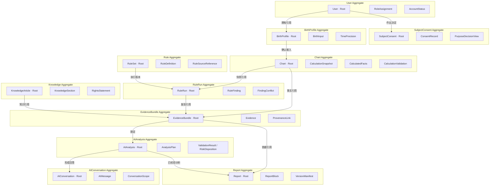

关系线表示聚合间仅通过身份或不可变发布值协作，不表示一个事务同时修改多个聚合。

## 10.1 User Aggregate

- **Aggregate Root：** User。
- **内部对象：** AccountStatus、RoleAssignment、匿名资产认领记录。
- **一致性边界：** User 状态与角色分配必须一致；Deleted 用户不能发起新业务动作；角色变化产生领域事件。
- **外部访问规则：** 其他聚合只持有 UserId，不复制认证信息；只有 Identity Context 可改变 User 状态。

## 10.2 BirthProfile Aggregate

- **Aggregate Root：** BirthProfile。
- **内部对象：** BirthInput、ProfileLabel、SubjectRelationship、TimePrecision。
- **一致性边界：** Confirmed BirthInput 不可修改；新输入必须形成新实体；直接四柱模式不得伪造地点和时间。
- **外部访问规则：** Calendar & Time 只消费 Confirmed BirthInput 的不可变投影；其他 Context 不得修改资料。

## 10.3 Chart Aggregate

- **Aggregate Root：** Chart。
- **内部对象：** CalculationSnapshot、CalculatedFacts、CalculationValidation、状态转换记录。
- **一致性边界：** 同一 CalculationSnapshot 必须锁定一个 BirthInput、时间语义、AlgorithmVersion 和 CalculationParameters；验证失败不能成为正式有效快照；Chart 状态只覆盖 Draft、Validating、Validated、Calculating、Calculated、Archived 及阶段性失败状态。
- **外部访问规则：** RuleRun 和基础 Timeline 读取 Valid 快照；外部不能直接追加或改写计算事实；重新计算必须由 Chart Root 创建新快照；任何下游聚合不得回写 Chart 状态。

## 10.4 Algorithm Aggregate

- **Aggregate Root：** AlgorithmVersion。
- **内部对象：** CapabilityDeclaration、SupportedRange、DataSourceReference、ValidationManifest。
- **一致性边界：** Published 版本必须具有支持范围、数据版本和黄金测试声明；被引用版本不能修改或删除。
- **外部访问规则：** Chart 只能选择 Published 或被明确允许用于历史重放的版本。

## 10.5 Rule Aggregate

- **Aggregate Root：** RuleSet。
- **内部对象：** RuleDefinition、RuleDependency、RuleConflictDeclaration、RuleSourceReference、ExpertOpinion、RuleTestManifest。
- **一致性边界：** Published RuleSet 不可修改；每个规则必须属于明确流派、具有来源和适用条件；未经批准的争议规则不能进入正式版本。
- **外部访问规则：** RuleExecutionService 通过 RuleSet Root 获取可执行发布快照；治理人员不能绕过 Root 修改单条生产规则。

RuleFinding 不放入 Rule Aggregate 的发布事务中，因为它属于一次运行结果，生命周期与 RuleSet 定义不同。

## 10.6 RuleRun Aggregate

- **Aggregate Root：** RuleRun。
- **内部对象：** RuleFinding、FindingConflict、RunCompleteness、RuleExecutionError。
- **一致性边界：** 一个 RuleRun 只能绑定一个 CalculationSnapshot 和一个 RuleSetVersion；Completed 前所有 Finding 必须完成验证，冲突关系和完整性状态必须确定；Failed 不得伪装为 Completed。
- **外部访问规则：** 只能通过 RuleRun Root 访问本次 RuleFinding 集合；EvidenceBuilder 使用 Completed RuleRun 的冻结结果；外部不得单独新增或改写 RuleFinding。

## 10.7 EvidenceBundle Aggregate

- **Aggregate Root：** EvidenceBundle。
- **内部对象：** Evidence、ProvenanceLink、EvidenceStatus、CitationValidation、UpstreamVersionManifest、AnalysisScope。
- **一致性边界：** Bundle 中每个 Evidence 必须能追踪到清单内的 CalculationSnapshot、RuleRun、RuleFinding 或 KnowledgeCitation；分析范围一致；冻结后不可修改；无效引用不能保留为有效证据。
- **外部访问规则：** AIAnalysis 和 Report 只能引用 Frozen Bundle；不得自己创建 EvidenceId；Timeline 不属于 Bundle 冻结的必要前置对象。

## 10.8 Knowledge Aggregate

- **Aggregate Root：** KnowledgeArticle。
- **内部对象：** KnowledgeSection、SourceAttribution、RightsStatement、Applicability、LanguageVersion、ReviewDecision。
- **一致性边界：** Published 文章必须有来源、授权状态、语言、适用范围和审核结果；授权失效后不能用于新分析。
- **外部访问规则：** 检索只返回发布版本的稳定引用；AI 不能修改文章或扩大许可范围。

## 10.9 AIAnalysis Aggregate

- **Aggregate Root：** AIAnalysis。
- **内部对象：** AnalysisPlan、PromptVersionReference、ModelReference、ValidationResult、RiskDisposition、StructuredAnalysisResult。
- **一致性边界：** 一个 AIAnalysis 锁定一个 CalculationSnapshot、一个 Frozen EvidenceBundle 和一个 AnalysisPlan；Completed 前必须通过全部校验；供应商原始输出不属于正式结果。
- **外部访问规则：** Report 和 AIConversation 只读取 Completed AIAnalysis；外部不能要求其创建事实、Evidence 或扩大分析范围。

## 10.10 AIConversation Aggregate

- **Aggregate Root：** AIConversation。
- **内部对象：** AIMessage、ConversationScope、ContextSummary、UsageLimitState。
- **一致性边界：** 会话绑定一个 Chart；消息必须遵守时间和主题范围；需要命理分析的 Completed 回答必须引用相应 Completed AIAnalysis；切换 Chart 必须新建会话。
- **外部访问规则：** 只有会话所有者或获授权支持角色可访问；模型供应商不是聚合参与者。

## 10.11 Report Aggregate

- **Aggregate Root：** Report。
- **内部对象：** ReportBlock、VersionManifest、EvidenceReference、ReportStatus、SupersessionReference。
- **一致性边界：** Frozen 前必须通过结构、事实、引用和风险校验；VersionManifest 完整；Frozen 后不可修改；重新生成创建新 Report。
- **外部访问规则：** 只能通过 Report Root 冻结、归档或标记被替代；打印、PDF 和分享是对 Frozen Report 的投影或授权，不改变正文。

## 10.12 Timeline Aggregate

- **Aggregate Root：** Timeline。
- **内部对象：** TimelineKind、TimelinePeriod、TimelineNode、NodeComparison、TimeHorizon、EvidenceReference。
- **一致性边界：** 所有节点属于同一 CalculationSnapshot；基础 Timeline 只要求确定性事实与边界版本一致；分析 Timeline 必须引用一个基础 Timeline 版本，且其中关键节点必须有 RuleFinding 和 EvidenceReference。
- **外部访问规则：** AI 和 Report 可读取 Available Timeline；基础 Timeline 不依赖 Evidence；分析扩展通过 Timeline Root 产生新版本，不反向修改 EvidenceBundle。

## 10.13 SubjectConsent Aggregate

- **Aggregate Root：** SubjectConsent。
- **内部对象：** ConsentRecord、PurposeScope、PolicyReference、RevocationReason。
- **一致性边界：** 同一主体、目的和范围在某时刻只能有一个当前有效决策；变化通过追加 ConsentRecord 表达，不覆盖历史。
- **外部访问规则：** 其他 Context 查询当前决策或订阅撤回事件，不得修改 ConsentRecord。

---

## 11. 聚合间一致性

跨聚合不追求单一事务内的全部完成，而通过业务状态和领域事件实现最终一致：

1. `BirthProfileCreated` 只表示容器存在，不触发正式时间或排盘处理。
2. 用户确认不可变输入后发布 `BirthInputConfirmed`，Calendar & Time 才能标准化，ChartFactory 才能创建正式计算所需 Chart。
3. Chart 只有在 CalculationSnapshot 有效后发布 `ChartCalculated`；其生命周期至此保持 Calculated，不等待或跟随任何下游状态。
4. RuleRun 消费 ChartCalculated，完成后发布 `RulesEvaluated`，但不得修改 Chart。
5. EvidenceBundle 消费有效 CalculationSnapshot、Completed RuleRun 和知识引用，冻结后发布 `EvidenceGenerated`。
6. AIAnalysis 消费 Frozen EvidenceBundle，完成校验后发布 `AIAnalysisCompleted`。
7. ReportFactory 收齐所需引用后创建报告；报告冻结发布 `ReportFrozen`。
8. 基础 Timeline 可在 ChartCalculated 后独立构建；分析 Timeline 在基础版本上附加 RuleFinding 和 EvidenceReference。
9. 任一步失败都保留在对应聚合，不反向伪造或修改上游成功状态。
10. 重复事件由订阅者按事件身份保持业务幂等；本文档不规定实现机制。

### 11.1 AnalysisProgress 只读查询投影

`AnalysisProgress` 用于向用户展示端到端处理进度。它可以汇总 Chart、RuleRun、EvidenceBundle、AIAnalysis、Timeline 和 Report 的当前状态及失败原因，但具有以下限制：

- 不是 Entity，不具有业务身份和独立生命周期；
- 不是 Aggregate Root，不定义跨 Context 一致性事务；
- 只读取各聚合已经发布的状态，不反向修改任何聚合；
- 某一投影暂时滞后时，不改变任何源聚合的真实状态；
- 不使用一个笼统的 Completed 覆盖各阶段的独立完成语义。

---

## 12. Domain Service

Domain Service 用于不自然属于单一 Entity 或 Value Object、需要协调多个领域概念的业务行为。它们不代表技术层服务或网络服务。

## 12.1 ChartCalculationService

- **为什么是 Domain Service：** 计算需要协调 BirthInput、标准化时间语义、AlgorithmVersion、CalculationParameters 和验证策略，不能由单一值对象承担。
- **输入：** 已确认 BirthInput 引用、标准化时间结果、AlgorithmVersion、CalculationParameters、验证策略。
- **输出：** CalculationSnapshot 候选、计算验证结果，或 ValidationFailed、CalculationFailed、VerificationBlocked 等明确阶段结果。
- **领域约束：** 不使用 AI；不接受未发布算法用于正式计算；不把验证一致性解释为预测准确率。

## 12.2 RuleExecutionService

- **为什么是 Domain Service：** 规则执行跨 RuleSet 和 CalculationSnapshot，并产生独立运行结果。
- **输入：** Valid CalculationSnapshot、Published RuleSet、分析范围。
- **输出：** RuleRun 聚合，其中包含 RuleFinding 集合、冲突关系和执行完整性结果。
- **领域约束：** 不适用和信息不足必须显式；执行错误不能成为 RuleFinding 的肯定或否定结论。

## 12.3 EvidenceBuilder

- **为什么是 Domain Service：** 证据需要组合计算事实、RuleFinding、KnowledgeCitation 和证据策略，跨越多个上游概念。
- **输入：** CalculationSnapshot 引用、一个或多个 Completed RuleRun、允许的 KnowledgeCitation、AnalysisScope、证据策略版本，以及可选 TimelineNodeReference。
- **输出：** 可验证的 EvidenceBundle 或构建失败原因。
- **领域约束：** 不能创建不存在的上游事实；冲突必须保留；EvidenceStatus 不得转换成概率。

## 12.4 AIAnalysisService

- **为什么是 Domain Service：** AI 分析协调 AnalysisPlan、EvidenceBundle、KnowledgeCitation、可选 Timeline 投影、Prompt 版本和风险策略，不属于单条消息或会话自身。
- **输入：** Planned AIAnalysis、Frozen EvidenceBundle、允许知识、可选基础或分析 Timeline、PromptVersion、ModelReference 和风险策略版本。
- **输出：** Completed、Rejected 或 Failed 的 AIAnalysis。
- **领域约束：** 不计算事实、不创建证据、不扩大范围；供应商原始结果不是正式领域输出。

## 12.5 ReportGenerator

- **为什么是 Domain Service：** 报告需要组织来自 Chart、Evidence、AI 和 Timeline 的稳定引用，并执行跨区块完整性检查。
- **输入：** 报告类型、Chart 引用、CalculationSnapshot、Frozen EvidenceBundle、Completed AIAnalysis（报告类型需要时）、基础或分析 Timeline、语言和报告策略。
- **输出：** 可进入验证状态的 Report，或缺失组成部分清单。
- **领域约束：** 不重新计算上游对象；不能修改 Frozen Report；缺失必要版本不得生成正式报告。

## 12.6 TimelineBuilder

- **为什么是 Domain Service：** 基础时间轴需要组织 CalculationSnapshot 中的确定性流运事实；分析时间轴需要在既有基础版本上协调 RuleFinding 和 EvidenceReference。
- **输入：** 构建基础 Timeline 时只输入 CalculationSnapshot、TimeHorizon 和粒度；构建分析 Timeline 时另输入基础 Timeline 引用、Completed RuleRun 和 Frozen EvidenceBundle 的相关引用。
- **输出：** 基础 Timeline、分析 Timeline 或边界不确定状态。
- **领域约束：** 关键节点必须有证据；不生成绝对吉凶；不无界生成逐时结果。

## 12.7 ConsentDecisionService

- **为什么是 Domain Service：** 处理许可取决于主体、目的、范围、政策版本、撤回和时间，不属于单条 ConsentRecord。
- **输入：** 主体引用、处理目的、数据范围、判断时刻。
- **输出：** Allowed、Denied、RequiresNewConsent 或 LegallyRestricted，以及依据记录。
- **领域约束：** 缺少明确可选授权时默认拒绝可选用途。

## 12.8 RuleComparisonService

- **为什么是 Domain Service：** V1 比较来自不同 RuleSet 的发现，任何一个 RuleFinding 都不能单独完成对齐。
- **输入：** 同一 CalculationSnapshot 下的多个 Completed RuleRun 及已确认概念映射。
- **输出：** 一致、部分一致、差异、冲突或不可比较的结构化结果。
- **领域约束：** 不按数量投票确定真理；优先级待专家确认。

---

## 13. Repository

Repository 表示领域对聚合集合的访问抽象。Repository 以 Aggregate Root 为边界，不允许外部绕过 Root 直接保存内部实体。本文档不规定任何持久化技术。

## 13.1 UserRepository

- 按 UserId 获取 User Aggregate；
- 判断用户主体是否存在且处于允许状态；
- 保存由 User Root 验证过的状态变化；
- 不提供跨用户敏感资料的无边界查询。

## 13.2 BirthProfileRepository

- 按所有者和 BirthProfileId 获取聚合；
- 保存新确认 BirthInput 和资料生命周期变化；
- 保证调用者不能绕过所有权访问；
- 支持数据权利过程定位属于主体的 BirthProfile。

## 13.3 ChartRepository

- 按 ChartId 取得 Chart Aggregate；
- 保存合法状态转换和新 CalculationSnapshot；
- 查找特定 BirthProfile 下的 Chart；
- 为历史重放取得指定快照，不自动替换为最新版。

## 13.4 AlgorithmRepository

- 获取指定 AlgorithmVersion；
- 选择符合能力、范围和发布状态的算法版本；
- 保留历史引用版本的可读性；
- 不允许调用者修改 Published 版本。

## 13.5 RuleRepository

- 获取指定 RuleSet 发布版本；
- 按流派、适用范围和状态选择规则集；
- 保存治理通过的新版本和生命周期变化；
- 保留旧报告引用版本。

## 13.6 RuleRunRepository

- 获取和保存完整 RuleRun Aggregate；
- 按 RuleRunId、CalculationSnapshot 和 RuleSetVersion 获取对应运行；
- 只通过 RuleRun Root 保存 RuleFinding、冲突关系和完整性状态；
- 不把不同 RuleRun 的 RuleFinding 静默合并。

## 13.7 EvidenceRepository

- 获取和保存完整 EvidenceBundle；
- 按 EvidenceId 解析冻结证据；
- 验证证据属于指定分析和访问范围；
- 不允许单独改写 Frozen Bundle 内的 Evidence。

## 13.8 ReportRepository

- 获取和保存 Report Aggregate；
- 查找 Chart 下的报告及替代关系；
- 取得 Frozen Report 的原版本；
- 不提供原地更新 Frozen 正文的操作语义。

## 13.9 AIAnalysisRepository

- 获取和保存 AIAnalysis Aggregate；
- 按 CalculationSnapshot、EvidenceBundle 和 AnalysisPlan 查找独立分析；
- 只把 Completed AIAnalysis 提供给正式 Report 或回答；
- 保留 Rejected 与 Failed 的状态语义，但不将供应商原始输出视为正式结果。

## 13.10 KnowledgeRepository

- 获取指定 KnowledgeArticleVersion；
- 按发布、授权、语言、流派和主题选择知识；
- 保存治理通过的新版本和撤下状态；
- 不让检索相似度绕过正式状态。

## 13.11 ConversationRepository

- 按所有者与 Chart 获取 AIConversation；
- 保存符合会话范围的新 AIMessage；
- 取得消息生成时锁定的证据和策略引用；
- 隔离不同 Chart 的上下文。

## 13.12 TimelineRepository

- 获取 Chart 和 CalculationSnapshot 对应的基础或分析 Timeline；
- 分别保存基础版本和基于基础版本的分析扩展；
- 按 TimeHorizon、粒度和 TimelineKind 选择可用 Timeline；
- 不把不同计算版本的节点合并，也不让分析版本改写基础节点。

## 13.13 SubjectConsentRepository

- 按 SubjectConsentId 或 SubjectId 获取 SubjectConsent Aggregate；
- 保存由 Aggregate Root 验证过的追加式 ConsentRecord；
- 提供指定目的、范围和时刻的当前有效决策；
- 不允许外部单独改写或删除历史 ConsentRecord。

---

## 14. Factory

## 14.1 ChartFactory

- **职责：** 仅在 `BirthInputConfirmed` 后，根据已确认 BirthInput、标准化时间语义和选定算法能力创建合法 Chart 初始聚合。
- **必须验证：** 输入确认状态、主体访问权、必要同意、算法支持范围和时间边界状态。
- **产生结果：** Draft 或 Validated 前置状态的 Chart；不直接伪造 Calculated 状态。
- **不负责：** 执行具体排盘、规则或 AI 分析。

## 14.2 ReportFactory

- **职责：** 根据报告类型和已验证组成部分创建 Report 聚合。
- **必须验证：** Chart 所有权、CalculationSnapshot、Frozen EvidenceBundle、所需 Completed AIAnalysis、Timeline、语言和版本清单是否相互兼容。
- **产生结果：** Queued 或 Generating 状态 Report。
- **不负责：** 修改上游内容、绕过风险校验或冻结未完成报告。

## 14.3 EvidenceFactory

- **职责：** 创建 Building 状态 EvidenceBundle，并为 EvidenceBuilder 创建类型正确、来源明确的内部 Evidence 候选。
- **必须验证：** CalculationSnapshot、RuleRun、KnowledgeCitation、证据策略版本、AnalysisScope 和访问范围合法。
- **产生结果：** Building 状态的 EvidenceBundle 或拒绝原因。
- **不负责：** 判定最终 EvidenceStatus 或生成 AI 文案。

## 14.4 BirthProfileFactory

- **职责：** 为匿名主体或注册 User 创建符合最小化原则的 BirthProfile。
- **必须验证：** 年龄确认、必要处理许可、输入模式和所有权关系。
- **产生结果：** Draft BirthProfile。

## 14.5 RuleSetFactory

- **职责：** 创建带流派、来源、适用范围和治理元数据的规则集草稿。
- **必须验证：** 流派身份存在、创建者具有治理角色、来源最小信息完整。
- **产生结果：** Draft RuleSet；不得直接产生 Published 状态。

## 14.6 RuleRunFactory

- **职责：** 为一个有效 CalculationSnapshot 和一个 Published RuleSetVersion 创建 Requested RuleRun。
- **必须验证：** 计算快照有效、规则集适用、分析范围明确且不存在相同幂等业务运行。
- **产生结果：** Requested RuleRun；不直接创建 Completed 或 RuleFinding。

## 14.7 AIAnalysisFactory

- **职责：** 根据 Chart、CalculationSnapshot、Frozen EvidenceBundle 和 AnalysisPlan 创建 Planned AIAnalysis。
- **必须验证：** 分析范围不超出 EvidenceBundle，PromptVersion 与 ModelReference 适用，所需风险策略存在。
- **产生结果：** Planned AIAnalysis；不接收供应商原始输出作为正式结果。

## 14.8 SubjectConsentFactory

- **职责：** 为合法 Subject 创建 SubjectConsent Aggregate，并建立初始目的决策视图。
- **必须验证：** SubjectId、PolicyReference、允许的目的和范围完整。
- **产生结果：** Active SubjectConsent；所有具体同意变化继续通过追加 ConsentRecord 表达。

---

## 15. Domain Event

领域事件描述已经发生且具有业务意义的事实。事件使用过去式，不表达命令。订阅者不得假设与发布者处于同一事务。

| 事件 | 触发条件 | 发布者 | 主要订阅者 |
|---|---|---|---|
| BirthProfileCreated | 合法主体创建 BirthProfile 容器 | BirthProfile Aggregate | Audit；不触发时间标准化或排盘 |
| BirthInputConfirmed | 用户确认某次不可变 BirthInput | Birth Context | Calendar & Time、Chart Calculation、Audit |
| BirthTimeAmbiguityDetected | 输入范围跨越关键时间边界 | Calendar & Time | Birth、Chart Calculation、Report、Audit |
| ChartCalculationRequested | Chart 已具备合法计算前置条件 | Chart Aggregate | ChartCalculationService、Audit |
| ChartCalculated | CalculationSnapshot 完成并验证有效 | Chart Aggregate | Rule Evaluation、Timeline、Audit |
| ChartCalculationFailed | 计算不可完成；关键交叉验证阻断另以 VerificationBlocked 状态表达 | Chart Aggregate | Birth/用户流程、Audit、运营处理 |
| RuleRunRequested | 有效 CalculationSnapshot 与 Published RuleSetVersion 形成合法执行请求 | RuleRun Aggregate | RuleExecutionService、Audit |
| RulesEvaluated | RuleRun 完成验证并形成完整 RuleFinding 集合 | RuleRun Aggregate | Evidence、Timeline、Audit |
| RuleRunFailed | RuleRun 执行或验证无法完成 | RuleRun Aggregate | AnalysisProgress、Audit、运营处理 |
| RuleConflictDetected | 同一 RuleRun 或多流派比较发现明确冲突 | RuleRun Aggregate / Rule Evaluation | Evidence、Timeline、Audit |
| EvidenceGenerated | EvidenceBundle 完成验证并冻结 | EvidenceBundle Aggregate | AI、Report、Timeline、Audit |
| EvidenceValidationFailed | EvidenceBundle 引用不存在、版本不符或不支持结论并进入 Invalid | EvidenceBundle Aggregate | AnalysisProgress、Governance、Audit |
| AIAnalysisPlanned | 合法 AnalysisPlan 与 Frozen EvidenceBundle 创建 Planned AIAnalysis | AIAnalysis Aggregate | AIAnalysisService、Audit |
| AIAnalysisCompleted | AI 输出通过结构、事实、引用、冲突和风险校验 | AIAnalysis Aggregate | Report、AIConversation、Audit、成本与反馈投影 |
| AIAnalysisRejected | AI 输出因范围、风险或内容策略被拒绝 | AIAnalysis Aggregate | 用户流程、Audit、安全运营 |
| AIAnalysisFailed | AIAnalysis 因不可恢复的生成或验证错误失败 | AIAnalysis Aggregate | AnalysisProgress、Audit、运营处理 |
| ReportFrozen | Report 完成验证并成为不可变正式报告 | Report Context | 用户通知、打印/PDF投影、Audit |
| ReportRegenerated | 用户或授权流程基于新请求创建替代报告 | Report Context | Report、Audit、用户通知 |
| ReportArchived | Report 不再活跃展示但保留历史 | Report Context | Audit、保留策略 |
| ConsentGranted | 主体对明确目的和范围作出有效同意 | SubjectConsent Aggregate | 相关处理 Context、Audit |
| ConsentRevoked | 主体撤回某一可选处理目的 | SubjectConsent Aggregate | Birth、Knowledge、AI、研究流程、Audit |
| UserDeletionRequested | User 完成删除请求确认 | Identity Context | Consent、Birth、AI、Report、Audit |
| UserDeleted | 所有必须完成的活跃主体处理达到删除完成状态 | Identity Context | 各 Context、Audit、通知 |
| RuleSetPublished | RuleSet 经治理流程发布 | Governance / Rule Context | Rule Evaluation、Evidence、Audit |
| KnowledgeArticlePublished | KnowledgeArticle 经治理和授权审核发布 | Governance / Knowledge Context | Knowledge 检索、AI、Audit |
| KnowledgeRightsWithdrawn | 知识授权失效或被合法撤回 | Knowledge Context | Evidence、AI、Report影响评估、Audit |
| BaseTimelineBuilt | 基础 Timeline 由 CalculationSnapshot 与确定性流运事实构建完成 | Timeline Aggregate | AI、Report、Evidence 的可选节点引用、Audit |
| AnalysisTimelineBuilt | 分析 Timeline 在基础版本上附加 RuleFinding 与 EvidenceReference 后可用 | Timeline Aggregate | AI、Report、Audit |

### 15.1 必需事件详解

#### BirthProfileCreated

- **触发条件：** 主体、必要同意和所有权满足 BirthProfileFactory 约束，BirthProfile 容器已创建；不要求存在 Confirmed BirthInput。
- **发布者：** BirthProfile Aggregate。
- **订阅者：** Audit 记录创建事实；其他只读产品投影可更新容器状态。
- **不得推断：** 事件不表示输入已确认，不得触发 Calendar & Time 或 Chart Calculation，也不表示四柱已经计算。

#### BirthInputConfirmed

- **触发条件：** 用户确认某次不可变 BirthInput，其输入模式、精度和必要参数完整到可进入标准化判断。
- **发布者：** BirthProfile Aggregate。
- **订阅者：** Calendar & Time、Chart Calculation 的前置流程和 Audit。
- **业务后果：** 这是正式时间标准化和排盘流程的唯一 Birth 触发事件；后续仍可因歧义或验证失败而停止。

#### ChartCalculated

- **触发条件：** CalculationSnapshot 完成确定性计算、内部验证和要求的交叉验证。
- **发布者：** Chart Aggregate。
- **订阅者：** Rule Evaluation、基础 TimelineBuilder 和 Audit。
- **不得推断：** 事件不表示规则、AI 或报告已完成。

#### RulesEvaluated

- **触发条件：** 一个锁定 RuleSetVersion 对一个有效 CalculationSnapshot 执行完毕。
- **发布者：** RuleRun Aggregate。
- **订阅者：** EvidenceBuilder、Timeline 和 Audit。
- **不得推断：** 不适用、信息不足和冲突也属于合法完成结果。

#### EvidenceGenerated

- **触发条件：** EvidenceBundle 的上游引用、版本和支持关系验证通过并冻结。
- **发布者：** EvidenceBundle Aggregate。
- **订阅者：** AIAnalysisService、ReportGenerator、TimelineBuilder 和 Audit。
- **不得推断：** EvidenceStatus 不表示预测准确率。

#### AIAnalysisCompleted

- **触发条件：** 结构、事实、引用、冲突和风险检查全部通过。
- **发布者：** AIAnalysis Aggregate。
- **订阅者：** ReportGenerator、Audit 和成本/质量投影。
- **不得推断：** 模型供应商返回成功不等于该事件发生。

#### ReportFrozen

- **触发条件：** Report 必需区块和 VersionManifest 完整，校验通过并执行冻结。
- **发布者：** Report Aggregate。
- **订阅者：** 用户通知、打印/V1 PDF 投影和 Audit。
- **业务后果：** 报告正文不可原地修改。

#### ReportRegenerated

- **触发条件：** 用户或授权流程明确要求使用新请求、版本或范围创建新报告。
- **发布者：** Report Aggregate。
- **订阅者：** Report 查询投影、Audit 和用户通知。
- **业务后果：** 原报告可标记 Superseded，但仍保持冻结。

#### UserDeleted

- **触发条件：** User 删除业务流程达到已定义完成条件。
- **发布者：** User Aggregate。
- **订阅者：** 所有持有主体引用的 Context 和 Audit。
- **待确认：** 法律保留数据和备份到期不必与用户可见删除完成处于同一时刻，具体语义待法律确认。

#### ConsentRevoked

- **触发条件：** 主体对可撤回目的作出有效撤回决定。
- **发布者：** SubjectConsent Aggregate。
- **订阅者：** AI、Knowledge、研究、反馈优化、Birth 数据用途和 Audit。
- **业务后果：** 停止新的相关处理；既有研究和历史报告如何处理待法律确认。

---

## 16. Domain Event Flow

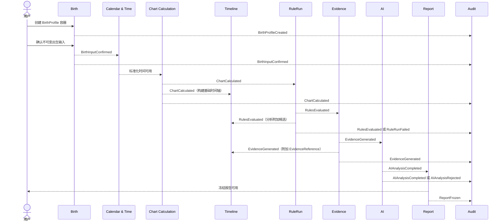

### 16.1 事件流不变量

1. `ChartCalculated` 必须先于对应的 `RulesEvaluated`。
2. `RulesEvaluated` 和有效计算事实必须先于 `EvidenceGenerated`。
3. `EvidenceGenerated` 必须先于使用该证据的 `AIAnalysisCompleted`。
4. `BaseTimelineBuilt` 可在 `ChartCalculated` 后独立发生，不等待 RulesEvaluated 或 EvidenceGenerated。
5. `AnalysisTimelineBuilt` 必须引用既有基础 Timeline，并在需要关键节点解释时等待对应 RuleFinding 和 EvidenceReference。
6. Timeline 不构成 EvidenceGenerated 的必需前置事件；时间证据最多引用已有基础 TimelineNode 的稳定身份。
7. `AIAnalysisCompleted` 不一定是 ReportFrozen 的必要条件：AI 不可用时可否冻结“无 AI 规则报告”由产品确认；若允许，报告类型必须明确区分。
8. `ReportFrozen` 不得由模型供应商直接发布。
9. Audit 订阅失败不能让高风险业务动作在完全无审计的情况下继续，具体阻断范围由架构与安全策略决定。

---

## 17. 生命周期

## 17.1 Chart 生命周期

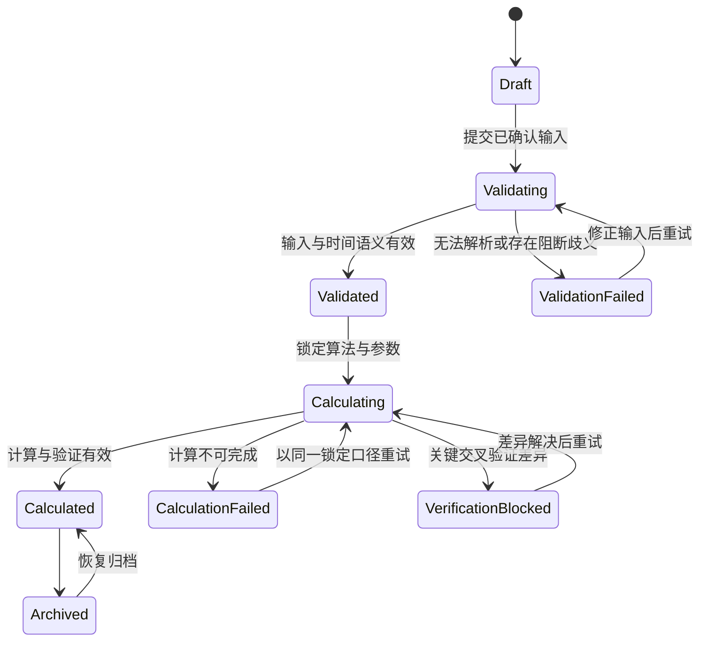

**不变量**

- ValidationFailed、CalculationFailed 和 VerificationBlocked 必须分别记录阶段与原因；不得合并为含义不明的 Failed。
- 输入或关键参数改变不得原地修改有效 CalculationSnapshot。
- Archived 不表示删除。
- RuleRun、EvidenceBundle、AIAnalysis 和 Report 的成功或失败均不能修改 Chart 状态。

## 17.2 RuleRun 生命周期

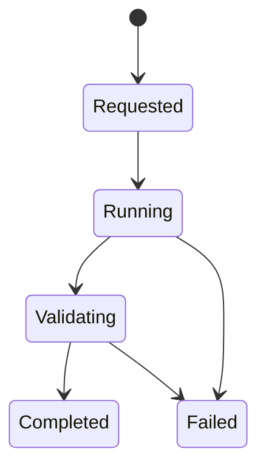

**不变量**

- 一个 RuleRun 始终绑定同一 CalculationSnapshot 和 RuleSetVersion。
- Completed 后 RuleFinding、冲突关系和完整性状态不可原地修改。
- Failed 只影响本次 RuleRun，不改变 Chart 的 Calculated 状态。

## 17.3 EvidenceBundle 生命周期

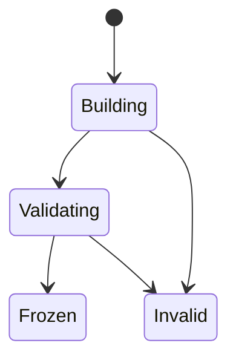

**不变量**

- Frozen 前必须锁定上游版本清单和 AnalysisScope。
- Frozen 后内部 Evidence 和溯源关系不可修改。
- Invalid Bundle 不得供 AIAnalysis 或 Report 使用。

## 17.4 AIAnalysis 生命周期

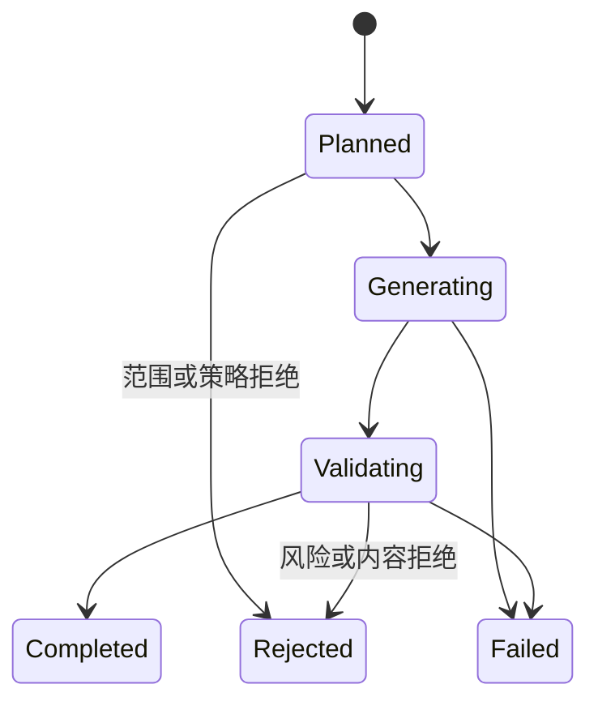

**不变量**

- AIAnalysis 始终绑定同一 CalculationSnapshot、Frozen EvidenceBundle 和 AnalysisPlan。
- 只有 Completed 包含正式可消费的结构化结果。
- 供应商原始输出不构成生命周期状态或正式结果。

## 17.5 Report 生命周期

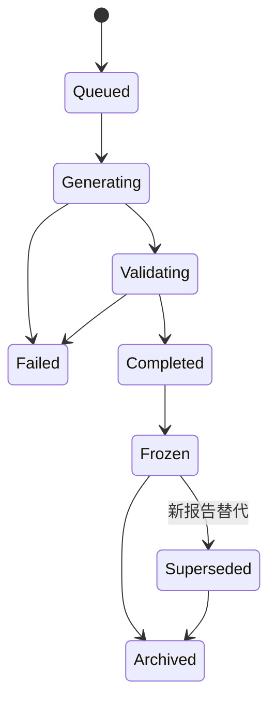

**不变量**

- 只有 Frozen 报告属于正式可交付报告。
- Frozen 报告不返回 Generating，也不原地修改。
- Regeneration 创建新 ReportId。
- 分享、打印和 PDF 不改变报告正文生命周期。

## 17.6 Rule 生命周期

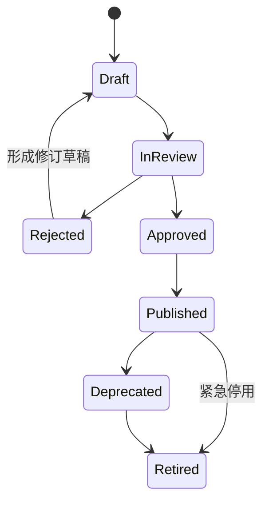

**不变量**

- 只有 Published 可用于新正式分析。
- Published 内容不可修改。
- Retired 版本仍可用于合法历史重放，但不能用于新分析。
- 专家意见有分歧时必须保留，不得伪造一致通过。

## 17.7 Knowledge 生命周期

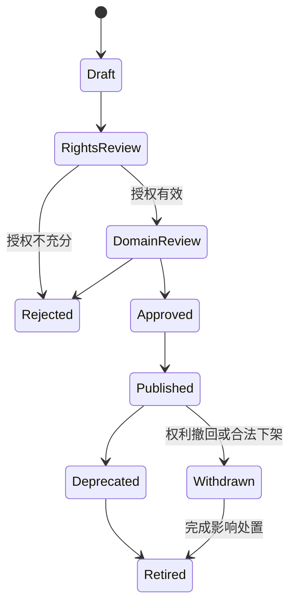

**不变量**

- RightsReview 和 DomainReview 均通过才可 Published。
- Withdrawn 后不得用于新检索和新报告。
- 旧报告的引用处置不由 KnowledgeArticle 单独决定，需法律规则和 Report 协作。

---

## 18. 核心领域不变量

### 18.1 身份与所有权

1. 一个业务资产在任一时刻必须有明确所有者或合法匿名主体边界。
2. 分享只授予访问权，不转移 Report 或 Chart 所有权。
3. 支持人员和管理员访问不是所有权，必须有独立业务目的和审计。

### 18.2 Birth 与时间

1. Confirmed BirthInput 不可修改。
2. 时间精度不得在标准化后丢失或被提高。
3. 直接四柱输入不得逆推出用户未提供的出生事实。
4. 关键口径必须由 VersionInfo 标识。

### 18.3 Chart

1. 有效 CalculationSnapshot 绑定且仅绑定一个 AlgorithmVersion 和一组 CalculationParameters。
2. AI 不能产生或修改 CalculatedFacts。
3. 关键交叉验证差异未解决时，受影响快照不能成为正式有效结果。
4. 历史快照不能被新算法覆盖。
5. Chart 的状态不包含 RuleRun、EvidenceBundle、AIAnalysis 或 Report 的状态；这些状态只能由 AnalysisProgress 只读汇总。

### 18.4 Rule

1. RuleRun 必须且只能引用一个 CalculationSnapshot 和一个 RuleSetVersion。
2. RuleFinding 必须属于一个 RuleRun，不得脱离聚合根被单独创建或修改。
3. 未发布规则不能用于正式 RuleRun。
4. `InsufficientData` 不等于 `NotSatisfied`。
5. 冲突观点不得静默覆盖。

### 18.5 Evidence 与 AI

1. EvidenceBundle 必须锁定 CalculationSnapshot、RuleRun、KnowledgeCitation 和证据策略的上游版本清单及 AnalysisScope。
2. Evidence 必须属于一个 EvidenceBundle 且具有真实上游引用。
3. AIAnalysis 不能创建 EvidenceId，也不能扩大 Frozen EvidenceBundle 的分析范围。
4. 重要 AI 结论必须引用当前 AIAnalysis 范围内的有效 Evidence。
5. EvidenceStatus 不能被表达为事件概率。
6. 风险、事实、引用或范围校验失败的 AI 输出不能成为 Completed AIAnalysis。
7. 模型供应商原始输出不是正式领域结果。

### 18.6 Timeline

1. 基础 Timeline 只依赖 CalculationSnapshot 和确定性流运事实即可存在。
2. 分析 Timeline 必须引用一个基础 Timeline 版本。
3. 分析 Timeline 中的关键节点必须具有 RuleFinding 和 EvidenceReference。
4. EvidenceBundle 不以完整 Timeline 为冻结前置；时间相关 Evidence 只可引用基础 TimelineNode 的稳定身份。

### 18.7 Report

1. Frozen Report 必须具有完整 VersionManifest。
2. Frozen Report 不可原地修改。
3. Regenerated Report 与旧 Report 具有不同身份。
4. 报告删除不得导致仍保留的其他报告失去必要版本语义。

### 18.8 Consent 与 Audit

1. SubjectConsent 是 Consent Context 唯一同意聚合根。
2. 可选用途在无有效同意时默认不允许。
3. 同一主体、目的和范围在同一时刻只能有一个有效决定。
4. 授予或撤回通过新 ConsentRecord 表达，不修改历史选择。
5. AuditEvent 不可原地修改；纠正通过新事件表达。
6. 用户反馈不能直接改变 RuleSet 或 KnowledgeArticle 的发布状态。

---

## 19. 所有权与删除语义

| 对象 | 业务所有者 | 可归档 | 可请求删除 | 历史保留原则 |
|---|---|---:|---:|---|
| User | 主体本人 | 否 | 是 | 最小审计与法定义务待确认 |
| BirthProfile | User / 匿名主体 | 是 | 是 | 与快照和报告协同处理 |
| Chart | BirthProfile 所有者 | 是 | 是 | 不得留下可访问的孤立敏感内容 |
| CalculationSnapshot | Chart | 通过 Chart | 通过 Chart | 冻结报告依赖时需整体策略 |
| RuleSet | 平台治理 | 可停用 | 已发布不可普通删除 | 历史复现需要可读 |
| RuleRun | Chart 分析范围 | 否 | 通过 Chart | 被 EvidenceBundle 引用时保持完整运行语义 |
| RuleFinding | RuleRun | 否 | 通过 RuleRun | 不可脱离 RuleRun 单独删除 |
| EvidenceBundle | Chart 分析范围 | 否 | 通过 Chart/Report | Frozen 后保持上游版本与范围语义 |
| Evidence | EvidenceBundle | 否 | 通过 EvidenceBundle | 不能单独破坏 Bundle 或报告引用 |
| KnowledgeArticle | 平台治理及权利约束 | 是 | 可撤下 | 授权与旧报告处置待法律确认 |
| AIAnalysis | Chart 所有者 | 否 | 通过 Chart/Report/Conversation | 被 Frozen Report 引用时保持正式结果语义 |
| AIConversation | User | 是 | 是 | 安全审计独立处理 |
| Report | Chart 所有者 | 是 | 是 | 分享访问同步撤销 |
| Timeline | Chart | 是 | 通过 Chart | 冻结报告引用节点需保留语义 |
| SubjectConsent | Subject | 可关闭 | 受法律限制 | 当前视图与追加历史需保持一致 |
| ConsentRecord | 主体作出、平台管理 | 否 | 受法律限制 | 证明范围和期限待确认 |
| AuditEvent | 平台合规责任 | 可归档 | 仅按政策处置 | 不允许普通角色删除 |

删除、匿名化、撤回授权和归档的最终法律语义由后续法律评审决定，本文档不假设所有对象都能立即彻底抹除。

---

## 20. 命理分歧的领域表达

### 20.1 不使用单一布尔结论

旺衰、格局、调候、用神等规则可能存在多流派或同流派分支。RuleFinding 必须包含：

- 所属 RuleSetVersion 和 SchoolReference；
- RuleOutcome；
- 所需事实与实际事实引用；
- 适用与排除条件；
- 专家确认状态；
- 与其他 Finding 的冲突关系；
- EvidenceStatus。

### 20.2 多流派比较对象

V1 可引入 `SchoolComparison` 领域对象，表达：

- ComparableConcept：确认可以对齐的概念；
- Agreement：结论语义一致；
- PartialAgreement：部分条件一致；
- Divergence：解释不同但不直接矛盾；
- Conflict：结论在同一问题上相反；
- NotComparable：概念或前提不同，不能强行比较。

该对象不产生“最终正确流派”。任何优先级策略均为命理专家待确认。

### 20.3 无法自动化

规则可标记为：

- DeterministicRule：可由结构化事实稳定执行；
- AssistedRule：系统产生候选，需要专家确认；
- InterpretiveGuidance：只作为解释知识，不产生自动 RuleFinding；
- Unsupported：当前版本不支持。

具体分类由命理专家决定，研发不得自行将解释性观点改写为确定规则。

---

## 21. 高风险主题的领域边界

`RiskLevel`、`TopicScope` 和风险处置结果属于领域模型，但具体类别、阈值和允许文案待法律、安全和产品确认。

领域层至少区分：

- NormalInterpretation：一般传统文化解释；
- CautionRequired：需弱化措辞并提供现实风险提示；
- ProfessionalBoundary：必须明确不能替代专业意见；
- RestrictedAdvice：不得给出具体行动指令；
- ProhibitedPrediction：不得生成的必然预测或伤害内容。

这些名称是领域候选语言，最终正式命名和边界待法律确认。无论最终命名如何，医疗诊断、具体投资保证、法律裁决、赌博指令和死亡必然预测不得通过 AI 或报告绕过。

---

## 22. 领域模型一致性检查

### 22.1 与 Product Vision 一致

- 普通用户优先通过 Report 投影实现，不污染专业事实模型；
- 确定性计算与 AI 分离；
- 分歧和不确定性是一等状态；
- 历史报告冻结且可复现；
- 插件扩展不进入本领域模型的动态执行设计。

### 22.2 与 SRS 一致

- 覆盖 User、Birth、Chart、RuleRun、EvidenceBundle、Knowledge、AIAnalysis、Report、Timeline、SubjectConsent 和 Audit；
- 支持所有主要状态机、异常状态和领域事件；
- 不确定时间、算法差异、规则冲突和 AI 校验失败均有正式语义；
- 所有权、删除、授权和审计边界可支持相关 FR、BR 与 NFR。

### 22.3 与 System Architecture 一致

- Bounded Context 与已批准模块边界对应；
- Chart Calculation 不依赖 Rule Evaluation、Evidence、AI 或 Report，且下游聚合不能修改 Chart；
- Evidence 是 Rule、Knowledge 与 AI/Report 的中间语义边界；
- 基础 Timeline 只依赖 CalculationSnapshot，分析 Timeline 才附加规则与证据；
- Report 消费冻结引用，不重算上游；
- Governance 与被治理内容分离；
- Audit 通过事件订阅形成只读历史。

---

## 23. 领域模型评审清单

- [ ] 本文档是否被接受为项目唯一正式领域模型。
- [ ] 统一语言是否避免把 BirthProfile、Chart、CalculationSnapshot、RuleFinding、Evidence 和 Report 混为一体。
- [ ] 13 个 Bounded Context 的职责、数据所有权和关系是否清晰。
- [ ] Chart Calculation 是否完全隔离于 AI 和自然语言知识。
- [ ] Chart 生命周期是否只包含确定性验证、计算、阶段失败和归档状态。
- [ ] AnalysisProgress 是否严格保持只读查询投影，不成为跨 Context 聚合根。
- [ ] Rule Evaluation 是否能够表达不适用、信息不足、冲突和错误。
- [ ] RuleRun 是否作为 RuleFinding 的唯一聚合根，且绑定单一 CalculationSnapshot 与 RuleSetVersion。
- [ ] EvidenceBundle 是否锁定上游版本清单与 AnalysisScope，并在 Frozen 后不可变。
- [ ] AIAnalysis 是否与 AIConversation/AIMessage 分离，且供应商原始输出不构成正式结果。
- [ ] SubjectConsent 是否成为唯一同意聚合根，ConsentRecord 仅作追加式内部历史。
- [ ] Evidence 是否成为所有重要结论的唯一正式溯源边界。
- [ ] AI 是否只能消费证据并产生通过校验的解释。
- [ ] Frozen Report 是否严格不可原地修改。
- [ ] 实体的身份、生命周期、删除和版本语义是否完整。
- [ ] Value Object 是否真正按值相等且不携带独立生命周期。
- [ ] Aggregate 是否足够小，且聚合间只通过引用或领域事件协作。
- [ ] Repository 是否只围绕 Aggregate Root，而未暗示数据库设计。
- [ ] Factory 和 Domain Service 是否保持领域职责而非实现职责。
- [ ] 领域事件是否使用已发生事实语义，并标明发布者和订阅者。
- [ ] Chart、RuleRun、EvidenceBundle、AIAnalysis、Report、Rule 和 Knowledge 生命周期是否与已批准 SRS 一致。
- [ ] 基础 Timeline 与分析 Timeline 的依赖方向是否清晰且无 EvidenceBundle 构建循环。
- [ ] 所有权、归档、删除、撤回和历史保留是否被明确区分。
- [ ] 多流派比较是否没有隐含唯一正确答案或多数投票逻辑。
- [ ] 高风险主题是否保持待法律确认且没有越权定义。
- [ ] 本文档是否完全避免数据库、SQL、ORM、API、DTO、Controller 和实现代码。

---

## 24. 需要命理专家确认的领域对象

1. `AlgorithmVersion` 的正式能力分类、支持范围和领域版本含义。
2. `SolarTermBoundary`、`CalculationParameters` 中真太阳时和换日策略的正式语义。
3. 起运顺逆、起运时刻和流月边界相关 Value Object 是否需要进一步拆分。
4. `CalculatedFacts` 的首批正式事实类型清单。
5. `RuleSet` 与流派、分支、规则来源之间的正式关系。
6. `RuleDefinition` 中哪些属于 DeterministicRule、AssistedRule 或 InterpretiveGuidance。
7. `RuleOutcome` 是否需要除当前六种状态外的其他领域状态。
8. 旺衰、得令、得地、得势、格局、调候、用神、喜忌的正式概念边界。
9. 首批神煞对象、来源、适用条件及其是否只作为辅助 Evidence。
10. `RuleConflictDeclaration` 与多流派冲突优先级是否需要建模；当前不得默认优先级。
11. `EvidenceStatus` 的判定规则和等级之间是否允许有序比较。
12. `SchoolComparison` 的可比较概念清单与对齐语义。
13. 不确定时间产生多个候选 Chart 还是一个 Chart 下多个 CalculationSnapshot 的最终产品/领域选择。
14. 哪些时间边界会阻断下游 RuleFinding、Timeline 和 Report。
15. 黄金命例和领域不变量由哪些专家角色批准。

---

## 25. 需要法律确认的领域对象

1. `SubjectConsent` 及其内部追加式 `ConsentRecord` 需要保留的证明范围、关闭与最终处置规则。
2. `UserDeleted` 的业务完成语义与备份、法定保留之间的关系。
3. BirthProfile 保存他人资料时 `SubjectRelationship` 和授权声明的合法要求。
4. BirthInput、Chart、AIConversation 和 Report 的敏感信息分类。
5. 各实体“可删除”的实际法律边界、处理期限和例外。
6. ConsentRevoked 后已进入研究或已匿名数据的处理规则。
7. KnowledgeArticle 的 RightsStatement、Withdrawn 状态和旧报告引用处置。
8. AuditEvent 的保留期限、访问边界和纠正机制。
9. RiskLevel、ProfessionalBoundary、RestrictedAdvice 和 ProhibitedPrediction 的正式分类。
10. 医疗、婚姻、投资、法律、赌博、自伤和死亡相关 TopicScope 的允许与禁止范围。
11. 匿名主体是否需要额外的同意证明以及临时资产到期语义。
12. V1 分享访问权是否需要记录访问主体、同意或水印状态。

---

## 26. 需要产品确认的领域对象

1. `Chart` 与 BirthProfile 的关系：关键输入改变时创建新 Chart，还是在同一 Chart 下创建新输入分支。
2. 不确定出生时间在 MVP 是创建多个候选 Chart、多个 CalculationSnapshot，还是阻断部分分析。
3. AI 不可用时是否允许生成明确类型的“无 AI 规则报告”；该选择不得改变 Chart 的 Calculated 状态。
4. MVP `Timeline` 是否包含流月和年份比较。
5. Report 类型是否区分普通报告、专业报告和无 AI 规则报告。
6. `AIConversation` 是否允许用户在同一 Chart 下创建多个独立主题会话。
7. `ReportRegenerated` 的用户触发条件和旧报告默认展示关系。
8. 单用户 100 个活动命盘的配额是否需要成为 User 或 Entitlement 领域规则；当前不放入 User Aggregate 核心不变量。
9. BirthProfile 标签是否允许用户输入姓名类信息；基于最小化原则建议提示避免真实姓名。
10. TimelineNode 的“关键”在普通界面中的正式名称，避免被理解为必然事件。
11. ProfessionalUser 是 User 角色、资格还是套餐权益；MVP 建议作为资格/角色引用，不产生独立用户实体。
12. 反馈、投诉和实际结果是否需要在后续领域模型版本中加入独立 Feedback Aggregate。

---

## 27. 进入下一份《05-DATA-MODEL.md》所需输入条件

- [ ] 04-DOMAIN-MODEL.md 已通过评审并确认为唯一正式领域模型。
- [ ] 统一语言、13 个 Bounded Context 及其所有权边界已经确认。
- [ ] 所有必需 Entity 的身份、版本、删除和生命周期语义已经确认。
- [ ] User、Chart、RuleSet、RuleRun、EvidenceBundle、KnowledgeArticle、AIAnalysis、AIConversation、Report、Timeline 和 SubjectConsent 等 Aggregate Root 及一致性边界已经确认。
- [ ] Chart 与 BirthProfile 在关键输入变化时的关系已由产品确认，或允许 Data Model 明确保留两种候选方案而不提前选定。
- [ ] 不确定出生时间的候选模型已确认，或明确标记为数据模型中的待决分支。
- [ ] 命理专家已确认首批事实和规则对象范围，或 Data Model 只为可扩展事实保留概念结构而不假设规则内容。
- [ ] 法律专家已初步确认 SubjectConsent、ConsentRecord、删除、审计、知识授权和敏感分类的建模约束。
- [ ] 已确认 Frozen Report、CalculationSnapshot、Published RuleSet、Completed RuleRun、Frozen EvidenceBundle 和 Completed AIAnalysis 的不可变要求。
- [ ] 已确认基础 Timeline 不依赖 Evidence，分析 Timeline 只附加规则、证据和解释。
- [ ] 已确认领域事件只描述业务事实，不直接映射为数据库结构。
- [ ] 下一份文档只把领域对象转换为概念与逻辑数据模型，不在未经确认时改变领域语义。
- [ ] 下一阶段仍不创建 SQL、ORM、迁移、API、代码或实际数据库。

只有本领域模型通过评审后，才开始生成 `05-DATA-MODEL.md`。在用户明确回复“需求与架构评审通过，可以进入编码阶段”之前，不得进入任何实现阶段。
