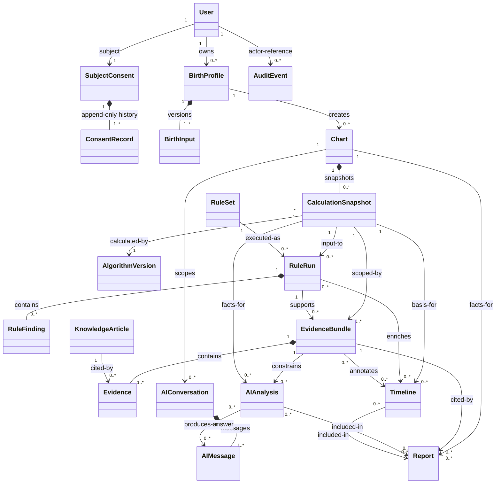
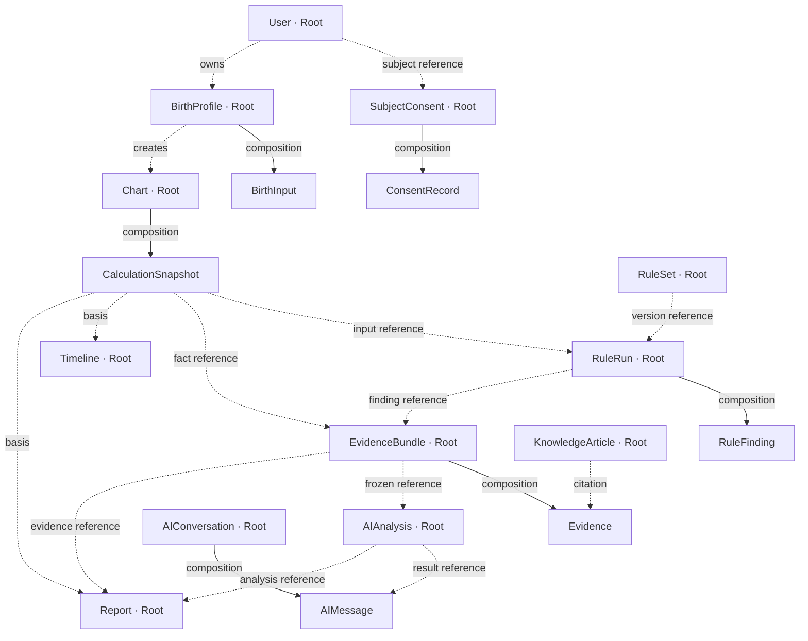
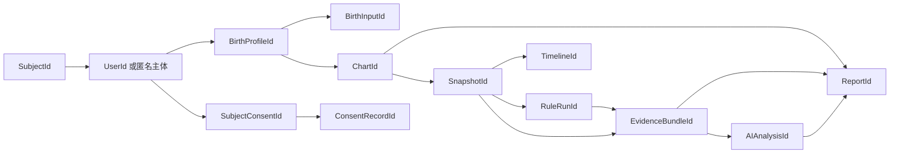
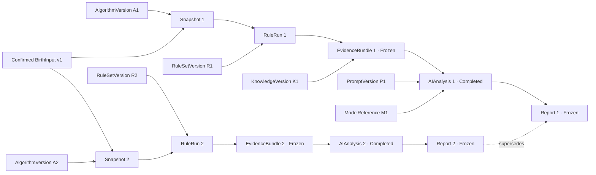
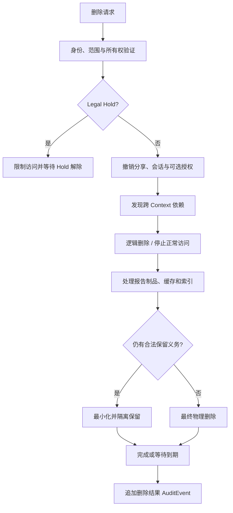

# AI 八字命理分析平台：数据模型

**文档编号：** 05  
**文档类型：** Data Model  
**文档状态：** Approved  
**当前版本：** 1.0  
**上游基线：** `01-PRODUCT-VISION.md`、`02-SRS.md`、`03-SYSTEM-ARCHITECTURE.md`、`04-DOMAIN-MODEL.md` 1.0（Approved）  
**目标读者：** 产品负责人、领域专家、架构师、数据负责人、安全与隐私负责人、测试负责人、法律评审人员

---

## 1. 文档目标与边界

本文档将已批准领域模型映射为正式逻辑数据模型，定义核心数据对象的身份、结构、关系、生命周期映射、一致性、唯一性、删除、归档、版本和审计策略。

本文档是逻辑层设计，不规定物理存储实现。文中的“主键”“引用”“唯一约束”和“数据对象”描述业务数据身份与约束，不表示具体数据库表、列、索引或外键实现。

本文档不包含：

- SQL 或建表语句；
- ORM、迁移脚本或 Repository 实现；
- API、OpenAPI、GraphQL、DTO 或 JSON Schema；
- Service、Controller 或业务算法实现；
- Java、Python、TypeScript 或其他程序代码。

### 1.1 Version 1.0 变更摘要

1. 已完成最终架构评审，文档状态正式更新为 `Approved`。
2. Cross Context Reference Rules 已定稿。
3. Identity Strategy 已定稿。
4. Version Strategy 已定稿。
5. Immutable Object Rules 已定稿。
6. 本数据模型正式作为后续设计基线；现有产品、法律、隐私、安全及命理专家待确认事项继续保留。

---

## 2. 数据建模原则（Data Modeling Principles）

### DMP-001 Identity

每个具有独立生命周期的 Entity 或 Aggregate Root 使用不可变代理身份。身份不使用邮箱、手机号、名称、出生信息、四柱文本或版本号等可变化或敏感值。

身份原则：

1. 核心身份在平台命名空间内全局唯一。
2. 身份一经分配不得重用，即使对象已删除、匿名化或归档。
3. 标识符本身不承载对象类别、创建时间、地区或用户敏感信息。
4. 对象之间通过身份引用，而不是复制对方完整数据。
5. 已冻结历史对象引用的身份必须保持可解析，或保留合法的最小历史占位语义。

### DMP-002 Versioning

版本分为三类，必须区分：

- **定义版本：** AlgorithmVersion、RuleSetVersion、KnowledgeArticleVersion、PromptVersion 等被治理内容版本。
- **运行快照：** CalculationSnapshot、RuleRun、EvidenceBundle、AIAnalysis 和 Report 等一次业务运行或冻结结果。
- **状态修订：** User、Chart、Conversation 等可变聚合的当前状态修订，用于并发一致性，不代表新的业务内容版本。

任何定义内容变化创建新版本；任何正式重新计算、重新分析或重新生成创建新运行对象。状态修订号不得被展示或解释为规则、报告或算法版本。

### DMP-003 Immutability

以下对象一旦达到正式状态，不可原地修改其业务内容：

- Confirmed BirthInput；
- Valid CalculationSnapshot；
- Published AlgorithmVersion；
- Published RuleSetVersion；
- Completed RuleRun；
- Frozen EvidenceBundle 及其 Evidence；
- Published KnowledgeArticleVersion；
- Completed AIAnalysis；
- Completed AIMessage 的正式回答内容；
- Frozen Report；
- AuditEvent；
- ConsentRecord 历史记录。

更正通过新对象、新版本、替代关系或追加纠正事件表达。

### DMP-004 Traceability

任何 Frozen Report 必须可追溯到：

1. User 或合法匿名主体边界；
2. BirthProfile 与 Confirmed BirthInput；
3. Chart 与 CalculationSnapshot；
4. AlgorithmVersion 及关键参数版本；
5. RuleSetVersion 与 RuleRun；
6. EvidenceBundle、Evidence 和 KnowledgeCitation；
7. AIAnalysis、AnalysisPlan、PromptVersion、ModelReference 和校验结果；
8. Timeline 版本；
9. 风险策略、语言和术语版本；
10. 报告自身冻结时间与替代关系。

追溯链使用稳定身份和版本清单，不依赖自然语言正文匹配。

### DMP-005 Soft Delete Strategy

逻辑删除用于需要立即从正常业务视图消失，但仍处于删除编排、恢复窗口、法律保留或依赖检查中的对象。逻辑删除不是默认永久保存手段。

逻辑删除必须表达：

- 删除请求时间；
- 请求主体和合法依据；
- 当前删除处理状态；
- 是否存在 Legal Hold；
- 关联对象处理结果；
- 最终物理删除或匿名化资格时间。

### DMP-006 Archive Strategy

Archive 表示对象仍合法存在且可被所有者恢复或作为历史查看，但不参与默认活动列表和新业务处理。Archive 不等于删除、匿名化或停用定义版本。

可归档对象包括 BirthProfile、Chart、AIConversation、Timeline 和 Report。Published RuleSet 或 KnowledgeArticle 使用 Deprecated/Retired，而不使用用户资产的 Archive 语义。

### DMP-007 Audit Strategy

AuditEvent 是追加式、不可原地修改的审计事实。业务对象的创建、关键更新、删除请求、发布、撤销、冻结、敏感访问和权限变化必须形成审计记录。

审计数据只保存调查所需最小信息；不得默认复制完整出生信息、报告正文、对话内容、模型上下文或知识全文。

### DMP-008 Snapshot Strategy

Snapshot 是某一时刻业务输入、版本和结果的不可变集合。Snapshot 必须完整到足以复现其确定性部分，同时避免复制不必要的身份信息。

核心快照包括：

- BirthInput：用户确认输入快照；
- CalculationSnapshot：确定性计算事实快照；
- RuleRun：规则执行结果快照；
- EvidenceBundle：证据和溯源快照；
- AIAnalysis：受约束解释结果快照；
- Report：最终交付快照。

Snapshot 之间通过明确引用形成链，不允许“始终读取最新版”破坏历史语义。

### DMP-009 Ownership

数据所有权区分：

- **用户业务所有权：** User 对 BirthProfile、Chart、Conversation、Timeline 和 Report 的业务访问权。
- **聚合组成所有权：** 聚合根对内部 Entity 的一致性控制，例如 RuleRun 对 RuleFinding、EvidenceBundle 对 Evidence。
- **平台治理责任：** AlgorithmVersion、RuleSet、KnowledgeArticle 和 AuditEvent。
- **法律权利关系：** 知识作者、版权方、数据主体和平台之间的权利，不等于业务聚合所有权。

### DMP-010 Data Minimization

只保存完成排盘、解释、用户选择和合规义务所需的数据。姓名和详细地址不属于默认排盘数据。第三方 AI 处理所需数据从 CalculationSnapshot、EvidenceBundle 和必要 Timeline 投影构造，不直接使用身份数据。

### DMP-011 State as Explicit Data

生命周期状态、失败阶段、不确定性、冲突、信息不足、Legal Hold 和删除进度均使用显式数据表达，不用空值、缺失记录或自由文本推断。

### DMP-012 Context Ownership

每个逻辑数据对象只归一个 Bounded Context 管理。跨 Context 只保存稳定引用或发布快照，不允许多个 Context 共同修改同一对象。

---

## 3. 数据分类与敏感度

| 分类 | 主要对象 | 敏感度 | 核心控制 |
|---|---|---|---|
| 身份与账户 | User | 高 | 强授权、最小关联、删除编排 |
| 同意与权利 | SubjectConsent、ConsentRecord | 高 | 追加历史、目的限制、受控访问 |
| 出生资料 | BirthProfile、BirthInput | 高 | 字段最小化、加密、精度保留、访问审计 |
| 确定性命盘 | Chart、CalculationSnapshot | 高 | 所有权、不可变快照、版本追溯 |
| 算法与规则定义 | AlgorithmVersion、RuleSet | 内部敏感 | 治理、发布、职责分离、历史可读 |
| 规则结果与证据 | RuleRun、RuleFinding、EvidenceBundle、Evidence | 高 | 分析范围隔离、不可变、引用校验 |
| 知识内容 | KnowledgeArticle | 版权与内部敏感 | 权利声明、引用范围、撤下 |
| AI 内容 | AIAnalysis、AIConversation、AIMessage | 高 | 去标识化、范围限制、风险处置、保留策略 |
| 时间分析 | Timeline | 高 | Chart 所有权、版本隔离、证据引用 |
| 报告 | Report | 高 | 冻结、访问控制、分享隔离、删除协同 |
| 审计 | AuditEvent | 受限 | 追加、防篡改、最小正文、独立权限 |

具体个人信息分类、保留期限和跨境处理边界待法律与隐私评审确认。

---

## 4. Logical Data Model 总览

该图表达逻辑数据关系，不表示物理表、外键或对象装载策略。

---

## 5. 核心对象逻辑定义

### 5.1 总览矩阵

| 对象 | 主键 | 自然键 | 生命周期 | 正式状态不可变 | 版本化 | 删除主策略 | 上游 | 下游 |
|---|---|---|---|---:|---:|---|---|---|
| User | UserId | 无；认证标识不可作自然键 | Pending→Active→Suspended→DeletionRequested→Deleted | 否 | 状态修订 | 逻辑删除后物理删除或最小化 | 无 | SubjectConsent、BirthProfile、AuditEvent |
| SubjectConsent | SubjectConsentId | SubjectId 在有效主体范围唯一 | Active→Restricted→Closed | 否 | 追加历史 | 法律限制下关闭/最小化 | User/匿名 Subject | ConsentRecord、各用途处理 |
| ConsentRecord | ConsentRecordId | 无 | Granted/Declined→Revoked/Expired/Superseded | 是 | 每次决定新记录 | 受 Legal Hold 与证明期限约束 | SubjectConsent、PolicyReference | 当前目的决策视图、AuditEvent |
| BirthProfile | BirthProfileId | 所有者内无强制自然键 | Draft→Confirmed→InUse→Archived→DeletionRequested→Deleted | 否 | 状态修订 | 归档或删除编排 | User、SubjectConsent | BirthInput、Chart |
| BirthInput | BirthInputId | BirthProfileId + InputSequence | DraftInput→ConfirmedInput→Superseded | Confirmed 后是 | 每次确认新记录 | 随 BirthProfile 协同处理 | BirthProfile | Calendar & Time、Chart |
| Chart | ChartId | 无 | Draft→Validating→Validated→Calculating→Calculated→Archived；阶段失败显式表达 | CalculationSnapshot 不可变 | Chart 状态修订；快照独立版本 | 归档或删除编排 | BirthProfile、BirthInput | CalculationSnapshot、RuleRun、Timeline、Report |
| CalculationSnapshot | SnapshotId | ChartId + SnapshotSequence | Pending→Calculating→Validating→Valid/Invalid/Failed→Superseded | Valid 后是 | 每次计算新快照 | 随 Chart；历史引用保护 | Chart、BirthInput、AlgorithmVersion | RuleRun、EvidenceBundle、AIAnalysis、Timeline、Report |
| AlgorithmVersion | AlgorithmVersionId | AlgorithmFamilyId + SemanticVersion | Draft→InReview→Approved→Published→Deprecated→Retired | Published 后是 | 是 | 不物理删除已引用版本 | Governance | CalculationSnapshot |
| RuleSet | RuleSetVersionId | RuleSetId + Version | Draft→InReview→Approved→Published→Deprecated→Retired | Published 后是 | 是 | 不物理删除已引用版本 | Governance、Algorithm capability | RuleRun |
| RuleRun | RuleRunId | SnapshotId + RuleSetVersionId + RunOrdinal | Requested→Running→Validating→Completed/Failed | Completed 后是 | 每次执行新对象 | 随 Chart；历史引用保护 | CalculationSnapshot、RuleSet | RuleFinding、EvidenceBundle、Timeline |
| RuleFinding | RuleFindingId | RuleRunId + FindingKey | Produced→Validated→Included/Excluded/Error | Validated 后是 | 随 RuleRun 新建 | 只能随 RuleRun 处理 | RuleRun | RuleRun 内部使用；对外只发布只读 Finding 引用值 |
| EvidenceBundle | EvidenceBundleId | SnapshotId + AnalysisScopeHash + BundleOrdinal | Building→Validating→Frozen/Invalid | Frozen 后是 | 每次构建新对象 | 随 Chart；冻结引用保护 | CalculationSnapshot、RuleRun、KnowledgeCitation | Evidence、AIAnalysis、Timeline、Report |
| Evidence | EvidenceId | EvidenceBundleId + EvidenceKey | Candidate→Validating→Valid/Conflicted/Invalid→Included | Bundle Frozen 后是 | 随 Bundle 新建 | 只能随 Bundle 处理 | EvidenceBundle、RuleRun 发布的 Finding 引用、KnowledgeArticle 引用 | AIAnalysis、Timeline、Report 的只读 EvidenceReference |
| KnowledgeArticle | KnowledgeArticleVersionId | KnowledgeArticleId + Version + LanguageTag | Draft→RightsReview→DomainReview→Approved→Published→Deprecated/Withdrawn→Retired | Published 后是 | 是 | 撤下/退役；引用历史受法律约束 | Governance、RightsStatement | Evidence、AIAnalysis |
| AIAnalysis | AIAnalysisId | 无；可用 AnalysisSeriesId + Ordinal 分组 | Planned→Generating→Validating→Completed/Rejected/Failed | Completed 后是 | 每次分析新对象 | 随 Chart/Report/Conversation 协同处理 | CalculationSnapshot、EvidenceBundle、Knowledge、Timeline | AIMessage、Report |
| AIConversation | AIConversationId | 无 | Active→Limited/Suspended→Closed→Archived→DeletionRequested | 否 | 状态修订 | 归档或删除编排 | User、Chart | AIMessage |
| AIMessage | AIMessageId | ConversationId + MessageSequence | Submitted→Generating→Validating→Completed/Rejected/Failed | Completed 后是 | 重答创建新消息 | 随 Conversation；审计最小化 | AIConversation、AIAnalysis | 用户展示、反馈 |
| Timeline | TimelineId | SnapshotId + TimelineKind + Horizon + Version | Planned→Building→Available→Extended→Superseded/Archived | Available 版本内容是 | 基础与分析版本分别新建 | 随 Chart；报告引用保护 | CalculationSnapshot；分析版另有 RuleRun/EvidenceBundle | AIAnalysis、Report |
| Report | ReportId | ReportSeriesId + ReportOrdinal | Queued→Generating→Validating→Completed→Frozen→Superseded/Archived/Failed | Frozen 后是 | 每次生成新对象 | 归档或删除编排 | Chart、Snapshot、EvidenceBundle、AIAnalysis、Timeline | 打印/PDF/分享投影、AuditEvent |
| AuditEvent | AuditEventId | EventSource + SourceEventId（存在时） | Recorded→Retained→Archived→EligibleForDisposal | 是 | 不版本化；纠正追加事件 | 仅按审计与法律策略 | 所有关键 Context | 调查与合规视图 |

自然键只用于业务去重和一致性校验，不替代主键，也不应包含不必要的敏感数据。

---

## 6. 对象详细数据结构

以下“结构”描述逻辑属性组，不是物理字段清单。

## 6.1 User

**身份与键**

- 主键：`UserId`，全局唯一、不可重用。
- 自然键：无。认证渠道标识可唯一，但属于可变化身份凭证，不是 User 自然键。

**逻辑结构**

- 主体状态与状态原因；
- 用户角色及其有效期引用；
- 创建、暂停、删除请求和删除完成时间；
- 默认语言和非敏感偏好；
- 当前状态修订号；
- Legal Hold 状态引用。

**一致性与生命周期**

- Deleted User 不得拥有新的活动业务对象。
- User 状态变化不得改变既有业务对象的历史身份引用。
- 角色变化与用户状态变化必须形成 AuditEvent。

**删除**

先进入 DeletionRequested，完成关联数据编排后进入 Deleted；可物理删除的身份凭证与必须保留的最小审计身份分开处理。

## 6.2 SubjectConsent

**身份与键**

- 主键：`SubjectConsentId`，全局唯一、不可重用。
- 自然键：`SubjectId` 在当前主体域内唯一对应一个 SubjectConsent。

**逻辑结构**

- SubjectId 和主体类型；
- 当前 PolicyReference；
- 当前目的决策视图；
- 聚合状态；
- ConsentRecord 历史引用；
- 当前状态修订号。

**一致性**

- 同一主体、目的、范围和时刻只能有一个有效决定。
- 当前目的决策视图必须能由追加式 ConsentRecord 历史推导。
- SubjectConsent Closed 后不得追加普通业务同意；法律纠正以特殊追加记录表达。

**删除**

不作为普通用户内容直接物理删除；按法律确认的证明期限关闭、最小化或最终处置。

## 6.3 ConsentRecord

**身份与键**

- 主键：`ConsentRecordId`，全局唯一、不可重用。
- 自然键：无；同一业务请求的重复记录通过来源事件身份去重。

**逻辑结构**

- SubjectConsentId；
- 目的、范围和数据类别；
- 决定类型：Granted、Declined、Revoked、Expired 或 Superseded；
- PolicyReference；
- 生效时间和失效时间；
- 用户操作来源与必要证明引用；
- 替代的前一 ConsentRecord 引用；
- 创建审计信息。

**一致性**

- 记录追加后不可修改。
- Revoked 必须引用或可推导被撤回的有效授权。
- 可选用途不得因缺少 Declined 记录而被视为同意；无有效 Granted 即不允许。

**删除**

受法律证明义务和 Legal Hold 约束，优先最小化而非单独删除历史决定。

## 6.4 BirthProfile

**身份与键**

- 主键：`BirthProfileId`，全局唯一、不可重用。
- 自然键：无；同一用户可合法保存多个相似资料。

**逻辑结构**

- 所有者 SubjectId；
- 资料关系类型及授权声明引用；
- 用户标签；
- 当前确认 BirthInput 引用；
- 状态、归档和删除信息；
- 创建与状态修订信息。

**一致性**

- 只能有一个当前 Confirmed BirthInput，但保留历史输入链。
- 用户标签不得被当作身份或出生事实。
- 保存他人资料的法律要求待确认。

**删除**

支持 Archive 和删除请求。删除需协调 Chart、Conversation、Timeline、Report 和研究授权，不允许留下可从普通业务访问的孤立敏感对象。

## 6.5 BirthInput

**身份与键**

- 主键：`BirthInputId`，全局唯一、不可重用。
- 自然键：`BirthProfileId + InputSequence` 在一个 BirthProfile 内唯一。

**逻辑结构**

- 输入模式：公历、农历或直接四柱；
- 日期、时间、TimePrecision 和可选 BirthTimeRange；
- LocationReference；
- 传统算法所需参数，与身份属性分离；
- 用户确认状态与确认时间；
- 前一输入引用和替代原因；
- 输入政策与术语版本引用。

**一致性**

- Confirmed 后不可修改。
- 未提供的时间、地点和身份信息不得被补造。
- 直接四柱输入不得伪造其不存在的出生日期、地点或历法口径。

**删除**

随 BirthProfile 删除编排处理；已被正式 Snapshot 引用时必须与下游整体删除、匿名化或合法保留。

## 6.6 Chart

**身份与键**

- 主键：`ChartId`，全局唯一、不可重用。
- 自然键：无；相同 BirthInput 可因明确业务意图创建不同 Chart，是否允许由产品规则约束。

**逻辑结构**

- BirthProfileId 与用于创建的 BirthInputId；
- 当前有效 CalculationSnapshot 引用；
- Chart 状态及 ValidationFailed、CalculationFailed、VerificationBlocked 等阶段原因；
- 创建、归档、删除请求和状态修订信息。

**一致性**

- Chart 只管理确定性计算及 CalculationSnapshot 生命周期。
- RuleRun、EvidenceBundle、AIAnalysis、Timeline 和 Report 通过 Chart/Snapshot 引用获得事实基础，但不得修改 Chart 状态。
- AnalysisProgress 不存入 Chart 作为业务状态。

**删除**

支持 Archive 和删除请求。下游对象按各自 Context 处理，不能以删除 Chart 直接绕过 Frozen Report、审计或 Legal Hold 规则。

## 6.7 CalculationSnapshot

**身份与键**

- 主键：`SnapshotId`，即领域模型中的 CalculationSnapshotId；全局唯一、不可重用。
- 自然键：`ChartId + SnapshotSequence`。

**逻辑结构**

- ChartId、BirthInputId；
- 标准化时间引用与 TimePrecision；
- AlgorithmVersionId；
- CalculationParameters 与数据源版本清单；
- FourPillars 和经批准的 CalculatedFacts；
- 计算状态、验证结果和交叉验证差异；
- SnapshotSequence、创建时间和被替代关系；
- 完整性摘要。

**一致性**

- 一个 Snapshot 只绑定一个 BirthInput、AlgorithmVersion 和参数集合。
- Valid 后业务内容不可修改。
- VerificationBlocked 不得成为当前有效正式 Snapshot。
- AI、规则或报告内容不得写入 CalculationSnapshot。

**删除**

不能在仍存在的 RuleRun、EvidenceBundle、AIAnalysis 或 Frozen Report 需要其语义时单独删除。

## 6.8 AlgorithmVersion

**身份与键**

- 主键：`AlgorithmVersionId`，全局唯一、不可重用。
- 自然键：`AlgorithmFamilyId + SemanticVersion`，在算法家族内唯一。

**逻辑结构**

- 算法家族与版本信息；
- 支持日期、地点、历法和参数范围；
- 数据源和时间策略版本；
- 能力声明；
- 黄金测试清单引用；
- 审核、发布、废弃和退役状态；
- 已知限制与差异说明。

**一致性**

- Published 后内容不可修改。
- 退役不影响历史 Snapshot 解析。
- 不完整或未批准版本不能用于正式 Snapshot。

**删除**

已被引用版本永久保留其最小可复现定义；未发布且未引用草稿可按治理策略物理删除。

## 6.9 RuleSet

**身份与键**

- 主键：`RuleSetVersionId`，全局唯一、不可重用。
- 自然键：`RuleSetId + Version`；RuleSetId 表示稳定规则集家族。

**逻辑结构**

- RuleSetId、版本和 SchoolReference；
- RuleDefinition 集合；
- 适用、排除、依赖和冲突声明；
- 来源、专家意见和测试清单；
- 审核与发布生命周期；
- 兼容的事实和算法能力范围。

**一致性**

- Published 后定义不可修改。
- 规则成员不能跨 RuleSetVersion 被原地共享修改。
- 未经专家确认的规则不得进入正式 Published 版本。

**删除**

已被 RuleRun 引用的版本不可物理删除；Retired 仅停止新运行。

## 6.10 RuleRun

**身份与键**

- 主键：`RuleRunId`，全局唯一、不可重用。
- 自然键：`SnapshotId + RuleSetVersionId + RunOrdinal`；相同业务幂等请求不得重复生成正式运行。

**逻辑结构**

- SnapshotId 与 RuleSetVersionId；
- AnalysisScope；
- Requested、Running、Validating、Completed 或 Failed 状态；
- RuleFinding 集合；
- FindingConflict 集合；
- RunCompleteness、失败原因和验证结果；
- 运行时间及被替代运行引用。

**一致性**

- 一个 RuleRun 只绑定一个 Snapshot 和一个 RuleSetVersion。
- Completed 后 Finding、冲突和完整性不可修改。
- Failed 不得被 EvidenceBundle 当作完整运行使用。

**删除**

随 Chart 数据权利过程处理；被 Frozen EvidenceBundle 或 Frozen Report 引用时不可单独删除。

## 6.11 RuleFinding

**身份与键**

- 主键：`RuleFindingId`，全局唯一、不可重用。
- 自然键：`RuleRunId + FindingKey`；FindingKey 在同一 RuleRun 内稳定标识结论类型和作用域。

**逻辑结构**

- RuleRunId；
- RuleDefinition 引用；
- RuleOutcome；
- 所需与实际事实引用；
- 适用、排除和信息不足状态；
- 冲突引用；
- 分析主题和时间范围；
- 验证及包含状态。

**一致性**

- 只能通过 RuleRun 聚合创建和管理。
- InsufficientData 不得存成 NotSatisfied。
- ExecutionError 不得伪装为命理结论。

**删除**

不支持独立删除，只能随 RuleRun 和下游引用策略处理。

## 6.12 EvidenceBundle

**身份与键**

- 主键：`EvidenceBundleId`，全局唯一、不可重用。
- 自然键：`SnapshotId + AnalysisScopeHash + BundleOrdinal`；Hash 仅用于范围等价与去重，不是身份。

**逻辑结构**

- SnapshotId；
- RuleRunId 集合；
- KnowledgeCitation 版本集合；
- EvidencePolicyVersion；
- AnalysisScope：主题、时间、语言和流派范围；
- UpstreamVersionManifest；
- Evidence 集合及 ProvenanceLink；
- Building、Validating、Frozen 或 Invalid 状态；
- 验证结果、冻结时间和被替代 Bundle 引用。

**一致性**

- Frozen 前必须锁定上游版本清单和范围。
- 每个 Evidence 的上游必须出现在清单内。
- Frozen 后内容、范围和引用不可修改。
- 完整 Timeline 不是冻结前置；时间证据只引用合法 TimelineNodeReference。

**删除**

被 Completed AIAnalysis 或 Frozen Report 引用时不可单独删除；随上游 Chart 的合法数据权利流程协同处理。

## 6.13 Evidence

**身份与键**

- 主键：`EvidenceId`，全局唯一、不可重用。
- 自然键：`EvidenceBundleId + EvidenceKey`，EvidenceKey 在 Bundle 范围内唯一。

**逻辑结构**

- EvidenceBundleId 和 EvidenceType；
- 上游 Input/CalculatedFact Snapshot 引用、由 RuleRun 发布的只读 Finding 引用值、KnowledgeCitation 或可选 TimelineNodeReference；
- 支持、限制或反驳关系；
- EvidenceStatus；
- 分析主题、时间范围和适用条件；
- CitationValidation 和 ProvenanceLink；
- 用户展示级别。

**一致性**

- 必须属于一个 EvidenceBundle。
- 不得引用 Bundle 上游清单外的数据。
- EvidenceStatus 不得保存预测概率。
- Bundle Frozen 后 Evidence 不可修改。

**删除**

不支持独立删除；删除必须保持 Bundle 和 Frozen Report 的引用完整性。

## 6.14 KnowledgeArticle

**身份与键**

- 主键：`KnowledgeArticleVersionId`，全局唯一、不可重用。
- 自然键：`KnowledgeArticleId + Version + LanguageTag`。

**逻辑结构**

- 稳定 KnowledgeArticleId 与版本；
- 来源类型、作者、书名或文献名、章节；
- 许可范围内原文、现代解释和语言；
- SchoolReference、主题与适用条件；
- SourceAttribution 和 RightsStatement；
- 审核意见、发布、废弃、撤下和退役状态；
- 前一版本与替代版本引用。

**一致性**

- Published 必须同时具有有效权利状态和领域审核。
- Published 后正文、解释和适用范围不可修改。
- Withdrawn 立即停止新引用，但不能静默改写旧报告。

**删除**

未发布且未引用草稿可物理删除；已发布版本采用 Withdrawn/Retired 和受控内容处置，最终规则待法律确认。

## 6.15 AIAnalysis

**身份与键**

- 主键：`AIAnalysisId`，全局唯一、不可重用。
- 自然键：无。可使用 `AnalysisSeriesId + AnalysisOrdinal` 表达重新分析关系，但不替代主键。

**逻辑结构**

- ChartId 与 SnapshotId；
- EvidenceBundleId；
- 可选 TimelineId 和 KnowledgeCitation 集合；
- AnalysisPlan；
- PromptVersion 与 ModelReference；
- Planned、Generating、Validating、Completed、Rejected 或 Failed 状态；
- StructuredAnalysisResult；
- ValidationResult 与 RiskDisposition；
- 用量、成本摘要和生成时限；
- 前一分析或替代关系。

**一致性**

- AnalysisPlan 不得超出 EvidenceBundle 的 AnalysisScope。
- Completed 前必须通过结构、事实、引用、冲突和风险校验。
- AIAnalysis 不得写入 CalculatedFacts、RuleFinding 或 Evidence。
- 模型供应商原始输出不是正式 StructuredAnalysisResult。

**删除**

随 Chart、Conversation 或 Report 的数据权利过程协同处理；Frozen Report 需要时保留完整历史语义或按合法策略整体删除。

## 6.16 AIConversation

**身份与键**

- 主键：`AIConversationId`，全局唯一、不可重用。
- 自然键：无。

**逻辑结构**

- 所有者 SubjectId、ChartId；
- ConversationScope 和 TimeHorizon；
- 语言、状态和额度状态；
- ContextSummary 的版本引用；
- 创建、关闭、归档和删除请求信息；
- 当前状态修订号。

**一致性**

- 一个 Conversation 只绑定一个 Chart。
- 切换 Chart 必须创建新 Conversation。
- ContextSummary 不能改变事实或 EvidenceId。

**删除**

支持 Archive 和删除请求；消息、分析引用和最小安全审计需协同处理。

## 6.17 AIMessage

**身份与键**

- 主键：`AIMessageId`，全局唯一、不可重用。
- 自然键：`AIConversationId + MessageSequence`。

**逻辑结构**

- AIConversationId；
- 消息角色和 MessageSequence；
- 用户问题、正式回答或安全拒绝；
- AIAnalysisId（需要命理分析的回答）；
- EvidenceReference 集合；
- Prompt/Model/风险策略版本引用；
- 状态、ValidationResult 和 RiskDisposition；
- 被替代消息引用。

**一致性**

- Completed 回答内容不可原地修改。
- 命理结论回答必须引用 Completed AIAnalysis 和有效 Evidence。
- Rejected 与 Failed 不能存成普通 Completed 回答。

**删除**

随 Conversation 处理；若保留最小安全审计，不复制消息正文。

## 6.18 Timeline

**身份与键**

- 主键：`TimelineId`，全局唯一、不可重用。
- 自然键：`SnapshotId + TimelineKind + TimeHorizon + TimelineVersion`。

**逻辑结构**

- SnapshotId 与 TimelineKind：Basic 或 Analytical；
- TimeHorizon、粒度和边界版本；
- 基础 Timeline 引用（仅分析版）；
- TimelinePeriod 和稳定 TimelineNode 身份集合；
- 分析版附加的 RuleRun、RuleFinding、EvidenceReference 和解释；
- 状态、版本、被替代和归档关系。

**一致性**

- Basic 只依赖 Snapshot 和确定性流运事实。
- Analytical 必须引用一个 Basic Timeline 版本。
- Analytical 关键节点必须有 RuleFinding 和 EvidenceReference。
- 分析版不得改写基础节点身份、时间位置或事实。

**删除**

随 Chart 协同处理；被 Frozen Report 引用的节点语义不能被单独破坏。

## 6.19 Report

**身份与键**

- 主键：`ReportId`，全局唯一、不可重用。
- 自然键：`ReportSeriesId + ReportOrdinal`；ReportSeriesId 只用于关联重新生成序列。

**逻辑结构**

- 所有者 SubjectId、ChartId 和 SnapshotId；
- ReportType、语言和受众模式；
- EvidenceBundleId；
- AIAnalysisId 集合；
- TimelineId；
- ReportBlock 集合；
- VersionManifest；
- 状态、冻结时间、被替代和归档关系；
- 打印、V1 PDF 和分享投影的引用，不把投影状态写入正文。

**一致性**

- Frozen 前 VersionManifest 和必需区块完整。
- Frozen 后正文、区块顺序、证据引用和版本清单不可修改。
- Regeneration 创建新 ReportId 并通过替代关系连接。
- Report 不执行或修改上游计算、规则、证据或分析。

**删除**

支持 Archive 和删除请求；分享访问应同步撤销；PDF/导出等派生制品随删除流程处理；Legal Hold 可暂停最终物理删除。

## 6.20 AuditEvent

**身份与键**

- 主键：`AuditEventId`，全局唯一、不可重用。
- 自然键：存在可靠来源事件时使用 `EventSource + SourceEventId` 防止重复审计投影。

**逻辑结构**

- 事件类型和发生时间；
- ActorReference、RoleReference 和业务目的；
- ObjectType 与 ObjectId；
- 动作、结果、失败类别和关联标识；
- 政策或发布版本引用；
- 安全严重度；
- 纠正事件和调查引用；
- 保留类别和 Legal Hold 状态。

**一致性**

- 记录后不可修改；纠正追加新 AuditEvent。
- 不保存非调查必要的出生信息、报告正文或模型上下文。
- 普通管理员不能删除或覆盖自己的操作记录。

**删除**

只按审计、法律和安全保留策略进入归档或最终处置，不接受普通业务删除。

---

## 7. Relationship Model

### 7.1 关系类型定义

| 关系类型 | 数据语义 | 删除影响 |
|---|---|---|
| One-to-One | 一个对象在指定业务范围内最多对应一个对象 | 不默认级联；按双方生命周期处理 |
| One-to-Many | 一个上游对象拥有或引用多个下游对象 | 需区分 Composition 与 Reference |
| Many-to-Many | 两类独立对象通过明确关联语义发生多重关系 | 任一对象删除不得隐式删除另一对象 |
| Composition | 内部对象不能脱离聚合根独立存在 | 只能通过聚合根创建、修改和删除 |
| Aggregation | 下游可独立存在，但在上游视图中被组织 | 上游删除不自动删除下游 |
| Reference | 仅保存稳定身份和版本关系 | 被引用对象需保持可解析或合法占位 |

### 7.2 一对一关系

| 左对象 | 右对象 | 所有权 | 约束 |
|---|---|---|---|
| User/匿名 Subject | SubjectConsent | Consent Context 管理 | 一个主体只有一个当前 SubjectConsent 聚合 |
| Chart | Current CalculationSnapshot | Chart Aggregate | 只是当前有效引用；Chart 仍可有多个历史快照 |
| Analytical Timeline | Basic Timeline | Timeline Context | 每个分析时间轴引用一个且仅一个基础版本 |
| Frozen Report | VersionManifest | Report Composition | VersionManifest 不能独立存在 |

### 7.3 一对多关系

| 一方 | 多方 | 关系 | 所有权与约束 |
|---|---|---|---|
| SubjectConsent | ConsentRecord | Composition | Record 只能追加，不能脱离 SubjectConsent |
| User | BirthProfile | Ownership Reference | User 拥有业务访问权，Birth Context 管理数据 |
| BirthProfile | BirthInput | Composition | Confirmed Input 不可修改 |
| BirthProfile | Chart | Reference | Chart 独立聚合，使用已确认输入 |
| Chart | CalculationSnapshot | Composition | Snapshot 由 Chart Root 创建 |
| AlgorithmVersion | CalculationSnapshot | Reference | 一个版本可被多个快照引用 |
| RuleSetVersion | RuleRun | Reference | 一个规则版本可运行多次 |
| CalculationSnapshot | RuleRun | Reference | 每个运行只属于一个快照 |
| RuleRun | RuleFinding | Composition | Finding 不可脱离运行 |
| CalculationSnapshot | EvidenceBundle | Reference | Bundle 锁定快照事实 |
| EvidenceBundle | Evidence | Composition | Evidence 不可脱离 Bundle |
| EvidenceBundle | AIAnalysis | Reference | 分析只能使用 Frozen Bundle |
| Chart | AIConversation | Ownership Reference | Conversation 独立聚合并绑定一个 Chart |
| AIConversation | AIMessage | Composition | Message 由 Conversation 管理 |
| CalculationSnapshot | Timeline | Reference | 可有多个范围与类型版本 |
| Chart | Report | Ownership Reference | Report 独立聚合，Chart 只提供事实基础 |

### 7.4 多对多关系

| 对象 A | 对象 B | 关联语义 | 所有权 |
|---|---|---|---|
| RuleRun | EvidenceBundle | Bundle 使用 RuleRun Aggregate 发布的只读 Finding 引用值 | 两个聚合独立；不得直接引用或修改 RuleFinding 内部 Entity |
| KnowledgeArticleVersion | EvidenceBundle | KnowledgeCitation | Knowledge 独立；Bundle 冻结引用版本 |
| Evidence | AIAnalysis | AI 结论的 EvidenceReference | AIAnalysis 管理使用关系，不管理 Evidence |
| RuleRun | Analytical Timeline | 节点的规则附加 | Timeline 管理投影，RuleRun 不被修改 |
| EvidenceBundle | Analytical Timeline | 节点的 EvidenceReference | Timeline 管理引用，Bundle 不被修改 |
| AIAnalysis | AIMessage | 分析被一个或多个回答使用 | Message 只引用 Completed Analysis |
| AIAnalysis | Report | 分析被一个或多个报告区块使用 | Report 管理包含关系，不修改 Analysis |
| Timeline | Report | 时间轴版本被报告引用 | Report 冻结 TimelineId |

### 7.5 聚合所有权图

实线 Composition 表示内部生命周期所有权；虚线表示独立聚合之间的稳定引用。

### 7.6 Cross Context Reference Rules

跨 Bounded Context 的数据关系必须遵循以下规则：

1. **只能引用 Aggregate Root Identity。** 一个 Context 对另一个 Context 的业务对象建立长期关系时，只能保存对方 Aggregate Root 的稳定 Identity，不能依赖其内部结构。
2. **不允许跨 Context 引用内部 Entity。** 其他 Context 不得直接持有或修改 `RuleFinding`、`Evidence`、`ConsentRecord`、`AIMessage`、`BirthInput` 等内部 Entity。确需表达历史依据时，应引用其所属 Aggregate Root 的不可变 Snapshot、公开证据引用或由所属 Context 发布的稳定引用值。
3. **不允许跨 Context 修改其他 Aggregate。** Context 只能修改自己拥有的 Aggregate。下游处理的成功、失败或删除状态不得回写上游 Aggregate 的生命周期。
4. **只通过稳定关系协作。** Context 之间通过 Aggregate Root Identity、不可变 Snapshot 或 Domain Event 建立关系。自然语言、显示名称、当前版本推断和内部序号不能作为跨 Context 关系依据。
5. **聚合一致性由所属 Context 保证。** 其他 Context 可以验证引用是否可用，但不能替代所属 Context 维护聚合不变量或修复内部数据。

补充约束：

- `CalculationSnapshot` 虽是 Chart Aggregate 内部 Entity，但可以由 Chart Calculation Context 发布为不可变 Snapshot 契约供其他 Context 消费。其他 Context 保存 `SnapshotId` 仅用于来源追溯，不获得对 Chart 内部 Entity 的直接访问或修改能力；这属于 Snapshot 交换，不属于跨 Context 内部 Entity 共享。
- `RuleFinding`、`Evidence` 等内部 Entity 对外只通过所属 Aggregate Root 发布的冻结引用值出现。接收方保存的是只读引用语义，不是对内部 Entity 的直接引用、装载能力或共同所有权。
- `AnalysisProgress` 只聚合读取各 Context 的公开状态，不构成新的跨 Context Aggregate。

---

## 8. Identity Strategy

### 8.1 核心身份规则

| 身份 | 全局唯一 | 可重用 | 标识保留语义 |
|---|---:|---:|---|
| UserId | 是 | 否 | 业务数据删除后仍永久保留“不得重用”的命名空间约束；实际身份数据按法律删除 |
| ChartId | 是 | 否 | 删除后不得指向新命盘；合法历史引用可保留最小占位 |
| SnapshotId | 是 | 否 | 被历史报告引用时持续可解析；否则随合法删除流程处置 |
| RuleRunId | 是 | 否 | 被 Bundle 或报告引用时持续可解析 |
| EvidenceBundleId | 是 | 否 | Frozen 后为稳定证据集合身份，不因新 Bundle 改变 |
| AIAnalysisId | 是 | 否 | Completed 分析身份稳定；重新分析生成新 ID |
| ReportId | 是 | 否 | Frozen 报告永久不被另一报告复用；删除后也不重新分配 |

“永久存在”指身份值不得重用，不代表相关个人数据必须永久保存。

### 8.2 其他身份

- `BirthProfileId`、`BirthInputId`、`AlgorithmVersionId`、`RuleSetVersionId`、`RuleFindingId`、`EvidenceId`、`KnowledgeArticleVersionId`、`AIConversationId`、`AIMessageId`、`TimelineId`、`ConsentRecordId` 和 `AuditEventId` 同样全局唯一且不可重用。
- 稳定家族身份 `AlgorithmFamilyId`、`RuleSetId`、`KnowledgeArticleId`、`AnalysisSeriesId` 和 `ReportSeriesId` 只用于组织版本或重新生成关系，不替代具体版本/实例主键。
- 匿名主体标识必须是临时、不可推断且不能与新会话重用；匿名资产转存到 User 后保留来源追踪，但不把匿名标识暴露为永久用户身份。

### 8.3 Identity Graph

箭头表示可追踪引用，不表示对象由上游统一管理生命周期。

### 8.4 Identity Semantic Rules

Identity 仅用于稳定识别对象，不承载业务语义。所有核心 Identity 必须遵循：

1. Identity 永远不编码地区、租户类别、用户类型、对象状态、创建时间、业务版本或执行顺序。
2. `UserId` 不表示用户所在地区、语言、注册渠道或账户等级。
3. `ChartId` 不表示创建时间、出生日期、命盘类型或所有者身份。
4. `ReportId` 不表示报告版本号、报告类型、语言或冻结顺序。
5. `SnapshotId` 不表示 `SnapshotSequence`、算法版本或计算时间。
6. `RuleRunId` 不表示执行顺序、RuleSetVersion、成功状态或流派。
7. 同理，`EvidenceBundleId`、`AIAnalysisId`、`TimelineId` 等 Identity 也不得嵌入其范围、版本、状态或敏感信息。
8. 需要排序、分类、分区、版本或展示的信息必须使用独立业务属性表达，不能解析 Identity 获得。

因此，Identity 的格式变化不得改变对象业务含义，业务规则也不得依赖 Identity 的字符结构或排序结果。

---

## 9. Version Strategy

### 9.1 Chart Version

`ChartId` 表示稳定命盘业务身份，Chart 本身不采用内容版本号表达重新计算。Chart 的状态修订只用于当前状态一致性，不属于用户可见业务版本。

- 同一 Chart 的每次正式计算产生新的 SnapshotId 和 SnapshotSequence。
- 当前有效 Snapshot 通过明确引用确定，不使用“最大版本号”隐式推断。
- BirthInput 关键内容改变时是创建新 Chart 还是同一 Chart 新分支仍待产品确认；无论哪种方案，旧 Snapshot 不被覆盖。
- RuleRun、AIAnalysis 和 Report 的版本状态不得写回 Chart。

### 9.2 Snapshot Version

CalculationSnapshot 是不可变运行快照：

- `SnapshotId` 是实例身份；
- `SnapshotSequence` 只在同一 Chart 内有序；
- Snapshot 锁定 BirthInputId、AlgorithmVersionId、参数和数据源版本；
- Valid 后不可修改；更正或新算法重算产生新 Snapshot；
- Superseded 只表示有更新候选，不使旧 Snapshot 失去历史可读性。

### 9.3 Rule Version

规则版本分两层：

- `RuleSetId`：稳定规则集家族；
- `RuleSetVersionId`：不可变发布版本。

RuleRun 必须锁定 RuleSetVersionId。新规则版本只影响明确选择它的新 RuleRun。旧 RuleRun 不“升级”到新规则版本。

### 9.4 Knowledge Version

知识版本分为稳定文章身份与语言版本：

- `KnowledgeArticleId`：稳定知识主题或文章家族；
- `KnowledgeArticleVersionId`：某语言下的不可变内容、权利和适用范围版本；
- `LanguageTag` 属于自然版本定位的一部分；
- KnowledgeCitation 锁定具体版本和允许引用范围；
- 撤下不重写旧引用，旧报告处置按法律规则执行。

### 9.5 Report Version

Report 不在同一 ReportId 下累加可变正文版本：

- 每次生成或重新生成都有新的 ReportId；
- ReportSeriesId 将相同业务意图下的报告关联为系列；
- ReportOrdinal 表达系列内顺序；
- Frozen 后不可修改；
- 新报告通过 SupersedesReportId 指向旧报告；
- 旧报告保持 Frozen 或进入 Archived/Superseded，不被覆盖。

### 9.6 AIAnalysis Version

AIAnalysis 是一次独立、不可变的正式分析运行：

- 每次重新分析生成新 AIAnalysisId；
- 生成过程内的技术重试不自动形成多个正式 AIAnalysis 版本；
- Completed 后 StructuredAnalysisResult、EvidenceBundleId、PromptVersion、ModelReference、ValidationResult 和 RiskDisposition 不可修改；
- AnalysisSeriesId 和 AnalysisOrdinal 可组织同一问题或报告目的下的重新分析；
- PromptVersion、ModelReference 和 EvidenceBundle 版本不能被误称为 AIAnalysis 自身版本。

### 9.7 Version Flow

每条新链创建新快照或运行对象，旧链保持原版本语义。

### 9.8 Identity 与 Version 的区别

`Identity ≠ Version`。

- Identity 回答“这是哪个对象”；
- Version 回答“这个对象家族或内容演进到了哪个不可变版本”；
- Sequence/Ordinal 回答“在限定业务范围内的顺序”；
- Status 回答“对象当前处于哪个生命周期阶段”。

以下概念不得混用：

| Identity | 对应版本或顺序 | 必须区分的语义 |
|---|---|---|
| SnapshotId | SnapshotSequence | SnapshotId 是全局对象身份；SnapshotSequence 仅表示同一 Chart 内的快照顺序 |
| ReportId | ReportOrdinal | ReportId 是单份报告身份；ReportOrdinal 表示 ReportSeries 内的生成顺序 |
| RuleSetId | RuleSetVersion / RuleSetVersionId | RuleSetId 标识稳定规则集家族；版本标识某份不可变规则内容 |
| KnowledgeArticleId | KnowledgeArticleVersion / KnowledgeArticleVersionId | 前者标识知识家族；后者标识具体语言和内容版本 |
| AIAnalysisId | AnalysisOrdinal | AIAnalysisId 标识单次正式分析；Ordinal 只组织重新分析序列 |
| RuleRunId | RunOrdinal | RuleRunId 标识一次运行；RunOrdinal 只区分同一 Snapshot 与规则版本下的运行顺序 |

一致性规则：

1. 不能从 Identity 的格式、大小或排序推断 Version、Sequence 或 Ordinal。
2. 新版本通常获得新的版本身份或运行对象身份，但“新 ID”本身不说明它比另一个 ID 更新。
3. 当前版本必须通过显式状态、当前引用、版本号或替代关系确定，不能以 Identity 最大值推断。
4. 对象删除后，其 Identity 不得被后续版本重用。
5. 用户界面展示版本时应使用明确的 Version、Sequence 或生成时间，不把 Identity 当作版本号。

---

## 10. Delete Strategy

### 10.1 删除动作定义

| 动作 | 定义 | 可逆性 | 适用目的 |
|---|---|---:|---|
| Physical Delete | 从活动及合法待删范围中最终移除数据内容 | 通常不可逆 | 无依赖、无保留义务的数据最终处置 |
| Logical Delete | 标记为不可正常访问并进入删除编排 | 在完成前可能可撤销 | 即时停止使用、处理依赖和等待期限 |
| Archive | 从活动视图移出但保留所有者恢复及历史访问 | 可逆 | 用户整理、历史版本和停用资产 |
| Anonymization | 不可逆移除或泛化与主体关联，使数据不再可合理关联个人 | 不可逆 | 合法研究或统计；标准待法律确认 |
| Legal Hold | 暂停删除或变更以满足法律、安全或争议处理 | 到期可解除 | 法定义务、争议和安全调查 |

Archive 不是删除，Anonymization 也不能只通过删除 UserId 宣称完成。

### 10.2 对象删除矩阵

| 对象 | Physical Delete | Logical Delete | Archive | Anonymization | Legal Hold |
|---|---|---|---|---|---|
| User | 最终允许，期限待确认 | 是 | 否 | 可用于最小审计替代 | 是 |
| SubjectConsent | 受法律限制 | 关闭而非普通逻辑删 | 否 | 可最小化主体关联，待确认 | 是 |
| ConsentRecord | 通常不单独执行，待期限 | 否 | 到期归档 | 可最小化非必要证明 | 是 |
| BirthProfile | 是，依赖清理后 | 是 | 是 | 经单独授权可用于研究副本 | 是 |
| BirthInput | 随 BirthProfile | 随聚合流程 | 通过 Profile | 经批准研究副本 | 是 |
| Chart | 是，依赖清理后 | 是 | 是 | 经批准研究副本 | 是 |
| CalculationSnapshot | 随 Chart 且无历史依赖后 | 通过 Chart | 通过 Chart | 经批准研究副本 | 是 |
| AlgorithmVersion | 未发布未引用草稿可 | 否 | 以 Retired 表达 | 不适用 | 是 |
| RuleSet | 未发布未引用草稿可 | 否 | 以 Retired 表达 | 不适用 | 是 |
| RuleRun | 随 Chart 且无历史依赖后 | 通过 Chart | 否 | 经批准研究副本 | 是 |
| RuleFinding | 仅随 RuleRun | 否 | 否 | 随研究规则 | 继承 RuleRun |
| EvidenceBundle | 随 Chart 且无冻结依赖后 | 通过 Chart | 否 | 经批准研究副本 | 是 |
| Evidence | 仅随 Bundle | 否 | 否 | 随研究规则 | 继承 Bundle |
| KnowledgeArticle | 草稿可；发布版受限 | 撤下而非逻辑删 | 以 Retired 表达 | 不适用 | 是 |
| AIAnalysis | 依赖清理后 | 通过所属流程 | 否 | 可仅保留去标识质量指标 | 是 |
| AIConversation | 是，期限后 | 是 | 是 | 可仅保留去标识聚合指标 | 是 |
| AIMessage | 随 Conversation | 通过 Conversation | 通过 Conversation | 可移除正文仅留聚合指标 | 是 |
| Timeline | 随 Chart 且无报告依赖后 | 通过 Chart | 是 | 经批准研究副本 | 是 |
| Report | 是，依赖与制品清理后 | 是 | 是 | 通常不保留全文匿名版 | 是 |
| AuditEvent | 仅保留期到期后 | 否 | 是 | 主体引用可依法最小化 | 是 |

### 10.3 删除顺序与依赖

用户删除请求不得简单采用无条件级联。逻辑顺序是：

1. 验证请求与 Legal Hold；
2. 停止主体创建新数据；
3. 撤销分享、会话和可选处理授权；
4. 标记用户资产不可正常访问；
5. 定位 BirthProfile、Chart、Conversation、Timeline、Report 及其下游；
6. 处理 AIAnalysis、EvidenceBundle、RuleRun 和 Snapshot 的历史依赖；
7. 删除 PDF、导出、缓存、检索副本和研究候选；
8. 对必须保留的审计、同意证明和 Legal Hold 数据进行最小化与隔离；
9. 完成可物理删除数据；
10. 记录删除完成、部分失败或等待到期状态。

### 10.4 Delete Flow

### 10.5 匿名化边界

- 匿名化必须不可合理逆转，不能仅删除 UserId 而保留可重新识别的精确出生时间、地点和完整报告。
- 用于优化或研究的匿名数据必须来源于有效、单独授权。
- 撤回后如何处理既有匿名研究数据待法律确认。
- 传统规则不得因匿名用户反馈自动改变。

---

## 11. Audit Strategy

### 11.1 必须审计的动作

| 对象 | 创建 | 更新/状态变化 | 删除请求 | 发布 | 撤销/停用 | 冻结 | 敏感访问 |
|---|---:|---:|---:|---:|---:|---:|---:|
| User | 是 | 是 | 是 | 不适用 | 会话/角色撤销 | 不适用 | 是 |
| SubjectConsent | 是 | 是 | 关闭请求 | 不适用 | 是 | 不适用 | 是 |
| ConsentRecord | 是 | 不可更新 | 受限处置 | 不适用 | 是 | 追加即固定 | 是 |
| BirthProfile | 是 | 是 | 是 | 不适用 | 授权关系撤销 | Confirmed Input 审计 | 是 |
| BirthInput | 是 | 草稿变化可摘要 | 随 Profile | 不适用 | Superseded | Confirmed | 是 |
| Chart | 是 | 是 | 是 | 不适用 | 归档/恢复 | Snapshot Valid | 是 |
| CalculationSnapshot | 是 | 状态变化 | 随 Chart | 不适用 | Superseded | Valid | 是 |
| AlgorithmVersion | 是 | 草稿/审核 | 草稿撤销 | 是 | Deprecated/Retired | Published | 是 |
| RuleSet | 是 | 草稿/审核 | 草稿撤销 | 是 | Deprecated/Retired | Published | 是 |
| RuleRun | 是 | 状态变化 | 随 Chart | 不适用 | 不适用 | Completed | 是 |
| RuleFinding | 通过 RuleRun | 不可独立更新 | 通过 RuleRun | 不适用 | 不适用 | 随 Run | 按 Run |
| EvidenceBundle | 是 | 状态变化 | 随 Chart | 不适用 | Invalid | Frozen | 是 |
| Evidence | 通过 Bundle | 不可独立更新 | 通过 Bundle | 不适用 | Invalid | 随 Bundle | 按 Bundle |
| KnowledgeArticle | 是 | 草稿/审核 | 草稿撤销 | 是 | Withdrawn/Retired | Published | 是 |
| AIAnalysis | 是 | 状态变化 | 随所属流程 | 不适用 | Rejected | Completed | 是 |
| AIConversation | 是 | 是 | 是 | 不适用 | Closed | 不适用 | 是 |
| AIMessage | 是 | 状态变化 | 随 Conversation | 不适用 | Rejected | Completed | 按会话 |
| Timeline | 是 | 新版本/状态 | 随 Chart | 不适用 | Superseded | Available | 是 |
| Report | 是 | 状态变化 | 是 | V1 分享另审计 | 分享撤销/归档 | Frozen | 是 |
| AuditEvent | 记录即创建 | 不可更新 | 仅到期处置 | 不适用 | 不适用 | 记录即固定 | 查询也需审计 |

### 11.2 审计内容

每个 AuditEvent 至少表达：

- 谁或哪个系统主体发起；
- 基于什么角色、所有权或业务目的；
- 对哪个对象及对象类型；
- 执行何种动作；
- 何时发生；
- 成功、拒绝、部分失败或错误；
- 关联哪个业务流程或来源事件；
- 使用何种政策、发布或风险版本（如相关）。

### 11.3 不进入审计正文的数据

默认不写入：

- 完整出生日期、时间和地点；
- 四柱以外的完整计算快照；
- 报告和 AI 对话全文；
- Prompt 全文或模型完整上下文；
- 密钥、认证凭证和恢复令牌；
- 受版权保护知识全文。

审计通过对象引用和版本引用定位业务语义，只有经授权调查才访问源数据。

### 11.4 审计保留

AuditEvent 具有独立保留类别，不能盲目继承被审计对象的删除时间。保留期限、Legal Hold 和主体引用最小化规则待法律与安全评审确认。

---

## 12. Data Consistency Rules

### 12.1 Aggregate 一致性

1. SubjectConsent 与 ConsentRecord 在同一聚合内保证目的决定唯一性和追加历史。
2. BirthProfile 与 BirthInput 保证当前确认输入和历史输入链一致。
3. Chart 与 CalculationSnapshot 保证当前有效快照、状态和失败阶段一致。
4. RuleRun 与 RuleFinding 保证运行版本、完整性和冲突集合一致。
5. EvidenceBundle 与 Evidence 保证 AnalysisScope、上游清单和引用一致。
6. AIConversation 与 AIMessage 保证消息顺序和 Chart 范围一致。
7. Report 与 ReportBlock、VersionManifest 保证冻结内容完整。
8. 聚合外对象不得直接修改聚合内部 Entity。

### 12.2 引用一致性

1. Chart 引用的 BirthInput 必须属于其 BirthProfile 且已 Confirmed。
2. CalculationSnapshot 的 AlgorithmVersion 必须在计算开始时允许正式使用。
3. RuleRun 的 Snapshot 必须 Valid，RuleSetVersion 必须 Published 或合法历史重放可用。
4. EvidenceBundle 的 RuleRun 必须 Completed，KnowledgeCitation 必须在构建时授权有效。
5. Evidence 引用的上游必须出现在 Bundle 的 UpstreamVersionManifest。
6. AIAnalysis 只能引用 Frozen EvidenceBundle。
7. Analytical Timeline 必须引用一个 Available Basic Timeline。
8. Frozen Report 引用的 Snapshot、Bundle、Analysis 和 Timeline 必须与同一 Chart 及兼容分析范围一致。
9. 删除不得留下仍可访问但无法解析的历史引用。

### 12.3 生命周期一致性

1. BirthProfileCreated 不触发计算；BirthInputConfirmed 才允许进入时间标准化。
2. Chart Calculated 不表示 RuleRun、EvidenceBundle、AIAnalysis 或 Report 已完成。
3. RuleRun Completed 必须先于基于其构建的 EvidenceBundle Frozen。
4. EvidenceBundle Frozen 必须先于使用它的 AIAnalysis Completed。
5. AIAnalysis Completed 必须先于需要 AI 内容的 Report Frozen。
6. Basic Timeline 可在 Snapshot Valid 后独立 Available，不等待 Evidence。
7. Report Frozen 后不能回到 Generating 或 Validating。
8. AnalysisProgress 只读汇总状态，不写回任何源对象。

### 12.4 版本一致性

1. Snapshot 锁定 AlgorithmVersion 和 CalculationParameters。
2. RuleRun 锁定 RuleSetVersion，不读取规则集“当前版本”。
3. EvidenceBundle 锁定 Snapshot、RuleRun、KnowledgeCitation 和证据策略版本。
4. AIAnalysis 锁定 EvidenceBundle、PromptVersion、ModelReference 和风险策略版本。
5. Report 的 VersionManifest 锁定全部正式上游版本。
6. 新版本发布不更新旧运行对象。
7. 重新生成创建新身份和替代关系，不覆盖旧对象。

### 12.5 唯一约束

| 约束 | 目的 |
|---|---|
| SubjectId 对应唯一当前 SubjectConsent | 防止同一主体出现冲突聚合 |
| BirthProfileId + InputSequence 唯一 | 保证输入历史顺序 |
| ChartId + SnapshotSequence 唯一 | 保证计算快照顺序 |
| AlgorithmFamilyId + SemanticVersion 唯一 | 防止算法版本歧义 |
| RuleSetId + Version 唯一 | 防止规则发布版本歧义 |
| SnapshotId + RuleSetVersionId + RunOrdinal 唯一 | 区分并去重规则运行 |
| RuleRunId + FindingKey 唯一 | 防止同一运行重复 Finding |
| EvidenceBundleId + EvidenceKey 唯一 | 防止 Bundle 内重复证据身份 |
| KnowledgeArticleId + Version + LanguageTag 唯一 | 区分知识语言版本 |
| ConversationId + MessageSequence 唯一 | 保证消息顺序 |
| SnapshotId + TimelineKind + Horizon + TimelineVersion 唯一 | 区分时间轴版本 |
| ReportSeriesId + ReportOrdinal 唯一 | 保证报告重生成序列 |
| EventSource + SourceEventId 唯一（存在时） | 防止审计事件重复投影 |

### 12.6 Eventual Consistency

以下跨聚合流程采用最终一致语义：

- BirthInputConfirmed → 时间标准化 → Chart 计算；
- ChartCalculated → RuleRun 与 Basic Timeline；
- RulesEvaluated → EvidenceBundle 和 Analytical Timeline 候选；
- EvidenceGenerated → AIAnalysis、Analytical Timeline 和 Report 候选；
- AIAnalysisCompleted → Report 生成或 AIMessage 回答；
- ConsentRevoked / UserDeletionRequested → 各 Context 停止处理与数据处置；
- KnowledgeRightsWithdrawn → 新检索停止与历史影响评估；
- ReportFrozen → 打印、PDF、分享和通知投影。

最终一致不允许以下行为：

- 在等待下游时修改上游已完成事实；
- 用一个跨 Context 事务状态替代各聚合状态；
- 将投影暂时滞后视为源数据失败；
- 因重复事件生成重复正式对象；
- 失败后伪造 Completed 或 Frozen 状态。

### 12.7 并发一致性

可变聚合使用状态修订语义防止丢失更新。不可变快照使用身份和状态转换防止重复冻结。以下竞争必须可检测：

- 同一 BirthProfile 同时确认两个 Current BirthInput；
- 同一 Chart 同时指定不同 Current Snapshot；
- 同一 SubjectConsent 对同一目的同时授予和撤回；
- 同一 RuleRun 被重复完成；
- EvidenceBundle 或 Report 被重复冻结；
- Report 同时归档、删除和创建分享；
- 用户删除期间创建新业务对象。

本文档不规定并发控制的技术实现。

### 12.8 Immutable Object Rules

达到正式不可变状态的对象必须遵守以下规则：

1. **Frozen 对象不得重新进入可编辑生命周期。** Frozen EvidenceBundle 和 Frozen Report 只能被新对象替代、归档或依法删除，不能回到 Building、Draft、Generating 或其他可编辑状态。
2. **Published 定义不得原地修改。** Published AlgorithmVersion、RuleSetVersion 和 KnowledgeArticleVersion 的正文、规则、能力、适用范围及版本语义均不可变；变更必须创建新版本。
3. **Completed AIAnalysis 不得重新进入 Generating。** 重试只发生在正式完成前；Completed 后需要重新分析时必须创建新的 AIAnalysisId。
4. **Frozen Report 不得重新进入 Draft 或 Generating。** 修订、纠错和重新生成必须创建新的 ReportId，并通过替代关系连接旧报告。
5. **CalculationSnapshot Valid 后不得修改事实。** 算法、参数、数据源或事实发生变化时必须产生新的 SnapshotId。
6. **RuleRun Completed 后不得新增 RuleFinding。** Finding、冲突关系或完整性变化必须通过新的 RuleRun 表达。
7. **EvidenceBundle Frozen 后不得新增 Evidence。** 新证据、引用或 AnalysisScope 变化必须构建新的 EvidenceBundle。

进一步约束：

- 不可变对象可以新增不改变其业务内容的外部关系，例如被新 Report 引用；这种引用不得写回或重写原对象内容。
- Superseded、Deprecated、Retired、Withdrawn、Archived 和 Legal Hold 是对使用资格、展示或处置的状态说明，不允许借此修改已冻结或已发布内容。
- 对不可变对象的纠正必须保留旧对象身份、纠正原因、新对象身份和必要 AuditEvent。

---

## 13. Snapshot 与追溯清单

### 13.1 CalculationSnapshot 清单

必须锁定：BirthInputId、标准化时间语义、TimePrecision、AlgorithmVersionId、CalculationParameters、数据源版本、CalculatedFacts、验证结果和完整性摘要。

### 13.2 EvidenceBundle 清单

必须锁定：SnapshotId、RuleRunId 集合、RuleSetVersion 集合、KnowledgeCitation 集合、EvidencePolicyVersion、AnalysisScope、Evidence 与 ProvenanceLink。

### 13.3 AIAnalysis 清单

必须锁定：SnapshotId、EvidenceBundleId、AnalysisPlan、PromptVersion、ModelReference、KnowledgeCitation、可选 TimelineId、ValidationResult、RiskDisposition 和正式结构化结果。

### 13.4 Report VersionManifest

必须至少包含：

- BirthInputId；
- SnapshotId 和 AlgorithmVersionId；
- RuleRunId 与 RuleSetVersionId 集合；
- EvidenceBundleId；
- KnowledgeArticleVersionId/Citation 集合；
- AIAnalysisId、PromptVersion 和 ModelReference；
- TimelineId；
- 风险策略、术语、语言和报告模板版本；
- 报告冻结时间。

VersionManifest 不复制全部上游正文，但必须使每个版本可定位。

---

## 14. Archive Strategy 详细规则

### 14.1 用户资产归档

- BirthProfile Archive 后不出现在默认活动列表，也不能默认发起新计算；恢复后仍使用原身份。
- Chart Archive 后不允许创建新 Snapshot、RuleRun、AIAnalysis 或 Report，除非先恢复。
- AIConversation Archive 后只读，恢复前不能追加消息。
- Timeline Archive 后不作为默认最新时间轴，但 Frozen Report 仍可引用。
- Report Archive 后不作为默认报告展示，但内容和版本不改变。

### 14.2 定义版本退役

AlgorithmVersion、RuleSet 和 KnowledgeArticle 不使用用户资产 Archive：

- Deprecated：仍可存在兼容或过渡用途；
- Retired：不用于新正式运行；
- Withdrawn：知识权利或合法下架；
- 历史引用保持可解析，具体内容展示受法律约束。

### 14.3 归档与配额

活动命盘默认上限与归档命盘是否计入配额待产品确认。归档不能用来逃避数据保留、Legal Hold 或删除义务。

---

## 15. 数据质量规则

### 15.1 完整性

- 必需身份和版本引用不能缺失。
- 正式快照必须有完整状态与生成时间。
- Frozen Report 必须有 VersionManifest。
- SubjectConsent 当前视图必须可由 ConsentRecord 历史重建。

### 15.2 有效性

- 枚举状态只能使用已批准领域值。
- TimePrecision 不能因后续处理被提高。
- RuleOutcome 的 InsufficientData、NotApplicable 和 ExecutionError 不得互换。
- EvidenceStatus 不能存储伪精确概率。
- TimelineKind 必须明确 Basic 或 Analytical。

### 15.3 一致性

- 同一分析链的 ChartId 和 SnapshotId 必须一致。
- 语言、流派、时间范围和 AnalysisScope 必须兼容。
- 报告引用的 AIAnalysis 和 Bundle 必须属于同一分析范围。
- 分享和 PDF 只能来源于 Frozen Report。

### 15.4 可追溯性

- 每个 RuleFinding 可定位 RuleDefinition 与输入事实。
- 每个 Evidence 可定位上游事实、Finding 或 Citation。
- 每个 AI 结论可定位 EvidenceReference。
- 每个 ReportBlock 可说明来源类型及必要上游引用。

### 15.5 纠错

- 不可变对象错误通过替代对象纠正。
- AuditEvent 错误通过纠正事件说明。
- 用户输入错误通过新 BirthInput 表达。
- 规则错误通过新 RuleSetVersion 和新 RuleRun 表达。
- 报告错误通过新 Report 和必要用户通知表达。

---

## 16. 生命周期映射

| 领域状态变化 | 数据动作 | 是否修改既有正式内容 | 必须审计 |
|---|---|---:|---:|
| BirthInput Draft→Confirmed | 冻结输入内容并设为当前确认引用 | 否；冻结前完成 | 是 |
| Chart Validated→Calculating | 锁定待计算输入与算法选择 | 否 | 是 |
| Snapshot Validating→Valid | 冻结计算事实和验证清单 | 否；冻结前完成 | 是 |
| RuleRun Validating→Completed | 冻结 Finding、冲突和完整性 | 否；冻结前完成 | 是 |
| EvidenceBundle Validating→Frozen | 冻结 Evidence、范围和版本清单 | 否；冻结前完成 | 是 |
| Knowledge Approved→Published | 冻结内容、权利和适用范围版本 | 否；发布新版本 | 是 |
| AIAnalysis Validating→Completed | 冻结正式结果、校验和风险处置 | 否；冻结前完成 | 是 |
| Report Completed→Frozen | 冻结区块和 VersionManifest | 否；冻结前完成 | 是 |
| Consent Granted→Revoked | 追加新 ConsentRecord 并更新当前视图 | 不修改旧记录 | 是 |
| 任意用户资产→Archived | 更新活动可见性状态 | 不修改对象正文 | 是 |
| 用户资产→DeletionRequested | 创建删除流程状态并停止正常访问 | 不立即破坏历史 | 是 |

---

## 17. 数据模型风险

### RISK-DM-001 身份被误当作永久保留依据

**风险：** “ID 不重用”被误解为必须永久保存个人数据。  
**缓解：** 区分命名空间保留和数据内容保留；删除后只保留合法最小占位或审计引用。

### RISK-DM-002 版本概念混淆

**风险：** Chart 状态修订、SnapshotSequence、RuleSetVersion 和 ReportOrdinal 被当作同一种版本。  
**缓解：** 按定义版本、运行快照和状态修订分层；字段语义和用户文案分别命名。

### RISK-DM-003 不可变链造成存储增长

**风险：** 每次计算、规则运行、分析和报告均创建新对象。  
**缓解：** 使用归档、合法保留期限、内容去重和派生制品清理，但不得牺牲复现性。

### RISK-DM-004 无条件级联删除破坏历史

**风险：** 删除 Chart 时破坏 Frozen Report、Evidence 或审计引用。  
**缓解：** 使用删除编排、依赖发现、Legal Hold 和整体处置，不允许盲目级联。

### RISK-DM-005 逻辑删除长期堆积

**风险：** Soft Delete 被当作永久处理，增加隐私风险。  
**缓解：** 每个逻辑删除对象必须具有最终处置状态、到期时间和失败监控。

### RISK-DM-006 匿名化不足

**风险：** 精确出生时间、地点和报告组合仍可重新识别。  
**缓解：** 采用正式匿名化标准和再识别评估；无单独授权不进入研究数据。

### RISK-DM-007 Context 共享数据所有权

**风险：** Rule、Evidence、AI 或 Report 修改 Chart，或多个模块共同修改同一对象。  
**缓解：** 单一 Context 所有权；跨 Context 只使用稳定引用和事件；AnalysisProgress 只读。

### RISK-DM-008 Timeline 与 Evidence 循环

**风险：** EvidenceBundle 等待 Timeline，分析 Timeline 又等待 Evidence。  
**缓解：** Basic Timeline 独立于 Evidence；Bundle 不需要完整 Timeline；Analytical Timeline 后置附加 EvidenceReference。

### RISK-DM-009 知识撤下破坏旧报告

**风险：** 删除知识正文后旧报告无法说明引用，保留又可能违反权利要求。  
**缓解：** 分离引用元数据和可展示内容；撤下处置由法律意见决定并审计。

### RISK-DM-010 审计复制敏感正文

**风险：** AuditEvent 成为第二份敏感数据仓库。  
**缓解：** 审计保存对象引用和动作，不默认复制出生、报告、对话和模型上下文。

### RISK-DM-011 自然键包含敏感信息

**风险：** 使用出生日期、地点或四柱作为唯一键泄露信息且难以更正。  
**缓解：** 核心对象使用代理身份；业务 Hash 只用于范围等价且不得对外暴露。

### RISK-DM-012 当前版本隐式推断

**风险：** 使用创建时间最大值作为当前 Snapshot、规则或报告，导致并发和历史错误。  
**缓解：** 使用显式当前引用、发布状态和替代关系。

---

## 18. 数据模型待确认项

### 18.1 产品待确认

1. BirthInput 关键内容改变时创建新 Chart，还是在同一 Chart 下创建新计算分支。
2. 不确定出生时间产生多个 Chart、多个 Snapshot 候选，还是阻断受影响分析。
3. AI 不可用时是否允许 Frozen 的“无 AI 规则报告”，以及其 ReportType。
4. MVP 是否正式包含流月与年份比较，从而决定 Timeline 默认范围。
5. 活动命盘 100 个配额是否排除 Archived Chart。
6. 一个 Chart 是否允许多个独立 AIConversation。
7. ReportSeries 和 AnalysisSeries 的用户可见比较方式。
8. BirthProfile 标签是否允许用户输入可能识别身份的内容。

### 18.2 命理专家待确认

1. CalculatedFacts 的首批正式类型及必需版本信息。
2. AlgorithmVersion 支持范围、数据源和黄金样例清单。
3. RuleSet、RuleDefinition、RuleFindingKey 和 FindingConflict 的正式语义。
4. EvidenceStatus 的判定策略与是否允许有序比较。
5. 多流派 RuleRun 和 SchoolComparison 的对齐数据要求。
6. TimelineNode 的稳定业务身份如何跨不同粒度和算法版本解释。
7. 时间边界导致候选 Snapshot 时，哪些下游对象必须分支或阻断。

### 18.3 法律、隐私与安全待确认

1. User、出生资料、命盘、对话、报告和审计的正式敏感度分类。
2. 每类对象的具体保留期限、物理删除期限和 Legal Hold 规则。
3. SubjectConsent 与 ConsentRecord 需要保留的证明范围。
4. UserDeleted 的完成语义与备份到期之间的关系。
5. 保存他人 BirthProfile 所需授权数据。
6. 匿名化标准、再识别测试和撤回后研究数据处理。
7. KnowledgeArticle Withdrawn 后旧报告的引用元数据和正文处置。
8. 第三方 AI 供应商调用记录、用量和原始输出的保留边界。
9. AuditEvent 的保留、主体最小化和访问审计期限。
10. V1 分享、PDF 和导出制品的保留与撤销语义。

### 18.4 架构与运营待确认

1. 逻辑主键采用何种技术表示不属于本文档，但必须满足全局唯一和不可重用原则。
2. 状态修订、业务幂等和事件去重的物理机制留待详细设计。
3. 对象存储中的 PDF、导出和附件如何与 Report 删除状态保持一致。
4. 审计与业务对象的访问隔离级别。
5. 不可变快照的长期存储成本和归档层级。

---

## 19. 数据模型评审清单

- [ ] 20 个核心数据对象是否与 Approved Domain Model 一致。
- [ ] 每个对象的主键、自然键、生命周期、不可变、版本、删除和上下游是否明确。
- [ ] Chart 是否只负责确定性计算及 CalculationSnapshot 生命周期。
- [ ] RuleFinding 是否只能属于 RuleRun Aggregate。
- [ ] Evidence 是否只能属于 EvidenceBundle Aggregate。
- [ ] AIAnalysis 是否与 AIConversation 和 AIMessage 清晰分离。
- [ ] SubjectConsent 是否是唯一 Consent Aggregate Root，ConsentRecord 是否仅追加。
- [ ] Basic Timeline 是否不依赖 Evidence，Analytical Timeline 是否只在基础版上附加规则与证据。
- [ ] Identity 是否全局唯一、不可重用且不包含敏感信息。
- [ ] Chart、Snapshot、Rule、Knowledge、Report 和 AIAnalysis 的版本语义是否互不混淆。
- [ ] Frozen/Published/Completed 对象是否不可原地修改。
- [ ] Frozen Report 是否能够追溯完整 VersionManifest。
- [ ] 一对一、一对多、多对多、Composition、Aggregation 和 Reference 是否区分清楚。
- [ ] 跨 Context 是否只使用 Aggregate Root Identity、不可变 Snapshot、Domain Event 或聚合根发布的只读引用值。
- [ ] Identity 是否完全不承载地区、时间、版本、顺序或其他业务语义。
- [ ] Identity 与 Version、Sequence、Ordinal 和 Status 是否始终分离。
- [ ] Frozen、Published、Completed 和 Valid 对象是否符合统一不可变规则。
- [ ] 删除是否区分 Physical Delete、Logical Delete、Archive、Anonymization 和 Legal Hold。
- [ ] 删除流程是否避免无条件级联和敏感孤立对象。
- [ ] AuditEvent 是否覆盖创建、更新、删除请求、发布、撤销和冻结，同时不复制敏感正文。
- [ ] Aggregate、引用、生命周期、版本和最终一致性规则是否可验证。
- [ ] 所有自然键是否只用于业务约束而不取代主键。
- [ ] 待确认项是否未被文档擅自固化。
- [ ] 本文档是否完全没有 SQL、ORM、API、Repository 实现、Service 实现或迁移脚本。

---

## 20. 进入下一阶段《06-ROADMAP.md》所需输入条件

- [ ] `05-DATA-MODEL.md` 已通过评审，成为正式数据模型基线。
- [ ] 20 个核心对象及其身份、所有权和聚合关系已确认。
- [ ] Chart 与 BirthInput 关键变更的版本策略已确认，或明确保留为 Roadmap 前置决策。
- [ ] 不确定出生时间的多候选数据策略已确认，或明确进入原型验证里程碑。
- [ ] Snapshot、Rule、Knowledge、AIAnalysis 和 Report 版本链已确认。
- [ ] Frozen Report 的 VersionManifest 内容已确认。
- [ ] 删除、归档、匿名化和 Legal Hold 的对象级策略已完成法律初审。
- [ ] 数据保留期限尚未确定的项目已明确责任人和最迟决策里程碑。
- [ ] 命理专家已确认首批 CalculatedFacts 和 RuleFinding 数据范围，或将其列为原型阶段阻断门槛。
- [ ] Basic Timeline 与 Analytical Timeline 的数据依赖方向已确认。
- [ ] AuditEvent 的最小内容、访问边界和保留原则已确认。
- [ ] Roadmap 能够引用本文档定义原型、MVP、V1、V2 的数据就绪门槛。
- [ ] 下一阶段仍只生成路线图文档，不创建代码、数据库、SQL、ORM、迁移、API 或配置。

只有本数据模型通过评审后，才开始生成 `06-ROADMAP.md`。在用户明确回复“需求与架构评审通过，可以进入编码阶段”之前，不得进入任何实现阶段。
