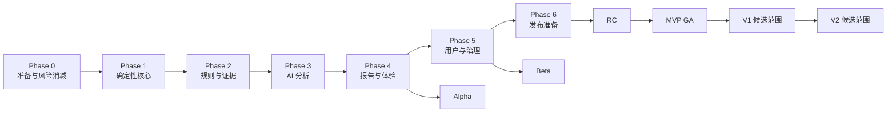
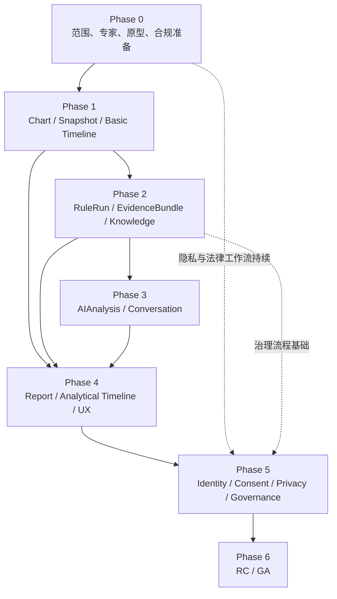
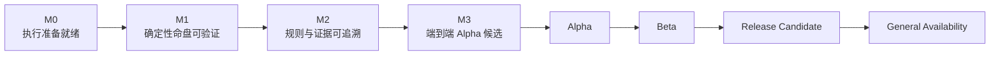
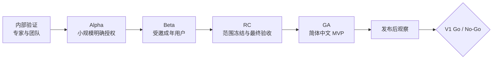
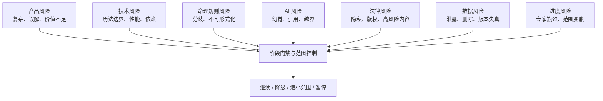

# AI 八字命理分析平台：项目路线图

**文档编号：** 06  
**文档类型：** Project Roadmap  
**文档状态：** Approved  
**当前版本：** 1.0  
**上游基线：** `01-PRODUCT-VISION.md`、`02-SRS.md`、`03-SYSTEM-ARCHITECTURE.md`、`04-DOMAIN-MODEL.md` 1.0、`05-DATA-MODEL.md` 1.0（均已 Approved）  
**路线图范围：** 原型准备、MVP 实施、Alpha、Beta、RC、GA，以及 V1/V2 后续演进  
**目标读者：** 产品负责人、项目负责人、命理专家、设计负责人、架构与数据负责人、研发与测试负责人、安全、隐私、法律、内容与运营负责人

---

## 1. 文档目标与使用方式

本文档定义项目整体实施路线、阶段目标、范围、依赖、交付成果、风险门禁、验收标准、里程碑和发布策略。

路线图采用“能力成熟度与验收门禁”驱动，而不是以日期到达自动宣布完成。每个阶段只有满足规定的退出条件，才能进入依赖该阶段的后续工作。

本文档不定义具体技术实现，不包含代码、数据定义、接口设计、部署配置或工程脚本。本文档中的“交付”表示可验证的产品能力、领域内容、评审结论和质量证据。

### 1.1 计划口径

- Phase 0 至 Phase 6 构成 MVP 从准备到 GA 的主路线。
- Alpha、Beta、RC 和 GA 是发布成熟度，不与单一开发阶段简单等同。
- V1 和 V2 只有在 MVP GA 数据证明核心价值后才进入正式范围承诺。
- 未给定团队规模、专家产能和法律评审周期前，不在本文档虚构固定上线日期。
- 项目负责人可在团队与外部依赖明确后，为每个 Phase 建立日历计划，但不得绕过本文件的质量门禁。

### 1.2 Version 0.9 变更摘要

1. 新增 Architecture Governance，明确 Approved 文档构成 Architecture Baseline，后续设计不得直接改写已批准基线。
2. 新增 ADR Gate，要求 Aggregate Boundary、Cross Context Dependency、Identity Strategy、Version Strategy 和 Immutable Object Rules 的变化先获得 ADR 批准。
3. 新增 Scope Freeze，分别定义 Beta、RC 和 GA 前的范围冻结规则。
4. 本次修订只增强文档治理，不改变任何既有阶段、依赖、里程碑、风险或发布策略。

---

## 2. Roadmap Principles

### RP-001 Business First

每项工作必须回答其服务的用户任务、业务假设和验收指标。优先验证“普通用户是否能快速得到易理解、有依据的分析”，不以功能数量或技术复杂度衡量进度。

### RP-002 Domain First

排盘、规则、证据、不确定性和流派分歧的领域语义先于 AI 文案和界面扩展。命理专家未确认的规则不得因进度压力进入正式产品。

### RP-003 Data First

任何正式能力必须先满足身份、版本、快照、追溯、删除和审计要求。无法复现来源的结果不能作为正式报告交付。

### RP-004 Incremental Delivery

每阶段交付可验证的纵向能力，尽早用黄金命例、原型用户和受控数据发现问题。增量交付不代表把未完成安全或合规能力暴露给真实公众。

### RP-005 Traceability

需求、领域对象、数据对象、验收用例、风险和发布决策必须可追溯。每个里程碑需能说明满足了哪些 SRS 要求和仍存在哪些例外。

### RP-006 Risk Driven

优先处理会否定项目可行性的高风险问题：时间边界正确性、规则专家共识、AI 事实与引用约束、敏感数据处理和高风险内容边界。

### RP-007 Compliance First

隐私、年龄、第三方 AI、版权、高风险主题和数据权利不是上线前补丁。相应评审从 Phase 0 开始，在 Beta、RC 和 GA 分别设置阻断门禁。

### RP-008 Evidence Before Explanation

没有有效 CalculationSnapshot、Completed RuleRun 和 Frozen EvidenceBundle，不开始正式 AI 解读。模型生成成功不等于业务分析完成。

### RP-009 Quality Gates Over Calendar Pressure

里程碑未通过时允许延后或缩小范围，不允许降低事实、证据、隐私和风险门槛来维持发布日期。

### RP-010 MVP Discipline

MVP 不包含真实支付、完整多流派、0 至 100 岁完整时间轴、正式 PDF/分享、研究平台、开发者平台和第三方动态插件。

---

## 2A. Architecture Governance

### 2A.1 Architecture Baseline

下列已批准文档及其 Approved 版本共同构成项目的 `Architecture Baseline`：

- Product Vision；
- SRS；
- System Architecture；
- Domain Model；
- Data Model；
- 本 Roadmap 在通过评审后的正式版本；
- 后续明确标记为 Approved 的架构设计文档。

Architecture Baseline 是后续产品设计、应用设计、数据设计和实施计划必须遵守的正式约束。文档之间发生疑似冲突时，必须先停止受影响决策并完成基线澄清，不能由后续设计人员自行选择忽略某一份已批准文档。

### 2A.2 已批准文档保护

1. 后续设计不得为适应局部方案而直接修改已批准文档。
2. 对 Approved 文档的任何实质性调整必须先说明变更原因、影响范围、迁移影响和回滚条件。
3. 文字澄清若会改变对象身份、边界、生命周期、不变量、版本或删除语义，仍属于架构变更，不能按普通编辑处理。
4. 已批准文档需要修订时，应产生明确的新版本和评审记录，旧版本继续保留历史基线地位。
5. 未完成批准的候选变更不得被后续文档当作既定事实。

### 2A.3 ADR 治理

所有重大架构调整必须通过 ADR（Architecture Decision Record）完成。ADR 至少应说明：

- 需要解决的问题；
- 当前 Architecture Baseline；
- 候选方案与取舍；
- 对需求、Context、Domain、Data、生命周期、安全、隐私和 Roadmap 的影响；
- 兼容、迁移和回滚要求；
- 需要重新评审的基线文档；
- 决策状态、批准者和生效范围。

未批准 ADR 不得改变 Domain、Data 或 Bounded Context 边界，也不得被阶段验收、里程碑或实现计划视为有效决策。

### 2A.4 Roadmap 职责边界

Roadmap 只负责定义实施顺序、依赖、阶段门禁、风险控制和发布节奏，不负责修改领域模型、数据模型或系统边界。

若实施顺序暴露出领域或架构问题，Roadmap 只能：

- 记录风险与阻塞；
- 调整尚未冻结的实施顺序；
- 提议 ADR；
- 在 ADR 批准后引用新的 Architecture Baseline。

Roadmap 不得通过改变 Phase 描述、里程碑名称或发布范围，隐式修改 Aggregate、Entity、Identity、Version、Context 或不可变规则。

---

## 3. Roadmap 总览

### 3.1 阶段总表

| 阶段 | 名称 | 核心目标 | 主要输入 | 主要输出 | 可独立交付 |
|---|---|---|---|---|---:|
| Phase 0 | 准备与风险消减 | 形成可执行范围、专家规则候选、用户原型和合规问题闭环 | 五份 Approved 基线文档 | 决策清单、专家样例、体验原型、评测与合规计划 | 是，作为执行准备包 |
| Phase 1 | 确定性核心领域能力 | 验证出生输入、时间标准化、排盘、快照和基础时间轴 | Phase 0 规则口径与黄金样例 | 可复现 Chart、CalculationSnapshot、Basic Timeline | 是，仅供内部和专家验证 |
| Phase 2 | 规则与证据能力 | 建立正式 RuleRun、RuleFinding、EvidenceBundle 和知识引用链 | Valid Snapshot、已批准规则和知识 | 可审计规则结果、冲突和 Frozen EvidenceBundle | 是，作为专业验证能力 |
| Phase 3 | AI 分析与对话能力 | 在证据边界内完成结构化解读、校验、拒答和成本测量 | Frozen EvidenceBundle、风险策略、Prompt 评测集 | Completed AIAnalysis、受限 AI 对话 | 否，需与报告和用户体验结合 |
| Phase 4 | 报告、时间分析与用户体验 | 形成普通用户端到端匿名旅程、在线报告、打印和未来三年 | Phase 1–3 能力 | Frozen Report、Analytical Timeline、移动端完整旅程 | 是，作为内部 Alpha |
| Phase 5 | 用户、隐私与运营治理 | 完成账户资产、数据权利、权限、后台治理和可运营闭环 | Alpha 能力、法律初审 | 可邀请用户的 Beta 能力与治理流程 | 是，作为受邀 Beta |
| Phase 6 | 发布准备与正式发布 | 完成质量、安全、法律、容量、恢复和运营门禁 | Beta 数据和整改结果 | RC 候选与 MVP GA | 是，正式发布 |

### 3.2 Roadmap Timeline

该图表示依赖顺序，不代表固定持续时间。部分工作流可在门禁允许后并行。

### 3.3 横向工作流

以下工作贯穿全部 Phase，不应被误认为单独阶段结束后即可停止：

| 工作流 | Phase 0 | Phase 1–2 | Phase 3–4 | Phase 5–6 |
|---|---|---|---|---|
| 产品与体验 | 用户研究、原型 | 输入与专业验证 | 报告和对话可用性 | Beta 反馈与 GA 优化 |
| 命理专家 | 口径、样例、规则清单 | 排盘与规则验收 | 解释抽样 | 回归与争议处置 |
| 数据与追溯 | 对象与样例准备 | Snapshot 与版本链 | AI/报告清单 | 删除、审计和运营数据 |
| 隐私与法律 | 问题识别、资料分类 | 最小化和版权初审 | 风险主题与模型处理 | 正式法律评审与发布条件 |
| 质量与安全 | 测试策略 | 黄金/边界/权限 | AI 回归和内容安全 | 压力、安全、恢复与发布验收 |
| 运营治理 | 治理流程草案 | 专家审核记录 | Prompt/知识审查 | 后台、投诉和事件响应 |

---

## 4. Phase 0：准备与风险消减

### 4.1 目标

将已批准需求与架构基线转化为可执行的产品、专家、质量和合规准备包，优先验证可能否定 MVP 可行性的假设。

### 4.2 功能范围

- 普通用户首次排盘流程的高保真体验原型；
- 输入、参数确认、时间不确定、真太阳时和换日说明原型；
- 首屏摘要、证据展开、风险提示和未来三年视图原型；
- 专业模式基础信息架构；
- 命理术语与通俗解释第一版；
- 子平基础规则候选范围；
- 黄金命例、边界命例和争议命例候选集；
- AI 结构化输出、事实错误、引用错误和高风险问题评测集；
- 数据分类、处理目的、第三方 AI 和版权问题清单；
- MVP 指标测量定义和基线研究计划。

### 4.3 不包含内容

- 正式排盘、规则、AI 或报告产品能力；
- 对未经专家确认的旺衰、格局、调候、用神或起运规则作最终决定；
- 真实用户大规模开放；
- 支付、完整多流派、开发者能力和插件生态。

### 4.4 前置条件

- 五份上游文档均为 Approved；
- 产品、命理专家、法律/隐私和技术责任人明确；
- 所有待确认事项有负责人、决策方法和最迟门禁；
- 可以接触到目标普通用户进行原型测试。

### 4.5 输出成果

1. MVP 详细范围与 Won’t 清单确认；
2. 用户旅程原型及可用性观察结果；
3. 首批算法与规则专家评审计划；
4. 黄金、边界、AI 和风险测试资料集版本；
5. 术语表、风险表达和报告样例；
6. 数据用途和法律问题登记册；
7. 阶段级验收责任矩阵；
8. 初始性能、成本和容量验证计划。

### 4.6 主要风险

- 命理专家无法对 MVP 最小规则集形成可执行范围；
- 普通用户无法理解关键参数确认；
- 高风险内容边界无法在目标地区形成可接受方案；
- 目标用户期待与“传统文化自我反思工具”定位不一致；
- 黄金命例来源或版权不清晰。

### 4.7 验收标准

- 普通用户原型覆盖从进入、输入、参数确认到首屏摘要的完整旅程；
- 至少完成一轮目标用户观察，三分钟目标获得可测基线；
- 专家签字确认第一批“可计算事实、待确认规则、明确不支持规则”分类；
- 每个高风险待确认项有责任人和决策截止里程碑；
- 测试资料集具有来源、版本和预期结果责任人；
- 没有把待确认命理规则写成正式产品承诺。

### 4.8 阶段退出门禁

未确认时间与排盘最小口径、黄金样例来源或核心隐私处理目的时，禁止进入正式 Phase 1 验收；可以进行不依赖这些决策的体验和质量准备。

---

## 5. Phase 1：确定性核心领域能力

### 5.1 目标

交付可复现、可验证、完全不依赖 AI 的出生输入、时间标准化、Chart、CalculationSnapshot 和 Basic Timeline 能力。

### 5.2 功能范围

- 公历、农历和直接四柱三类输入；
- TimePrecision、出生时间范围和不确定性表达；
- 地点标准化、历史时区、夏令时和边界识别；
- 真太阳时切换与可配置换日策略；
- 四柱和专家批准的基础 CalculatedFacts；
- 当前大运和未来三年所需的确定性流运事实；
- AlgorithmVersion、CalculationParameters 和 Snapshot 版本链；
- 内部交叉验证与差异分类；
- Basic Timeline；
- Chart 的验证、计算、阻断和归档生命周期；
- 相关审计和错误分类语义。

### 5.3 不包含内容

- RuleFinding、EvidenceBundle、AI 解读和报告；
- 未批准的旺衰、格局、调候、用神和神煞；
- 用户可见多算法自由切换；
- 0 至 100 岁完整时间轴；
- 绝对化择日或具体时辰吉凶裁决。

### 5.4 前置条件

- Phase 0 的算法范围、时间口径和黄金样例通过专家评审；
- 不确定出生时间的 MVP 处置方案至少有可验收决定；
- AlgorithmVersion 与 CalculationSnapshot 的数据语义已确认；
- 出生信息最小化和保护级别完成隐私初审。

### 5.5 输出成果

1. 可由输入生成 Valid CalculationSnapshot 的确定性能力；
2. 可查看输入、时间参数、四柱和基础事实的专业验证视图；
3. 版本化算法定义与计算参数清单；
4. 黄金命例、节气、换日、闰月、时区和夏令时验收证据；
5. 交叉验证差异记录和阻断流程；
6. Basic Timeline；
7. 计算性能与失败分类基线。

### 5.6 主要风险

- 历法和历史时间资料存在不一致；
- 节气与子时边界出现无法解释差异；
- 起运算法尚未获得专家确认；
- 不确定时间导致候选数据模型超出 MVP 预期；
- 性能目标与复杂边界验证发生冲突。

### 5.7 验收标准

- 相同 BirthInput、参数和 AlgorithmVersion 重复计算得到一致事实；
- 专家批准的黄金和边界样例达到正式门槛；
- Critical/High 交叉验证差异均有归因或阻断，不能静默继续；
- AI 完全不可用时仍能完成全部 Phase 1 能力；
- Valid Snapshot 具有完整版本和数据源清单；
- Basic Timeline 不依赖 RuleFinding 或 Evidence；
- 确定性排盘在约定基准条件下达到 SRS 初始性能基线，或获得经评审的修订值。

### 5.8 阶段退出门禁

四柱关键边界仍存在未解释 Critical 差异，或 Valid Snapshot 不能稳定复现时，禁止开始正式规则执行验收和任何正式 AI 生成。

---

## 6. Phase 2：规则、知识与证据能力

### 6.1 目标

把已批准子平基础规则转化为可版本化、可执行、可冲突表达且可追溯的 RuleRun 与 EvidenceBundle，为 AI 和报告提供唯一正式依据。

### 6.2 功能范围

- RuleSet 生命周期和发布版本；
- RuleRun 与 RuleFinding；
- Satisfied、NotSatisfied、NotApplicable、InsufficientData、Conflicted 和 ExecutionError；
- FindingConflict 和 RunCompleteness；
- Frozen EvidenceBundle、Evidence 和 ProvenanceLink；
- EvidenceStatus 及其非概率说明；
- KnowledgeArticle 来源、版权、语言、流派、审核和发布状态；
- KnowledgeCitation 与授权过滤；
- 规则、知识和证据的专业展开；
- Analytical Timeline 的规则与证据附加基础；
- 规则、知识和证据发布/冻结审计。

### 6.3 不包含内容

- AI 自然语言解读；
- 完整多流派比较；
- 复杂低代码规则编辑器；
- 用户反馈自动调整规则；
- 未经专家确认的全量神煞；
- 将 EvidenceStatus 映射为准确率或事件概率。

### 6.4 前置条件

- Phase 1 的 Valid Snapshot 和事实语言稳定；
- 子平基础 RuleSet 第一版由命理专家批准；
- 规则来源、适用条件、冲突和测试样例完整；
- 首批知识内容具有权利状态和引用边界；
- EvidenceStatus 的最小策略获得产品与专家确认。

### 6.5 输出成果

1. Published RuleSetVersion；
2. Completed RuleRun 与完整 RuleFinding 集合；
3. Frozen EvidenceBundle 与上游版本清单；
4. Published KnowledgeArticleVersion 与可追溯 Citation；
5. 冲突、信息不足、不适用和执行错误的专业展示；
6. 规则和证据回归资料；
7. 规则、知识发布与回滚的治理记录。

### 6.6 主要风险

- 专家规则难以形式化；
- 同一流派内部存在未建模分支；
- RuleFinding 粒度不稳定导致证据链频繁变化；
- 知识来源授权不足；
- 证据等级被用户误解为预测概率；
- Analytical Timeline 与 Evidence 形成循环依赖。

### 6.7 验收标准

- 每个 RuleFinding 可追溯 RuleSetVersion、CalculationSnapshot 和输入事实；
- Completed RuleRun 后不能新增 Finding；
- Frozen EvidenceBundle 后不能新增 Evidence；
- 冲突双方均被保留，AI 尚未参与裁定；
- InsufficientData 不被表示为 NotSatisfied；
- 未发布或权利无效知识不进入正式 EvidenceBundle；
- Bundle 不依赖完整 Timeline 才能冻结；
- 专家批准规则回归集全部达到门禁。

### 6.8 阶段退出门禁

任何重要规则结论无法产生有效 Evidence，或知识版权状态无法验证时，禁止该结论进入 Phase 3 正式 AI 分析。

---

## 7. Phase 3：AI 分析与对话能力

### 7.1 目标

交付只在 Frozen EvidenceBundle 边界内工作的 AIAnalysis 和受限对话能力，并建立事实、引用、冲突、风险和成本控制闭环。

### 7.2 功能范围

- AnalysisPlan 和支持主题范围；
- 去标识化上下文构造；
- 已发布知识检索；
- PromptVersion 和 ModelReference 治理；
- 多模型供应商路由边界；
- 结构化 AIAnalysis；
- Schema、事实、时间范围、引用支持、冲突和风险检查；
- Planned、Generating、Validating、Completed、Rejected 和 Failed 生命周期；
- 当前命盘、未来三年和已支持主题的连续对话；
- 对话上下文隔离、限额和反馈；
- 模型超时、有限重试、安全拒绝和降级；
- 用量、成本、延迟和质量测量。

### 7.3 不包含内容

- AI 计算四柱、大运或规则事实；
- AI 创建 Evidence；
- 超出三年或未支持主题的开放式问答；
- 无依据的预测概率；
- 多模型投票作为事实证明；
- 医疗、法律、投资等专业替代建议；
- 英文和阿拉伯语正式内容。

### 7.4 前置条件

- Phase 2 的 EvidenceBundle 结构和引用校验稳定；
- AI 输出结构和 AnalysisPlan 已确认；
- 高风险测试类别和初步处置规则完成法律/安全评审；
- 第三方模型数据最小化和处理边界完成隐私初审；
- Prompt、知识和模型版本治理责任明确；
- AI 回归评测集具有版本和人工复核标准。

### 7.5 输出成果

1. Completed AIAnalysis；
2. 受限 AIConversation 和 AIMessage；
3. 事实、引用、冲突和风险校验结果；
4. 安全拒绝与降级体验；
5. 模型和 Prompt 评测对比；
6. 单次报告/回答成本和时延基线；
7. AI 内容人工抽样记录；
8. 无 AI 时保留确定性能力的降级证明。

### 7.6 主要风险

- 模型生成虚假事实或看似合理的无效引用；
- 同一模型同时生成和自评导致检查失效；
- 高风险问题漏检；
- 供应商保留或训练策略不符合要求；
- AI 时延和成本高于 MVP 可接受范围；
- 对话跨 Chart 泄露上下文；
- 模型升级导致输出漂移。

### 7.7 验收标准

- 模型供应商原始输出不直接成为 Completed AIAnalysis；
- 注入错误事实、证据 ID、时间范围和绝对化预测的测试样例被拦截；
- 重要结论引用有效 Evidence；
- 冲突证据不会被表达为唯一确定结论；
- 高风险评测达到待确认发布门槛；
- 切换 Chart 必须新建会话，跨命盘事实测试无泄露；
- Completed AIAnalysis 不可返回 Generating；
- AI 全部不可用时不影响 Phase 1–2 能力；
- 延迟和成本达到 SRS 初始基线或获得正式调整结论。

### 7.8 阶段退出门禁

事实一致性、引用有效性或高风险漏检未达到门槛时，禁止 AI 内容进入任何对外报告或 Beta。

---

## 8. Phase 4：报告、时间分析与普通用户体验

### 8.1 目标

将确定性事实、规则、证据、AIAnalysis 和 Timeline 组织为可理解、可打印、可冻结且可复现的普通用户端到端体验。

### 8.2 功能范围

- 匿名试算完整旅程；
- 年龄确认、必要告知和参数确认；
- 首屏通俗摘要；
- 性格、事业、财务习惯、关系和健康生活方式等经批准主题；
- 普通依据与专业依据逐级展开；
- EvidenceStatus 和不确定性展示；
- 当前大运与未来三年；
- Basic Timeline 和 Analytical Timeline；
- 在线 Report、ReportBlock 和 VersionManifest；
- Frozen Report；
- 安全打印；
- AnalysisProgress 只读进度；
- 数据错误、解释不清和规则疑问反馈入口；
- 移动端和基础可访问性体验。

### 8.3 不包含内容

- 正式 PDF 文件和分享链接；
- 完整 0 至 100 岁时间轴；
- 完整多流派和用户算法切换；
- 真实支付；
- 英文和阿拉伯语正式报告；
- 绝对化择日和具体时辰必然吉凶。

### 8.4 前置条件

- Phase 1–3 各自质量门禁通过；
- ReportType、必需区块和无 AI 报告策略获得产品确认；
- VersionManifest 内容确认；
- 普通术语、证据说明和高风险文案完成内容评审；
- 打印隐私提示和报告免责声明完成法律初审。

### 8.5 输出成果

1. 从匿名输入到 Frozen Report 的完整纵向体验；
2. 普通与专业两级信息呈现；
3. 当前大运与未来三年时间视图；
4. 在线报告、打印和版本清单；
5. 报告冻结、重新生成和旧版保留；
6. 用户理解度和三分钟完成率可用性结果；
7. 内部 Alpha 候选。

### 8.6 主要风险

- 首屏信息过多，偏离普通用户优先；
- 用户把 EvidenceStatus 误认为预测概率；
- 时间轴视觉让趋势被理解为必然事件；
- 报告过长超出长度和成本边界；
- 打印造成私人信息二次泄露；
- Frozen Report 仍被内容更新静默改变。

### 8.7 验收标准

- 用户可在目标移动设备完成全流程；
- 首次排盘完成率和三分钟完成率形成可靠测量，并达到 Alpha 门槛；
- 每个重要命理结论可展开有效 Evidence；
- 事实、规则、AI 综合和现实建议能够被用户区分；
- Frozen Report 的 VersionManifest 完整，更新上游版本后旧报告不变；
- 报告正文和 AI 回答不超过 SRS 长度边界；
- 打印不包含管理控件、其他用户数据或失效引用；
- 可访问性核心旅程不存在阻断问题。

### 8.8 阶段退出门禁

无法复现 Frozen Report、普通用户不能区分事实与 AI，或重大隐私内容出现在错误报告中时，不允许进入 Alpha 邀请或账户资产扩展。

---

## 9. Phase 5：用户系统、隐私权利与运营治理

### 9.1 目标

把 Alpha 能力扩展为可供受邀真实用户安全使用、可保存资产、可行使数据权利、可由平台治理和支持的 Beta 产品。

### 9.2 功能范围

- 注册、登录、退出、恢复和会话管理；
- 匿名资产安全转存；
- 多 BirthProfile 和 Chart 保存、标签、归档和删除；
- 单用户活动命盘配额；
- SubjectConsent 与追加式 ConsentRecord；
- 命例优化单独授权和撤回；
- 数据查看、导出、单项删除和账户删除流程；
- 角色、资源归属、最小权限和职责分离；
- 规则、知识、Prompt、模型和术语治理后台；
- 用户反馈、投诉、风险内容和数据错误处置；
- AuditEvent 调查能力；
- 匿名数据到期和对象级保留策略；
- 安全事件、支持访问和删除部分失败处置；
- 免费额度和功能资格，仍不处理真实支付。

### 9.3 不包含内容

- 真实订单、支付、发票或退款；
- 企业团队账户；
- 开发者 API；
- 研究模式；
- 第三方插件市场；
- 复杂低代码规则编辑器；
- 公开分享链接。

### 9.4 前置条件

- Alpha 端到端能力通过 Phase 4 门禁；
- 账户、BirthProfile、Chart、Report、Conversation 的所有权语义确认；
- 数据分类、删除、保留、Legal Hold 和第三方处理完成法律初审；
- 后台角色和职责分离获得安全评审；
- 用户支持、投诉和安全事件责任人明确。

### 9.5 输出成果

1. 注册用户资产管理和匿名转存；
2. 数据导出、删除和授权撤回闭环；
3. 受控后台治理能力；
4. 审计和敏感访问记录；
5. 受邀 Beta 用户管理方案；
6. Beta 反馈与问题分级机制；
7. 规则、知识、Prompt 和模型发布责任链；
8. 数据保留和匿名数据到期验证结果。

### 9.6 主要风险

- 跨账户越权访问；
- 匿名资产被错误认领；
- 删除流程只处理主对象而遗漏报告制品、索引或对话；
- 管理员权限过宽；
- 用户拒绝研究授权却仍进入优化数据；
- 支持人员无业务目的查看敏感资料；
- 用户反馈被错误用于自动修改规则。

### 9.7 验收标准

- 跨用户资源和猜测对象身份访问全部被拒绝；
- 匿名资产只能由原匿名会话合法认领；
- 可选命例授权默认关闭，拒绝不影响基础服务；
- 撤回后不再进入新优化任务；
- 导出、删除和账户删除端到端演练通过，部分失败不会虚假报告完成；
- 规则、知识和 Prompt 生产发布符合职责分离；
- 管理员和支持人员敏感访问全部具有目的和 AuditEvent；
- Beta 所需隐私告知、用户协议草案和投诉流程通过初审。

### 9.8 阶段退出门禁

存在可复现跨账户越权、删除数据复活、可选授权默认开启或无审计敏感访问时，禁止启动 Beta。

---

## 10. Phase 6：发布准备与正式发布

### 10.1 目标

基于 Beta 数据完成产品质量、安全、法律、容量、恢复、运营和成本门禁，形成 Release Candidate 并在满足条件后发布 MVP GA。

### 10.2 功能范围

- Beta 缺陷与高风险问题整改；
- 用户旅程、移动端、可访问性和打印最终验收；
- 排盘黄金、边界和交叉验证最终回归；
- 规则、证据、AI、风险和报告完整回归；
- 身份、权限、敏感访问和数据权利最终安全验收；
- 容量、时延、成本、失败降级和恢复演练；
- 正式数据保留期限、删除时限和 Legal Hold 规则；
- 中国大陆目标市场隐私、版权、消费者、内容和第三方 AI 法律评审；
- 用户支持、投诉、安全事件和重大算法差异处置；
- GA 指标看板、发布决策和回退标准；
- 免费额度与成本保护最终确认。

### 10.3 不包含内容

- 以发布压力把 V1 能力提前并入 MVP；
- 真实支付；
- 完整三语言正式内容；
- 正式 PDF/分享；
- 多流派完整比较；
- 研究或开发者平台；
- 任何未通过专家、法律或安全评审的实验规则。

### 10.4 前置条件

- Beta 已运行到足以覆盖核心用户旅程和主要风险场景；
- 阻断级问题均已处置或明确取消相关能力；
- 目标指标有可靠测量数据；
- 正式规则、知识、Prompt、模型和术语版本已锁定为 RC 候选；
- 运营、安全、隐私和法律责任人参与 Go/No-Go。

### 10.5 输出成果

1. Release Candidate；
2. 全量发布验收证据包；
3. 正式法律与隐私评审结论；
4. 专家算法与规则签字版本；
5. 容量、性能、成本和恢复结果；
6. 已知限制、用户告知和支持方案；
7. GA Go/No-Go 记录；
8. MVP GA 版本及发布后观察计划。

### 10.6 主要风险

- Beta 样本不足却过早宣布产品成功；
- AI 供应商临近发布发生模型或政策变化；
- 正式法律意见要求调整数据流或内容；
- 高峰负载、模型成本或外部依赖超出基线；
- 备份恢复使已删除数据重新进入活动状态；
- 发布后负面内容或隐私投诉响应不足；
- 为日期承诺降低门禁。

### 10.7 验收标准

- `Must / MVP` 需求全部通过或有多方批准的明确范围移除；
- 黄金与边界样例、规则回归、事实和引用检查达到发布门槛；
- 高风险内容、安全和隐私测试不存在未处置阻断项；
- 删除、撤回、备份恢复和供应商降级演练通过；
- 性能、容量和 AI 成本达到批准基线；
- 简体中文移动端、打印和核心可访问性通过；
- 正式法律评审完成；
- 运营支持、安全响应和投诉升级路径可用；
- Go/No-Go 参与者一致确认 GA，或记录明确反对与最终责任决策。

### 10.8 阶段退出门禁

任何以下情况均为 GA 阻断：关键排盘差异未解释、正式报告不可复现、AI 事实/引用校验可被绕过、严重越权、删除/撤回失效、法律评审未完成或高风险内容门槛未达成。

---

## 11. Dependency Map

### 11.1 Phase Dependency

### 11.2 必须先完成的依赖

| 后续能力 | 必须先完成 |
|---|---|
| RuleRun | Valid CalculationSnapshot、Published RuleSetVersion |
| EvidenceBundle | Completed RuleRun、有效 KnowledgeCitation、Evidence 策略 |
| AIAnalysis | Frozen EvidenceBundle、AnalysisPlan、Prompt/模型/风险版本 |
| Analytical Timeline | Available Basic Timeline、RuleFinding；关键节点还需 EvidenceReference |
| Frozen Report | Valid Snapshot、Frozen Bundle、所需 Completed AIAnalysis、Timeline 和 VersionManifest |
| Beta | Alpha 端到端体验、身份与授权、删除/导出、后台职责分离、安全初验 |
| RC | Beta 反馈闭环、正式法律评审、性能容量与恢复验收 |
| GA | RC 全部门禁、Go/No-Go 决策和运营准备 |

### 11.3 可并行工作

- Phase 0 中用户原型、专家样例、法律问题识别和 AI 评测集可并行，但共享术语和范围基线。
- Phase 1 中移动端输入体验可与确定性计算验证并行，最终必须通过同一参数语义验收。
- Phase 2 中知识权利审核可与规则形式化并行，EvidenceBundle 冻结需两者均满足。
- Phase 3 中模型评测、风险策略和对话体验可并行，正式回答必须汇合到统一校验门禁。
- Phase 4 中报告体验、打印、时间轴呈现和可访问性可并行。
- Phase 5 中用户资产、数据权利、治理后台和支持流程可并行，但权限与审计共同验收。
- Phase 6 中性能、安全、恢复、法律和运营验收可并行，GA 需要全部汇合。

### 11.4 禁止提前开始的工作

1. 未有 Valid Snapshot，不开始正式规则结论验收。
2. 未有 Frozen EvidenceBundle，不开始正式 AI 解读。
3. AI 事实、引用和风险校验未通过，不把内容放入报告。
4. VersionManifest 未确认，不冻结正式报告。
5. 数据权利和越权测试未通过，不启动 Beta。
6. 法律正式评审、删除恢复演练和高风险门禁未完成，不进入 GA。
7. MVP 核心价值未验证，不启动完整多流派、支付、研究、开发者和第三方插件建设。

---

## 12. Milestones

### 12.1 Milestone Flow

### 12.2 M0：执行准备就绪

**达成条件**

- Phase 0 验收通过；
- MVP 范围、Won’t、责任人和风险门禁明确；
- 黄金样例、规则候选、AI 评测和合规问题清单版本化；
- 用户原型完成首轮观察。

**输出成果**

- 执行准备包；
- 专家、产品、法律和质量决策清单；
- 可进入确定性核心工作的范围。

**是否允许进入下一阶段**

只有算法最小口径、样例来源和隐私处理目的不再阻断时允许进入 M1 主路径。

### 12.3 M1：确定性命盘可验证

**达成条件**

- Phase 1 验收通过；
- Chart 和 Snapshot 可复现；
- 黄金与边界样例达到门槛；
- Basic Timeline 可用；
- 关键交叉验证差异已处置。

**输出成果**

- 专家可验证的确定性命盘能力；
- 计算版本和质量证据。

**是否允许进入下一阶段**

允许开展正式 RuleRun；仍禁止正式 AI 分析。

### 12.4 M2：规则与证据可追溯

**达成条件**

- Phase 2 验收通过；
- Published RuleSet、Completed RuleRun、Frozen EvidenceBundle 可复现；
- 规则冲突、信息不足和来源权利正确表达；
- 专家回归资料通过。

**输出成果**

- 不依赖 AI 的规则与证据专业验证能力；
- 可供 AI 消费的正式证据边界。

**是否允许进入下一阶段**

允许正式 AIAnalysis 评测；没有证据的主题继续禁止进入 AI。

### 12.5 M3：端到端 Alpha 候选

**达成条件**

- Phase 3 和 Phase 4 的 Alpha 必需项通过；
- 从匿名输入到 Frozen Report 全流程可用；
- AI 事实、引用和风险检查达到内部门槛；
- 报告可复现且用户可区分事实、规则和 AI。

**输出成果**

- Alpha 候选；
- 端到端质量和可用性报告。

**是否允许进入下一阶段**

允许内部员工、命理专家和明确授权的测试用户进入 Alpha，不允许公开开放。

### 12.6 Beta

**达成条件**

- Phase 5 验收通过；
- 账户、权限、Consent、导出、删除、审计和治理闭环可用；
- Alpha 阻断问题清零；
- Beta 用户范围、反馈和事件响应明确。

**输出成果**

- 受邀 Beta；
- 真实用户指标、风险问题和成本数据。

**是否允许进入下一阶段**

只有 Beta 覆盖核心旅程、主要风险类型和数据权利流程后，允许进入 RC 评审。

### 12.7 RC：Release Candidate

**达成条件**

- Phase 6 中除 GA 最终决策外的门禁通过；
- 功能范围冻结；
- 正式规则、知识、Prompt、模型和术语版本锁定；
- 法律、安全、性能、容量和恢复结论可接受；
- 无未处置阻断级问题。

**输出成果**

- Release Candidate；
- 发布验收证据和已知限制。

**是否允许进入下一阶段**

只有 Go/No-Go 评审通过，才允许 GA。RC 期间只接受阻断问题修复和经批准的范围移除，不增加功能。

### 12.8 GA：General Availability

**达成条件**

- RC 全部门禁持续有效；
- Go/No-Go 正式通过；
- 用户告知、支持、事件响应和发布后观察准备完成；
- 回退和能力关闭标准明确。

**输出成果**

- 面向目标市场的 MVP 正式版本；
- 发布后指标和风险观察机制；
- V1 是否立项的数据输入。

**是否允许进入下一阶段**

GA 不自动授权 V1 全范围。需完成发布后观察并单独批准 V1 范围。

---

## 13. Release Strategy

### 13.1 Release Flow

### 13.2 Alpha

**开放对象**

- 内部团队；
- 命理专家；
- 明确了解测试性质并授权的少量成年测试用户。

**允许能力**

- 出生输入与参数确认；
- 确定性排盘和专业依据；
- 主规则体系和 Evidence；
- 受控 AIAnalysis；
- 在线报告、未来三年和打印；
- 结构化反馈。

**限制**

- 不公开注册；
- 不宣传准确率；
- 测试数据按更短保留策略处理；
- 高风险能力可按主题关闭；
- 发现事实或引用系统性错误时立即停止 AI 报告。

### 13.3 Beta

**开放对象**

- 分批受邀的中国大陆 18 岁以上简体中文用户；
- 受控专业用户样本。

**允许能力**

- Alpha 全部通过能力；
- 注册保存多个命盘；
- 数据导出、删除和授权管理；
- 有限 AI 对话；
- Beta 反馈、投诉和支持。

**限制**

- 不接真实支付；
- 不公开分享私人报告；
- 用户规模按风险处置和支持能力分批扩大；
- 未达到质量门槛的主题保持关闭。

### 13.4 Release Candidate

**开放对象**

- Beta 用户继续使用；
- 内部发布验收人员；
- 必要的法律、安全和专家评审人员。

**允许能力**

- 仅 GA 计划内的完整 MVP 能力；
- 发布范围、规则、知识、Prompt、模型和语言版本冻结。

**限制**

- 不新增产品功能；
- 只修复阻断问题、降低风险或移除未达门槛范围；
- 任何依赖版本变更均需重新运行受影响门禁。

### 13.5 General Availability

**开放对象**

- 目标市场内符合年龄与必要告知要求的用户。

**允许能力**

- 匿名试算和可选注册；
- 简体中文确定性排盘；
- 经专家批准的子平基础规则；
- 证据化普通/专业分析；
- 当前大运与未来三年；
- 受限 AI 对话；
- 在线报告、打印、反馈和数据权利；
- 免费额度，不含真实支付。

**持续限制**

- 不是科学预测，不保证准确；
- 不提供绝对化择日或高风险专业替代建议；
- V1/V2 能力不因 GA 自动开放。

### 13.6 发布暂停与能力关闭

出现以下情况应暂停扩大、关闭受影响能力或回退到安全降级：

- 四柱或时间边界出现系统性 Critical 错误；
- AI 事实或引用校验可被普遍绕过；
- 严重隐私、越权或数据删除失败；
- 模型供应商政策变更违反数据处理要求；
- 高风险内容产生现实伤害或监管要求；
- 关键版本无法复现；
- 运营团队无法在承诺时限处理严重事件。

---

## 14. Risk Management

### 14.1 Risk Overview

### 14.2 产品风险

| 风险 | 早期信号 | 缓解措施 | 阻断里程碑 |
|---|---|---|---|
| 普通用户被术语淹没 | 输入放弃、解释不清反馈高 | 渐进披露、术语解释、原型测试 | M3 / Beta |
| 三分钟目标无法达到 | 参数确认耗时过长 | 自动推断但要求确认、折叠专业选项 | M0 / M3 |
| 用户误认为科学预测 | 复述中出现“必然、准确率” | 分层标识、不确定性、内容研究 | M3 / GA |
| 核心洞察缺少价值 | 有帮助率和回访低 | 缩小主题、改善现实建议，不堆功能 | Beta / V1 Go |
| 功能范围膨胀 | V1/V2 需求进入 MVP | Won’t 清单和变更评审 | 全阶段 |

### 14.3 技术风险

| 风险 | 早期信号 | 缓解措施 | 阻断里程碑 |
|---|---|---|---|
| 历法与时区边界错误 | 黄金/交叉验证差异 | 专家样例、独立验证、阻断输出 | M1 |
| 版本链无法复现 | 旧报告依赖“当前版本” | 不可变快照与 VersionManifest | M2 / RC |
| AI 外部依赖不稳定 | 超时、限流、输出变化 | 受控路由、降级、版本锁定 | M3 / RC |
| 性能与容量不达标 | P95/P99、队列增长 | 按风险压测、限制范围、削峰策略评审 | RC |
| 恢复破坏删除状态 | 恢复后已删数据重现 | 删除墓碑和恢复演练 | RC / GA |

### 14.4 命理规则风险

| 风险 | 早期信号 | 缓解措施 | 阻断里程碑 |
|---|---|---|---|
| 专家无法形成最小规则集 | 争议长期无结论 | 缩小 MVP，只纳入已确认规则 | M0 / M2 |
| 规则被错误形式化 | 专家回归失败 | 来源、条件、反例和专家复核 | M2 |
| 多流派被强行合并 | 冲突消失或隐式权重 | 保留 SchoolReference 和 Conflict | M2 / V1 |
| 神煞影响被夸大 | 首屏由神煞主导 | 限制清单与允许影响范围 | M2 / M3 |
| 用户反馈导致规则漂移 | “符合率”触发自动改规则 | 反馈与规则治理隔离 | Beta / GA |

### 14.5 AI 风险

| 风险 | 早期信号 | 缓解措施 | 阻断里程碑 |
|---|---|---|---|
| 编造命盘事实 | 出现 Evidence 中不存在内容 | 结构、事实和引用验证 | M3 |
| 虚假引用 | 引用存在但不支持结论 | 支持关系检查和人工抽样 | M3 / RC |
| 风险内容漏检 | 医疗/投资等越界回答 | 专项评测、拒答和专业引导 | Beta / GA |
| 模型升级漂移 | 相同评测显著变化 | 模型版本锁定与重新评测 | RC / 持续 |
| 成本不可持续 | 有效回答单位成本上升 | 上下文预算、任务路由和限额 | Beta / GA |
| 自我审查同源失效 | 错误生成与自评同时通过 | 确定性检查、独立策略、抽样 | M3 / RC |

### 14.6 法律风险

| 风险 | 早期信号 | 缓解措施 | 阻断里程碑 |
|---|---|---|---|
| 第三方 AI 数据处理不合规 | 供应商条款与用途冲突 | 去标识化、供应商审查、告知 | Beta / GA |
| 出生信息保护不足 | 过度收集或越权访问 | 最小化、授权、审计和删除 | Beta / GA |
| 高风险主题边界不合法 | 法律意见要求限制 | 主题关闭、拒答、内容调整 | Beta / GA |
| 知识版权不清 | 来源或授权缺失 | RightsReview、撤下和影响评估 | M2 / GA |
| 未成年人处理不足 | 年龄保障方案不充分 | 18 岁确认与法律复核 | Beta / GA |

### 14.7 数据风险

| 风险 | 早期信号 | 缓解措施 | 阻断里程碑 |
|---|---|---|---|
| 跨 Context 共享内部对象 | 多模块共同修改数据 | Aggregate Root Identity、Snapshot、Event | M1–M3 |
| Identity 与版本混淆 | 以最大 ID 推断最新版 | 显式版本与当前引用 | M1 / M2 |
| 删除不完整 | 孤立报告、缓存、索引残留 | 跨 Context 删除演练 | Beta / RC |
| 匿名化可逆 | 精确数据可重新识别 | 正式匿名化和再识别评估 | Beta / V2 |
| 审计复制敏感正文 | 审计内出现出生/报告全文 | 最小审计数据和扫描 | Beta / GA |

### 14.8 进度风险

| 风险 | 早期信号 | 缓解措施 | 阻断里程碑 |
|---|---|---|---|
| 专家评审成为瓶颈 | 规则等待时间持续增长 | 提前排期、缩小规则集、记录分歧 | M0 / M2 |
| 法律评审过晚 | RC 才发现数据流问题 | Phase 0 启动，分阶段初审 | Beta / GA |
| 过早并行造成返工 | AI/报告先于证据稳定 | 遵守 Dependency Map | M2 / M3 |
| 质量工作被压缩 | 门禁例外增加 | 质量门禁高于日期，范围可缩 | 全阶段 |
| V1/V2 侵入 MVP | 迭代目标不断扩大 | 独立候选池和 GA 后立项 | 全阶段 |

### 14.9 风险处理规则

- 每项 High/Critical 风险必须有责任人、状态、下次评审时间和关闭证据。
- 风险接受必须说明影响范围和接受责任人。
- 无法降低到门槛内的风险通过关闭能力、缩小范围或推迟发布处理。
- 不允许用免责声明替代必要的技术、产品或数据保护措施。
- 风险关闭不等于永久消失；模型、规则、法律和供应商变化会重新开启评审。

---

## 15. 验收与 Go/No-Go 机制

### 15.1 阶段验收角色

| 验收领域 | 必须参与角色 |
|---|---|
| 用户价值与范围 | 产品负责人、设计/研究负责人 |
| 排盘与规则 | 命理专家、产品、质量负责人 |
| 数据与追溯 | 领域/数据负责人、安全与隐私负责人 |
| AI 与内容 | AI 质量负责人、内容、安全、命理专家 |
| 法律与隐私 | 法律/隐私负责人、产品责任人 |
| 发布质量 | 项目负责人、质量、安全、运营及上述责任人 |

### 15.2 例外处理

Must 门禁原则上不允许例外。确需变更时只能：

1. 从发布范围中移除受影响能力；
2. 降级为不产生正式结论的明确体验；
3. 延后里程碑；
4. 通过需求和架构变更评审重新定义门槛。

不能用“已知问题”标签保留会造成错误命盘、严重隐私、安全或高风险现实伤害的能力。

### 15.3 发布决策记录

每个 Milestone 和 Release 决策至少记录：

- 评审范围和版本；
- 通过与未通过的验收项；
- 开放风险及其责任人；
- 被移除或降级的能力；
- 进入下一阶段的允许范围；
- 决策参与者和结论。

### 15.4 ADR Gate

任何阶段、Milestone 或 Release 的 Go/No-Go 评审发现下列变更需求时，必须先进入 ADR Gate：

| 变更类型 | ADR 要求 | 未批准时的处置 |
|---|---|---|
| Aggregate Boundary 变化 | 必须批准 ADR，并重新评审受影响 Domain Model、Data Model 和应用设计 | 保持现有 Aggregate Boundary；暂停受影响工作 |
| Cross Context Dependency 变化 | 必须批准 ADR，并说明依赖方向、所有权、事件和一致性影响 | 禁止新增依赖或跨 Context 修改 |
| Identity Strategy 变化 | 必须批准 ADR，并证明身份稳定性、不可重用和历史引用不受破坏 | 继续使用现有 Identity Strategy |
| Version Strategy 变化 | 必须批准 ADR，并说明旧快照、旧报告和历史复现影响 | 禁止用新版本语义生成正式对象 |
| Immutable Object Rules 变化 | 必须批准 ADR，并说明不可变对象、纠错、替代和审计影响 | 保持现有 Frozen、Published、Completed 和 Valid 约束 |

ADR Gate 规则：

1. ADR 未批准前，变更只能作为候选方案或阻塞项存在。
2. 试验性验证不得修改正式数据、正式报告或已批准领域语义。
3. ADR 获批不自动更新 Architecture Baseline；受影响文档必须按治理流程完成修订和批准。
4. 基线文档更新前，依赖该变更的阶段不得通过退出门禁。
5. 紧急问题可以关闭或降级受影响能力，但不能以“紧急”为由永久绕过 ADR。

### 15.5 Scope Freeze

#### Beta Scope Freeze

- Beta 启动时冻结 MVP Feature 范围。
- Beta 后不得新增任何 MVP Feature。
- Beta 期间只允许修复缺陷、降低风险、改善已冻结能力的可用性，或移除未达到门禁的范围。
- 新发现的产品机会进入 GA 后候选池，不得以“Beta 反馈”为由直接扩展 MVP。

#### RC Scope Freeze

- RC 开始时冻结功能、规则、知识、Prompt、模型候选、用户文案和发布范围。
- RC 后仅允许阻塞问题修复或经过批准的范围移除。
- 任何会改变用户行为、领域语义、数据用途或风险边界的修订都不属于普通 RC 修复；必须退出 RC 或经过相应变更治理。
- 修复导致基线依赖版本变化时，必须重新执行受影响验收门禁。

#### GA Scope Freeze

- GA Go/No-Go 评审前不得新增任何需求。
- GA 前只接受 RC 范围内已批准的阻塞修复、法律强制调整或范围移除。
- 法律强制调整若改变 Architecture Baseline，仍需通过 ADR Gate 和受影响文档复审；无法及时完成时应延后 GA 或关闭相关能力。
- GA 发布后新增需求进入独立的发布后评审和 V1/V2 候选流程，不回写 MVP GA 范围。

Scope Freeze 不禁止关闭高风险能力。范围移除始终优先于带着未达门禁的新能力发布。

---

## 16. 发布后与 V1/V2 演进

### 16.1 GA 后观察期

GA 后优先观察：

- 首次排盘完成率和三分钟完成率；
- 用户理解度、解释不清和数据错误反馈；
- 引用有效率与无依据结论率；
- 高风险内容漏检和投诉；
- AI 延迟、有效输出成本和降级率；
- 删除、导出和授权撤回完成情况；
- 次日/七日回访和主题价值；
- 算法差异与规则争议。

这些指标不用于宣传命理预测准确率。

### 16.2 V1 候选范围

只有 MVP GA 稳定且核心价值获得支持后，评估：

- 完整专业模式；
- 多个经过专家验收的流派并行输出；
- 用户可见算法差异；
- 0 至 100 岁大运/流年时间轴；
- 流月、流日等按需分析；
- 正式 PDF 和受控分享链接；
- 英文与阿拉伯语正式内容及 RTL 验收；
- 简单会员、额度或单次报告商业化；
- 选择性多模型复核；
- 经评审第三方排盘文本导入。

V1 范围需单独 Go/No-Go，不一次性承诺所有候选项。

### 16.3 V2 候选范围

在 V1 和治理能力成熟后评估：

- 研究模式与多命例比较；
- 经单独授权的匿名命例研究；
- 开发者资源、密钥、额度、限流和调用日志；
- 企业与团队账户；
- Webhook 和 SDK；
- 受控内部插件生命周期；
- 第二个传统文化分析模块。

公开第三方动态插件仍需独立安全与业务评审，不因 V2 自动获得批准。

---

## 17. Remaining Open Questions

### 17.1 产品待确认

1. 不确定出生时间在 MVP 生成多个候选 Chart/Snapshot，还是阻断受影响分析。
2. BirthInput 关键变更创建新 Chart，还是同一 Chart 下形成新分支。
3. AI 不可用时是否允许正式“无 AI 规则报告”。
4. 流月和年份比较是否为 MVP 正式门槛。
5. 活动命盘 100 个配额是否排除归档命盘。
6. MVP 首批主题的最终数量、排序和名称。
7. Alpha 与 Beta 的样本规模和分批扩大条件。
8. 北极星指标和各阶段具体目标值。

### 17.2 命理专家待确认

1. 最终子时换日默认口径和真太阳时策略。
2. 起运顺逆与起运时间算法。
3. 首批 CalculatedFacts、RuleSet 和神煞清单。
4. 旺衰、格局、调候、用神和喜忌的正式规则范围。
5. EvidenceStatus 的判定策略。
6. 多流派冲突与概念对齐方式。
7. 黄金、边界和争议命例的发布门槛。

### 17.3 法律、隐私与安全待确认

1. 高风险主题的最终允许、限制和禁止边界。
2. 各类数据的正式保留期限和删除时限。
3. 第三方 AI 数据处理、跨境、训练禁用和合同要求。
4. 未成年人访问的最终处置。
5. 保存他人 BirthProfile 的授权责任。
6. 命例撤回后既有匿名研究数据的处理。
7. 知识撤下对旧报告的影响。
8. 中国大陆正式发布所需协议、标识和其他义务。

### 17.4 项目待确认

1. 团队规模、各角色投入比例和专家可用时间。
2. 每阶段日历估算和外部评审周期。
3. Alpha/Beta 用户招募渠道和支持能力。
4. 发布责任人和最终 Go/No-Go 决策机制。
5. 目标模型供应商的评测与商务约束。

---

## 18. Remaining Risks

即使路线图全部按计划执行，以下剩余风险仍需持续管理：

1. 八字规则本身存在流派和解释分歧，无法通过技术消除。
2. 传统文化分析可能被部分用户当作确定预测。
3. 历史时间和历法边界资料可能出现新纠错。
4. AI 模型行为、价格、条款和可用性可能变化。
5. 法律与监管要求可能在目标市场变化。
6. 出生信息和完整报告即使无姓名仍可能具有再识别风险。
7. 用户反馈存在选择偏差，不能证明命理有效性。
8. 专家审核产能可能限制规则和语言扩展速度。
9. 多语言和多流派会显著扩大评测组合。
10. 发布后真实用户可能提出超出已支持边界的高风险问题。

这些风险不必全部消失才能发布，但必须在对应发布阶段降低到批准范围，并具有监控、责任人和处置策略。

---

## 19. Roadmap Review Checklist

- [ ] Phase 0–6 是否完整覆盖 MVP 从准备到 GA。
- [ ] 每个 Phase 是否具有目标、范围、不包含内容、前置条件、输出、风险和验收标准。
- [ ] Roadmap 是否坚持 Business First、Domain First、Data First 和 Compliance First。
- [ ] Phase 1 是否完全不依赖 AI。
- [ ] Phase 2 是否在 AI 之前完成 RuleRun 和 Frozen EvidenceBundle。
- [ ] Phase 3 是否禁止模型创建事实和 Evidence。
- [ ] Phase 4 是否保持普通用户优先和 Frozen Report 可复现。
- [ ] Phase 5 是否在 Beta 前完成权限、Consent、删除、导出和审计闭环。
- [ ] Phase 6 是否在 GA 前完成法律、安全、容量、恢复和运营门禁。
- [ ] Basic Timeline 与 Analytical Timeline 的依赖方向是否正确。
- [ ] M0、M1、M2、M3、Beta、RC 和 GA 达成条件是否清晰。
- [ ] Alpha、Beta、RC 和 GA 的开放对象与能力边界是否合理。
- [ ] Dependency Map 是否明确哪些能力必须先完成、可以并行和禁止提前。
- [ ] 产品、技术、命理、AI、法律、数据和进度风险是否都有缓解措施。
- [ ] 是否明确不以日期压力降低正确性、隐私、证据和风险门槛。
- [ ] MVP、V1 和 V2 是否保持清晰边界。
- [ ] 所有待确认事项是否有最迟应影响的里程碑。
- [ ] 路线图是否避免将用户“认为符合”解释为预测准确率。
- [ ] 本文档是否只描述实施路线而不进入具体技术实现。
- [ ] 本文档是否未引入真实支付、第三方动态插件或其他超出 MVP 的承诺。

---

## 20. 进入下一阶段《07-APPLICATION-ARCHITECTURE.md》所需输入条件

- [ ] `06-ROADMAP.md` 已通过评审并成为正式项目实施基线。
- [ ] Phase 0–6 的边界、顺序和退出门禁已确认。
- [ ] M0、M1、M2、M3、Alpha、Beta、RC 和 GA 的定义已确认。
- [ ] MVP、V1 和 V2 范围没有混淆。
- [ ] 产品、命理专家、法律/隐私、安全、质量和项目责任人已明确。
- [ ] 高风险待确认事项已分配责任人和最迟决策里程碑。
- [ ] 07 文档的目标被限定为应用层责任、用例编排、命令/查询边界和 Context 协作，不改变已批准 Domain Model 与 Data Model。
- [ ] 07 文档不得把 AnalysisProgress 变成跨 Context 事务聚合根。
- [ ] 07 文档必须保持 Chart、RuleRun、EvidenceBundle、AIAnalysis、Timeline 和 Report 的独立生命周期。
- [ ] 07 文档必须继续遵守 Cross Context Reference Rules、Identity Strategy、Version Strategy 和 Immutable Object Rules。
- [ ] 下一阶段仍然只进行设计，不创建代码、数据库、接口实现、部署配置或工程文件。

只有本路线图通过评审后，才开始生成 `07-APPLICATION-ARCHITECTURE.md`。在用户明确回复“需求与架构评审通过，可以进入编码阶段”之前，不得进入任何实现阶段。
