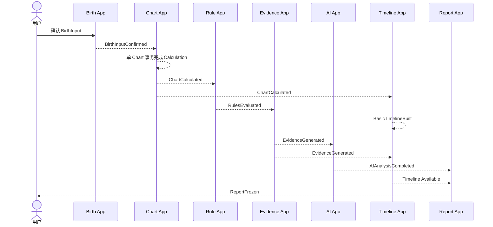
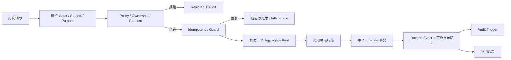
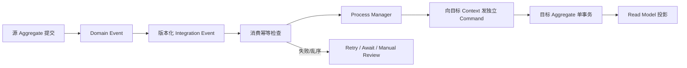
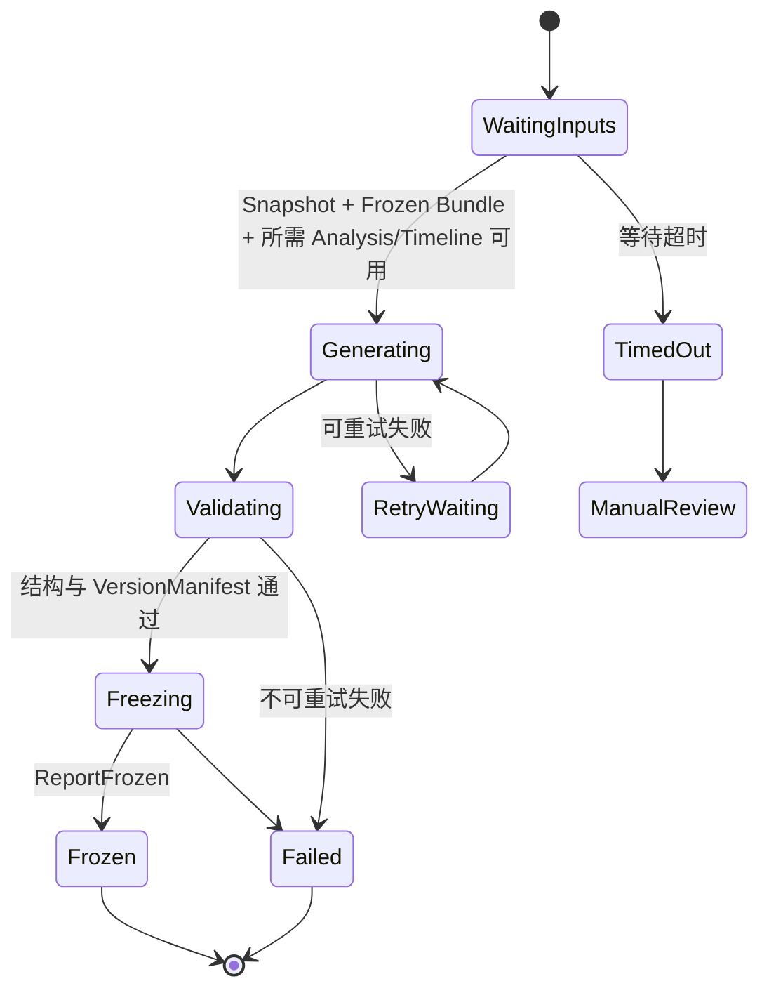
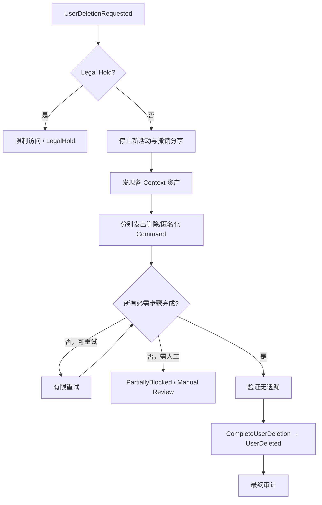
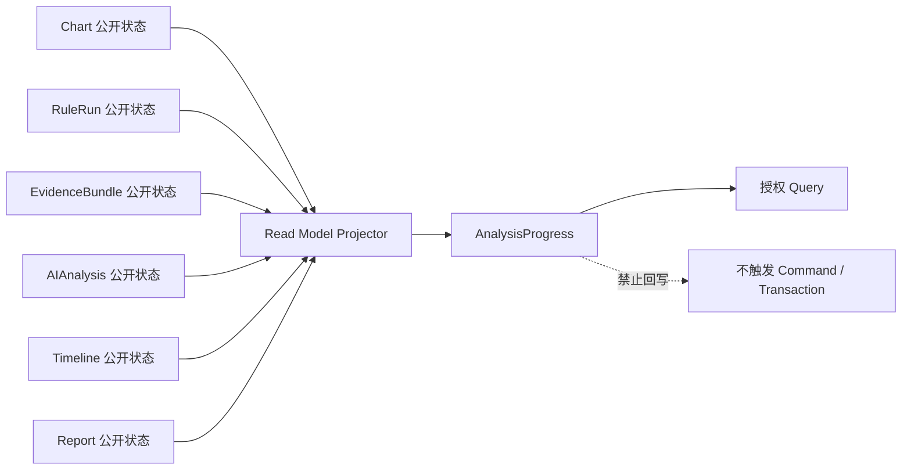
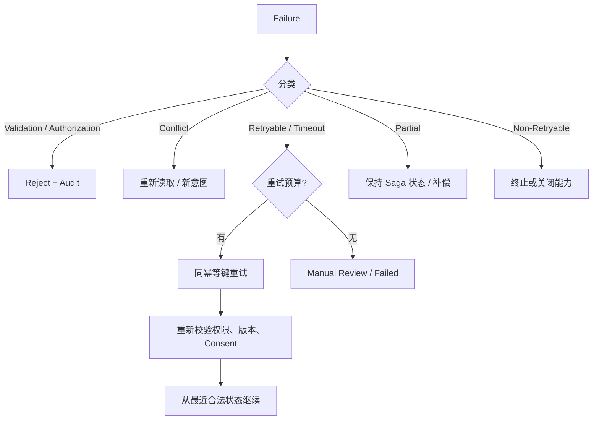

# AI 八字命理分析平台：应用架构

**文档编号：** 07  
**文档类型：** Application Architecture  
**文档状态：** Review  
**当前版本：** 0.9  
**上游基线：** `01-PRODUCT-VISION.md`、`02-SRS.md`、`03-SYSTEM-ARCHITECTURE.md`、`04-DOMAIN-MODEL.md` 1.0、`05-DATA-MODEL.md` 1.0、`06-ROADMAP.md` 1.0（均已 Approved）  
**目标读者：** 产品负责人、应用架构师、领域与数据负责人、安全与隐私负责人、研发及测试负责人、运营治理负责人

---

## Version 0.9 Change Log

- 新增 `ADR Reference Matrix`，明确应用架构关键主题发生变化时的 ADR 前置审批要求。
- 新增 `Application Layer Anti-Patterns`，明确应用层禁止模式、相关风险及推荐治理方式。

---

## 1. Document Purpose and Scope

### 1.1 目标

本文档定义 Application Layer 如何接收用例意图、建立安全上下文、调用领域行为、控制单聚合事务、协调跨 Bounded Context 长流程、处理幂等与失败、触发审计，并向调用方返回明确的应用结果。

本文件把已批准 Domain Model 和 Data Model 组织成可执行的应用责任边界，但不改变任何领域语义。

### 1.2 分层边界

| 层 | 负责 | Application Layer 与其关系 |
|---|---|---|
| Interface Layer | 接收外部交互、表达请求和展示结果 | 将已验证的用例意图交给应用层；不直接操作 Aggregate |
| Application Layer | 用例编排、事务、授权、幂等、事件、长流程与应用结果 | 本文档定义的范围 |
| Domain Layer | Aggregate、Entity、Value Object、领域行为、不变量和 Domain Event | 应用层调用领域行为，不复制或改写领域规则 |
| Infrastructure Layer | 持久化、外部模型、时间/地点来源、事件传递和运行能力 | 通过抽象能力支持应用层；不得决定领域结果 |

### 1.3 Application Layer 边界

Application Layer 可以决定“按什么顺序调用哪些已存在的领域能力”，不能决定“命理事实是什么”“某条规则如何判断”或“冻结对象是否可以被修改”。

### 1.4 本文档不包含

- 代码或伪代码；
- SQL、ORM、数据迁移或物理数据结构；
- API Schema、传输字段、路由或 Controller 实现；
- Repository 实现；
- 消息队列配置或具体传递产品；
- 部署、云服务或运行环境配置；
- Bounded Context、Aggregate、Entity、Value Object 或 Domain Event 的重新定义；
- 具体四柱算法、命理规则或 AI Prompt 内容。

### 1.5 上游基线处理

如应用用例需要改变 Aggregate Boundary、Context 依赖、Identity、Version 或 Immutable Object Rules，只记录为 Open Question 或 ADR Candidate。ADR 未批准且相关基线文档未更新前，本文件不得采用候选变化。

---

## 2. Application Architecture Principles

### AAP-001 Use Case Oriented

应用入口围绕明确业务用例，而不是围绕数据对象的任意增删改。每个用例具有 Actor、目标、前置条件、授权、事务、事件、失败和审计语义。

### AAP-002 Domain First

应用层只协调已批准领域行为。命理计算、RuleFinding、Evidence 和冻结规则由相应 Domain Context 保证。

### AAP-003 Thin Application Layer

Application Service 保持薄：不保存领域判断公式，不积累条件树，不复制 Aggregate 不变量。出现复杂业务判断时，应由现有领域对象承担；若领域模型缺失，提交 ADR Candidate。

### AAP-004 Explicit Orchestration

跨步骤流程使用明确 Process Manager 或 Saga 状态，不依赖隐式调用链、定时猜测或“读取当前最大版本”。

### AAP-005 Command Query Separation

Command 表达改变状态的意图；Query 只读取。Query 不触发修复、计算、重试、冻结或审计之外的业务状态变化。

### AAP-006 Idempotency

所有可能重复提交、重试或重复投递的 Command 和 Event 都必须具有业务幂等语义。幂等不以忽略所有重复为目标，而以避免重复正式业务结果为目标。

### AAP-007 Eventual Consistency

跨 Aggregate 与跨 Context 流程通过事件达到最终一致。投影延迟和下游等待是明确状态，不用跨 Context 事务消除。

### AAP-008 No Cross Aggregate Mutation

一个 Handler 不直接修改多个 Aggregate。需要改变另一个 Aggregate 时，发布事件或向其所属 Context 发出独立 Command。

### AAP-009 Traceability

Command、事务、Domain Event、Integration Event、Saga、AuditEvent 和应用结果使用 CorrelationId、CausationId 与稳定 Identity 形成追踪链。

### AAP-010 Security and Privacy by Design

Actor、Subject、Purpose、Role、Resource Ownership、Consent 和敏感访问理由在用例开始时建立，在跨 Context 传递时最小化，并在每个所属 Context 重新验证。

### AAP-011 Failure as Explicit State

Validation、Authorization、Conflict、Timeout、Dependency、Partial、Retryable 和 Non-Retryable Failure 均以明确应用结果表达，不以空结果或伪成功替代。

### AAP-012 Immutable Results Stay Immutable

应用层不能让 Valid Snapshot、Completed RuleRun、Frozen EvidenceBundle、Completed AIAnalysis、Published 定义或 Frozen Report 回到可编辑状态。

### AAP-013 Read Models Are Projections

Read Model 可重建、可延迟且不拥有领域状态。Read Model 的便利性不能成为绕过 Aggregate Root 和 Context 权限的理由。

### AAP-014 Governance Before Deviation

任何影响 Architecture Baseline 的变更先经过 ADR Gate；Roadmap Scope Freeze 期间还需满足相应范围治理。

---

## 3. Application Layer Responsibilities

### 3.1 应用层负责

1. 接收明确的用例请求并识别 Command 或 Query。
2. 建立 ActorContext、SubjectContext 和 PurposeOfUse。
3. 校验身份、角色、资源所有权、Consent 和敏感访问理由。
4. 通过所属 Context 的访问抽象加载 Aggregate Root 或不可变 Snapshot。
5. 调用 Aggregate 或 Domain Service 的公开领域行为。
6. 为单一 Aggregate 管理事务边界。
7. 收集并发布 Domain Event；需要跨 Context 时转换为 Integration Event。
8. 使用 Process Manager/Saga 编排跨 Context 长流程。
9. 处理 Command/Event 幂等、有限重试、超时、补偿和人工介入。
10. 触发 AuditEvent，保留最小追踪信息。
11. 更新或触发 Read Model 投影。
12. 返回 Success、Accepted、InProgress、Rejected、Conflict、Failed 或 Degraded 等明确应用结果。

### 3.2 应用层不负责

1. 实现四柱、历法、起运或其他确定性计算公式。
2. 实现旺衰、格局、调候、用神、神煞等命理规则。
3. 直接生成 RuleFinding。
4. 直接创建 Evidence 或判断 EvidenceStatus。
5. 让 AI 决定 CalculatedFacts、RuleFinding 或 Evidence。
6. 直接修改其他 Context 的 Aggregate。
7. 绕过 Aggregate Root 修改内部 Entity。
8. 把多个 Context 合并成一个超级 Application Service。
9. 在 Application Service 内堆积领域条件、流派优先级或风险判断公式。
10. 让下游状态回写 Chart 或其他上游 Aggregate。
11. 将 AnalysisProgress 作为事务状态源。
12. 修改 Frozen、Published、Completed 或 Valid 对象内容。

### 3.3 应用结果

| 结果 | 含义 | 调用方后续动作 |
|---|---|---|
| Success | 用例在所属事务内完成 | 读取新状态或结果 |
| Accepted | 已接受长流程，尚未完成 | 使用进度查询，不重复创建新意图 |
| InProgress | 相同幂等意图正在处理 | 复用原流程标识 |
| Rejected | 授权、Consent、风险或不可变规则禁止 | 不自动重试；按原因修正或人工处理 |
| Conflict | 当前版本/状态与意图冲突 | 重新读取状态后由用户或流程决定 |
| Failed | 不可恢复或已终止失败 | 展示明确失败并保留审计 |
| Degraded | 核心事实可用，但非核心下游不可用 | 展示允许内容及降级说明 |

---

## 4. Application Components

| 组件 | 主要职责 | 禁止事项 |
|---|---|---|
| Application Service | 为一个 Context 提供用例入口，协调 Handler、授权、事务和结果 | 不拥有跨 Context 业务状态；不实现领域规则 |
| Use Case Handler | 完成一个具体用例的应用编排 | 不处理多个无关用例；不成为万能服务 |
| Command Handler | 校验 Command 上下文，加载一个 Aggregate Root，调用领域行为并提交事务 | 不直接修改第二个 Aggregate；不返回拼装查询视图 |
| Query Handler | 校验读取权限，读取 Read Model 或不可变 Snapshot，返回查询结果 | 不改变领域状态；不触发计算、冻结或修复 |
| Process Manager | 根据事件推进一个明确跨 Context 流程，记录流程状态与下一动作 | 不是 Domain Aggregate；不复制参与者业务状态 |
| Saga | 处理具有多步骤、超时、补偿和终态的长流程 | 不使用一个全局事务；不修改冻结对象 |
| Policy/Authorization Check | 评估 Actor、Role、Ownership、Purpose、Consent 和敏感访问理由 | 不用界面隐藏代替服务端授权；不推导命理结论 |
| Idempotency Guard | 识别重复意图、复用已有结果或阻止重复正式对象 | 不把内容不同但键相同的请求静默视为成功 |
| Transaction Boundary | 包围单一 Aggregate 的加载、行为、保存和事件记录 | 不跨 Bounded Context；原则上不同时提交多个 Aggregate |
| Event Publisher | 发布事务中产生的 Domain Event，并向外提供版本化 Integration Event | 不修改事件事实；不承诺仅投递一次 |
| Audit Trigger | 根据用例和事件追加最小 AuditEvent | 不复制敏感正文；不允许调用方伪造审计主体 |
| Read Model Projector | 消费事件并更新查询投影 | 不成为事实源；不反向发布修改源 Aggregate 的 Command |

### 4.1 Process Manager 与 Saga 的使用边界

- 短、单聚合、无外部等待的用例不使用 Saga。
- 跨 Context、有多个终态、超时或补偿需求的流程使用 Process Manager/Saga。
- Saga 状态只记录流程步骤、参与者 Identity、已消费事件、已发 Command、等待期限和终态。
- Saga 不复制 CalculationSnapshot、RuleFinding、Evidence、AI 内容或 Report 正文。

---

## 5. Command Model

### 5.1 Command 通用规则

每个 Command 表达一次业务意图，并携带调用方已建立的 ActorContext、PurposeOfUse、CorrelationId 和业务 IdempotencyKey。具体传输字段不属于本文档。

Command 只由目标 Aggregate 所属 Context 处理。跨 Context 流程由 Process Manager 发出新的独立 Command，而非在原事务中继续修改。

下表中，只有已在 Approved《04-DOMAIN-MODEL.md》中定义的事件名称才属于正式 Domain Event。为完整描述应用编排而出现、但尚未进入领域基线的名称，仅代表 Application Event / Integration Event Candidate；它们不得被解释为本文新增或重定义的 Domain Event，正式采用前必须通过 ADR Gate 并更新相应 Architecture Baseline。

### 5.2 User / Identity Commands

| Command Name | Intent | Target Aggregate Root | Preconditions | Authorization | Idempotency | Transaction | Domain Events | Failure Results |
|---|---|---|---|---|---|---|---|---|
| RegisterUser | 创建注册主体 | User | 年龄与必要告知满足；身份未占用 | 匿名 Actor 自助 | 注册意图键 | 单 User | UserRegistered | Validation、Conflict、DependencyFailure |
| SuspendUser | 暂停主体使用资格 | User | User Active | 授权安全/管理员角色与理由 | 管理动作键 | 单 User | UserSuspended | Authorization、Conflict |
| RestoreUser | 恢复允许状态 | User | User Suspended 且无阻断 | 授权角色 | 管理动作键 | 单 User | UserRestored | Authorization、Conflict |
| RequestUserDeletion | 发起账户删除 | User | 身份复核；无重复完成请求 | User 本人或法定流程 | 删除请求键 | 单 User | UserDeletionRequested | Authorization、Conflict、LegalHold |

### 5.3 SubjectConsent Commands

| Command Name | Intent | Target Aggregate Root | Preconditions | Authorization | Idempotency | Transaction | Domain Events | Failure Results |
|---|---|---|---|---|---|---|---|---|
| GrantConsent | 对目的和范围授予同意 | SubjectConsent | PolicyReference 有效；无冲突当前决定 | Subject 本人 | 主体+目的+政策+意图 | 单 SubjectConsent | ConsentGranted | Validation、Authorization、Conflict |
| DeclineConsent | 明确拒绝可选用途 | SubjectConsent | 目的可选择 | Subject 本人 | 同上 | 单 SubjectConsent | ConsentDeclined | Validation、Conflict |
| RevokeConsent | 撤回当前有效同意 | SubjectConsent | 存在可撤回 Granted | Subject 本人或法定代理 | 撤回意图键 | 单 SubjectConsent | ConsentRevoked | Authorization、Conflict、NonRetryable |

### 5.4 BirthProfile Commands

| Command Name | Intent | Target Aggregate Root | Preconditions | Authorization | Idempotency | Transaction | Domain Events | Failure Results |
|---|---|---|---|---|---|---|---|---|
| CreateBirthProfile | 创建出生资料容器 | BirthProfile | 必要处理许可；配额允许 | Subject 本人 | 创建意图键 | 单 BirthProfile | BirthProfileCreated | Validation、Authorization、QuotaConflict |
| ConfirmBirthInput | 冻结一次用户输入 | BirthProfile | Profile Draft/Active；输入完整度可判断 | 所有者 | Profile+输入意图摘要 | 单 BirthProfile | BirthInputConfirmed | Validation、Authorization、Conflict |
| ArchiveBirthProfile | 移出活动使用 | BirthProfile | 非删除处理中 | 所有者 | Profile+Archive | 单 BirthProfile | BirthProfileArchived | Conflict、Authorization |
| RestoreBirthProfile | 恢复活动使用 | BirthProfile | 已 Archived 且配额允许 | 所有者 | Profile+Restore | 单 BirthProfile | BirthProfileRestored | Conflict、QuotaConflict |

### 5.5 Chart Calculation Commands

| Command Name | Intent | Target Aggregate Root | Preconditions | Authorization | Idempotency | Transaction | Domain Events | Failure Results |
|---|---|---|---|---|---|---|---|---|
| CreateChart | 为 Confirmed BirthInput 创建确定性命盘 | Chart | BirthInputConfirmed；处理许可有效 | BirthProfile 所有者 | BirthInput+创建意图 | 单 Chart | ChartCreated | Validation、Authorization、Conflict |
| ValidateChartInput | 进入时间与输入验证 | Chart | Chart Draft | 所有者或受信流程 | Chart+验证版本 | 单 Chart | ChartValidated / ChartValidationFailed | ValidationFailure、DependencyFailure |
| ExecuteCalculation | 使用锁定版本生成 Snapshot 候选 | Chart | Chart Validated；AlgorithmVersion 可用 | 所有者或 Process Manager | Chart+Input+Algorithm+Parameters | 单 Chart | ChartCalculationRequested、ChartCalculated / ChartCalculationFailed | Conflict、Timeout、VerificationBlocked |
| SetCurrentSnapshot | 显式选择当前 Valid Snapshot | Chart | Snapshot 属于 Chart 且 Valid | 所有者或批准流程 | Chart+Snapshot | 单 Chart | CurrentSnapshotSet | Conflict、Authorization |
| ArchiveChart | 归档确定性命盘 | Chart | Chart Calculated/允许归档；非删除中 | 所有者 | Chart+Archive | 单 Chart | ChartArchived | Conflict |
| RestoreChart | 恢复归档命盘 | Chart | Chart Archived 且配额允许 | 所有者 | Chart+Restore | 单 Chart | ChartRestored | Conflict、QuotaConflict |

### 5.6 Algorithm Governance Commands

| Command Name | Intent | Target Aggregate Root | Preconditions | Authorization | Idempotency | Transaction | Domain Events | Failure Results |
|---|---|---|---|---|---|---|---|---|
| SubmitAlgorithmVersionForReview | 提交算法定义版本审核 | AlgorithmVersion | 定义、支持范围和验证清单完整 | 算法治理角色 | Version+提交轮次 | 单 AlgorithmVersion | AlgorithmVersionSubmitted | Validation、Authorization |
| ApproveAlgorithmVersion | 记录审核批准 | AlgorithmVersion | InReview；批准职责满足 | 独立审核角色 | Version+审核决定 | 单 AlgorithmVersion | AlgorithmVersionApproved | Authorization、Conflict |
| PublishAlgorithmVersion | 发布正式可用版本 | AlgorithmVersion | Approved；门禁通过 | 发布角色 | Version+发布批次 | 单 AlgorithmVersion | AlgorithmVersionPublished | Conflict、GovernanceFailure |
| RetireAlgorithmVersion | 停止新计算使用 | AlgorithmVersion | Published/Deprecated | 发布治理角色 | Version+Retire | 单 AlgorithmVersion | AlgorithmVersionRetired | Authorization、Conflict |

### 5.7 Rule Governance Commands

| Command Name | Intent | Target Aggregate Root | Preconditions | Authorization | Idempotency | Transaction | Domain Events | Failure Results |
|---|---|---|---|---|---|---|---|---|
| SubmitRuleSetVersionForReview | 提交规则集审核 | RuleSet | 来源、适用条件、专家样例完整 | 内容/领域编辑角色 | Version+提交轮次 | 单 RuleSet | RuleSetSubmitted | Validation、Authorization |
| ApproveRuleSetVersion | 记录专家与审核决定 | RuleSet | InReview；职责分离满足 | 命理专家/审核角色 | Version+决定 | 单 RuleSet | RuleSetApproved | Conflict、Authorization |
| PublishRuleSetVersion | 发布不可变规则版本 | RuleSet | Approved；回归门禁通过 | 发布角色 | Version+发布批次 | 单 RuleSet | RuleSetPublished | GovernanceFailure、Conflict |
| RetireRuleSetVersion | 停止新 RuleRun 使用 | RuleSet | Published/Deprecated | 发布角色 | Version+Retire | 单 RuleSet | RuleSetRetired | Conflict |

### 5.8 RuleRun Commands

| Command Name | Intent | Target Aggregate Root | Preconditions | Authorization | Idempotency | Transaction | Domain Events | Failure Results |
|---|---|---|---|---|---|---|---|---|
| RequestRuleRun | 创建单次规则执行 | RuleRun | Snapshot Valid；RuleSetVersion Published 且适用 | Chart 所有者或 Process Manager | Snapshot+RuleSet+Scope+RunIntent | 单 RuleRun | RuleRunRequested | Validation、Conflict、Authorization |
| ExecuteRuleRun | 执行并验证 Finding 集合 | RuleRun | Requested/Running | 受信应用流程 | RuleRunId+执行尝试 | 单 RuleRun | RulesEvaluated / RuleRunFailed、RuleConflictDetected | DependencyFailure、NonRetryableFailure |

### 5.9 EvidenceBundle Commands

| Command Name | Intent | Target Aggregate Root | Preconditions | Authorization | Idempotency | Transaction | Domain Events | Failure Results |
|---|---|---|---|---|---|---|---|---|
| BuildEvidenceBundle | 建立证据候选集合 | EvidenceBundle | Snapshot Valid；所需 RuleRun Completed；知识引用可用 | Chart 所有者或 Process Manager | Snapshot+Runs+Scope+Policy | 单 EvidenceBundle | EvidenceBundleBuilt | Validation、DependencyFailure |
| FreezeEvidenceBundle | 验证并冻结 Bundle | EvidenceBundle | Building/Validating；上游清单完整 | 受信应用流程 | Bundle+FreezeAttempt | 单 EvidenceBundle | EvidenceGenerated / EvidenceValidationFailed | Conflict、NonRetryableFailure |

### 5.10 Knowledge Governance Commands

| Command Name | Intent | Target Aggregate Root | Preconditions | Authorization | Idempotency | Transaction | Domain Events | Failure Results |
|---|---|---|---|---|---|---|---|---|
| SubmitKnowledgeVersionForReview | 提交知识版本权利与领域审核 | KnowledgeArticle | 来源、权利、语言和适用范围完整 | 内容编辑角色 | Version+提交轮次 | 单 KnowledgeArticle | KnowledgeSubmitted | Validation、Authorization |
| ApproveKnowledgeArticleVersion | 记录权利与领域审核通过 | KnowledgeArticle | 所需审核均完成 | 独立审核角色 | Version+审核决定 | 单 KnowledgeArticle | KnowledgeApproved | Conflict、Authorization |
| PublishKnowledgeArticleVersion | 发布知识版本 | KnowledgeArticle | Approved | 发布角色 | Version+发布批次 | 单 KnowledgeArticle | KnowledgeArticlePublished | GovernanceFailure、Conflict |
| WithdrawKnowledgeRights | 因权利原因停止新引用 | KnowledgeArticle | Published/Deprecated；合法依据存在 | 权利/法律治理角色 | Version+撤下依据 | 单 KnowledgeArticle | KnowledgeRightsWithdrawn | Authorization、Conflict |

### 5.11 AIAnalysis Commands

| Command Name | Intent | Target Aggregate Root | Preconditions | Authorization | Idempotency | Transaction | Domain Events | Failure Results |
|---|---|---|---|---|---|---|---|---|
| PlanAIAnalysis | 创建受范围约束的分析计划 | AIAnalysis | Frozen Bundle；Purpose/Consent 允许；资格与额度允许 | Chart 所有者或 Process Manager | Snapshot+Bundle+PlanIntent | 单 AIAnalysis | AIAnalysisPlanned | Authorization、ConsentFailure、QuotaConflict |
| ExecuteAIAnalysis | 生成并校验正式分析 | AIAnalysis | Planned；Prompt/Model/Risk 版本可用 | 受信应用流程 | AnalysisId+技术尝试 | 单 AIAnalysis | AIAnalysisCompleted / Rejected / Failed | Timeout、DependencyFailure、ValidationFailure |

### 5.12 AIConversation Commands

| Command Name | Intent | Target Aggregate Root | Preconditions | Authorization | Idempotency | Transaction | Domain Events | Failure Results |
|---|---|---|---|---|---|---|---|---|
| CreateConversation | 为一个 Chart 创建受限会话 | AIConversation | Chart 可访问；Purpose/Consent/额度允许 | Chart 所有者 | Chart+会话意图 | 单 Conversation | ConversationCreated | Authorization、QuotaConflict |
| SubmitAIMessage | 提交问题并创建消息处理意图 | AIConversation | Active；主题和三年范围可判断 | 会话所有者 | Conversation+客户端消息意图 | 单 Conversation | AIMessageSubmitted | Validation、Authorization、RateLimit |
| CompleteAIMessage | 关联 Completed AIAnalysis 或安全拒绝 | AIConversation | 对应消息等待中；分析属于同一 Chart/Scope | 受信应用流程 | Message+Completion | 单 Conversation | AIMessageCompleted / Rejected / Failed | Conflict、ValidationFailure |
| CloseConversation | 关闭会话 | AIConversation | Active/Limited | 所有者 | Conversation+Close | 单 Conversation | ConversationClosed | Conflict |

### 5.13 Timeline Commands

| Command Name | Intent | Target Aggregate Root | Preconditions | Authorization | Idempotency | Transaction | Domain Events | Failure Results |
|---|---|---|---|---|---|---|---|---|
| BuildBasicTimeline | 从确定性事实建立基础时间轴 | Timeline | Snapshot Valid；范围与粒度允许 | Chart 所有者或 Process Manager | Snapshot+Kind+Horizon+Version | 单 Timeline | BaseTimelineBuilt | Validation、DependencyFailure |
| BuildAnalyticalTimeline | 在基础版上附加规则与证据 | Timeline | Basic Available；RuleRun Completed；关键节点 Evidence 可用 | Chart 所有者或 Process Manager | Basic+Runs+Bundle+Scope | 单 Timeline | AnalysisTimelineBuilt | Conflict、DependencyFailure |
| ArchiveTimeline | 归档时间轴版本 | Timeline | Available/Superseded | Chart 所有者 | Timeline+Archive | 单 Timeline | TimelineArchived | Conflict |

### 5.14 Report Commands

| Command Name | Intent | Target Aggregate Root | Preconditions | Authorization | Idempotency | Transaction | Domain Events | Failure Results |
|---|---|---|---|---|---|---|---|---|
| GenerateReport | 创建报告候选 | Report | Snapshot Valid；Bundle Frozen；所需 AI/Timeline 可用 | Chart 所有者或 Process Manager | Chart+ReportType+UpstreamManifest+Intent | 单 Report | ReportGenerationRequested | Validation、DependencyFailure |
| FreezeReport | 验证结构与 VersionManifest 并冻结 | Report | Completed；所有必需检查通过 | 受信应用流程 | Report+FreezeAttempt | 单 Report | ReportFrozen | ValidationFailure、Conflict |
| RegenerateReport | 明确创建替代报告意图 | 新 Report | 原 Report Frozen；新上游/范围明确 | Report 所有者 | OldReport+RegenerationIntent | 单新 Report | ReportRegenerated、ReportGenerationRequested | Authorization、Conflict |
| ArchiveReport | 归档报告 | Report | Frozen/Superseded | 所有者 | Report+Archive | 单 Report | ReportArchived | Conflict |
| RestoreReport | 恢复归档展示 | Report | Archived；未删除 | 所有者 | Report+Restore | 单 Report | ReportRestored | Conflict |

### 5.15 Audit Commands

| Command Name | Intent | Target Aggregate Root | Preconditions | Authorization | Idempotency | Transaction | Domain Events | Failure Results |
|---|---|---|---|---|---|---|---|---|
| RecordAuditEvent | 追加关键业务/管理事实 | AuditStream | 来源事件或动作上下文可信；最小信息 | 仅受信 Audit Trigger | EventSource+SourceEventId | 单 AuditStream | AuditEventRecorded | DuplicateAccepted、DependencyFailure |
| CorrectAuditEvent | 追加纠正说明 | AuditStream | 原 AuditEvent 存在；纠正依据完整 | 审计角色 | Original+CorrectionIntent | 单 AuditStream | AuditEventCorrected | Authorization、Conflict |

### 5.16 Deletion / Data Rights Commands

| Command Name | Intent | Target Aggregate Root | Preconditions | Authorization | Idempotency | Transaction | Domain Events | Failure Results |
|---|---|---|---|---|---|---|---|---|
| RequestDataExport | 发起主体数据导出流程 | 无新增 Domain Aggregate；由应用流程记录承载请求状态 | 身份复核；Purpose 合法 | Subject 本人/法定代理 | Subject+ExportScope+Request | 单应用流程状态单元 | DataExportRequested | Authorization、Conflict |
| RequestObjectDeletion | 删除单一用户资产 | 对应资源所属 Context 的 Aggregate Root；应用流程记录承载协调状态 | 所有权；依赖可发现 | 所有者 | Subject+Object+DeleteIntent | 单目标 Aggregate；协调状态独立提交 | ObjectDeletionRequested | Authorization、LegalHold |
| ContinueDeletionStep | 推进某 Context 删除步骤 | 该 Context 的目标 Aggregate/请求 | Saga 已授权；步骤未完成 | Deletion Saga | Request+Context+Step | 单目标 Aggregate | ContextDeletionCompleted / Failed | PartialFailure、LegalHold |
| CompleteUserDeletion | 在所有必需步骤完成后结束主体删除 | User | 删除 Saga 达到完成条件 | Deletion Saga | User+DeletionRequest | 单 User | UserDeleted | Conflict、PartialFailure |

`DataRightsRequest` 只表示应用流程请求身份及其应用流程记录，不是 Aggregate Root，也不重新定义前述 Domain Model。它不得持有或修改各 Context 的内部 Entity；若需要将其提升为正式 Domain Aggregate，必须提交 ADR Candidate。

---

## 6. Query Model

### 6.1 Query 原则

1. Query 不修改领域状态，不发布会改变业务对象的 Command。
2. Query 可以读取专门 Read Model、不可变 Snapshot 或 Aggregate 的公开只读投影。
3. Query 必须校验 Actor、Purpose、Ownership、Role、Consent 和敏感访问理由。
4. Query 不因追求便利而绕过 Context 数据所有权。
5. Query 可以拼装展示数据，但不能把多个 Aggregate 的状态拼成新的事务一致性语义。
6. 投影延迟必须显式表达，不能被解释为源对象失败。
7. 审计、支持和导出 Query 使用比普通用户更严格的用途与访问审计。

### 6.2 Query Catalog

| Query | Query Owner | 数据来源 | 授权与隐私 | 一致性语义 | 禁止行为 |
|---|---|---|---|---|---|
| GetChartDetail | Chart Calculation | Chart Read Model、当前 Snapshot 引用 | Chart 所有者/授权专业用户 | 当前状态 + 明确投影时间 | 不触发计算；不显示下游为 Chart 状态 |
| GetCalculationSnapshotDetail | Chart Calculation | 不可变 Snapshot 投影 | Chart 所有权；专业权限控制详情 | 强版本一致、内容不可变 | 不自动替换为最新 Snapshot |
| GetRuleRunDetail | Rule Evaluation | Completed/Failed RuleRun 投影 | Chart 所有权；专业展开权限 | 单 Run 一致 | 不跨 Run 合并 Finding 为新事实 |
| GetRuleFindings | Rule Evaluation | RuleRun 内部公开投影 | 同上 | 继承 RuleRun 状态 | 不直接访问或修改内部 Entity |
| GetEvidenceBundle | Evidence | Frozen/Invalid Bundle 投影 | Chart 所有权；展示级别过滤 | Frozen 内容强一致 | 不让 AI 或查询层创建缺失 Evidence |
| GetAIAnalysisStatus | AI | AIAnalysis 状态投影 | Chart 所有权、Purpose/Consent | 最终一致状态 | 不展示供应商原始输出为正式结果 |
| GetConversationHistory | AI | Conversation Read Model | 会话所有者；敏感内容限制 | 消息顺序一致，投影可延迟 | 不混入另一 Chart 消息 |
| GetTimeline | Timeline | Basic/Analytical Timeline Read Model | Chart 所有权 | 明确 TimelineId/Kind/版本 | 不把 Basic 与 Analytical 静默合并 |
| CompareTimelineNodes | Timeline | 同版本节点投影 | Chart 所有权 | 查询比较，不产生关键节点事实 | 不写回 Timeline |
| GetReport | Report | Frozen Report 投影 | 所有者或 V1 合法分享权限 | Frozen 内容强版本一致 | 不按当前上游重写旧报告 |
| GetAnalysisProgress | Application Read Model | 多 Context 公开状态投影 | Chart 所有权 | 最终一致、可延迟 | 不触发步骤、不回写源对象 |
| SearchAuditEvents | Audit | Audit Read Model | Auditor/批准调查目的 | 追加历史；查询也审计 | 不暴露无关敏感正文 |
| ExportUserData | Data Rights | 各 Context 经授权导出投影 | 身份复核、导出目的、范围 | 截止时间快照 + 各来源状态 | 不绕过 Context 过滤或 Legal Hold |

### 6.3 Query 失败

Query 使用 NotFound、NotAuthorized、PurposeDenied、ProjectionLagging、TemporarilyUnavailable 和 VersionUnavailable 等明确结果。为防止资源枚举，对外结果可以统一隐藏对象是否存在，但内部 Audit 保留实际拒绝原因。

---

## 7. Use Case Catalog

### 7.1 用例描述规则

下列用例描述应用编排，不修改 Domain Model。`Aggregates involved` 只表示读取或分别发 Command，不代表同一事务修改多个聚合。

### 7.2 Birth 与 Chart 用例

| Use Case | Actor / Goal | Preconditions | Main Flow | Alternate / Failure | Aggregates | Events | Consistency | Audit |
|---|---|---|---|---|---|---|---|---|
| UC-A01 创建 BirthProfile | 匿名/注册用户；建立资料容器 | 年龄与必要处理允许 | 授权→幂等→创建 Root→提交→事件 | 配额满则拒绝；重复返回原结果 | BirthProfile | BirthProfileCreated | 单聚合强一致 | 创建、主体、Purpose |
| UC-A02 确认 BirthInput | 所有者；冻结输入 | Profile 可编辑；输入可验证 | 加载 Profile→确认输入→提交 | 边界/缺失返回 Validation；不补造 | BirthProfile | BirthInputConfirmed | 单聚合强一致 | 输入模式、精度、确认版本，不记完整敏感正文 |
| UC-A03 创建 Chart | 所有者；建立确定性命盘 | BirthInputConfirmed | 创建 Chart→接受计算流程 | 不确定输入可阻断或候选，待产品决定 | Chart；读取 Birth Snapshot | ChartCreated | 单 Chart + 最终一致触发 | Chart/Input 引用 |
| UC-A04 执行 Calculation | 所有者/流程；生成 Valid Snapshot | Chart Validated；算法版本可用 | 锁定版本→领域计算→验证→提交 | ValidationFailed、CalculationFailed、VerificationBlocked | Chart | ChartCalculated / Failed | 单 Chart 强一致 | 算法、参数、结果状态 |
| UC-A05 设置 Current Snapshot | 所有者；显式选择 Valid Snapshot | Snapshot 属于 Chart | 校验→设置→提交 | Snapshot 非 Valid 或版本冲突 | Chart | CurrentSnapshotSet | 单聚合强一致 | 新旧 Snapshot 引用 |
| UC-A06 归档/恢复 BirthProfile 或 Chart | 所有者；管理活动资产 | 所有权、状态和配额允许 | 调用对应 Root 行为→提交 | 删除中/配额冲突 | 单个目标 Root | Archived / Restored | 单聚合强一致 | 状态、原因 |

### 7.3 Governance 与 Rule 用例

| Use Case | Actor / Goal | Preconditions | Main Flow | Alternate / Failure | Aggregates | Events | Consistency | Audit |
|---|---|---|---|---|---|---|---|---|
| UC-A07 发布 AlgorithmVersion | 算法治理角色；允许正式计算使用 | 审核、黄金门禁和职责分离 | 提交→审核→批准→独立发布 Command | 拒绝或测试失败保持未发布 | AlgorithmVersion | Submitted、Approved、Published | 每步单聚合；流程最终一致 | 每个决定、角色、理由 |
| UC-A08 发布 RuleSetVersion | 专家/发布角色；允许正式运行 | 来源、条件、回归、分歧记录完整 | 提交→专家审核→批准→发布 | 分歧未解决可拒绝或缩小范围 | RuleSet | Submitted、Approved、Published | 每步单聚合 | 专家意见、版本、发布批次 |
| UC-A09 执行 RuleRun | 所有者/流程；生成规则发现 | Snapshot Valid；RuleSet Published | 创建 Run→执行→验证→完成 | Failed 不产生完整 Bundle；冲突保留 | RuleRun；读取 Snapshot/RuleSet Snapshot | RuleRunRequested、RulesEvaluated、Conflict/Failed | 单 Run；上下游最终一致 | 版本、范围、完整性 |
| UC-A10 构建并冻结 EvidenceBundle | 流程；形成正式证据边界 | Snapshot Valid；Runs Completed；知识有效 | Build→验证引用/范围→Freeze | Invalid 终止；不由 AI 补证据 | EvidenceBundle；读取发布 Snapshot | EvidenceGenerated / ValidationFailed | 单 Bundle；跨来源最终一致 | 上游清单、策略、冻结 |
| UC-A11 发布 KnowledgeArticleVersion | 内容/权利/专家角色；允许新引用 | RightsReview、DomainReview 通过 | 提交→审核→批准→发布 | 权利不足拒绝；撤下走独立用例 | KnowledgeArticle | Submitted、Approved、Published | 每步单聚合 | 来源、权利、审核、版本 |

### 7.4 AI 与 Conversation 用例

| Use Case | Actor / Goal | Preconditions | Main Flow | Alternate / Failure | Aggregates | Events | Consistency | Audit |
|---|---|---|---|---|---|---|---|---|
| UC-A12 执行 AIAnalysis | 用户/报告流程；取得证据化解释 | Bundle Frozen；Purpose、Consent、额度允许 | Plan→生成→结构/事实/引用/风险验证→Complete | Rejected、Failed、Timeout；可降级 | AIAnalysis；读取 Bundle/Timeline/知识 Snapshot | Planned、Completed/Rejected/Failed | 单 Analysis + 外部依赖最终一致 | 模型、Prompt、策略、成本、结果状态 |
| UC-A13 创建 Conversation | 用户；建立单 Chart 会话 | Chart 可访问；资格允许 | 创建 Root→提交 | 配额/Consent 拒绝 | AIConversation | ConversationCreated | 单聚合 | Chart、Purpose |
| UC-A14 提交 AIMessage | 会话所有者；获得受限回答 | Conversation Active；范围可判断 | 追加用户消息→触发分析流程→完成回答 | 越界安全拒绝；超时保持明确状态 | Conversation；独立 AIAnalysis | MessageSubmitted、Analysis events、MessageCompleted | 消息单聚合；分析最终一致 | 问题风险分类、结果，不默认复制全文 |

### 7.5 Timeline 与 Report 用例

| Use Case | Actor / Goal | Preconditions | Main Flow | Alternate / Failure | Aggregates | Events | Consistency | Audit |
|---|---|---|---|---|---|---|---|---|
| UC-A15 生成 Basic Timeline | 用户/流程；查看确定性时间结构 | Snapshot Valid | 创建 Timeline→构建事实节点→Available | 边界不确定或范围不支持 | Timeline；读取 Snapshot | BaseTimelineBuilt | 单 Timeline；不等 Evidence | Snapshot、范围、版本 |
| UC-A16 生成 Analytical Timeline | 用户/流程；附加规则和证据 | Basic Available；Run Completed；Evidence 可用 | 创建分析版→引用基础节点→附加→Available | 缺 Evidence 的关键节点不生成 | Timeline；读取 Run/Bundle | AnalysisTimelineBuilt | 单 Timeline；最终一致 | Basic/Run/Bundle 引用 |
| UC-A17 生成并冻结 Report | 用户/流程；取得正式在线报告 | Snapshot、Bundle、所需 Analysis/Timeline 可用 | Generate→结构/清单验证→Complete→Freeze | 缺上游则等待/失败；不得伪冻结 | Report；读取上游快照 | GenerationRequested、ReportFrozen | 单 Report；上游最终一致 | VersionManifest、冻结、类型 |
| UC-A18 重新生成 Report | 所有者；基于新意图创建替代报告 | 原报告 Frozen；新上游明确 | 创建新 Report→正常生成/冻结→建立 Supersedes | 新生成失败时旧报告不变 | 新 Report；只读旧 Report | ReportRegenerated、Frozen/Failed | 新 Report 单事务；最终一致 | 原/新 ID、原因、版本 |
| UC-A19 归档/恢复 Report 或 Timeline | 所有者；管理展示 | 状态允许；未删除 | 对单一 Root 执行 Archive/Restore | Legal Hold 不阻止归档但影响删除 | 单目标 Root | Archived/Restored | 单聚合 | 动作和原因 |

### 7.6 Consent、数据权利与敏感访问用例

| Use Case | Actor / Goal | Preconditions | Main Flow | Alternate / Failure | Aggregates | Events | Consistency | Audit |
|---|---|---|---|---|---|---|---|---|
| UC-A20 Consent 授予/撤回 | Subject；控制用途 | Policy 有效；身份可验证 | 对 SubjectConsent 追加决定→提交 | 无有效授权时默认 Denied | SubjectConsent | Granted/Revoked | 单聚合强一致；下游停止最终一致 | 决定、政策、范围 |
| UC-A21 用户数据导出 | Subject；取得本人数据 | 身份复核；范围合法 | 创建请求→各 Context 提供授权投影→汇总→完成 | Partial/超时进入人工处理 | 无新增 Domain Aggregate；应用流程记录协调并只读各 Context | DataExportRequested/Completed/Failed | 多来源截止时间快照 | 请求、范围、各步骤结果 |
| UC-A22 用户删除 | Subject；删除账户及资产 | 身份复核；Legal Hold 评估 | 创建删除 Saga→停止新活动→逐 Context 处置→完成 User | Partial/Hold/失败保持处理中 | User 及各 Context 各自 Aggregate | UserDeletionRequested、ContextDeleted、UserDeleted | 跨 Context 最终一致 | 全步骤、Hold、失败和完成 |
| UC-A23 管理员敏感访问 | Support/Admin；处理合法工单 | 角色、工单、Purpose、范围、期限 | 授权检查→最小 Query→记录 Audit | 任一条件缺失拒绝并审计 | 不修改业务 Aggregate；AuditStream | SensitiveAccessRecorded/Denied | 只读 + 审计独立事务 | Actor、理由、对象范围、结果 |

---

## 8. Cross Context Collaboration

### 8.1 基本规则

1. 跨 Context 只通过 Aggregate Root Identity、不可变 Snapshot 或 Event 协作。
2. 不直接引用、加载或修改其他 Context 的内部 Entity。
3. 不共享事务。
4. 不把多个 Context 合成超级 Application Service。
5. 下游状态不回写上游 Aggregate。
6. 每个 Context 对收到的 Identity、Purpose 和版本重新验证。

### 8.2 Synchronous Collaboration

同步协作只用于必须在当前用例决定前获得的只读判断或稳定 Snapshot，例如：

- 授权与 Consent 当前决策；
- Aggregate Root 是否存在且 Actor 可访问；
- Algorithm/Rule/Knowledge 发布版本是否可用于当前范围；
- 不可变 Snapshot 的读取；
- 配额和风险策略的当前允许结果。

同步调用不得在被调用 Context 修改 Aggregate。外部依赖超时必须返回 DependencyFailure，而不是继续使用未经验证默认值。

### 8.3 Asynchronous Collaboration

异步协作用于跨 Context 状态变化、长耗时处理和可恢复投影：

- ChartCalculated 后创建 RuleRun 和 Basic Timeline；
- RulesEvaluated 后构建 EvidenceBundle；
- EvidenceGenerated 后执行 AIAnalysis 或分析时间轴；
- AIAnalysisCompleted 后生成 Report 或完成消息；
- UserDeletionRequested、ConsentRevoked 和 KnowledgeRightsWithdrawn；
- Read Model 与 Audit 投影。

### 8.4 Domain Event 与 Integration Event

| 类型 | 范围 | 语义 |
|---|---|---|
| Domain Event | 一个 Bounded Context 内，描述 Aggregate 已发生事实 | 使用领域语言；由所属 Context 拥有 |
| Integration Event | 向其他 Context 发布的稳定、最小、版本化事实 | 不暴露内部 Entity；只含接收方需要的 Identity、版本、状态和追踪语义 |

Domain Event 不自动等同 Integration Event。发布方应用层负责在不泄露内部结构的前提下转换。

### 8.5 Event Contract

Event Contract 逻辑上至少定义：事件名称、契约版本、发生时间、发布 Context、Aggregate Root Identity、事件身份、CorrelationId、CausationId、业务事实摘要、Purpose/数据分类和兼容规则。本文档不定义传输结构。

### 8.6 Event Versioning

- 兼容性新增不改变已有字段语义；
- 删除、重命名或改变语义需要新契约版本；
- 消费者声明支持的版本范围；
- 发布者在迁移期保留已批准兼容策略；
- 事件版本不是 Aggregate 版本，也不能替代 Snapshot/Rule/Report 版本。

### 8.7 CorrelationId 与 CausationId

- CorrelationId 关联一个端到端业务过程。
- CausationId 指向直接导致当前 Command/Event 的前一意图或事件。
- 两者只用于追踪，不作为业务 Identity、Version 或 IdempotencyKey。
- 对外日志和审计不因追踪而复制敏感正文。

### 8.8 Idempotency、Retry 与人工处理

- 消费者按 EventId 与业务作用域去重。
- Retry 只针对明确 Retryable Failure，并保持同一业务意图。
- 超过尝试/时间边界后进入 `AwaitingManualReview` 或终止失败。
- Dead Letter 表示事件无法自动处理、需要隔离和人工决定的应用语义，不指定技术设施。
- 人工处理只能重试、跳过非必需投影、关闭能力或发出新的合法 Command，不能直接改数据库或冻结对象。

### 8.9 Eventual Consistency

调用方必须能区分 Pending、InProgress、Completed、Failed、Degraded 和 ProjectionLagging。最终一致期间，源 Aggregate 状态仍是事实；AnalysisProgress 只是汇总。

---

## 9. Process Managers / Sagas

### 9.1 通用约束

- Saga/Process Manager 不是 Domain Aggregate。
- 不拥有参与 Context 的业务状态，只记录流程状态和引用。
- 不修改 Frozen、Published、Completed 或 Valid 对象。
- 每一步使用独立 Command 和事务。
- 补偿不能“撤销已经发生的事实”，只能创建相反业务动作、停止后续步骤、关闭制品或标记流程终态。
- AnalysisProgress 不是 Saga，也不触发流程。

### 9.2 长流程目录

| Process Manager | Trigger | States | Participants | Commands / Events | Timeout & Retry | Compensation | Terminal States | Manual Intervention | Audit |
|---|---|---|---|---|---|---|---|---|---|
| PM-01 BirthInput to Calculation | BirthInputConfirmed | Received→Standardizing→ChartReady→Calculating | Birth、Calendar、Chart | CreateChart、Validate、Execute；消费 Confirmed/Calculated/Failed | 地点/时间依赖有限重试；总体超时 | 停止流程，不改 Confirmed Input；允许用户新输入 | Calculated、ValidationFailed、CalculationFailed、VerificationBlocked | 时间歧义、交叉验证差异 | 输入引用、算法、每步结果 |
| PM-02 Snapshot to RuleRun | ChartCalculated/SnapshotValid | Received→RunRequested→Running | Chart、Rule | RequestRuleRun、ExecuteRuleRun；消费 RulesEvaluated/Failed | 规则执行有限重试，仅 Retryable | 停止受影响规则范围；Chart 保持 Calculated | Completed、Failed | 规则执行错误或版本不兼容 | Snapshot、RuleSet、Run 状态 |
| PM-03 RuleRun to EvidenceBundle | RulesEvaluated | Gathering→Building→Validating→Freezing | Rule、Knowledge、Evidence | Build/Freeze Bundle；消费 EvidenceGenerated/Invalid | 知识依赖短期重试 | 停止 Bundle；不修改 RuleRun | Frozen、Invalid、Failed | 权利状态、引用冲突 | 上游清单、策略、冻结结果 |
| PM-04 Bundle to AIAnalysis | EvidenceGenerated | Planned→Generating→Validating | Evidence、Knowledge、AI | Plan/Execute Analysis；消费 Completed/Rejected/Failed | 模型超时有限重试 | 安全降级为无 AI 能力；不改 Bundle | Completed、Rejected、Failed、Degraded | 风险争议、供应商异常 | Prompt、模型、成本、校验 |
| PM-05 AIAnalysis to Report | AIAnalysisCompleted | WaitingInputs→Generating→Validating→Freezing | AI、Timeline、Report | Generate/Freeze Report；消费 Frozen/Failed | 报告生成可重试；冻结冲突不盲重试 | 保留旧报告或无新报告 | Frozen、Failed、AwaitingInputs | VersionManifest 不兼容 | 全部上游 Identity、结果 |
| PM-06 Snapshot to Basic Timeline | ChartCalculated | Requested→Building | Chart、Timeline | BuildBasicTimeline；消费 BaseTimelineBuilt | 可重试边界读取失败 | 停止 Timeline，不影响 Chart | Available、Failed | 时间范围争议 | Snapshot、Horizon、版本 |
| PM-07 Rules/Evidence to Analytical Timeline | RulesEvaluated + EvidenceGenerated + Basic Available | WaitingInputs→Building | Rule、Evidence、Timeline | BuildAnalyticalTimeline；消费 AnalysisTimelineBuilt | 等待窗口到期后保持 Basic | 不生成无证据关键节点 | Available、PartialNotAllowed、Failed | 节点证据冲突 | Basic/Run/Bundle 引用 |
| PM-08 User Deletion | UserDeletionRequested | Restricting→Discovering→DeletingByContext→Verifying | Identity、Consent、Birth、Chart、AI、Timeline、Report、Audit | 各 Context 删除 Command；消费 Completed/Failed/Hold | 每步独立重试与期限 | 撤销分享/会话；失败保持受限，不伪完成 | Deleted、PartiallyBlocked、LegalHold、Failed | 任一遗漏、Hold、备份例外 | 每 Context 结果和最终决定 |
| PM-09 Consent Revocation | ConsentRevoked | Received→StoppingNewUse→AssessingExistingUse | Consent、AI、Knowledge/Research、Feedback | 停止新处理 Command；消费各步骤结果 | 短期重试；法律判断可等待 | 关闭可选任务；不删除法定历史 | Applied、PartiallyBlocked、LegalReview | 既有研究/匿名数据争议 | 目的、范围、各处理结果 |
| PM-10 Knowledge Rights Withdrawal | KnowledgeRightsWithdrawn | BlockingNewUse→FindingImpact→ApplyingDisposition | Knowledge、Evidence、AI、Report、Governance | 停止检索、影响评估 Command | 索引/投影可重试 | 停止新引用；旧报告按法律决定 | Applied、LegalReview、Failed | 旧报告展示与权利冲突 | 来源、版本、影响对象 |
| PM-11 Report Frozen Projections | ReportFrozen | Received→Projecting→Notifying | Report、打印/通知投影、Audit | 创建授权投影/通知意图；消费投影结果 | 非关键投影可重试 | 删除失败制品；Report 仍 Frozen | Completed、Degraded、Failed | 私密制品或通知异常 | ReportId、投影结果 |

### 9.3 Saga 状态约束

1. Saga 的 `Completed` 只表示流程编排结束，不改变参与 Aggregate 的状态语义。
2. Saga 重建使用已消费事件和已发 Command 记录，不从“当前最大 ID”猜测步骤。
3. Saga 超时不把参与 Aggregate 标为 Failed；它只标记流程等待或失败，并发出合法后续 Command。
4. 手工处理必须有 Actor、Reason、Purpose、Command 和 Audit，不允许越过 Aggregate Root。

---

## 10. Transaction Boundaries

### 10.1 基本规则

1. 一个事务原则上只修改一个 Aggregate。
2. 同一事务不跨 Bounded Context。
3. 跨 Aggregate 通过 Event 和最终一致性协调。
4. Domain Event 与其来源 Aggregate 状态变化必须具有可靠一致语义。
5. Integration Event 发布失败不能导致业务事实被伪装为未发生；由可靠发布职责继续处理。

### 10.2 允许强一致的操作

- User 状态与其 RoleAssignment 内部变化；
- SubjectConsent 当前视图与新增 ConsentRecord；
- BirthProfile 与新 Confirmed BirthInput；
- Chart 与新 CalculationSnapshot/当前 Snapshot 引用；
- RuleRun 与其 RuleFinding/Conflict；
- EvidenceBundle 与其 Evidence/Provenance；
- Conversation 与新 AIMessage；
- Report 与 ReportBlock/VersionManifest 冻结；
- 单一治理 Aggregate 的状态转换。

这些都是同一 Aggregate 内部一致性，不代表跨 Context 事务。

### 10.3 必须最终一致的操作

- BirthInputConfirmed 到 Calculation；
- SnapshotValid 到 RuleRun 和 Basic Timeline；
- RuleRunCompleted 到 EvidenceBundle；
- EvidenceBundleFrozen 到 AIAnalysis/Analytical Timeline；
- AIAnalysisCompleted 到 Report/AIMessage；
- UserDeletionRequested 的跨 Context 处置；
- ConsentRevoked 的下游停止；
- KnowledgeRightsWithdrawn 的影响处置；
- ReportFrozen 的打印、通知和查询投影；
- Audit 与业务 Read Model 投影。

### 10.4 Outbox / Inbox 逻辑职责

- Outbox 逻辑职责：保证已提交业务事实对应的待发布事件不丢失。
- Inbox 逻辑职责：记录消费者已处理的事件身份和结果，支持去重与恢复。
- 两者不规定具体技术实现，不改变 Event Contract，也不是新的 Domain Aggregate。

---

## 11. Idempotency and Duplicate Handling

### 11.1 Command 幂等

- IdempotencyKey 的作用域至少包含 Actor/Subject、Command 类型和业务目标。
- 相同键、相同意图：返回原结果、InProgress 或原失败终态。
- 相同键、不同意图：返回 IdempotencyConflict，不静默覆盖。
- 幂等记录的保留时间覆盖客户端重试和长流程最长合理窗口。

### 11.2 Event 幂等

- 每个 Integration Event 具有稳定 EventId。
- 消费者按 EventId 与业务作用域防重。
- 已处理重复事件返回 DuplicateAccepted，不重新创建正式对象。
- 事件乱序时等待前置事件、读取源状态或进入人工处理，不伪造缺失步骤。

### 11.3 Retry 幂等

Retry 保持原业务意图和 IdempotencyKey。改变范围、版本、输入或模型策略属于新正式意图，不是技术重试。

### 11.4 重点场景

| 场景 | 幂等规则 | 重复处理结果 |
|---|---|---|
| Report 重新生成 | 每个 RegenerationIntent 唯一；技术重试复用新 ReportId | 不创建多个替代报告；新用户意图才新建 Report |
| RuleRun 重复请求 | Snapshot+RuleSetVersion+Scope+RunIntent 唯一 | 返回已有 Run；正式重跑使用新 Intent/RunId |
| EvidenceBundle 重复冻结 | BundleId+FreezeAttempt 受控；Frozen 为终态 | 返回已 Frozen；不得新增 Evidence |
| AIAnalysis 技术重试 | 同 AIAnalysisId、同 Plan/Bundle/Prompt/Model | 成功只产生一个 Completed；正式重跑创建新 AIAnalysisId |
| 删除流程重复触发 | Subject+DeletionRequest 唯一 | 返回现有 Saga 状态，不重复删除或提前 UserDeleted |
| AuditEvent 去重 | EventSource+SourceEventId 唯一（存在时） | DuplicateAccepted，不追加相同事实 |
| Consent 重复撤回 | Subject+Purpose+Scope+有效决定 | 已撤回返回当前结果；不追加语义相同无限记录 |

---

## 12. Failure and Recovery Model

### 12.1 Failure 分类

| Failure | 含义 | 默认重试 | 应用处置 |
|---|---|---:|---|
| Validation Failure | 输入、状态、范围或版本不满足 | 否 | 返回可修正原因；不提交正式状态 |
| Authorization Failure | Actor、Role、Ownership、Purpose 或 Consent 不允许 | 否 | 拒绝并审计；避免资源枚举 |
| Conflict | 并发修订、当前状态或幂等意图冲突 | 条件性 | 重新读取，由用户/流程决定 |
| Timeout | 外部或长步骤未在期限完成 | 是，有限 | 保持 Pending/InProgress；超过阈值终止或人工介入 |
| Dependency Failure | 必需 Context 或外部能力不可用 | 是，有限 | 降级、等待或失败；不猜测结果 |
| Partial Failure | Saga 部分 Context 已完成，部分失败 | 按步骤 | 保持流程受限；继续、补偿或人工处理 |
| Retryable Failure | 暂时性且重复不会改变业务意图 | 是，有限 | 保持同一 IdempotencyKey |
| Non-Retryable Failure | 规则、版本、安全或不可变约束禁止 | 否 | 终止、缩小范围或新业务意图 |
| Manual Review | 自动判断不足或风险过高 | 人工决定 | 隔离、记录理由、发合法 Command |
| Compensation | 对已完成步骤采取反向业务动作 | 不适用 | 不删除历史事实，不修改冻结对象 |
| Degraded Mode | 非核心下游不可用但核心事实安全可展示 | 后台恢复 | 明确隐藏/停用受影响能力 |

### 12.2 终态保护

失败不得伪装成 Completed、Frozen、Published 或 Valid：

- Calculation 验证未通过不能产生 Valid Snapshot；
- RuleRun 失败不能发布 RulesEvaluated 完整结果；
- Evidence 校验失败不能 Frozen；
- 模型返回成功但校验失败不能完成 AIAnalysis；
- Report 缺少 VersionManifest 不能 Frozen；
- 发布治理失败不能 Published；
- 删除部分失败不能发布 UserDeleted。

### 12.3 Recovery 原则

1. 从最近一个合法、不可变的业务状态恢复。
2. 不回滚已经对外发生的 Domain Event；使用新 Command 或补偿事件。
3. 技术重试与正式业务重跑分离。
4. 依赖恢复后重新验证版本、Consent、权限和范围。
5. 超过重试预算进入 Manual Review，不能无限循环。
6. Degraded Mode 必须说明缺失能力、恢复条件和用户可用事实。

---

## 13. Security, Privacy and Audit

### 13.1 安全上下文

| 上下文 | 含义 | 用例要求 |
|---|---|---|
| ActorContext | 实际执行操作的用户、管理员或系统流程 | 每个 Command/Query 必须存在且可信 |
| SubjectContext | 数据主体；可能与 Actor 不同 | 保存他人资料、支持访问和代理操作必须明确 |
| PurposeOfUse | 本次处理目的 | 不得用登录状态替代目的判断 |
| ResourceOwnership | 资源所属 User/匿名主体 | 每次服务端访问验证 |
| Role | Actor 被授予的职责 | 与资源和目的共同判断，不单独决定 |
| Consent | Subject 对目的与范围的当前决定 | 可选用途无有效 Granted 默认拒绝 |
| SensitiveAccessReason | 支持/管理员访问的工单、调查或法律理由 | 必填、限时、最小范围并审计 |

### 13.2 Least Privilege

- Handler 只获得当前用例所需 Context 能力。
- Query 只返回当前 Purpose 和角色需要的字段级投影。
- Process Manager 使用受限系统身份，只能发其流程白名单内 Command。
- Read Model Projector 无权修改源 Aggregate。
- Audit 读取与业务管理职责分离。

### 13.3 Data Minimization

- AIAnalysis 使用去标识化 Snapshot、EvidenceBundle 和必要 Timeline；不接收姓名、联系方式和详细地址。
- Integration Event 只传递下游所需 Identity、版本和状态摘要。
- Audit 不复制出生、报告、对话、Prompt 或模型上下文全文。
- Query 默认隐藏专业细节和敏感字段，按 Purpose 展开。

### 13.4 Audit Trigger

必须触发审计：身份与角色变化、Consent 决定、出生输入确认、计算版本选择、规则/知识/算法发布、RuleRun、Bundle 冻结、AI 正式结果、Report 冻结/重生成、敏感访问、导出、删除、人工介入和补偿。

### 13.5 Support/Admin Access

支持或管理员访问必须同时满足 Role、工单/调查理由、Purpose、对象范围、有效期限和必要审批。访问 Query 本身形成 AuditEvent；不得通过管理员界面获得默认全量明文访问。

### 13.6 Cross-user Isolation

- 所有 Command 和 Query 在 Context 所属边界重新验证 Subject 与 Ownership。
- 猜测 Identity 不产生访问权。
- 缓存、Read Model 和导出必须保留用户/租户隔离语义。
- 对外拒绝可隐藏资源存在性，内部审计保留真实原因。

---

## 14. AnalysisProgress Read Model

### 14.1 定义

`AnalysisProgress` 是只读、可重建、最终一致的应用查询投影，用于展示一条分析链当前公开进度。

### 14.2 汇总来源

- Chart：Draft、Validating、Validated、Calculating、Calculated、Archived 及阶段失败；
- RuleRun：Requested、Running、Validating、Completed、Failed；
- EvidenceBundle：Building、Validating、Frozen、Invalid；
- AIAnalysis：Planned、Generating、Validating、Completed、Rejected、Failed；
- Timeline：Basic/Analytical 的 Planned、Building、Available、Superseded/Archived；
- Report：Queued、Generating、Validating、Completed、Frozen、Failed、Superseded/Archived。

### 14.3 明确限制

1. 不拥有任何业务状态。
2. 不触发跨 Context 事务、Command、重试或补偿。
3. 不作为 Process Manager 或 Saga 状态源。
4. 投影延迟不代表源对象失败。
5. 可从事件与源公开状态重建。
6. 不允许回写任何源 Aggregate。
7. 不以一个总 `Completed` 覆盖各 Aggregate 的不同终态。
8. Query 必须验证 Chart 所有权和 Purpose。

### 14.4 投影状态

投影可显示 `UpToDate`、`Lagging`、`Rebuilding` 或 `Unavailable`。这些只是投影健康状态，不能覆盖源对象状态。

---

## 15. Application Event Flow

### 15.1 End-to-End Analysis Flow

### 15.2 Command Handling Flow

### 15.3 Eventual Consistency Flow

### 15.4 Report Generation Saga

### 15.5 User Deletion Saga

### 15.6 AnalysisProgress Projection

### 15.7 Error and Recovery Flow

---

## 16. Application Consistency Matrix

| Use Case | Aggregate | Transaction Type | Consistency | Events | Idempotency | Retry | Compensation | Audit |
|---|---|---|---|---|---|---|---|---|
| 创建 BirthProfile | BirthProfile | 单聚合写事务 | 强一致 | BirthProfileCreated | 创建意图键 | 仅暂时依赖失败 | 删除未使用草稿 | 必需 |
| 确认 BirthInput | BirthProfile | 单聚合写事务 | 强一致 | BirthInputConfirmed | 输入意图摘要 | Validation 不重试 | 新 Input 替代，不改旧输入 | 必需 |
| 执行 Calculation | Chart | 单聚合长行为提交 | Chart 内强一致 | ChartCalculated/Failed | 版本化计算意图 | 仅 Retryable | 新 Snapshot，不改 Valid 旧快照 | 必需 |
| 设置 Current Snapshot | Chart | 单聚合写事务 | 强一致 | CurrentSnapshotSet | Chart+Snapshot | Conflict 重新读取 | 设置回原引用需新 Command | 必需 |
| 发布 AlgorithmVersion | AlgorithmVersion | 每步单聚合 | 治理流程最终一致 | Submitted/Approved/Published | 版本+决定 | 不自动重试审核决定 | Retire 新使用，不改 Published 内容 | 必需 |
| 发布 RuleSetVersion | RuleSet | 每步单聚合 | 治理流程最终一致 | Submitted/Approved/Published | 版本+决定 | 同上 | Retire，不改旧版本 | 必需 |
| 执行 RuleRun | RuleRun | 单聚合写事务 | 上下游最终一致 | Requested/Evaluated/Failed | Snapshot+RuleSet+Scope | Retryable only | 新 Run；不改 Completed | 必需 |
| 冻结 EvidenceBundle | EvidenceBundle | 单聚合写事务 | 上下游最终一致 | EvidenceGenerated/Invalid | Bundle+Freeze | 构建可重试，冻结冲突否 | 新 Bundle；不改 Frozen | 必需 |
| 发布 Knowledge | KnowledgeArticle | 每步单聚合 | 治理流程最终一致 | Published/Withdrawn | 版本+决定 | 依赖失败可重试 | Withdraw/新版本 | 必需 |
| 执行 AIAnalysis | AIAnalysis | 单聚合状态事务 + 外部等待 | 最终一致 | Planned/Completed/Rejected/Failed | AnalysisId+技术尝试 | 有限 | Degraded 或新 Analysis | 必需 |
| 提交 AIMessage | AIConversation | 消息单聚合；分析独立 | 最终一致 | Submitted/Completed | 客户端消息意图 | 有限 | 安全拒绝/新消息 | 必需 |
| Basic Timeline | Timeline | 单聚合写事务 | Snapshot 后最终一致 | BaseTimelineBuilt | Snapshot+Horizon | 有限 | 新 Timeline | 必需 |
| Analytical Timeline | Timeline | 单聚合写事务 | 多输入最终一致 | AnalysisTimelineBuilt | Basic+Runs+Bundle | 有限等待 | 保留 Basic，不造关键节点 | 必需 |
| 冻结 Report | Report | 单聚合写事务 | 上下游最终一致 | ReportFrozen | Report+Freeze | 生成可重试，Frozen 否 | 新 Report/保留旧 Report | 必需 |
| 重生成 Report | 新 Report | 单新聚合写事务 | 最终一致 | Regenerated/Frozen | RegenerationIntent | 有限 | 旧 Report 不变 | 必需 |
| Consent 撤回 | SubjectConsent | 单聚合写事务 | 决定强一致、下游最终一致 | ConsentRevoked | 主体+目的+决定 | Conflict 重新读取 | 重新授予需新 Record | 必需 |
| 用户导出 | 无新增 Domain Aggregate；应用流程记录 + 多只读来源 | 应用流程状态单元独立提交 | 截止时间最终一致 | Requested/Completed | 导出请求键 | 分步骤 | 失效未完成制品 | 必需 |
| 用户删除 | User + 各 Context 分事务 | Saga | 最终一致 | Requested/ContextCompleted/UserDeleted | 删除请求键 | 分步骤有限 | 限制访问、人工处置 | 必需 |
| 敏感访问 | 无业务写；AuditStream | Query + 审计事务 | 访问结果即时、审计可靠 | AccessRecorded/Denied | 访问意图 | 不自动扩大范围 | 撤销访问资格 | 必需 |

---

## 17. Application Responsibility Matrix

| Context | Command Owner | Query Owner | Process Manager Owner | Events Published | Events Consumed | Read Models | Prohibited Actions |
|---|---|---|---|---|---|---|---|
| Identity | Identity Application Service | User Query | User Deletion 发起/终结 | UserRegistered、DeletionRequested、UserDeleted | Context deletion results | User Status | 读取命盘正文；直接删其他 Context |
| Consent | Consent Application Service | Consent Query | Consent Revocation | Granted、Declined、Revoked | Policy/Subject events | Current Purpose Decisions | 修改下游数据；默认推断同意 |
| Birth | Birth Application Service | BirthProfile Query | Birth→Calculation 触发 | ProfileCreated、InputConfirmed | Consent/Identity 状态 | BirthProfile Summary | 计算四柱；修改 Chart |
| Calendar & Time | Time Application Service | Time Explanation Query | PM-01 参与 | BirthTimeAmbiguityDetected；标准化完成事件名称待确认 | BirthInputConfirmed | Time Normalization Status | 产生命理结论 |
| Chart Calculation | Chart Application Service | Chart/Snapshot Query | Calculation Step | ChartCalculated/Failed | Birth Input Snapshot、AlgorithmPublished | Chart Detail | 运行规则、AI、报告；写下游状态 |
| Algorithm Governance | Algorithm Governance App | Algorithm Catalog Query | 审核发布流程 | Submitted/Approved/Published/Retired | Governance decisions | Published Algorithm Catalog | 修改 Published 版本 |
| Rule Evaluation | Rule Application Service | RuleRun Query | Snapshot→RuleRun | Requested、RulesEvaluated、Conflict/Failed | ChartCalculated、RuleSetPublished | RuleRun Detail | 修改 Chart；直接建 Evidence |
| Rule Governance | Rule Governance App | Rule Catalog Query | 审核发布流程 | RuleSetPublished/Retired | Expert review decisions | Published Rule Catalog | 修改 Published RuleSet；执行 AI |
| Evidence | Evidence Application Service | Evidence Query | RuleRun→Bundle | EvidenceGenerated/Invalid | RulesEvaluated、Knowledge status | Evidence Display | 创建 RuleFinding；依赖 AI 补证据 |
| Knowledge | Knowledge Governance App | Knowledge Query | Rights Withdrawal | Published/Withdrawn | Consent（匿名命例）、review decisions | Published Knowledge Catalog | 绕过权利状态；改旧报告 |
| AI | AI Application Service | Analysis/Conversation Query | Bundle→Analysis、Message Answer | Analysis/Message events | EvidenceGenerated、Timeline events | AI Status、Conversation History | 计算事实、创建 Evidence、扩大 Scope |
| Timeline | Timeline Application Service | Timeline Query | Basic/Analytical Timeline PM | Base/AnalysisTimelineBuilt | ChartCalculated、RulesEvaluated、EvidenceGenerated | Timeline Read Model | 让 Basic 依赖 Evidence；创建关键无证据节点 |
| Report | Report Application Service | Report Query | Report Generation、Frozen Projections | Requested、Frozen、Regenerated、Archived | AIAnalysisCompleted、Timeline、Evidence | Frozen Report | 修改上游或 Frozen Report |
| Governance | Governance Application Service | Governance Status Query | 发布审核流程 | Review/Publication events | Feedback、expert decisions | Governance Queue | 直接修改生产不可变版本 |
| Audit | Audit Application Service | Audit Query | 非业务 PM；作为订阅者 | AuditRecorded/Corrected | 所有关键事件 | Audit Investigation | 修改源业务；复制敏感全文 |
| Data Rights | Data Rights Coordinator | Export Status Query | Export/Deletion Saga | Requested/Step/Completed events | 各 Context 处置事件 | Request Progress | 共享跨 Context 事务；伪报完成 |

---

## 18. Governance Rules

### 18.1 Architecture Baseline

01–06 Approved 文档及本文件未来 Approved 版本属于 Architecture Baseline。应用设计只能引用，不得隐式改写。

### 18.2 ADR Gate

以下变化必须先提交并批准 ADR：Aggregate Boundary、Cross Context Dependency、Identity Strategy、Version Strategy、Immutable Object Rules，以及任何会改变 Domain/Data/Context 边界的应用便利方案。

ADR 未批准时：

- 记录 `ADR Candidate`；
- 暂停受影响用例或采用现有基线允许的降级；
- 不在本文件直接选择新边界；
- 不让候选方案进入正式 Milestone 验收。

### 18.3 Scope Freeze

- Beta 后不得新增 MVP Feature。
- RC 后只允许阻断问题修复或批准的范围移除。
- GA 前不得新增任何需求。
- 治理或法律变化需要扩大范围时，应延后发布而不是绕过 Freeze。

### 18.4 Cross Context Reference Rules

- 只通过 Aggregate Root Identity、不可变 Snapshot、Domain/Integration Event 或聚合根发布的只读引用值协作。
- 不直接引用其他 Context 内部 Entity。
- 不跨 Context 修改或共享事务。
- 聚合一致性只由所属 Context 保证。

### 18.5 Identity、Version 与 Immutability

- Identity 不承载地区、时间、版本或顺序语义。
- Identity 与 Version/Sequence/Ordinal/Status 分离。
- Valid Snapshot、Completed RuleRun、Frozen Bundle、Completed AIAnalysis、Published 定义和 Frozen Report 不可原地修改或返回可编辑状态。

---

## ADR Reference Matrix

| Topic | ADR Required |
|---|---|
| Aggregate Boundary | Yes |
| Bounded Context Relationship | Yes |
| Application Service Responsibility | Yes |
| Process Manager / Saga Flow | Yes |
| Event Contract | Yes |
| Integration Event | Yes |
| Command Model | Yes |
| Query Model | Yes |
| Transaction Boundary | Yes |
| Consistency Strategy | Yes |
| Security Model | Yes |
| Privacy Model | Yes |
| Audit Model | Yes |
| Idempotency Strategy | Yes |

任何涉及以上主题的修改，都不得直接修改本文档。变更提出方必须先提交 ADR，完成影响分析、替代方案比较和基线影响识别；只有 ADR 获得批准后，才可按批准结论更新本文档及其他受影响的 Architecture Baseline。未批准或被拒绝的 ADR 不构成架构变更依据。

---

## Application Layer Anti-Patterns

| Anti-Pattern | 为什么属于反模式 | 主要风险 | 推荐的正确方式 |
|---|---|---|---|
| God Application Service | 单一服务集中承载大量无关用例和 Context 协调职责，破坏清晰的应用边界 | 高耦合、变更扩散、授权与事务边界模糊、难以独立验证 | 按 Bounded Context 和用例目标拆分 Application Service；跨 Context 长流程交给职责单一的 Process Manager |
| Fat Command Handler | Handler 同时承担编排、领域判断、数据转换、外部调用和查询拼装 | 领域规则散落、测试复杂、失败语义不清、难以保持单聚合事务 | Handler 只完成授权、幂等、加载 Aggregate、调用领域行为、提交事务和发布结果 |
| Business Logic Inside Application Layer | 应用层直接判断领域事实、命理结论或领域不变量 | 与 Domain Model 产生双重规则来源，导致结果不一致和版本失控 | 将业务规则封装在 Aggregate、Value Object 或 Domain Service；应用层只协调调用顺序 |
| Cross Context Transaction | 一个事务同时修改多个 Bounded Context | Context 自治失效、锁与故障范围扩大、难以独立演进和恢复 | 每个 Context 独立提交；通过 Domain/Integration Event、Process Manager 和最终一致性协调 |
| Direct Aggregate-to-Aggregate Modification | 一个 Aggregate 或 Handler 直接修改另一个 Aggregate 的内部状态 | 绕过所有权、不变量和并发控制，形成隐藏耦合 | 分别向各 Aggregate Root 发送独立 Command，并由所属 Context 保证一致性 |
| Direct Repository Sharing Across Contexts | 多个 Context 共享或直接调用同一 Repository 以访问对方模型 | 数据所有权泄漏、内部 Entity 暴露、边界无法演进 | Repository 仅服务所属 Context；跨 Context 使用稳定 Identity、Snapshot、Event 或授权 Query |
| Event Chaining Without Governance | 事件连续触发事件，却没有责任人、版本、终态、超时和失败治理 | 形成不可观测的级联、循环触发、事件风暴和故障放大 | 对长链路定义正式 Process Manager/Saga、Correlation、幂等、终态、重试与人工介入规则 |
| Query Triggering Commands | 读取操作隐式发起写入、计算、删除或其他状态变化 | 隐藏副作用、重复读取导致重复写入、缓存和审计语义失真 | Query 保持只读；需要变化时由调用方显式提交独立 Command |
| Read Model As Source Of Truth | 以可能延迟或可重建的投影视图作领域决策和事务校验 | 使用过期状态破坏不变量，投影重建时产生错误决策 | 领域写入与关键校验以所属 Aggregate 和不可变事实为准；Read Model 仅用于展示和检索 |
| Saga Acting As Domain Aggregate | Saga 持有并裁决参与 Context 的业务状态或领域规则 | 形成跨 Context 超级聚合，削弱各 Aggregate 的自治与不变量 | Saga 只保存协调进度、关联身份、尝试结果和超时信息；领域决定由参与 Aggregate 作出 |
| Application Layer Reimplementing Domain Rules | 应用服务为了便利复制 Aggregate、RuleSet 或 Domain Service 的判断 | 同一规则出现多个实现，修订后产生静默偏差和不可追溯结果 | 应用层调用唯一正式领域能力，并记录使用的领域版本与结果引用 |
| Ignoring Idempotency | Command、事件消费或外部回调没有稳定的重复识别规则 | 重复 Aggregate、重复扣减额度、重复消息、重复报告或状态倒退 | 为业务意图定义 IdempotencyKey；消费者记录处理结果并对重复请求返回原结果或安全拒绝 |
| Hidden Side Effects | Handler、Query、授权检查或映射过程暗中修改状态或调用外部系统 | 调用方无法预期影响，事务、审计、重试与补偿均不可靠 | 所有副作用通过显式 Command、已声明事件和受治理的外部步骤表达并接受审计 |
| Shared Mutable State Between Contexts | 不同 Context 共享可修改对象、缓存或流程状态 | 并发覆盖、责任不清、版本漂移和跨 Context 数据泄漏 | 共享内容采用不可变 Snapshot 或版本化契约；每个 Context 独立维护其拥有的状态 |

---

## 19. Review Checklist

- [ ] Application Layer 是否保持薄，只进行用例协调。
- [ ] 每个 Command 是否只由目标 Aggregate Root 所属 Context 处理。
- [ ] 是否存在跨 Context 事务或同时修改多个 Aggregate。
- [ ] 是否直接加载、引用或修改其他 Context 内部 Entity。
- [ ] 是否绕过 Aggregate Root 修改内部状态。
- [ ] 是否把 Process Manager/Saga 当成 Domain Aggregate。
- [ ] 是否让 Saga 拥有参与 Context 的业务状态。
- [ ] 是否把 AnalysisProgress 当事务聚合根或流程触发器。
- [ ] Command 与 Query 是否明确分离。
- [ ] Query 是否仍执行 Ownership、Purpose、Consent 和隐私过滤。
- [ ] 每个长流程是否定义 Trigger、状态、超时、重试、补偿、终态、人工介入和审计。
- [ ] Command 与 Event 是否具有幂等和重复处理语义。
- [ ] CorrelationId、CausationId 与业务 Identity 是否分离。
- [ ] Domain Event 与 Integration Event 是否分离并版本化。
- [ ] 失败是否不会伪装成 Completed、Frozen、Published 或 Valid。
- [ ] 是否保护所有不可变对象和历史版本链。
- [ ] 管理员敏感访问是否要求理由、Purpose、最小权限和审计。
- [ ] 用户删除是否覆盖全部 Context 且不伪报完成。
- [ ] AI 长流程是否允许安全降级且不能创建领域事实。
- [ ] Read Model 延迟是否与源对象失败区分。
- [ ] 是否继承 Architecture Baseline、ADR Gate 和 Scope Freeze。
- [ ] 是否与 01–06 Approved 文档一致。
- [ ] 本文件是否未包含代码、SQL、ORM、API Schema、Controller/Repository 实现或配置。

---

## 20. Remaining Open Questions

### 20.1 Product

1. AI 不可用时是否允许正式“无 AI 规则报告”，以及报告必需输入。
2. 不确定出生时间是多候选 Snapshot 还是阻断受影响分析。
3. 流月和年份比较是否为 MVP 门禁。
4. 一个 Chart 是否允许多个独立 Conversation。
5. AnalysisProgress 面向普通用户展示到什么粒度。

### 20.2 Domain

1. `DataRightsRequest` 是否需要在未来 Domain Model 中正式成为 Aggregate Root；当前只作为应用流程身份。
2. 时间标准化完成事件的正式 Domain/Integration 命名与契约版本。
3. Analytical Timeline 等待多个 RuleRun 时的“完整范围”领域判定。
4. 无 AI ReportType 若获产品批准，需要哪些领域不变量。

### 20.3 Application

1. 哪些用例采用显式 Process Manager，哪些只需事件驱动 Handler。
2. Saga 最大等待窗口、重试预算和人工介入服务目标。
3. Report Generation 对可选 Timeline/AI 输入的等待策略。
4. IdempotencyKey 的业务保留窗口。
5. Read Model 可接受延迟和重建优先级。

### 20.4 Security

1. 高权限角色的更强认证和审批要求。
2. Process Manager 系统身份的最小 Command 白名单。
3. 敏感访问的双人审批范围。
4. 事件重放和人工处理的授权边界。

### 20.5 Privacy

1. AI、事件、审计和 Read Model 的字段最小化清单。
2. Export 截止时间快照与处理期间新数据的范围。
3. 删除 Saga 对备份和匿名研究数据的完成语义。
4. ConsentRevoked 后进行中 AIAnalysis 是否立即取消或允许安全完成后丢弃。

### 20.6 Operations

1. Dead Letter/Manual Review 的责任人和响应时限。
2. Saga 长期卡住的告警、升级和关闭标准。
3. Read Model 重建期间的用户提示与服务降级。
4. 外部模型/地点依赖的超时与健康阈值。

### 20.7 Legal

1. UserDeleted 的完成时点与各 Context、备份和 Legal Hold 的关系。
2. KnowledgeRightsWithdrawn 对旧 Frozen Report 投影的处置。
3. 管理员敏感访问理由与审计保留期限。
4. 高风险 AI 拒答、人工复核和紧急支持内容边界。

### 20.8 ADR Candidates

- ADR-CANDIDATE-001：`DataRightsRequest` 是否升级为正式 Domain Aggregate。
- ADR-CANDIDATE-002：无 AI 正式报告类型及其领域/数据不变量（仅在产品批准后评估）。
- ADR-CANDIDATE-003：若多候选出生时间要求跨 Chart 编排，是否需要独立候选分析流程；不得改变 Chart Aggregate Boundary。

---

## 21. Risks

| 风险 | 表现 | 影响 | 缓解与门禁 |
|---|---|---|---|
| Application Service 过重 | Handler 包含命理、权限、重试和查询拼装全部逻辑 | 难测试、绕过领域 | 一用例一 Handler；领域行为下沉；架构评审 |
| 跨 Context 耦合 | 同步链过长、内部 Entity 共享 | 故障扩散、边界失效 | Snapshot/Event；Integration Contract；ADR Gate |
| Saga 状态失控 | 无限状态、无法判断终态 | 删除/报告长期卡住 | 有限状态、超时、终态、人工处理 |
| 事件重复或乱序 | 重复 Run/Report、先处理后置事件 | 历史污染 | EventId、Inbox 语义、前置等待、幂等 |
| 补偿错误 | 试图删除已发生事实或修改 Frozen 对象 | 破坏追溯 | 补偿只发合法新 Command；Immutable Rules |
| 权限上下文丢失 | 系统流程绕过 Subject/Purpose | 越权和隐私事件 | 安全上下文最小传递、目标 Context 重验 |
| 删除流程遗漏 | 制品、索引、对话或研究副本残留 | 违反用户权利 | 资产发现清单、逐 Context 结果、人工复核 |
| AI 长流程超时 | 用户重复提交、成本叠加 | 重复分析和体验差 | Accepted 状态、幂等、取消/超时、降级 |
| Read Model 延迟误判 | 用户把 Lagging 当 Failed | 错误重试或投诉 | 投影健康状态、源状态查询、可重建 |
| 审计不足 | 无法解释发布、访问或人工处理 | 合规与调查失败 | Audit Trigger、关键动作门禁、失败告警 |
| 审计过度 | 复制敏感正文 | 二次数据风险 | 最小引用、Purpose、独立访问控制 |
| 超级 Process Manager | 一个 Saga 编排全部平台 | 变更和故障耦合 | 按业务目标拆分 11 个流程；禁止共享业务状态 |
| 技术重试与正式重跑混淆 | 多个 Completed Analysis/Report | 版本链混乱 | 新 Intent 与 Retry 分离；Idempotency Guard |
| 同步依赖过多 | 一个请求等待所有 Context | 时延与可用性恶化 | 只同步关键只读判断；长流程异步化 |

---

## 22. 进入下一阶段《08-API-DESIGN.md》所需条件

- [ ] `07-APPLICATION-ARCHITECTURE.md` 已完成评审并成为 Approved Architecture Baseline。
- [ ] Application Layer、Domain、Infrastructure 和 Interface 的责任边界已确认。
- [ ] Command Model 与 Query Model 的分类和 Owner 已确认。
- [ ] 核心 Use Case 的 Actor、前置条件、主/备选/失败流程、Aggregate、事件、一致性和审计已确认。
- [ ] 11 个 Process Manager/Saga 的边界、终态和责任人已确认。
- [ ] 单 Aggregate 事务和跨 Context 最终一致原则已确认。
- [ ] Event Contract、版本、CorrelationId、CausationId、幂等和人工处理语义已确认。
- [ ] AnalysisProgress 保持只读、可重建且不回写源 Aggregate。
- [ ] Actor、Subject、Purpose、Ownership、Role、Consent 和敏感访问理由的应用安全上下文已确认。
- [ ] `DataRightsRequest` 的 ADR Candidate 已决定，或 API 设计只表达应用流程而不将其声明为领域 Aggregate。
- [ ] API 设计不得改变 Bounded Context、Aggregate Boundary、Identity、Version 或 Immutable Object Rules。
- [ ] Beta/RC/GA Scope Freeze 规则继续有效。
- [ ] Remaining Open Questions 中会改变外部行为的项目已明确责任人和最迟决策点。
- [ ] 下一阶段只定义 API 设计，不生成代码、实现、数据库、配置或部署文件。

只有本应用架构通过评审后，才可以生成 `08-API-DESIGN.md`。本次不得生成该文件，也不得进入代码实现。
