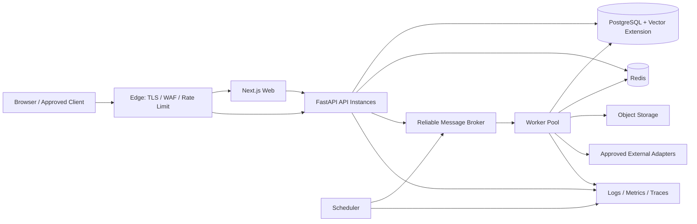
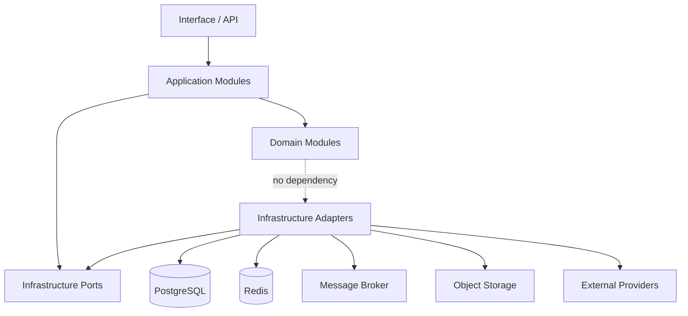
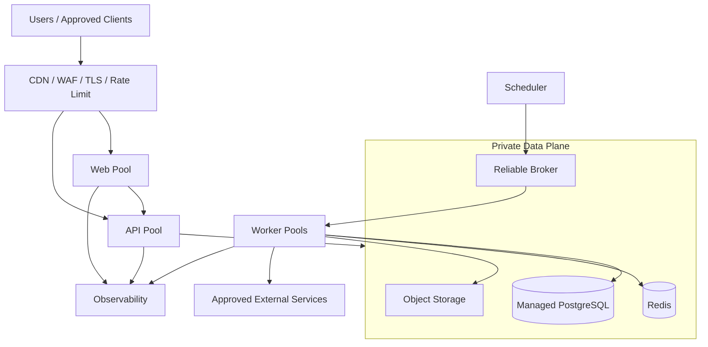
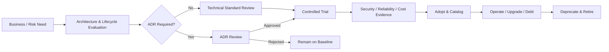

# AI 八字命理分析平台：技术架构

**文档编号：** 09  
**文档类型：** Technology Architecture  
**文档状态：** Review  
**当前版本：** 0.9  
**上游基线：** `01-PRODUCT-VISION.md`、`02-SRS.md`、`03-SYSTEM-ARCHITECTURE.md`、`04-DOMAIN-MODEL.md` 1.0、`05-DATA-MODEL.md` 1.0、`06-ROADMAP.md` 1.0、`07-APPLICATION-ARCHITECTURE.md` 1.0、`08-API-DESIGN.md` 1.0（均已 Approved）  
**目标读者：** CTO、技术与应用架构师、领域与数据负责人、安全与隐私负责人、研发、测试、平台工程、运维及发布治理人员

---

## Version 0.9 Change Log

- 首次定义平台技术栈、运行时、模块、分层与基础设施责任边界。
- 定义 Repository、数据访问、缓存、消息、搜索、对象存储与配置管理原则。
- 定义日志、指标、追踪、健康检查、安全、性能、扩展性与可靠性架构。
- 定义灾难恢复、CI/CD、部署、环境隔离、技术生命周期、ADR 和技术反模式。
- 本版本属于 Architecture Design，不包含代码、工程配置或实现授权。

---

## 1. Document Purpose

### 1.1 目标

本文档把前八份 Approved 基线转化为可评审的技术架构：明确哪些技术方向已经确定、哪些能力必须存在、各基础设施承担什么责任，以及技术选择、升级、替换和退役必须经过什么治理。

技术架构服务于“普通用户最好用”、确定性事实可复现、证据可追溯、AI 受约束、数据最小化和历史不可静默覆盖。技术复杂度不是产品目标。

### 1.2 适用范围

本文覆盖：

- Web、API、Worker 和计划任务的运行组织；
- 模块化单体内部的技术模块与依赖方向；
- PostgreSQL、Redis、消息、搜索、对象存储和外部适配器；
- 配置、Secret、日志、指标、追踪和健康检查；
- 安全基础设施、性能、扩展、可靠性和灾难恢复；
- CI/CD、部署、环境隔离和技术治理。

### 1.3 不包含内容

本文不包含：

- 业务代码、伪代码、SQL、ORM Mapping 或迁移脚本；
- API Endpoint、OpenAPI、DTO、Controller 或 SDK；
- Repository、Transaction Manager、Cache Client 或 Message Consumer 实现；
- 容器镜像文件、CI/CD 配置、基础设施即代码或云资源配置；
- 数据库表、索引、分区或物理 Schema 设计；
- Aggregate、Entity、Value Object、Domain Event、Data Model 或 API Contract 的修改；
- 具体命理算法、规则、Prompt 或模型供应商业务内容；
- 进入编码阶段的授权。

### 1.4 基线优先级

技术选型不能反向改变 Domain、Data、Application 或 API 语义。若某产品、框架或基础设施要求改变 Aggregate Boundary、Context Boundary、事务、一致性、Identity、Version、Immutable Rules 或 API Contract，只能登记为 `ADR Candidate` 或 `Open Question`。

### 1.5 已确认技术约束

| Area | Approved Direction | 本文约束 |
|---|---|---|
| Frontend | Next.js、TypeScript、响应式移动端优先 | 不因框架便利改变 API 或领域边界 |
| Backend | Python、FastAPI | 保持分层、模块自治和领域纯净 |
| Architecture Style | MVP 模块化单体，第一阶段不拆微服务 | API、Worker 可进程隔离，但共享兼容发布基线 |
| Transaction Source of Truth | PostgreSQL | 不成为无边界共享模型 |
| Vector Search | PostgreSQL 向量扩展优先 | 只做候选召回，不决定命理结论 |
| Cache / Short State | Redis | 不保存唯一正式事实 |
| Binary / Large Artifact | 对象存储 | 数据库保留授权、版本、哈希与生命周期元数据 |
| Runtime | 容器化、自动化交付 | 不在本文选择具体云或编排产品 |
| Operations | 结构化日志、指标、错误追踪、自动备份 | 默认不记录敏感正文 |

---

## 2. Technology Architecture Principles

### TAP-001 Business and Domain First

技术服务已批准业务用例与领域模型；框架、数据库和消息产品不能定义领域对象或业务规则。

### TAP-002 Modular Monolith First

MVP 采用一个后端应用基线与清晰模块边界。Web、API、Worker、Scheduler 可以独立运行和扩缩容，但不因此成为独立微服务。

### TAP-003 PostgreSQL as Transactional Source of Truth

正式领域状态、版本、幂等、可靠事件和审计索引以 PostgreSQL 为事务真相源。缓存、搜索、消息和对象存储不替代其权威语义。

### TAP-004 Ports and Adapters

领域与应用层依赖抽象能力；数据库、缓存、消息、模型、地点、对象存储和通知通过 Infrastructure Adapter 接入，供应商模型不进入核心层。

### TAP-005 Explicit Consistency

单 Aggregate、单 Context 使用本地事务；跨 Context、外部系统和长任务使用已批准 Event、Process Manager/Saga 与最终一致性。

### TAP-006 Immutable and Reproducible

技术组件必须保护 Valid、Completed、Frozen、Published 对象及版本链。部署、缓存和恢复不能把历史结果切换到“最新”版本。

### TAP-007 Secure and Private by Default

身份、出生信息、对话、报告和审计数据默认受限；加密、最小权限、用途限制、去标识化和最小日志从基础设施层落实。

### TAP-008 Observable by Design

每个重要请求、任务、事件和外部调用具有可关联的日志、指标和追踪；观察能力不得复制敏感业务正文。

### TAP-009 Failure Is Expected

外部 AI、地点、对象存储、Redis、消息和搜索都可能失败。系统通过超时、熔断、有限重试、隔离、降级和人工处理保持事实正确。

### TAP-010 Stateless Compute

API 和 Worker 尽量无状态。正式状态保存在受控数据层，进程重启和横向扩容不能丢失正式业务进度。

### TAP-011 Managed Complexity

优先使用团队能运营、能恢复、能审计的成熟能力。没有负载、组织、合规或 SLO 证据，不引入微服务、分库分表或独立搜索集群。

### TAP-012 Automated Quality Gates

依赖、测试、安全、许可证、制品、迁移兼容和发布证据通过自动化 Pipeline 检查；人工审批用于高风险决定，不替代自动验证。

### TAP-013 Vendor Isolation

外部供应商位于防腐层后，使用平台稳定语义、版本和错误模型。更换供应商不应改变领域事实或 API Contract。

### TAP-014 Recoverability

备份必须可恢复，恢复必须验证版本链、审计、对象引用、删除墓碑和权限，而不仅是服务能够启动。

### TAP-015 Governed Evolution

语言、框架、数据库、消息、搜索、部署和安全基础设施的重大变化走 ADR、兼容评估和回退计划。

---

## 3. Technology Stack Strategy

### 3.1 Selection Criteria

所有新增技术至少按以下维度评估：

| Criterion | Evaluation Question |
|---|---|
| Business Fit | 是否直接支持已批准用例、质量或风险目标 |
| Architecture Fit | 是否保持模块化单体、Context 和层次边界 |
| Correctness | 是否支持事务、幂等、不可变和版本复现 |
| Security / Privacy | 是否满足加密、最小权限、审计、驻留和删除要求 |
| Reliability | 是否有明确故障模式、备份、恢复和降级路径 |
| Operability | 团队是否能监控、升级、排障和演练 |
| Performance | 是否满足已批准容量基线且有实测证据 |
| Cost | 全生命周期成本是否与业务阶段匹配 |
| Portability | 是否有稳定标准、导出和替换路径 |
| Ecosystem | 维护活跃度、安全响应、文档和人才可用性 |
| License | 许可证、商业使用和供应链风险是否可接受 |
| Lifecycle | 是否有明确支持期、升级策略和退役计划 |

### 3.2 Programming Language Selection Principles

已批准方向：前端使用 TypeScript，后端使用 Python。该选择不得在本文重新打开；变化必须走 ADR。

- TypeScript 用于第一方 Web Interface 和受控前端类型安全，不承载服务器领域真相。
- Python 用于 FastAPI 后端、确定性计算编排、规则与 AI 基础能力；性能关键部分先以分析和基准定位，再决定优化方式。
- 同一业务规则不得在 TypeScript 与 Python 各实现一份正式版本。
- 新语言只有在现有语言无法经济满足可量化的性能、安全、合规或运行需求时评估。
- 语言版本固定在受支持范围，升级通过兼容、安全与回归门禁。

### 3.3 Framework Selection Principles

已批准方向：Web 使用 Next.js，API 使用 FastAPI。

- Framework 负责协议、生命周期、依赖装配和通用工程能力，不拥有领域规则。
- Domain Layer 不依赖 Web、HTTP、ORM、Cache、Queue 或供应商框架类型。
- Framework 扩展必须有明确 Owner、升级路径和替代方案。
- 不因插件便利引入跨 Context Repository、全局可变状态或隐式事务。
- 组件库、任务框架、ORM 和测试框架尚未由本基线指定，按选择标准评审。

### 3.4 Dependency Management

1. 直接与传递依赖必须锁定、可重建并纳入制品清单。
2. 依赖升级分为安全修复、兼容升级和 Breaking Upgrade，使用不同门禁。
3. 自动化扫描漏洞、恶意包、许可证和来源完整性。
4. 关键依赖设 Owner、支持版本和替代路径。
5. 禁止未评审依赖直接进入 Domain Layer。
6. 构建不得依赖未锁定的“最新”版本。
7. 已退役或无维护依赖进入技术债务清单并设期限。
8. 前端与后端依赖清单分开治理，但共享供应链政策。

### 3.5 Build and Artifact Strategy

- 每次发布产生不可变、可追溯、可验证来源的应用制品。
- 制品关联源版本、依赖清单、测试结果、安全扫描和构建环境身份。
- 同一已批准制品在环境间晋级，不在生产环境重新构建。
- Web、API、Worker 和 Scheduler 可以产生独立运行制品，但必须声明应用兼容版本。
- 规则、知识和 Prompt 发布制品与应用部署分离，分别走治理门禁。

### 3.6 Technology Decision Levels

| Level | Example | Governance |
|---|---|---|
| Baseline | Python、FastAPI、Next.js、PostgreSQL、Redis | 变更必须 ADR |
| Architecture Capability | Message Broker、Secret Manager、Log Aggregation | 产品选型前技术评审；重大变化 ADR |
| Implementation Library | ORM、HTTP Client、Test Library | 受标准与 Owner 评审；影响边界时升级为 ADR |
| Local Tool | Developer-only productivity tool | 不进入生产依赖时轻量审批 |

---

## 4. Runtime Architecture

### 4.1 Runtime Building Blocks

| Runtime | Responsibility | State Rule | Scaling Rule |
|---|---|---|---|
| Edge | TLS、WAF、基础 Rate Limit、静态分发和流量入口 | 不保存领域状态 | 按流量与安全需求扩展 |
| Web Runtime | Next.js 用户界面与第一方交互 | 不作为业务真相源 | 独立横向扩展 |
| API Runtime | FastAPI 同步 Command/Query、认证上下文和应用调用 | 尽量无状态 | 按请求、CPU、连接和时延扩展 |
| Worker Runtime | 异步 AI、Report、Rule、Timeline、Index、Deletion 等任务 | 进度持久化；本地内存可丢 | 按队列、成本与资源类型扩展 |
| Scheduler Runtime | 触发保留、清理、备份校验和周期治理意图 | 不直接绕过用例改数据 | 单一有效调度或幂等触发 |
| PostgreSQL | 正式事务状态、版本、幂等、事件和审计索引 | Source of Truth | 先纵向、连接与查询优化；分片需 ADR |
| Redis | Cache、Rate Limit、短期协调和可丢进度 | 非 Source of Truth | 独立容量与高可用评估 |
| Message Broker | 可靠任务和 Integration Event 传递 | 传递事实，不成为领域真相源 | 按积压、吞吐和隔离队列扩展 |
| Object Storage | PDF、导出、附件和大型冻结制品 | 内容受元数据与哈希约束 | 按容量和生命周期扩展 |
| Observability Platform | 日志、指标、追踪、告警和错误调查 | 不复制业务真相 | 按信号容量和保留扩展 |

### 4.2 Logical Runtime Flow

### 4.3 Process Isolation

- API 不同步等待长时间 AI、PDF、删除传播或大型索引任务。
- Worker 依任务特征分队列或执行池，防止高成本 AI 阻塞确定性任务。
- Scheduler 只发出受治理且幂等的应用意图，不直接执行数据库脚本替代业务流程。
- API 与 Worker 使用同一 Domain/Application 模块版本兼容矩阵。
- 单个 Worker 崩溃不能把未完成任务伪报为完成。

### 4.4 Service Discovery

MVP 模块化单体不需要业务微服务注册中心。Web、API、Worker 对 PostgreSQL、Redis、Broker、Object Storage 和外部 Adapter 使用运行平台提供的稳定服务端点或 DNS 发现。引入自建 Service Discovery 只有在真实多服务拓扑、跨区域或动态实例需求出现时考虑，并需 ADR。

### 4.5 External Dependency Boundary

AI、地点、通知、对象存储和未来模型供应商均通过 Adapter 接入。Adapter 负责认证、超时、错误映射、限流、去标识化、版本和观测，不负责创造领域事实。

---

## 5. Module Organization

### 5.1 Module Alignment

技术模块沿用 Approved Bounded Context，不重新定义：Identity、Consent、Birth、Calendar & Time、Chart Calculation、Rule Evaluation、Evidence、Knowledge、AI、Report、Timeline、Governance 和 Audit。

每个模块拥有自己的 Domain、Application、Infrastructure Adapter 和公开 Interface 入口。共享工程能力不拥有业务状态。

### 5.2 Module Boundary Rules

1. 模块只通过公开 Application Service、Command、Query、稳定 Snapshot 或 Event 协作。
2. 模块不导入其他 Context 的内部 Entity、Repository、ORM Model 或私有表结构。
3. 共享数据库实例不等于共享数据所有权。
4. 共享工具包仅包含无业务语义的横切能力。
5. 模块内部依赖方向保持 Interface → Application → Domain；Infrastructure 实现被内层通过 Port 使用。
6. Process Manager 属于 Application 协调，不成为跨模块 Domain Aggregate。
7. AnalysisProgress 属于只读 Projection，不回写任何源模块。

### 5.3 Shared Kernel Policy

Shared Kernel 仅允许极小、稳定且跨模块一致的技术或基础语义，例如通用 Identity 包装、时间基础类型、结果分类和追踪上下文。命理规则、权限决定、状态机、Entity、ORM Model 和业务枚举不得因“复用”进入共享包。

任何 Shared Kernel 扩大需模块 Owner 联合评审；若影响 Context 关系则走 ADR。

### 5.4 Internal Dependency Map

### 5.5 Source Repository Organization

基线只确认一个主要后端代码库方向，不在本文决定前端、后端和平台定义采用 Monorepo 还是 Polyrepo。无论仓库形态如何，都必须：

- 显式标示模块 Owner 与依赖规则；
- 阻止跨 Context 私有引用；
- 能独立运行模块边界测试；
- 让制品、版本与源提交可追踪；
- 不用物理目录替代架构治理。

仓库拓扑最终选择列为 Open Question；改变发布与所有权模型时需 ADR。

---

## 6. Layering Strategy

### 6.1 Layer Responsibilities

| Layer | Responsibility | May Depend On | Must Not Contain |
|---|---|---|---|
| Interface | HTTP、Web、Event 接入与协议适配 | Application Contract | 领域规则、Repository 实现、跨 Context 事务 |
| Application | 用例、授权、事务边界、幂等、Saga、结果 | Domain、Ports | 命理规则、供应商 SDK 语义 |
| Domain | Aggregate、Entity、Value Object、Domain Service/Event | 极小基础语言能力 | Framework、ORM、HTTP、Queue、Cache 类型 |
| Infrastructure | Repository/Cache/Message/Object/External Adapter | Ports、映射契约 | 业务决策、领域状态机替代实现 |
| Projection | Read Model 构建、搜索索引、统计投影 | Events、授权数据源 | 写回源 Aggregate、成为 Source of Truth |

### 6.2 Dependency Inversion

内层定义其需要的 Port，外层提供 Adapter。Domain/Application 不直接实例化数据库、Redis、Broker、Object Storage 或 AI Client。依赖注入只负责装配，不把 Service Locator 带入领域行为。

### 6.3 Boundary Mapping

ORM Record、Message Envelope、HTTP Representation、Search Document、Cache Entry 和供应商对象都在边界转换为平台稳定概念。映射失败返回明确技术/应用错误，不把不完整数据强制构造成 Valid 领域对象。

### 6.4 Cross-Cutting Concerns

认证上下文、授权、审计、事务、幂等、日志、指标、追踪和错误映射由一致的技术机制支持，但每个用例仍显式声明需要的政策；不得用全局中间件隐式替代业务授权或审计决定。

---

## 7. Infrastructure Layer

### 7.1 Responsibilities

Infrastructure Layer 提供：

- Repository 与 Unit of Work Adapter；
- Transaction Manager；
- Cache、Rate Limit 和短期协调 Adapter；
- Message Producer/Consumer、Outbox/Inbox 与任务调度 Adapter；
- Search/Vector、Object Storage 和文件检查 Adapter；
- AI、地点、通知和身份供应商 Adapter；
- Configuration、Secret、Clock、Identity Generation 和 Observability Adapter。

### 7.2 Prohibited Responsibilities

Infrastructure 不得：

- 判断旺衰、格局、用神或其他命理规则；
- 决定 Aggregate 合法状态转换；
- 通过数据库触发器或缓存脚本隐藏实现业务流程；
- 自动切换正式 Algorithm、Rule、Knowledge、Prompt 或 Model Version；
- 绕过 Application Authorization；
- 把供应商成功当作正式 AIAnalysis 或 Report 完成；
- 直接修改其他 Context 的数据。

### 7.3 Adapter Reliability Contract

每个 Adapter 明确：超时、重试资格、幂等、错误分类、容量限制、数据分类、审计、指标、健康和降级行为。未知供应商错误映射为安全的平台错误，不透传内部敏感信息。

### 7.4 Infrastructure Port Versioning

Port 是模块内部技术契约，不等同公共 API。Breaking Port 变化仍需影响分析、调用方迁移和版本兼容；若影响 Application/API Contract 或 Context 关系，必须走 ADR。

---

## 8. Repository Architecture

### 8.1 Repository Pattern

Repository 以 Approved Aggregate Root 与 Context 为边界，提供加载和持久化领域对象所需的最小能力。已有正式 Repository 名称继续沿用 Domain Model，例如 UserRepository、ChartRepository、RuleRepository、EvidenceRepository、ReportRepository 和 KnowledgeRepository。

### 8.2 Repository Rules

1. 每个 Repository 由所属 Context 拥有。
2. 仅通过 Aggregate Root Identity 定位写模型。
3. 不为每张表机械创建公共 Repository。
4. 不返回 ORM Query、数据库连接或可变内部 Entity 给上层。
5. 不跨 Context Join 后构造可写 Aggregate。
6. 复杂读取使用专用 Query/Projection，不膨胀写 Repository。
7. Repository 不决定授权、业务状态或命理规则。
8. Repository 持久化失败不能把内存对象伪报为已提交。

### 8.3 Aggregate Loading

- 写用例加载完成当前领域行为所需的一致性边界，不依赖隐式 Lazy Load 跨越事务。
- Immutable Snapshot 可通过专用只读 Port 访问，但不得被 ORM Change Tracking 修改。
- 跨 Context 只使用公开 Snapshot/Projection 或 Event，不调用对方 Repository。
- 大集合不随 Aggregate 无界加载；遵循 Aggregate 与 Data Model 已批准边界。

### 8.4 Unit of Work

Unit of Work 管理一个用例内的单 Context、通常单 Aggregate 本地事务，以及必要的幂等、Outbox 与最小审计写入。它不提供跨数据库或跨 Context 分布式原子性。

### 8.5 Read Repository / Query Adapter

Read Model 使用独立 Query Adapter，可按访问模式优化和组合已授权 Projection。Read Adapter 不成为 Domain Repository，也不允许 Query 触发 Command 或修复源数据。

---

## 9. Database Access Principles

### 9.1 PostgreSQL Boundary

PostgreSQL 是 MVP 事务真相源，承载 Approved Data Model 映射、版本、幂等、可靠事件、审计索引和初期向量检索。单实例方向不允许模块任意访问彼此数据。

### 9.2 Logical Ownership

- 每个 Context 拥有明确的数据访问命名空间、权限与迁移 Owner。
- 应用数据库身份按最小权限分离运行、迁移、只读、审计和运维能力。
- 跨 Context 报表通过授权 Projection 构建，不授予任意全库 Join 权限。
- 审计数据采用独立权限域；最终物理隔离方案待 ADR。

### 9.3 ORM Strategy

ORM 可用于减少常规映射和持久化样板，但只属于 Infrastructure Adapter。

- Domain Object 不继承 ORM 基类、不暴露 Session/Query 类型。
- 映射显式保护 Identity、Version、Immutable 和并发字段。
- 禁止隐式跨 Context关系和无界 Lazy Loading。
- 批量、搜索和高性能读取可以使用受控专用查询 Adapter，不强迫所有访问通过通用 ORM。
- ORM 不能自动创建或修改生产 Schema；迁移必须独立受控。
- 具体 ORM 产品尚未批准，按依赖、异步支持、迁移生态、性能和可测试性评审。

### 9.4 Transaction Manager

Transaction Manager 由 Application Use Case 明确开始和结束，遵循：

1. 一个事务原则上只修改一个 Aggregate。
2. 事务不跨 Bounded Context 和外部供应商。
3. AI、Object Storage 和 Message Broker 网络等待不持有数据库事务。
4. Domain Event 在提交后发布；可靠 Outbox 与业务提交保持一致。
5. 高风险操作的最小 Audit/Outbox 记录与业务提交具备可靠一致性。
6. 冲突和并发失败返回应用/API 已批准错误语义。

### 9.5 Connection Management

- API 与 Worker 分别设置连接预算，避免总连接数随实例数无界增长。
- 使用受控连接池、超时和泄漏监测。
- 长事务、空闲事务和未索引慢查询进入告警。
- Read Replica 仅用于允许最终一致的 Query；不得用于需要最新授权、Consent 或写前校验。

### 9.6 Schema Evolution Principles

- 迁移采用 Expand–Migrate–Contract 等向前兼容阶段。
- 新旧应用实例在滚动部署窗口内必须兼容。
- 删除/重命名数据结构前完成读取迁移、使用观测和回退评估。
- 生产迁移具有演练、备份、时间预算、锁风险和回退/前滚方案。
- 迁移不得修改 Frozen/Immutable 历史语义。

### 9.7 Data Integrity

数据库约束用于保护 Approved Data Model 的 Identity、唯一性、引用和不可变事实，但不把完整领域规则复制为不可治理的触发器。任何数据库级规则变化须与 Data Model Owner 评审。

---

## 10. Cache Architecture

### 10.1 Cache Roles

Redis 可承担：短期 Cache、分布式 Rate Limit、短期会话/撤销辅助、任务协调、短锁和可丢进度通知。Redis 丢失不能造成正式命盘、规则结果、报告或审计永久丢失。

### 10.2 Cacheable Data

| Cache Category | Key Requirements | Privacy Rule | Invalidation |
|---|---|---|---|
| Deterministic Calculation Fragment | Input Hash + Algorithm/Parameter Version | 不含直接身份 | 版本变化自然失效 |
| Published Terminology/Knowledge Projection | Article/Index Version + Locale | 仅已发布且授权内容 | 发布/撤下事件 |
| Frozen Report Projection | User/Tenant + ReportId + Version + Authorization View | 绝不跨主体共享私人文案 | 删除、权限/分享撤销、归档策略 |
| Timeline On-Demand Result | SnapshotId + Horizon + Rule/Evidence Version | 按 Chart Ownership 隔离 | 上游版本不变时稳定 |
| Authorization Auxiliary | Subject/Session/Policy Version | 短 TTL；Source of Truth 重验 | 撤销主动失效 + TTL |
| Read Model Fragment | Projection Version + Query Signature | 字段遮蔽视图进入 Key | Projection 更新或短 TTL |

### 10.3 Cache Key Rules

Cache Key 必须包含适用的 Context、Resource Identity、Tenant/Subject、业务版本、Locale、授权视图和 Schema Version。不得把姓名、出生信息、对话正文或 Secret 直接放入 Key。

### 10.4 Cache Consistency

- Cache-Aside 为默认候选模式；写成功后失效或更新由所属模块负责。
- 缓存命中后仍执行必要授权，不以“能读 Key”作为权限。
- Consent/权限撤销采用主动失效与短 TTL 双重保护。
- 不承诺所有 Cache 与事务同步；正式写入读取 Source of Truth。
- Cache Stampede 使用请求合并、随机 TTL 或受控锁缓解，不引入业务唯一性。

### 10.5 Cache Failure

Redis 不可用时：正式数据继续从 PostgreSQL 读取；缓存视为 Miss；限流采用保守策略；短期进度可降级；任务协调按 Broker/数据库可靠状态恢复。不得绕过额度、授权或创建无保护重复任务。

---

## 11. Messaging Architecture

### 11.1 Message Broker Role

Broker 用于异步任务、Integration Event、削峰和长流程协调。具体采用 Redis 能力还是独立托管队列尚未确认，保留为 ADR Candidate。

### 11.2 Delivery Semantics

- 基线为至少一次传递 + 业务幂等，不承诺 Exactly Once。
- 每条 Message 具有 MessageId/EventId、Contract Version、CorrelationId、CausationId、OccurredAt、Producer 和最小 Context。
- Consumer 使用 Inbox/处理记录识别重复。
- 顺序只在明确资源/分区范围内保证，不假设全局顺序。
- Message 过期、乱序和版本不支持有明确处置。

### 11.3 Outbox / Inbox

业务事务内写入可靠 Outbox；提交后由独立 Publisher 传递。Consumer 在处理业务前检查 Inbox/幂等状态，并将业务提交与消费结果可靠关联。Outbox/Inbox 是技术可靠性模式，不改变 Domain Event 事实或 Data Model 语义。

### 11.4 Queue Isolation

按故障和资源特征至少逻辑区分：

- 确定性计算与规则任务；
- AI 高成本任务；
- Report/PDF/Object 任务；
- Search/Vector Indexing；
- Data Rights/Deletion；
- Notification/Webhook；
- Audit/治理关键投影。

队列隔离不等于拆分微服务，也不改变 Context Ownership。

### 11.5 Retry and Dead Letter

- Retry 只针对 Retryable Failure，保持原业务意图与 IdempotencyKey。
- 使用有限指数退避、抖动、最大尝试和总时间预算。
- Non-Retryable、版本不兼容、Consent/Authorization 失败不自动重试。
- 超过预算进入 Dead Letter/Manual Review；不得无限循环。
- Dead Letter 重放需要重新验证权限、Consent、版本和业务状态，并完整审计。

### 11.6 Broker Selection Criteria

| Capability | Requirement |
|---|---|
| Durability | 已受理任务在单进程故障后可恢复 |
| Visibility / Ack | 支持处理超时、重新交付和明确确认 |
| Delay / Retry | 支持受控延迟或由调度层可靠实现 |
| Isolation | 队列、优先级或资源池隔离 |
| DLQ | 可调查、可授权重放 |
| Observability | 积压、年龄、吞吐、失败和重试指标 |
| Security | 加密、最小权限、网络隔离和审计 |
| Operations | 备份/恢复或托管可用性符合目标 |
| Cost | 与 MVP 规模和团队运维能力匹配 |

### 11.7 Event Contract Governance

内部 Integration Event 和 V2 外部 Event API 使用不同 Surface 与契约。Broker Envelope 不泄漏 Aggregate 内部 Entity 或数据库变更日志。Event Contract 变化遵循 `08-API-DESIGN.md` 兼容和 ADR 规则。

---

## 12. Search Architecture

### 12.1 Initial Strategy

MVP 优先使用 PostgreSQL 的结构化查询、全文检索能力和已批准的向量扩展。第一阶段不因预期规模引入独立 Search Engine。

### 12.2 Search Responsibilities

| Search Type | Source | Result Role | Prohibited Role |
|---|---|---|---|
| Structured Search | PostgreSQL Approved Projection | 过滤、排序和管理查询 | 绕过授权直接跨 Context Join |
| Full-Text Search | 已批准 Knowledge/Read Projection | 关键词候选召回 | 返回受限全文 |
| Vector Search | Published Knowledge Chunks + Version | 语义候选召回 | 决定命理结论或 Evidence 真伪 |
| Audit Search | Audit Projection/Index | 受控调查 | 普通运营批量浏览敏感数据 |

### 12.3 Indexing Pipeline

索引是可重建 Projection。只对 Published、权利有效、语言和范围明确的 Knowledge 内容生成索引；索引记录源 Article/Chunk Identity、Knowledge Version、Embedding Model/Index Version 和权利状态。

### 12.4 Search Consistency

- Source of Truth 更新后索引最终一致，并暴露 Lagging/Rebuilding/Unavailable。
- Rights Withdrawal 和删除优先停止新召回，再执行重建/清理。
- Search 不可用时使用结构化已验证材料或停止增强，不生成虚假引用。
- 搜索结果必须再次经过状态、权限、语言、流派和用途过滤。

### 12.5 Independent Search Engine Trigger

只有出现经测量的规模、复杂查询、SLO、索引重建隔离或运维需求，且 PostgreSQL 无法经济满足时，才评估独立 Search Engine。迁移需 ADR、双读/验证计划、回退和删除一致性设计。

---

## 13. File Storage Strategy

### 13.1 Object Storage Scope

对象存储用于 V1 PDF、用户导出、合法知识附件、较大 Frozen Artifact 和受控上传制品。普通结构化领域状态仍在 PostgreSQL。

### 13.2 Object Metadata

数据库保存 Object Identity、Owner/Subject、Purpose、Content Hash、Media Type、Size、Version、Encryption/Retention Class、Lifecycle Status、Legal Hold 和 Source Resource Reference。对象存储路径不作为业务 Identity。

### 13.3 Access Rules

- 私有对象默认不可公开。
- 下载先经服务端授权，可使用短期、最小权限的签名访问能力。
- 不可猜 URL 不是授权机制。
- Object Key 不包含姓名、出生日期、报告标题或其他敏感内容。
- 分享、导出和管理员访问使用不同 Purpose 与审计。

### 13.4 Integrity and Immutability

Frozen Artifact 记录内容 Hash 和版本，上传完成后验证完整性。重新生成创建新 Object/Report 版本，不覆盖旧 Frozen 内容。对象版本保护不能阻止合法删除流程，二者需按 Retention/Legal Hold 协调。

### 13.5 Upload Security

若 V1/V2 开放文件上传，必须限制类型、大小、数量和来源；执行恶意内容检查、隔离和安全渲染。未完成检查的对象不能进入 Knowledge、Report 或公开下载流程。

### 13.6 Lifecycle and Deletion

对象生命周期按数据保留类别配置。删除 Saga 覆盖活动对象、历史版本、临时制品和失败上传；Legal Hold 与备份到期按已批准规则处理。对象删除失败保持处理中并进入人工处置，不伪报完成。

---

## 14. Configuration Management

### 14.1 Configuration Classes

| Class | Examples | Governance |
|---|---|---|
| Static Runtime Config | 端点、超时上限、功能连接方式 | 环境化、版本化、随部署验证 |
| Dynamic Operational Config | Rate Limit、非业务阈值、告警路由 | 权限、审计、范围和回滚 |
| Feature Flag | 受控开放、降级开关 | Owner、期限、目标人群、清理计划 |
| Business Version Config | Algorithm、Rule、Knowledge、Prompt、Model Route | 不属于普通配置；走 Governance 发布与不可变版本 |
| Secret | Credential、Key、Certificate | 只进入 Secret Management，不进入普通配置 |

### 14.2 Configuration Principles

1. 配置与代码分离，但配置变化仍受版本和审计。
2. 不在代码中硬编码环境端点、Secret、保留期或风险阈值。
3. 默认值必须安全；缺少关键配置时启动失败或关闭相关能力。
4. 启动时校验类型、范围、依赖和环境一致性。
5. 动态配置变化有 Owner、审批、传播状态和回滚。
6. Algorithm/Rule/Prompt 等业务版本不能用普通 Feature Flag 绕过发布。

### 14.3 Configuration Center

第一阶段可以使用环境隔离的受控配置存储与部署平台能力；是否引入专用 Configuration Center 取决于动态配置数量、传播 SLO、多环境规模和审计需求。引入或替换 Configuration Center 需技术评审；改变信任或发布边界时需 ADR。

### 14.4 Feature Flag Governance

- Flag 默认有 Owner、创建原因、目标范围、到期时间和删除计划。
- Flag 不绕过 Authorization、Consent、Risk Check 或 Immutable Rules。
- 同一 Flag 在不同环境独立配置。
- Flag 组合数量受控，避免形成不可测试产品版本。
- GA 后临时 Flag 应按期限清理或转为正式配置。

---

## 15. Secrets Management

### 15.1 Secret Scope

包括数据库凭据、API Credential、AI/地点/通知供应商 Key、对象存储访问材料、Webhook 签名材料、证书私钥和加密主密钥引用。

### 15.2 Secret Rules

- Secret 不进入源码、普通配置、数据库普通字段、镜像、日志、报告或工单正文。
- 使用受控 Secret Management 能力按工作负载身份授予最小访问。
- 不同环境、供应商项目和用途使用独立 Secret。
- Secret 在运行时按需获取或安全注入，不由开发者共享复制。
- 支持创建、轮换、撤销、过期、访问审计和应急封禁。
- 应用错误只显示 Secret Reference/状态，不显示原值。

### 15.3 Rotation

轮换需支持受控重叠、依赖方健康验证和失败回退。高风险 Secret 设定最大寿命；撤销传播 SLO 待安全评审。轮换本身是审计事件。

### 15.4 Encryption Key Management

数据加密使用独立 Key Management 边界。Key 与数据访问权限分离；轮换和恢复不能让历史合法数据不可读，也不能使已删除数据重新可用。具体算法、层级和字段加密范围由安全设计确认。

### 15.5 Break-Glass

紧急访问使用独立 Break-Glass 流程，要求强认证、最小时间、明确理由、实时告警和事后复核。不得成为常规运维路径。

---

## 16. Logging Strategy

### 16.1 Structured Logging

所有 Runtime 输出结构化日志，使用统一时间、Level、Service/Module、Environment、Release、RequestId、CorrelationId、TraceId、Operation/Resource Reference、Event Type、Result 和 Safe Error Code。

### 16.2 Log Categories

| Category | Purpose | Retention / Access Principle |
|---|---|---|
| Access Log | 请求、状态、时延、大小和 Client 类别 | 最小化 URI 参数；限制访问 |
| Application Log | 用例阶段、结果和安全错误 | 不记录领域敏感正文 |
| Worker Log | Task、Attempt、Queue、时长和终态 | 关联 Operation，不复制 Payload |
| Security Log | 认证异常、越权、滥用和 Secret 事件 | 更严格访问和告警 |
| Audit Log | 法定/业务关键行为 | 独立防篡改与权限；不是普通调试日志 |
| Dependency Log | AI、地点、存储、Broker 等调用结果 | 只记录供应商请求引用和安全摘要 |

### 16.3 Prohibited Log Data

默认禁止记录：密码、Token、API Key、Cookie、Secret、完整 BirthInput、详细地址、姓名/联系方式、Conversation 正文、完整 Report、Prompt、模型原始上下文/输出、签名 URL、数据库连接串和未遮蔽文件内容。

### 16.4 Log Aggregation

日志集中聚合、可按关联 ID 查询，并按环境、模块和敏感级别隔离。生产日志访问需要最小角色与 Purpose；批量导出受审计。具体平台产品待选型。

### 16.5 Sampling and Redaction

- 错误与安全日志不因采样丢失关键事件。
- 高频成功日志可按可解释策略采样，但 Metrics 保留总量。
- Redaction 在日志产生端优先执行，聚合端再次防护。
- Redaction 规则有自动测试和变更审计。

### 16.6 Retention

日志、Audit 和 Trace 使用不同保留策略。具体期限由法律、安全、隐私和运行需求确认，不硬编码在应用。删除与 Legal Hold 必须覆盖相应可识别日志引用。

---

## 17. Monitoring & Observability

### 17.1 Observability Model

平台同时观察：用户旅程、领域质量、应用流程、基础设施、安全、隐私和成本。单纯 CPU/内存正常不能证明产品可用。

### 17.2 Metrics

| Domain | Required Metrics |
|---|---|
| User Journey | 首次排盘完成率、三分钟完成率、首屏到达、失败步骤 |
| API | 请求量、P50/P95/P99、状态/错误码、限流、Payload 大小 |
| Calculation | 时延、成功、验证阻断、算法版本和黄金差异 |
| Rule / Evidence | 执行时延、冲突、完整性、引用存在率和支持度失败 |
| AI | Queue/模型时延、结构/事实/引用/风险失败、Retry、Token 与成本 |
| Report / Timeline | 生成/冻结成功、队列时间、长度、打印/PDF 和投影延迟 |
| Messaging | Queue Depth、Oldest Age、吞吐、Retry、DLQ、Consumer Lag |
| PostgreSQL | 连接、事务、锁、慢查询、复制延迟、存储和备份 |
| Redis | 命中率、内存、驱逐、延迟、错误和限流状态 |
| Search | 召回时延、零结果、索引 Lag、重建、权利过滤 |
| Object Storage | 上传/下载、完整性、容量、生命周期和删除失败 |
| Privacy | 导出/删除时长、部分失败、Consent 撤回、保留积压 |
| Security | 登录异常、越权、Credential、WAF、敏感访问和处置 |
| Cost | AI、存储、数据库、流量和有效结果单位成本 |

### 17.3 Service Level Indicators

SLI 以用户可观察结果为基础，至少覆盖可用性、时延、正确完成率、队列延迟和数据完整性。AI 供应商失败与整个排盘不可用分开衡量，避免掩盖确定性核心能力。

### 17.4 Alerting

- 告警按用户影响、数据正确性、安全、隐私和成本分级。
- Critical：四柱交叉验证关键差异、审计关键写入失败、越权、删除传播严重失败、备份不可恢复。
- 告警有 Owner、Runbook、升级路径、抑制和恢复条件。
- 避免对每个单次错误告警；使用速率、持续时间和错误预算。
- 关闭告警必须记录依据，不等于解决根因。

### 17.5 Dashboards

至少提供：业务旅程、API、Calculation、AI/Cost、Report、Queue、Data Store、Security/Privacy、Deployment 和 DR Dashboard。Dashboard 不向无权角色展示敏感 Identity 或正文。

---

## 18. Distributed Tracing

### 18.1 Trace Context

使用标准兼容的 Trace Context；OpenTelemetry-compatible 作为可移植方向，不在本文绑定具体 Backend。RequestId、CorrelationId、TraceId、CausationId、IdempotencyKey 和 Domain Identity 分离。

### 18.2 Span Boundaries

关键 Span 包括：Edge、API Handler、Application Use Case、Repository/Transaction、Broker Publish/Consume、Worker Step、External Adapter、Search、Object Storage 和 Projection。Domain 规则可产生安全指标/事件，但不把每个敏感事实写入 Span。

### 18.3 Propagation

- HTTP、Message 和内部任务传播受验证的 Trace Context。
- 外部 Client 提供的 Trace 不携带授权，平台可重建或限制。
- Async Producer 与 Consumer 通过 Link/Parent 关联，不伪造同步调用链。
- 第三方供应商 Trace ID 与平台 Identity 隔离，仅保存安全映射引用。

### 18.4 Sampling

采样按环境、错误、时延、风险和成本配置。安全/隐私事件不依赖 Trace 作为唯一记录；Audit 不受普通 Trace 采样影响。敏感属性在采样前即被过滤。

### 18.5 Trace Retention and Access

Trace 保留短于正式 Audit 的默认方向，具体期限待评审。访问生产 Trace 需要受控角色；禁止把完整 Request/Response、Prompt 或 BirthInput 作为 Span Attribute。

---

## 19. Health Check Strategy

### 19.1 Health Types

| Check | Question | Failure Effect |
|---|---|---|
| Startup | 必要配置、Secret Reference、Schema 兼容和依赖客户端能否初始化 | 阻止实例接收流量 |
| Liveness | 进程是否死锁或无法继续工作 | 允许运行平台重启实例 |
| Readiness | 当前实例能否安全处理其承诺流量 | 从流量/消费池移除，不必重启 |
| Dependency Health | PostgreSQL、Redis、Broker、Object、AI 等状态如何 | 驱动降级和告警，不都绑定 Liveness |
| Business Synthetic | 关键旅程是否端到端可用 | 触发服务级告警，不修改正式数据 |

### 19.2 Dependency Classification

| Dependency | API Readiness Impact | Degradation |
|---|---|---|
| PostgreSQL Primary | 正式写入与多数读取不可用时 Not Ready | 拒绝新正式任务，展示静态状态 |
| Redis | 不直接判定核心数据不可用 | Cache Miss、保守 Rate Limit、禁用非关键进度 |
| Broker | 异步受理能力受影响 | 不返回虚假 202；同步只读仍可用 |
| AI Provider | 不影响确定性排盘 Readiness | AI 排队、降级或明确失败 |
| Search/Vector | 不影响已保存正式资产 | 停止知识增强或使用结构化材料 |
| Object Storage | 不影响在线确定性结果 | PDF/导出延迟；不公开降级存储 |
| Observability Backend | 不自动让低风险读取不可用 | 缓冲/降级；高风险审计失败按门禁阻断 |

### 19.3 Health Endpoint Security

公开健康结果只显示必要状态，不暴露版本漏洞、内网地址、Secret、数据库名称或供应商细节。详细诊断仅供受控运行身份。

### 19.4 Synthetic Checks

使用合成数据验证匿名入口、确定性 Calculation、已知 Report 读取、Queue 循环和授权拒绝。Synthetic 数据明确标记，不进入真实指标、研究数据或用户报告。

---

## 20. Security Infrastructure

### 20.1 Defense Layers

| Layer | Capability |
|---|---|
| Edge | TLS、WAF、DDoS/滥用保护、基础 Rate Limit、请求大小限制 |
| Identity | 用户会话、Developer Credential、Workload Identity、MFA/再认证 |
| Authorization | RBAC、Scope、Ownership、Tenant、Purpose、Consent、临时授权 |
| Network | 环境隔离、私有数据端点、最小入站/出站、Egress 控制 |
| Application | 输入验证、输出安全、CSRF/CORS、Idempotency、风险检查 |
| Data | 传输/存储加密、字段保护、备份权限、删除与 Legal Hold |
| Supply Chain | 依赖、镜像、SBOM、签名、漏洞和许可证扫描 |
| Operations | Secret、审计、告警、Break-Glass、事件响应 |

### 20.2 Rate Limiting Infrastructure

Edge 负责粗粒度 IP/Client 防护，Application/Redis 层负责按 User、Tenant、Credential、Endpoint、Cost 和业务额度的细粒度限制。Rate Limit 状态丢失时采用保守降级，不默认无限开放。

### 20.3 Network Segmentation

- 公网只暴露 Edge 与批准入口。
- PostgreSQL、Redis、Broker、Secret 和内部 Observability 使用私有网络边界。
- Worker 仅获得任务所需的外部 Egress。
- AI/地点/通知目标采用 Allowlist 或受控代理方向，防止任意外联。
- 环境间无默认网络互通。

### 20.4 Encryption

所有敏感传输使用安全加密通道；存储、备份和对象使用受控加密。密钥独立管理，应用身份只获最小使用权限。具体协议和算法由安全基线确认并随行业标准升级。

### 20.5 Supply Chain Security

- 构建环境隔离、最小权限、短期凭据。
- 依赖和镜像生成 SBOM 并做漏洞/来源扫描。
- 发布制品签名或使用等价完整性证明。
- 阻断 Critical 漏洞的例外必须有风险接受、期限和补救计划。
- 第三方 Action/Plugin/构建组件固定可信版本并最小授权。

### 20.6 Security Event Response

安全基础设施统一输出事件到受控监控/审计，定义发现、分级、隔离、Credential 撤销、取证、通知、恢复和复盘。事件响应不得破坏业务 Audit 或静默删除证据。

### 20.7 Plugin Boundary

MVP/V1 不执行第三方动态代码，不建设公共插件市场。第二个真实术数模块出现前只保留内部契约；任何动态执行、沙箱或 Marketplace 设计需独立安全架构和 ADR。

---

## 21. Performance Strategy

### 21.1 Approved Initial Baseline

以下继承 System Architecture，作为压测基线而非对外承诺：

| Workload | Initial Target |
|---|---|
| Deterministic Calculation | P95 ≤ 2 秒 |
| Common API | P95 ≤ 500 毫秒 |
| AI First Valid Response | P95 目标 ≤ 15 秒 |
| Complete AI Report | P95 目标 ≤ 60 秒 |
| Concurrent Interactive Requests | 100 |
| Concurrent AI Tasks | 20 |
| Sustained Throughput | 10 requests/second |
| Online Report Body | ≤ 30,000 Unicode 字符 |
| AI Conversation Answer | ≤ 8,000 Unicode 字符 |

### 21.2 Performance Budget

请求预算按 Edge、Web、API、Application、Database/Cache 和 External Dependency 分解。地点解析与 Calculation 分阶段；AI/Report 使用异步 Operation；单个外部依赖不得消耗全部用户时延预算。

### 21.3 Database Performance

- 按 Approved Query/访问模式设计索引，不为所有字段盲目建索引。
- 监控慢查询、锁、连接、行扫描和计划回归。
- 避免 N+1、无界 Join 和无分页集合。
- Read Replica 只服务允许最终一致的读取。
- 分区、分库和分片必须由数据规模与 SLO 证据触发并走 ADR。

### 21.4 Compute Performance

- 确定性算法保持纯输入+锁定版本可复现，便于安全缓存与基准。
- CPU 密集任务与 I/O 任务使用不同 Worker Pool/并发预算。
- AI 上下文先最小化和结构化，不通过跳过事实/引用/风险校验降时延。
- Timeline 按需分页，不预生成无界流日/流时。

### 21.5 Frontend Performance

Next.js 页面以普通用户首次旅程为核心，控制 JavaScript、图片、字体和第三方脚本预算。敏感页面不依赖公共缓存；流式进度不能暗示任务已完成。

### 21.6 Performance Testing

每个 Milestone 按风险执行基准、负载、压力、峰值、耐久和降级测试。使用合成/去标识化数据，覆盖 Cache Cold、Provider Slow、Queue Backlog、Database Failover 和 Rolling Deployment。

---

## 22. Scalability Strategy

### 22.1 Scaling Order

1. 测量和消除明显查询/算法/网络浪费；
2. 缓存安全的确定性或 Published/Frozen 投影；
3. API/Worker 水平扩展并隔离队列；
4. 优化 PostgreSQL 连接、索引、容量和只读负载；
5. 按真实瓶颈拆分进程资源池；
6. 只有达到已批准触发条件才拆服务、独立搜索或数据分片。

### 22.2 Horizontal Scaling

- Web/API 无状态，可跨多个实例分发。
- Worker 按 Queue Depth、Oldest Age、CPU、外部配额和成本扩展。
- Scheduler 通过 Leader/Lease 或幂等触发避免重复业务结果；具体机制待选型。
- Session 与正式 Operation 不依赖单实例内存粘性。
- 扩容必须同时遵守 PostgreSQL 连接、Redis、Broker 和供应商并发预算。

### 22.3 Scaling by Workload

| Workload | Scaling Unit | Isolation |
|---|---|---|
| API Query/Command | API Instance | 按请求和连接预算 |
| Calculation/Rule | CPU Worker | 与 AI I/O Worker 分离 |
| AIAnalysis | AI Worker + Provider Quota | 按模型、成本、风险等级隔离 |
| Report/PDF | Rendering Worker | 限制内存、CPU 和对象上传 |
| Search Index | Index Worker | 低优先级或独立窗口 |
| Deletion/Data Rights | Durable Workflow Worker | 高可靠、低并发、强审计 |

### 22.4 Microservice Evolution

仅当负载、团队、合规、故障隔离或 SLO 有量化证据，并批准 ADR 时，从模块化单体拆分。推荐评估顺序继承基线：AI Generation Worker、Report Rendering、Developer API Gateway、Knowledge Indexing、Calculation Service。拆分不得改变 Domain/API Contract。

### 22.5 Multi-Region

首阶段不默认建设多区域 Active-Active。数据驻留、RTO、用户分布和供应商限制形成真实需求后再评估。跨区域一致性、Identity、删除、审计和成本变化必须走 ADR 与法律评审。

---

## 23. Reliability Strategy

### 23.1 Reliability Patterns

| Pattern | Use | Guardrail |
|---|---|---|
| Timeout | 所有网络和外部依赖 | 分连接/响应/总预算；不无限等待 |
| Retry | 暂时性且幂等的失败 | 有限、退避、抖动、保持同一业务意图 |
| Circuit Breaker | AI、地点、通知、对象存储等不稳定依赖 | Open 状态有降级，不隐藏数据错误 |
| Bulkhead | 队列、连接池、Worker 和供应商配额 | 防单能力耗尽全平台资源 |
| Rate Limit | 防滥用、容量与成本 | Edge 粗粒度 + Application 细粒度 |
| Idempotency | Command、Message、Webhook | Key/MessageId 与结果复用 |
| Outbox/Inbox | 事务与消息可靠衔接 | 不宣称 Exactly Once |
| Graceful Degradation | 非关键依赖失败 | 不编造事实、不绕过安全检查 |
| Backpressure | Queue/API 过载 | 202、429、Retry-After 或拒绝新高成本任务 |

### 23.2 Retry Strategy

重试资格由错误分类与用例决定：Validation、Authorization、Consent、Immutable Conflict 不自动重试；Timeout、Transient Dependency 和可恢复网络错误可有限重试。数据库事务重试需重新加载状态并防止重复副作用。

### 23.3 Circuit Breaker

每个外部依赖独立 Circuit，按错误率、时延和最小样本打开；Half-Open 使用少量探测。Circuit 状态产生指标和告警。AI Circuit 打开不能让平台用模板冒充完成；Redis Circuit 打开不能绕过 Rate Limit/Quota。

### 23.4 Graceful Shutdown

实例停止接收新流量/任务，完成或安全释放正在处理的事务；未确认 Message 返回 Broker 重投；长任务的正式进度已持久化。部署超时不得强行标记业务完成。

### 23.5 Failure Degradation Matrix

| Failure | Still Available | Degradation | Forbidden |
|---|---|---|---|
| AI All Down | 输入、排盘、已存报告、规则摘要 | 排队、规则型受限结果或明确失败 | 模板冒充 AI 完成 |
| Location Down | 已存命盘、直接四柱输入 | 本地受控数据或稍后重试 | 猜测地点/时区 |
| Vector Search Down | 排盘、规则、已存报告 | 结构化材料或停止增强 | 虚构引用 |
| Redis Down | PostgreSQL 正式资产 | Cache Miss、保守限制 | 丢状态或无限开放 |
| Object Storage Down | 在线排盘/报告 | PDF/导出延迟 | 公开不安全存储 |
| Broker Down | 同步安全读取 | 拒绝无法可靠受理的 202 | 易失内存假受理 |
| Audit Critical Write Down | 低风险读取 | 阻断高风险治理/敏感访问 | 无审计发布/访问 |
| PostgreSQL Primary Down | 静态状态页 | Failover/恢复 | 接受无法保存的正式任务 |

---

## 24. Disaster Recovery

### 24.1 DR Objectives

RPO、RTO、数据保留和灾难等级尚待产品、法律、安全和运行共同确认。不同能力可有不同等级，但 Frozen 历史、Consent、Audit 和删除墓碑不得因恢复被静默丢失。

### 24.2 Backup Scope

| Asset | Backup / Protection Principle |
|---|---|
| PostgreSQL | 连续保护或定期备份、时间点恢复、加密和独立访问 |
| Object Storage | 版本/生命周期保护、完整性清单、删除与 Legal Hold 协调 |
| Redis | 不依赖其备份恢复正式真相；必要配置与限流可重建 |
| Message Broker | 按任务可靠性评估持久化/恢复；Source of Truth 仍在应用状态 |
| Search/Vector Index | 从 Published Source 和 Version 可重建 |
| Configuration | 版本化导出、环境映射和恢复演练 |
| Secrets | 由 Secret/KMS 能力保护与恢复，不导出明文 |
| Observability/Audit | 普通观测按保留；Audit 按独立防篡改与法律要求 |

### 24.3 Restore Procedure Principles

1. 在隔离环境验证备份可读和完整。
2. 恢复 PostgreSQL、对象元数据、配置与必要运行依赖。
3. 重新应用删除墓碑、Consent 撤回和 Legal Hold 处置。
4. 验证 Identity/Version 链、Frozen Report、Audit 和对象 Hash。
5. 重建 Cache、Search/Vector 和 Read Model。
6. 校验外部 Credential/Endpoint 与当前环境，不复用失效 Secret。
7. 通过业务 Synthetic 与安全检查后逐步恢复流量。

### 24.4 DR Testing

至少按批准频率演练：数据库时间点恢复、对象恢复、区域/供应商不可用、Credential 丢失、Queue 重建、Search 重建和删除后恢复。演练记录实际 RPO/RTO、数据差异、手工步骤和改进 Owner。

### 24.5 Backup Security

备份加密、最小权限、访问审计、环境隔离和到期删除。生产备份不得用于低环境开发。恢复权限采用 Break-Glass 或独立高权限流程。

### 24.6 Deleted Data Resurrection Prevention

备份恢复后必须重新应用删除墓碑和保留策略，验证数据库、对象、索引、缓存和分析副本。无法确认删除完成时保持受限并进入人工处置，不向用户伪报。

---

## 25. CI/CD Architecture

### 25.1 CI Pipeline

CI 是质量和供应链门禁，不在本文定义具体 YAML 或平台。每次候选变更至少按适用范围执行：

1. 源完整性和依赖锁检查；
2. 格式、静态分析和类型检查；
3. 单元、领域、模块边界和状态机测试；
4. Repository/Database、Cache、Message 与 Adapter 集成测试；
5. API Contract 与向后兼容测试；
6. 黄金命例、边界、规则、Evidence 和 AI 回归测试；
7. 安全、Secret、依赖、许可证、SBOM 和镜像扫描；
8. 数据迁移前后兼容与回滚/前滚验证；
9. 性能烟测和高风险变更专项测试；
10. 生成不可变、可追溯的候选制品与证据。

### 25.2 CI Isolation

- 不在不可信变更中暴露生产 Secret。
- 外部贡献或第三方依赖构建使用受限网络与权限。
- 测试数据使用合成或经批准去标识化数据。
- CI Runner 与生产运行身份分离。
- 失败门禁不能由普通提交者静默跳过。

### 25.3 CD Pipeline

CD 负责将同一不可变制品按环境晋级：

1. 验证批准、制品签名/SBOM 和环境策略；
2. 执行兼容性迁移的安全阶段；
3. 部署 Web/API/Worker/Scheduler 兼容版本；
4. 执行 Startup/Readiness 与 Synthetic Check；
5. 逐步放量并观察错误、时延、领域质量与成本；
6. 达到门禁后完成发布，否则回滚应用或前滚修复；
7. 记录发布、审批、制品、配置、迁移和结果。

### 25.4 Release Separation

应用制品、数据库迁移、Algorithm/Rule/Knowledge/Prompt 发布和 Feature Flag 变化是不同治理对象。它们可以在一个发布计划中协调，但不能用应用部署绕过内容审核，也不能用内容发布执行代码。

### 25.5 Promotion and Approval

低风险自动晋级与高风险人工审批边界由 Environment/Change Policy 定义。生产 Database、Security、Identity、Payment 预留、Data Rights 和治理发布变化需要更强审批与证据。

### 25.6 Rollback

Rollback 只切换到与当前 Schema、配置和业务版本兼容的已批准制品。不可通过回滚删除已产生 Domain Event、Frozen Report 或 Audit。若数据迁移不可逆，使用前滚修复和功能关闭策略。

---

## 26. Deployment Architecture

### 26.1 Deployment Model

首阶段采用容器化模块化单体：Web、API、Worker 和 Scheduler 作为可独立部署/扩缩的运行单元，共享 Approved 应用版本兼容矩阵。具体云、区域和容器编排产品待技术选型。

### 26.2 Production Topology

### 26.3 Deployment Principles

- 至少预发布与生产使用接近的运行拓扑和版本门禁。
- API 尽量无状态，正式状态不依赖本地磁盘。
- Web/API/Worker 独立扩容，但避免不兼容版本长时间混跑。
- 生产变化通过 Pipeline，不允许手工替换未记录制品。
- 规则/知识/Prompt 发布独立于应用部署且可审计。
- 生产回滚不能导致历史 Snapshot/Report 无法读取。

### 26.4 Rollout Strategy

Rolling、Canary 或 Blue/Green 的具体选择按变更风险、容量和成本评估。任何策略必须支持：小流量验证、Readiness、错误/质量/成本观察、快速停止、兼容迁移和审计。

### 26.5 Database Deployment Compatibility

应用与 Schema 使用 N/N-1 窗口或经批准的明确兼容矩阵。先扩展 Schema，再部署兼容应用，完成数据迁移和使用验证后才收缩旧结构。不能在滚动过程中让旧实例写出新实例无法理解的数据。

### 26.6 Infrastructure Provisioning

基础设施应声明式、可审查、可重复和环境隔离；但本文不生成 IaC。手工紧急变化必须事后纳入声明基线和 Audit。

---

## 27. Environment Strategy

### 27.1 Environment Classes

| Environment | Purpose | Data Rule | Access Rule |
|---|---|---|---|
| Local Development | 快速开发与单模块验证 | 合成数据 | 开发者个人最小权限 |
| Automated Test | CI 集成、契约与安全测试 | 每次可重建的合成数据 | CI Workload Identity |
| Staging / Pre-Production | 发布、迁移、容量和运维演练 | 合成或严格去标识化 | 受控团队访问 |
| Production | 正式用户服务 | 正式数据 | 最小生产角色、强审计 |
| DR / Restore Sandbox | 备份恢复验证 | 隔离且按恢复权限控制 | Break-Glass/DR 角色 |

### 27.2 Isolation

- 环境使用独立账户/项目、网络、数据库、Redis、Broker、Object、Secret 和供应商 Credential。
- 生产数据不得复制到低环境；问题复现使用合成或严格批准的去标识化数据。
- 环境间没有默认网络或数据库访问。
- 生产权限不因拥有开发权限自动获得。
- 日志、Trace 和监控按环境隔离。

### 27.3 Configuration Parity

环境结构尽量相似，但容量、成本和外部 Sandbox 可不同。差异必须显式登记，尤其是认证、Message、Object、AI、时区/Locale、Feature Flag 和安全策略。

### 27.4 Test Clocks and Determinism

测试环境支持受控 Clock、固定外部数据 Snapshot 和锁定 Algorithm/Rule/Knowledge/Prompt/Model Stub，以验证可复现。生产不得接受客户端控制系统时钟。

### 27.5 Preview Environments

若使用临时 Preview Environment，必须无生产数据、使用受限 Secret、自动到期、限制外联，并不得误发真实通知或 Webhook。

---

## 28. Technology Governance

### 28.1 Architecture Baseline

01–08 Approved 文档与本文件未来 Approved 版本共同构成 Architecture Baseline。技术团队不能因实现便利直接改变任何上游语义。

### 28.2 Technology Lifecycle

| State | Meaning | Required Action |
|---|---|---|
| Proposed | 候选技术，尚未批准 | 完成评估、PoC（如需）和 ADR |
| Trial | 有限非关键试用 | 定义范围、Owner、退出条件 |
| Adopted | 批准用于生产 | 维护标准、升级、监控和支持 |
| Constrained | 仅允许既有用途 | 禁止新依赖，准备替代 |
| Deprecated | 已有替代和迁移计划 | 设 Sunset 与责任人 |
| Retired | 不得继续使用 | 删除访问、Secret 和运行资产，保留记录 |

### 28.3 Technology Radar / Catalog

技术目录记录：名称、用途、Owner、版本、许可证、数据分类、支持期、漏洞状态、ADR、依赖方、替代方案、成本、升级与退役计划。目录不等于允许任意团队自助引入。

### 28.4 Technical Debt Management

技术债务必须具备：问题描述、产生原因、影响范围、风险等级、Owner、目标期限、偿还方案和验证标准。以下债务优先级最高：安全/隐私、数据完整性、不可恢复、版本不可复现和跨 Context 边界破坏。

### 28.5 Exception Process

偏离基线需要书面 Exception：适用范围、期限、风险、补偿控制、Owner 和退出计划。涉及 ADR Matrix 主题的例外仍需 ADR，不能以“临时”绕过。

### 28.6 Upgrade Policy

- 维护受支持版本窗口和升级日历。
- 安全补丁按严重度 SLA 处理。
- Breaking Upgrade 先验证 API/Data/Message/Deployment 兼容。
- 数据库、框架和运行时升级有回退/前滚与备份。
- 自动升级不能静默替换生产 Model、Algorithm 或其他业务版本。

### 28.7 Ownership

每项生产技术、Pipeline、Dashboard、Alert、Runbook 和 Backup 有明确 Owner 与替补。无 Owner 的关键技术不得进入 Stable。

### 28.8 Governance Flow

---

## 29. ADR Reference Matrix

| Topic | ADR Required | Trigger Example |
|---|---|---|
| Programming Language | Yes | 替换 Python/TypeScript 或引入新生产语言 |
| Backend Framework | Yes | 替换 FastAPI 或改变后端生命周期模型 |
| Frontend Framework | Yes | 替换 Next.js 或改变 Web Rendering 边界 |
| Architecture Style | Yes | 模块化单体拆分为微服务 |
| Module / Context Runtime Boundary | Yes | 一个 Context 独立服务或跨模块共享内部模型 |
| Database | Yes | 替换 PostgreSQL、分库分片或引入第二事务真相源 |
| ORM Strategy | Yes | ORM 模型进入 Domain 或改变事务/映射边界 |
| Transaction Strategy | Yes | 跨 Context/数据库分布式事务 |
| Cache | Yes | 替换 Redis、改变 Source of Truth 或全局一致性策略 |
| Message Broker | Yes | 选择/替换 Broker 或改变投递保证 |
| Search Engine | Yes | 从 PostgreSQL/向量扩展迁移到独立 Search Engine |
| Object Storage | Yes | 替换存储模型或改变不可变/授权边界 |
| Configuration Center | Yes | 引入动态中心并改变传播/信任模型 |
| Secret / Key Management | Yes | 改变 Secret 注入、KMS 或 Workload Identity 边界 |
| Observability | Yes | 改变日志/指标/Trace 主平台或保留/采样责任 |
| Security Infrastructure | Yes | 改变 Edge、IAM、Network、WAF 或 Encryption 信任模型 |
| Deployment Model | Yes | 改变容器化、区域、编排或无状态原则 |
| Service Discovery | Yes | 引入业务服务注册与动态路由 |
| Scalability Model | Yes | 多区域 Active-Active、分片或新弹性边界 |
| Backup / Disaster Recovery | Yes | 改变 RPO/RTO、备份来源或恢复权威流程 |
| CI/CD Strategy | Yes | 改变制品晋级、审批、签名或生产发布模型 |
| Environment Strategy | Yes | 合并环境、允许生产数据下沉或共享 Credential |
| Technology Lifecycle Policy | Yes | 改变 Adopt/Deprecate/Retire 治理义务 |

任何涉及以上内容的修改，都不得直接修改本文档。必须先通过 ADR，记录背景、候选、取舍、基线影响、安全/隐私、数据迁移、兼容、成本、运行、回退与退出条件；批准后才能更新对应 Architecture Baseline。

---

## 30. Technology Anti-Patterns

| Anti-Pattern | 为什么属于反模式 | 风险 | 推荐做法 |
|---|---|---|---|
| Framework Driven Design | 让 Framework 的目录、Active Record 或生命周期决定领域结构 | Domain 被技术锁定，边界和测试失真 | 先遵循 Domain/Application 基线，再用 Adapter 映射 Framework |
| Infrastructure Leaking into Domain | Domain 依赖 ORM、HTTP、Redis、Queue 或供应商类型 | 领域不可独立测试、替换技术变成业务改写 | Domain 只依赖稳定语言和 Port；转换留在 Infrastructure |
| God Repository | 一个 Repository 提供全库查询和任意对象写入 | 绕过 Aggregate/Context、事务失控、授权困难 | 每个 Context/Aggregate Root 最小 Repository；复杂读用 Query Adapter |
| Shared Database Between Contexts | 因共享 PostgreSQL 实例而允许模块直接读写彼此表 | 数据所有权消失、耦合和迁移风险 | 逻辑权限隔离，通过 Application/Event/Projection 协作 |
| Distributed Transaction Abuse | 用 2PC/全局事务解决所有跨 Context 流程 | 可用性低、锁范围大、Context 自治失效 | 单 Context 本地事务 + Outbox/Inbox + Saga/最终一致性 |
| Business Logic in Infrastructure | 在数据库触发器、Consumer、Cache 脚本或 Adapter 中判断业务规则 | 规则不可见、不可版本化、绕过 Domain | Infrastructure 只执行技术职责，业务决定调用 Domain/Application |
| Cache as Source of Truth | 正式状态或额度只存在 Redis/本地缓存 | 丢失、重启或驱逐导致业务错误 | PostgreSQL/批准持久状态为真相源；Cache 可丢可重建 |
| Tight Coupling | 模块绑定供应商 SDK、私有 Schema 或同步调用链 | 故障扩散、替换和独立演进困难 | Port/Adapter、稳定 Snapshot/Event、Timeout 和 Bulkhead |
| Configuration Hardcoding | 环境端点、阈值、保留期或开关写死在代码 | 环境漂移、紧急变化需重发版、不可审计 | 分类配置、环境隔离、校验、版本和审计 |
| Secret in Source Code | Secret 出现在仓库、镜像、普通配置或日志 | Credential 泄漏和供应链事件 | 专用 Secret Management、Workload Identity、轮换和扫描 |
| Logging Sensitive Data | 记录 BirthInput、对话、Prompt、Token 或完整报告 | 隐私泄漏、扩大保留和访问面 | 结构化最小日志、Redaction、禁记清单和访问控制 |
| Technology Lock-in | 业务代码直接依赖单一云/AI/搜索特性且无退出路径 | 成本、合规或服务变化时无法迁移 | 防腐层、标准契约、数据导出、替代与退出测试 |
| Premature Optimization | 未测量即拆微服务、分片、独立搜索或复杂缓存 | 交付延迟、运维负担、错误边界固化 | 先设 SLI/基准，按真实瓶颈逐级优化并走 ADR |
| Queue as Database | 用 Broker 保存唯一任务状态或长期业务历史 | 消息过期/丢失导致状态不可恢复 | 正式 Operation/Saga 状态持久化，Broker 只传递 |
| Exactly-Once Assumption | 假设 Message、Webhook 或 Retry 只发生一次 | 重复正式对象、费用和状态污染 | 至少一次 + Idempotency + Inbox/Outbox |
| Hidden Retry Storm | 多层 HTTP、SDK、Queue 同时无限重试 | 级联故障、成本暴涨和供应商封禁 | 单一重试 Owner、总预算、退避、Circuit Breaker |
| Health Check Coupling | 任一可选外部依赖失败就重启全部实例 | 重启风暴和核心能力不可用 | 区分 Liveness、Readiness、Dependency Health 与降级 |
| Mutable Deployment Artifact | 在不同环境重新构建或在线修改制品 | 无法复现、供应链和回滚失效 | 一次构建、不可变签名制品、环境间晋级 |
| Production Data in Lower Environments | 用真实出生/对话数据调试 | 未授权访问和数据扩散 | 合成/严格去标识化数据与隔离恢复环境 |
| Manual Production Drift | 人工改资源、配置或 Schema 且不回写基线 | 环境不可重建、审计缺失 | Pipeline/声明式管理；紧急变化事后收敛和审计 |

---

## 31. Review Checklist

### 31.1 Baseline and Boundaries

- [ ] 是否严格继承前八份 Approved 文档。
- [ ] 是否保持模块化单体，未提前拆微服务。
- [ ] 是否未修改 Aggregate、Entity、Value Object、Domain Event 或 Context Boundary。
- [ ] 是否未修改 Data Model、Application Layer 或 API Contract。
- [ ] 各模块是否只通过公开 Application/Event/Projection 协作。
- [ ] Infrastructure 是否未实现业务规则或命理判断。

### 31.2 Technology Stack

- [ ] Next.js/TypeScript、Python/FastAPI 是否按既定方向治理。
- [ ] 新依赖是否完成安全、许可证、生命周期和 Owner 评审。
- [ ] Domain 是否不依赖 Framework、ORM 或供应商类型。
- [ ] 制品是否不可变、可追溯且环境间晋级。
- [ ] 重大技术变化是否先通过 ADR。

### 31.3 Data and Infrastructure

- [ ] PostgreSQL 是否保持事务真相源。
- [ ] Redis 是否只用于可丢 Cache、Rate Limit 和短期协调。
- [ ] Repository 是否按 Context/Aggregate Root 隔离。
- [ ] ORM 是否仅在 Infrastructure，且无跨 Context Lazy Relation。
- [ ] Transaction 是否单 Context/单 Aggregate，不等待外部网络。
- [ ] Broker 是否采用至少一次 + 幂等，并有 Outbox/Inbox、DLQ。
- [ ] Search/Vector 是否只做候选召回且可重建。
- [ ] Object Storage 是否有服务端授权、Hash、Version 和生命周期。

### 31.4 Operations and Security

- [ ] 配置、Secret 和 Business Version 是否正确分离。
- [ ] 日志是否结构化且不含敏感正文、Credential 或 Prompt。
- [ ] Metrics、Trace、RequestId 和 CorrelationId 是否可关联。
- [ ] Liveness、Readiness、Dependency Health 是否分离。
- [ ] Edge、Network、IAM、Encryption 和 Supply Chain 是否有最小权限。
- [ ] Rate Limit 是否具备 Redis 失败时的保守降级。
- [ ] Circuit Breaker、Retry、Bulkhead 和 Backpressure 是否明确。

### 31.5 Performance and Reliability

- [ ] 是否使用 Approved 初始性能基线并标明非市场承诺。
- [ ] API/Worker 是否可无状态横向扩展。
- [ ] AI、Calculation、Report、Deletion 是否按资源池隔离。
- [ ] 是否避免无证据的分片、独立搜索和多区域设计。
- [ ] Backup 是否覆盖数据库、对象、配置、Audit 和删除墓碑。
- [ ] Restore 是否通过业务、版本、权限和删除验证。
- [ ] RPO/RTO 是否已确认或明确为 Open Question。

### 31.6 Delivery and Governance

- [ ] CI 是否覆盖测试、兼容、安全、SBOM、迁移和制品证据。
- [ ] CD 是否使用同一不可变制品晋级。
- [ ] 应用、Schema、业务内容与 Feature Flag 发布是否分离治理。
- [ ] 环境是否网络、数据、Secret、Credential 和权限隔离。
- [ ] 技术目录、债务、升级、例外和退役是否有 Owner。
- [ ] 是否继续遵守 Beta/RC/GA Scope Freeze。
- [ ] 本文是否未生成代码、SQL、配置、IaC 或 Pipeline 文件。
- [ ] 是否未授权进入实现阶段。

---

## 32. Open Questions

### 32.1 Technology Selection

1. 任务队列使用 Redis 相关能力还是独立托管 Message Broker；需按可靠性、运维和成本比较。
2. Python ORM、迁移工具、Task Framework 和 HTTP Client 的具体选择。
3. Log Aggregation、Metrics、Trace/Error Tracking 的具体平台组合。
4. Secret/KMS、Configuration Store 和 Feature Flag 平台选型。
5. Object Storage、CDN、WAF 和容器编排/托管运行平台选型。
6. 前后端与平台定义采用 Monorepo 还是 Polyrepo。
7. PostgreSQL 全文检索能否满足首期 Knowledge/Audit 查询基准。

### 32.2 Runtime and Capacity

1. MVP 生产使用两个 API 实例，还是单实例加快速恢复作为最初门槛。
2. API、Worker、Scheduler 的最小/最大实例和数据库连接预算。
3. AI、Calculation、Report、Index 与 Deletion Queue 的优先级和并发配额。
4. Async Operation、Message、DLQ、Outbox/Inbox 和 Idempotency 的保留期限。
5. Cache TTL、最大容量、驱逐和 Redis 高可用目标。
6. Search/Vector 索引规模、重建窗口和召回性能门槛。

### 32.3 Reliability and DR

1. 各能力正式 SLO、Error Budget、RPO 与 RTO。
2. PostgreSQL 高可用、PITR、Read Replica 和跨区域备份策略。
3. Broker 不可用时可接受的异步受理中断时间。
4. Backup/Restore 和删除墓碑重放演练频率。
5. Object Storage 版本保护与用户删除/Legal Hold 的精确协调。
6. Multi-Region 是否有法律、用户或 SLO 需求；当前默认不建设。

### 32.4 Security and Privacy

1. 身份、出生信息、命盘、对话、报告、日志和 Trace 的保护等级与保留期限。
2. Workload Identity、MFA、Break-Glass、Secret Rotation 和撤销传播 SLO。
3. 字段级加密、Tokenization 和 KMS Key 层级的适用范围。
4. AI 供应商地区、跨境、留存和训练禁用的基础设施控制。
5. Audit 使用同 PostgreSQL 独立权限域、独立数据库还是不可变外部归档。
6. 生产 Debug、Log/Trace 访问和紧急数据导出的审批边界。

### 32.5 Deployment and Delivery

1. Rolling、Canary 或 Blue/Green 的默认发布策略。
2. Database Schema 的 N/N-1 兼容窗口和最大混跑时间。
3. Critical 漏洞门禁、例外期限和紧急发布流程。
4. Staging 与 Production 的拓扑相似度、容量比例和外部供应商 Sandbox。
5. Preview Environment 是否必要及其自动到期和 Egress 策略。
6. Deprecation 技术资产的最短迁移期和 Owner 责任。

### 32.6 Product and Domain Impact

1. AI Report 是否统一异步，或短报告允许同步后转异步。
2. 流月、年份比较和不确定出生时间方案对 Cache/Compute 的范围影响。
3. V2 Developer API 对独立 Gateway、Tenant 和 SLO 的触发时间。
4. 第二个术数模块何时出现，以验证内部扩展契约。
5. 高风险主题最终边界对模型路由、日志和安全基础设施的影响。

### 32.7 ADR Candidates

- ADR-CANDIDATE-TECH-001：Message Broker 与 Task Framework 选择。
- ADR-CANDIDATE-TECH-002：Python ORM、迁移和 Unit of Work 技术组合。
- ADR-CANDIDATE-TECH-003：Observability Stack 与 OpenTelemetry-compatible 收集边界。
- ADR-CANDIDATE-TECH-004：Secret/KMS、Configuration 和 Workload Identity 架构。
- ADR-CANDIDATE-TECH-005：容器运行、Deployment Rollout 与 Environment 拓扑。
- ADR-CANDIDATE-TECH-006：Audit 物理隔离与不可变归档策略。
- ADR-CANDIDATE-TECH-007：Repository Topology（Monorepo/Polyrepo）与制品边界。
- ADR-CANDIDATE-TECH-008：PostgreSQL Search/Vector 扩展到独立 Search Engine 的触发门槛。
- ADR-CANDIDATE-TECH-009：RPO/RTO、Backup、DR Region 和 Restore Governance。

---

## 33. Risks

| Risk | Manifestation | Impact | Mitigation / Gate |
|---|---|---|---|
| Framework 侵入 Domain | Domain Object 带 ORM/HTTP 类型 | 边界失效、难测试升级 | Dependency Rule、Architecture Test、Review |
| 模块化单体变泥球 | 跨模块私有导入和全库访问 | 未来拆分与自治失败 | Module Owner、公开 Contract、依赖门禁 |
| PostgreSQL 共享滥用 | 跨 Context Join/写表 | 所有权和事务混乱 | 权限/Namespace、Query Projection、审计 |
| Redis 成为真相源 | 额度、任务或报告只在 Cache | 丢失和重复业务结果 | PostgreSQL 持久状态、失效演练 |
| Broker 选型不足 | 丢任务、无 DLQ、不可观察 | AI/删除/报告不可靠 | ADR、可靠性 PoC、Outbox/Inbox |
| 重试风暴 | API/SDK/Queue 多层重试 | 容量和 AI 成本爆炸 | 单一 Retry Owner、预算、Circuit |
| Search 权限泄漏 | Index 含撤下或他人内容 | 隐私/版权事件 | 索引版本、过滤、撤下优先、重建 |
| Object 公开 | 长期 URL 或公开 Bucket | 报告/导出泄漏 | 服务端授权、短签名、WAF、审计 |
| Secret 泄漏 | 源码、日志、CI 或镜像包含 Key | 外部滥用和数据泄漏 | Secret Manager、扫描、短期凭据、轮换 |
| 日志过度 | BirthInput/Prompt/对话进入日志 | 二次数据资产与合规风险 | 禁记清单、Redaction Test、最小访问 |
| 观测盲区 | 只有基础设施指标 | 用户失败和证据质量不可见 | 业务/领域/成本 SLI 与关联 ID |
| 告警噪声 | 每个错误都告警 | 关键风险被忽略 | 用户影响分级、Error Budget、Runbook |
| 备份不可恢复 | 仅检查备份存在 | 灾难时丢版本、Audit 或对象 | 定期恢复演练和业务校验 |
| 删除数据复活 | 恢复未重放墓碑 | 用户权利和法律风险 | Tombstone、Restore Checklist、人工复核 |
| 发布破坏兼容 | Schema/API/Worker 版本不兼容 | 中间态失败和历史不可读 | Expand/Contract、兼容矩阵、Canary |
| 供应链攻击 | 恶意依赖/Action/镜像 | 生产入侵 | Lock、SBOM、签名、最小 CI 权限 |
| 过早微服务 | 网络/部署复杂度激增 | 延期、故障和成本 | 量化触发条件、ADR、模块化单体优先 |
| 技术锁定 | 业务依赖单一供应商特性 | 成本/合规迁移困难 | Adapter、标准、数据导出、退出测试 |
| 成本不可见 | AI/存储/Trace 无归因 | 商业化不可持续 | Usage/Cost Metrics、预算和 Rate Limit |
| 环境漂移 | 手工生产修改未记录 | 无法复现、回滚失败 | Pipeline、声明式管理、Drift 检测 |
| 性能目标误当承诺 | 未实测数字直接市场化 | 信任和 SLO 风险 | 明确压测基线，GA 前正式确认 |

---

## 34. 进入下一阶段《10-IMPLEMENTATION-GUIDE.md》所需输入条件

- [ ] `09-TECHNOLOGY-ARCHITECTURE.md` 已完成评审并成为 Approved 1.0 Architecture Baseline。
- [ ] Next.js/TypeScript、Python/FastAPI 和模块化单体边界已确认。
- [ ] Web、API、Worker、Scheduler、PostgreSQL、Redis、Broker、Object Storage 与 Observability 的运行责任已确认。
- [ ] Module Organization、Layering、Port/Adapter 和依赖规则已确认。
- [ ] Repository、ORM、Unit of Work、Transaction Manager 与 Schema Evolution 原则已确认。
- [ ] Message Broker/Task Framework 已选定，或 Implementation Guide 明确不超出已批准候选范围。
- [ ] Cache Key、失效、隐私和 Redis 故障降级已确认。
- [ ] Search/Vector、Index Version、Rights Withdrawal 和独立 Search 触发条件已确认。
- [ ] Object Storage 的授权、Hash、版本、生命周期、上传检查和删除策略已确认。
- [ ] Configuration、Feature Flag、Secret/KMS 和 Workload Identity 方案已完成安全评审。
- [ ] Logging 禁记清单、Metrics、Trace、Health、Alert 和 Runbook 责任已确认。
- [ ] Rate Limit、Timeout、Retry、Circuit Breaker、Bulkhead 和 Backpressure 标准已确认。
- [ ] 性能/容量、Connection Budget、Queue 并发和扩缩容基线已确认。
- [ ] RPO、RTO、Backup、Restore、删除墓碑重放和 DR 演练目标已确认。
- [ ] CI、CD、制品、SBOM、签名、迁移、Rollout、Rollback 和审批门禁已确认。
- [ ] Environment Isolation、生产数据禁下沉和 Preview/DR 环境规则已确认。
- [ ] ADR Reference Matrix 中影响实施的决策已批准，或在下一阶段保持阻断而不擅自选型。
- [ ] Open Questions 中涉及法律、安全、隐私和运行的事项已有 Owner 与最迟决策点。
- [ ] Beta、RC、GA Scope Freeze 继续生效。
- [ ] 用户尚未给出“需求与架构评审通过，可以进入编码阶段”时，下一阶段仍只能编写设计/实施指南，不得生成代码或配置。

只有本技术架构通过评审后，才可以生成 `10-IMPLEMENTATION-GUIDE.md`。本次不得生成该文件，也不得进入代码实现阶段。

